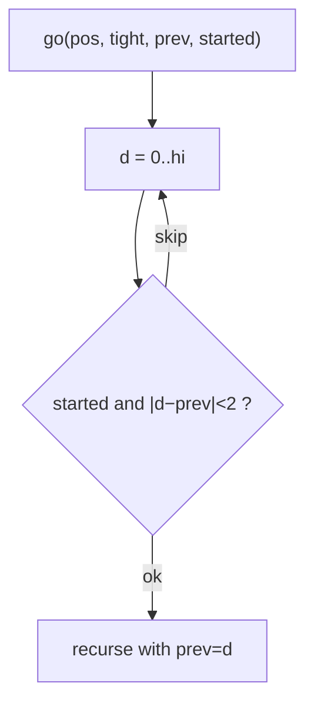

# Windy Numbers

> Digit DP tracking the previous digit. Classic · 🔴 Hard

## Problem
A **windy number** has no leading zeros and every pair of adjacent digits differs by **at least 2**. Count windy numbers in `[L, R]`.

## 🧮 Math / Recurrence
Digit DP carrying the previous digit and a `started` flag (to skip leading zeros):

$$
go(pos, tight, prev, started) = \sum_{\substack{d : |d - prev| \ge 2 \\ \text{or } \neg started}} go(pos+1, \dots, d, started \lor d{>}0)
$$

Answer for `[L, R]` = `count(R) − count(L−1)`.

## 🧠 Logic
We build the number left to right. Once the number has started (`started = true`), each new digit `d` must satisfy `|d − prev| ≥ 2`. While still in leading zeros (`started = false`), placing another `0` keeps it unstarted with no gap constraint; the first nonzero digit starts the number. `tight` limits the digit by `N`'s prefix. Tracking `prev` is the key extra state for the adjacency rule.



## 🔢 Iteration trace (`[1, 10]`)
- Windy: 1..9 (single digits) and not 10 (|1−0|=1) → **9**.

## 🐍 Python
```python
from functools import lru_cache

def count_windy(n: int) -> int:
    if n < 0:
        return 0
    digits = list(map(int, str(n)))
    L = len(digits)

    @lru_cache(maxsize=None)
    def go(pos: int, tight: bool, prev: int, started: bool) -> int:
        if pos == L:
            return 1 if started else 0
        hi = digits[pos] if tight else 9
        total = 0
        for d in range(hi + 1):
            if started and abs(d - prev) < 2:
                continue
            total += go(pos + 1, tight and d == hi, d, started or d > 0)
        return total

    res = go(0, True, -2, False)
    go.cache_clear()
    return res

def windy_in_range(lo: int, hi: int) -> int:
    return count_windy(hi) - count_windy(lo - 1)


if __name__ == "__main__":
    print(windy_in_range(1, 10))   # 9
```

## ⚙️ C++
```cpp
#include <cmath>
#include <cstring>
#include <iostream>
#include <string>
#include <vector>
using namespace std;

vector<int> D;
int Ln;
long long memo[12][2][11][2];
bool vis[12][2][11][2];

long long go(int pos, int tight, int prev, int started) {
    if (pos == Ln) return started ? 1 : 0;
    if (vis[pos][tight][prev + 1][started]) return memo[pos][tight][prev + 1][started];
    vis[pos][tight][prev + 1][started] = true;
    int hi = tight ? D[pos] : 9;
    long long total = 0;
    for (int d = 0; d <= hi; ++d) {
        if (started && abs(d - prev) < 2) continue;
        total += go(pos + 1, tight && d == hi, (started || d > 0) ? d : -1,
                    started || d > 0);
    }
    return memo[pos][tight][prev + 1][started] = total;
}

long long countWindy(long long n) {
    if (n < 0) return 0;
    string s = to_string(n);
    D.assign(s.begin(), s.end());
    for (auto& c : D) c -= '0';
    Ln = D.size();
    memset(vis, 0, sizeof vis);
    return go(0, 1, -1, 0);
}

int main() {
    cout << countWindy(10) - countWindy(0) << "\n";   // 9
}
```

## ⏱️ Complexity
- **Time:** `O(L · 10 · 10)` per query.
- **Space:** `O(L · 10)`.
