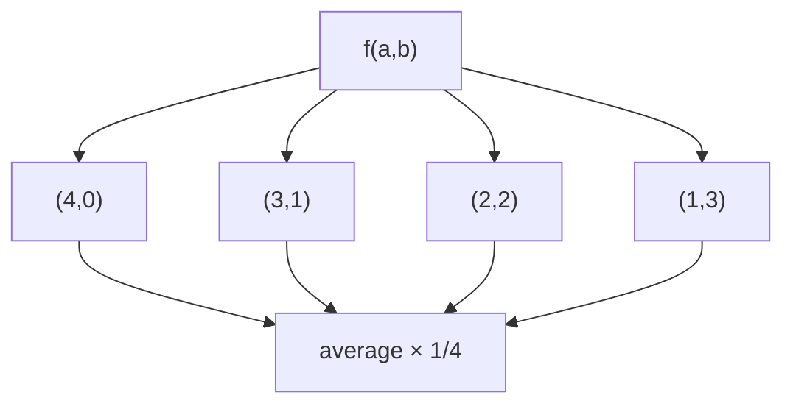

# Soup Servings

> Expectation recursion + memo; cap large n. LC 808 · 🟡 Medium

## Problem
Two soups A and B start with `n` mL each. One of four operations is chosen with probability `1/4`: serve (100,0), (75,25), (50,50), (25,75) mL of (A,B). Stop when either soup runs out. Return `P(A empties first) + 0.5·P(both empty simultaneously)`.

## 🧮 Math / Recurrence
Scale units by 25 (round up). `f(a, b)` = expected answer with `a`, `b` units left:

$$
f(a,b) = \tfrac14\big(f(a{-}4,b) + f(a{-}3,b{-}1) + f(a{-}2,b{-}2) + f(a{-}1,b{-}3)\big)
$$

Base: `a≤0 ∧ b≤0 → 0.5`, `a≤0 → 1`, `b≤0 → 0`.

## 🧠 Logic
Working in 25 mL units shrinks the state. From `(a, b)` the four equally likely serves move to four sub-states; the expected answer averages them. Boundaries encode who empties first. For large `n` (≥ ~4800 mL) the probability A empties first → 1 (A drains faster on average), so we shortcut to `1.0` to avoid a huge table — a standard accuracy trick accepted within `1e-5`.



## 🔢 Iteration trace (`n=50`)
- ≈ **0.625**.

## 🐍 Python
```python
from functools import lru_cache

def soup_servings(n: int) -> float:
    if n >= 4800:
        return 1.0
    units = (n + 24) // 25

    @lru_cache(maxsize=None)
    def f(a: int, b: int) -> float:
        if a <= 0 and b <= 0:
            return 0.5
        if a <= 0:
            return 1.0
        if b <= 0:
            return 0.0
        return 0.25 * (f(a - 4, b) + f(a - 3, b - 1)
                       + f(a - 2, b - 2) + f(a - 1, b - 3))

    return f(units, units)


if __name__ == "__main__":
    print(round(soup_servings(50), 5))   # 0.625
```

## ⚙️ C++
```cpp
#include <iostream>
#include <vector>
using namespace std;

vector<vector<double>> memo;
vector<vector<bool>> vis;

double f(int a, int b) {
    if (a <= 0 && b <= 0) return 0.5;
    if (a <= 0) return 1.0;
    if (b <= 0) return 0.0;
    if (vis[a][b]) return memo[a][b];
    vis[a][b] = true;
    return memo[a][b] = 0.25 * (f(a - 4, b) + f(a - 3, b - 1)
                                + f(a - 2, b - 2) + f(a - 1, b - 3));
}

double soupServings(int n) {
    if (n >= 4800) return 1.0;
    int units = (n + 24) / 25;
    memo.assign(units + 1, vector<double>(units + 1, 0.0));
    vis.assign(units + 1, vector<bool>(units + 1, false));
    return f(units, units);
}

int main() {
    cout << soupServings(50) << "\n";   // 0.625
}
```

## ⏱️ Complexity
- **Time:** `O(units²)` (capped).
- **Space:** `O(units²)`.
