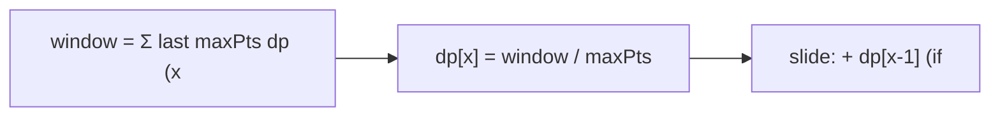

# New 21 Game

> Sliding-window probability DP. LC 837 · 🟡 Medium

## Problem
Alice starts with 0 points and draws while her total is `< k`. Each draw adds a uniform integer in `[1, maxPts]`. She stops once her total is `≥ k`. Return the probability her final total is `≤ n`.

## 🧮 Math / Recurrence
`dp[x]` = probability of reaching exactly `x` points. For `x < k` each reachable score spreads `1/maxPts` to the next `maxPts` scores:

$$
dp[x] = \frac{1}{maxPts}\sum_{i=1}^{maxPts} dp[x-i],\quad \text{only summing terms with } x-i < k
$$

Answer: $\sum_{x=k}^{n} dp[x]$.

## 🧠 Logic
Naively each `dp[x]` sums the previous `maxPts` reachable states — `O(n·maxPts)`. But the sum is a sliding window: maintain a running `window` of the last `maxPts` `dp` values that were `< k` (only those can draw again). Add `dp[x-1]` entering the window, drop `dp[x-1-maxPts]` leaving it. This gives `O(n)`. Scores `≥ k` are absorbing (Alice stops), so they don't feed the window.



## 🔢 Iteration trace (`n=10`, `k=1`, `maxPts=10`)
- One draw, any of 1..10 ≤ 10 → **1.0**.

## 🐍 Python
```python
def new21_game(n: int, k: int, max_pts: int) -> float:
    if k == 0 or n >= k + max_pts:
        return 1.0
    dp = [0.0] * (n + 1)
    dp[0] = 1.0
    window = 1.0                       # sum of dp[x] for x < k in the last maxPts
    result = 0.0
    for x in range(1, n + 1):
        dp[x] = window / max_pts
        if x < k:
            window += dp[x]
        else:
            result += dp[x]            # absorbing state ≥ k
        if x - max_pts >= 0 and x - max_pts < k:
            window -= dp[x - max_pts]
    return result


if __name__ == "__main__":
    print(new21_game(10, 1, 10))   # 1.0
```

## ⚙️ C++
```cpp
#include <iostream>
#include <vector>
using namespace std;

double new21Game(int n, int k, int maxPts) {
    if (k == 0 || n >= k + maxPts) return 1.0;
    vector<double> dp(n + 1, 0.0);
    dp[0] = 1.0;
    double window = 1.0, result = 0.0;
    for (int x = 1; x <= n; ++x) {
        dp[x] = window / maxPts;
        if (x < k) window += dp[x];
        else result += dp[x];
        if (x - maxPts >= 0 && x - maxPts < k) window -= dp[x - maxPts];
    }
    return result;
}

int main() {
    cout << new21Game(10, 1, 10) << "\n";   // 1.0
}
```

## ⏱️ Complexity
- **Time:** `O(n)`.
- **Space:** `O(n)`.
