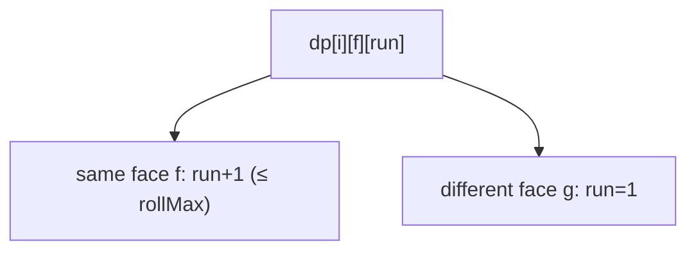

# Dice Roll Simulation

> dp with run-length constraint. LC 1223 · 🔴 Hard

## Problem
Roll a die `n` times. Face `i` (1..6) may not appear **more than `rollMax[i-1]` times consecutively**. Count the number of distinct roll sequences, modulo `10^9 + 7`.

## 🧮 Math / Recurrence
`dp[i][face][run]` = number of valid length-`i` sequences ending with `face` repeated `run` consecutive times:

$$
\begin{aligned}
dp[i][f][run{+}1] &\mathrel{+}= dp[i-1][f][run] \quad (\text{extend same face, } run{+}1 \le rollMax_f) \\
dp[i][g][1] &\mathrel{+}= dp[i-1][f][run] \quad (g \ne f)
\end{aligned}
$$

## 🧠 Logic
The constraint is on **consecutive** repeats, so the run length of the last face must be part of the state. Rolling the same face extends the run (allowed only up to `rollMax`); rolling a different face resets that face's run to 1. Summing over all faces and runs at step `n` gives the total. The state is small (`6 × maxRun`), so it's efficient.



## 🔢 Iteration trace (`n=2`, `rollMax=[1,1,2,2,2,3]`)
- 36 total minus disallowed (face1×2, face2×2) = **34**.

## 🐍 Python
```python
def dice_roll_simulation(n: int, roll_max: list[int]) -> int:
    MOD = 10**9 + 7
    # dp[face][run] for current length
    dp = [[0] * (roll_max[f] + 1) for f in range(6)]
    for f in range(6):
        dp[f][1] = 1
    for _ in range(2, n + 1):
        ndp = [[0] * (roll_max[f] + 1) for f in range(6)]
        for f in range(6):
            for run in range(1, roll_max[f] + 1):
                cnt = dp[f][run]
                if cnt == 0:
                    continue
                if run + 1 <= roll_max[f]:           # extend same face
                    ndp[f][run + 1] = (ndp[f][run + 1] + cnt) % MOD
                for g in range(6):                   # switch face
                    if g != f:
                        ndp[g][1] = (ndp[g][1] + cnt) % MOD
        dp = ndp
    return sum(sum(row) for row in dp) % MOD


if __name__ == "__main__":
    print(dice_roll_simulation(2, [1, 1, 2, 2, 2, 3]))   # 34
```

## ⚙️ C++
```cpp
#include <iostream>
#include <vector>
using namespace std;
const long long MOD = 1e9 + 7;

int dieSimulator(int n, vector<int>& rollMax) {
    vector<vector<long long>> dp(6);
    for (int f = 0; f < 6; ++f) { dp[f].assign(rollMax[f] + 1, 0); dp[f][1] = 1; }
    for (int step = 2; step <= n; ++step) {
        vector<vector<long long>> ndp(6);
        for (int f = 0; f < 6; ++f) ndp[f].assign(rollMax[f] + 1, 0);
        for (int f = 0; f < 6; ++f)
            for (int run = 1; run <= rollMax[f]; ++run) {
                long long cnt = dp[f][run];
                if (!cnt) continue;
                if (run + 1 <= rollMax[f]) ndp[f][run + 1] = (ndp[f][run + 1] + cnt) % MOD;
                for (int g = 0; g < 6; ++g)
                    if (g != f) ndp[g][1] = (ndp[g][1] + cnt) % MOD;
            }
        dp = ndp;
    }
    long long total = 0;
    for (int f = 0; f < 6; ++f) for (long long v : dp[f]) total = (total + v) % MOD;
    return (int)total;
}

int main() {
    vector<int> rollMax = {1, 1, 2, 2, 2, 3};
    cout << dieSimulator(2, rollMax) << "\n";   // 34
}
```

## ⏱️ Complexity
- **Time:** `O(n · 6 · maxRun · 6)`.
- **Space:** `O(6 · maxRun)`.
