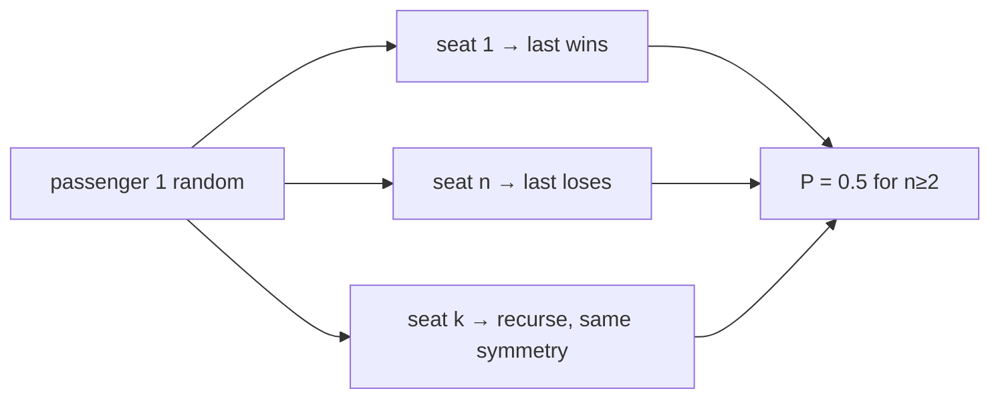

# Airplane Seat Assignment Probability

> Math collapses to 0.5. LC 1227 · 🟢 Easy

## Problem
`n` passengers board in order. The first passenger sits in a **random** seat. Each subsequent passenger takes their own seat if free, otherwise a random free seat. Return the probability the **n-th** passenger gets their own seat.

## 🧮 Math / Recurrence
$$
P(n) = \begin{cases} 1 & n = 1 \\ 0.5 & n \ge 2 \end{cases}
$$

## 🧠 Logic
The first passenger either (a) sits in seat 1 — then everyone, including the last, gets their own seat; or (b) sits in seat `n` — then the last passenger definitely doesn't; or (c) sits in some middle seat `k`, which recursively reduces to the same problem on the remaining passengers. By symmetry the chance the conflict resolves in favor of seat 1 versus seat `n` is equal, so for any `n ≥ 2` the probability is exactly `1/2`. A full DP confirms this constant.



## 🔢 Iteration trace
- `n=1` → 1.0; `n=2` → **0.5**.

## 🐍 Python
```python
def nth_person_gets_nth_seat(n: int) -> float:
    return 1.0 if n == 1 else 0.5


if __name__ == "__main__":
    print(nth_person_gets_nth_seat(1))   # 1.0
    print(nth_person_gets_nth_seat(2))   # 0.5
```

## ⚙️ C++
```cpp
#include <iostream>
using namespace std;

double nthPersonGetsNthSeat(int n) {
    return n == 1 ? 1.0 : 0.5;
}

int main() {
    cout << nthPersonGetsNthSeat(1) << "\n";   // 1
    cout << nthPersonGetsNthSeat(2) << "\n";   // 0.5
}
```

## ⏱️ Complexity
- **Time:** `O(1)`.
- **Space:** `O(1)`.
