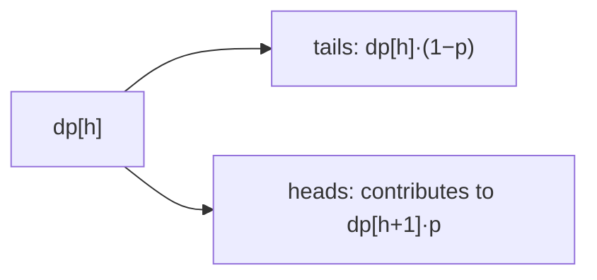

# Toss Strange Coins

> dp over heads count. LC 1230 · 🟡 Medium

## Problem
Given coins with head-probabilities `prob[i]`, return the probability of getting **exactly** `target` heads when all coins are tossed once.

## 🧮 Math / Recurrence
`dp[h]` = probability of exactly `h` heads so far. Adding coin `i` with probability `p`:

$$
dp'[h] = dp[h] \cdot (1 - p) + dp[h-1] \cdot p
$$

## 🧠 Logic
Process coins one at a time, maintaining the distribution over the number of heads. For each new coin, a state with `h` heads either stays `h` (tails, prob `1−p`) or becomes `h+1` (heads, prob `p`). Updating `h` from high to low (or using a fresh array) avoids overwriting needed values. After all coins, `dp[target]` is the answer.



## 🔢 Iteration trace (`prob=[0.4]`, `target=0`)
- P(0 heads) = 1 − 0.4 = **0.6**.

## 🐍 Python
```python
def probability_of_heads(prob: list[float], target: int) -> float:
    dp = [0.0] * (target + 1)
    dp[0] = 1.0
    for p in prob:
        for h in range(min(target, len(dp) - 1), -1, -1):
            dp[h] = dp[h] * (1 - p) + (dp[h - 1] * p if h > 0 else 0.0)
    return dp[target]


if __name__ == "__main__":
    print(round(probability_of_heads([0.4], 0), 4))   # 0.6
```

## ⚙️ C++
```cpp
#include <iostream>
#include <vector>
using namespace std;

double probabilityOfHeads(vector<double>& prob, int target) {
    vector<double> dp(target + 1, 0.0);
    dp[0] = 1.0;
    for (double p : prob)
        for (int h = target; h >= 0; --h)
            dp[h] = dp[h] * (1 - p) + (h > 0 ? dp[h - 1] * p : 0.0);
    return dp[target];
}

int main() {
    vector<double> prob = {0.4};
    cout << probabilityOfHeads(prob, 0) << "\n";   // 0.6
}
```

## ⏱️ Complexity
- **Time:** `O(n · target)`.
- **Space:** `O(target)`.
