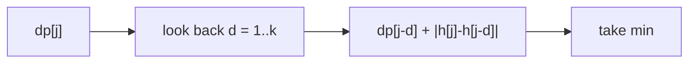

# Frog Jump K Distances

> Windowed / prefix optimization. AtCoder DP-D · 🟡 Medium

## Problem
A frog on stone `0` wants to reach stone `n−1`. From stone `i` it may jump to any of `i+1 … i+k`, paying `|height[i] − height[j]|`. Minimize total cost.

## 🧮 Math / Recurrence
$$
dp[j] = \min_{1 \le d \le k}\big(dp[j-d] + |h[j] - h[j-d]|\big)
$$

Naively `O(nk)`; the cost depends on `h[j]` (not separable), so we keep it `O(nk)` but small, or apply a monotonic structure when costs allow.

## 🧠 Logic
`dp[j]` is the cheapest cost to land on stone `j`, taken as the minimum over the previous `k` stones plus the jump cost. Because the jump cost `|h[j] − h[j-d]|` couples both endpoints, a plain sliding-window min doesn't directly apply; the clean formulation scans the last `k` predecessors. For the simpler **DP-C** variant (`k=2`) it's just `min(dp[j-1], dp[j-2]) + cost`.



## 🔢 Iteration trace (`h=[10,30,40,50,20]`, `k=3`)
- Optimal path cost → **30**.

## 🐍 Python
```python
def frog_jump(height: list[int], k: int) -> int:
    n = len(height)
    INF = float("inf")
    dp = [INF] * n
    dp[0] = 0
    for j in range(1, n):
        for d in range(1, k + 1):
            if j - d >= 0:
                dp[j] = min(dp[j], dp[j - d] + abs(height[j] - height[j - d]))
    return dp[n - 1]


if __name__ == "__main__":
    print(frog_jump([10, 30, 40, 50, 20], 3))   # 30
```

## ⚙️ C++
```cpp
#include <algorithm>
#include <cstdlib>
#include <iostream>
#include <vector>
using namespace std;

int frogJump(vector<int>& height, int k) {
    int n = height.size();
    const int INF = 1e9;
    vector<int> dp(n, INF);
    dp[0] = 0;
    for (int j = 1; j < n; ++j)
        for (int d = 1; d <= k && j - d >= 0; ++d)
            dp[j] = min(dp[j], dp[j - d] + abs(height[j] - height[j - d]));
    return dp[n - 1];
}

int main() {
    vector<int> h = {10, 30, 40, 50, 20};
    cout << frogJump(h, 3) << "\n";   // 30
}
```

## ⏱️ Complexity
- **Time:** `O(n · k)`.
- **Space:** `O(n)`.
