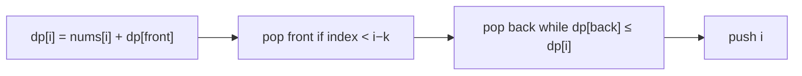

# Jump Game VI

> Monotonic deque window maximum. LC 1696 · 🟡 Medium

## Problem
Start at index 0 of `nums`. From index `i` you may jump to any index in `i+1 … i+k`. Each landing adds `nums[i]`. Maximize the total score reaching the last index.

## 🧮 Math / Recurrence
$$
dp[i] = nums[i] + \max_{i-k \le j \le i-1} dp[j]
$$

A **monotonic deque** maintains the window maximum in `O(1)` amortized, giving overall `O(n)`.

## 🧠 Logic
`dp[i]` is the best score to reach index `i`, which is `nums[i]` plus the best `dp` among the `k` reachable predecessors. Recomputing that maximum each step is `O(k)`; instead we keep a deque of indices whose `dp` values are **decreasing**. The front is always the window max. We pop expired indices (`< i−k`) from the front and pop smaller `dp` values from the back before pushing `i`.



## 🔢 Iteration trace (`nums=[1,-1,-2,4,-7,3]`, `k=2`)
- 1 → 4 → 3, path score → **7**.

## 🐍 Python
```python
from collections import deque

def max_result(nums: list[int], k: int) -> int:
    n = len(nums)
    dp = [0] * n
    dp[0] = nums[0]
    dq: deque[int] = deque([0])           # indices, decreasing dp
    for i in range(1, n):
        while dq and dq[0] < i - k:
            dq.popleft()
        dp[i] = nums[i] + dp[dq[0]]
        while dq and dp[dq[-1]] <= dp[i]:
            dq.pop()
        dq.append(i)
    return dp[-1]


if __name__ == "__main__":
    print(max_result([1, -1, -2, 4, -7, 3], 2))   # 7
```

## ⚙️ C++
```cpp
#include <deque>
#include <iostream>
#include <vector>
using namespace std;

int maxResult(vector<int>& nums, int k) {
    int n = nums.size();
    vector<int> dp(n, 0);
    dp[0] = nums[0];
    deque<int> dq{0};
    for (int i = 1; i < n; ++i) {
        while (!dq.empty() && dq.front() < i - k) dq.pop_front();
        dp[i] = nums[i] + dp[dq.front()];
        while (!dq.empty() && dp[dq.back()] <= dp[i]) dq.pop_back();
        dq.push_back(i);
    }
    return dp[n - 1];
}

int main() {
    vector<int> nums = {1, -1, -2, 4, -7, 3};
    cout << maxResult(nums, 2) << "\n";   // 7
}
```

## ⏱️ Complexity
- **Time:** `O(n)`.
- **Space:** `O(n)`.
