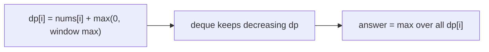

# Constrained Subsequence Sum

> Deque-optimized DP. LC 1425 · 🔴 Hard

## Problem
Given `nums` and `k`, find the maximum sum of a **non-empty** subsequence such that consecutive chosen indices are at most `k` apart.

## 🧮 Math / Recurrence
$$
dp[i] = nums[i] + \max\big(0,\ \max_{i-k \le j \le i-1} dp[j]\big)
$$

Answer: `max(dp)`. A monotonic deque supplies the windowed maximum in `O(1)` amortized.

## 🧠 Logic
`dp[i]` = best subsequence sum **ending** at `i`. We either start fresh (`nums[i]` alone) or extend the best previous `dp[j]` within the last `k` indices — but only if that maximum is positive (else extending hurts). As in Jump Game VI, a decreasing-`dp` deque gives the window max in amortized `O(1)`. The global answer is the largest `dp[i]`, since the subsequence may end anywhere.



## 🔢 Iteration trace (`nums=[10,2,-10,5,20]`, `k=2`)
- 10 + 5 + 20 (indices 0,3,4) → **37**.

## 🐍 Python
```python
from collections import deque

def constrained_subset_sum(nums: list[int], k: int) -> int:
    n = len(nums)
    dp = [0] * n
    dq: deque[int] = deque()
    best = float("-inf")
    for i in range(n):
        while dq and dq[0] < i - k:
            dq.popleft()
        take = dp[dq[0]] if dq else 0
        dp[i] = nums[i] + max(0, take)
        best = max(best, dp[i])
        while dq and dp[dq[-1]] <= dp[i]:
            dq.pop()
        dq.append(i)
    return best


if __name__ == "__main__":
    print(constrained_subset_sum([10, 2, -10, 5, 20], 2))   # 37
```

## ⚙️ C++
```cpp
#include <algorithm>
#include <deque>
#include <iostream>
#include <vector>
using namespace std;

int constrainedSubsetSum(vector<int>& nums, int k) {
    int n = nums.size();
    vector<int> dp(n, 0);
    deque<int> dq;
    int best = INT_MIN;
    for (int i = 0; i < n; ++i) {
        while (!dq.empty() && dq.front() < i - k) dq.pop_front();
        int take = dq.empty() ? 0 : dp[dq.front()];
        dp[i] = nums[i] + max(0, take);
        best = max(best, dp[i]);
        while (!dq.empty() && dp[dq.back()] <= dp[i]) dq.pop_back();
        dq.push_back(i);
    }
    return best;
}

int main() {
    vector<int> nums = {10, 2, -10, 5, 20};
    cout << constrainedSubsetSum(nums, 2) << "\n";   // 37
}
```

## ⏱️ Complexity
- **Time:** `O(n)`.
- **Space:** `O(n)`.
