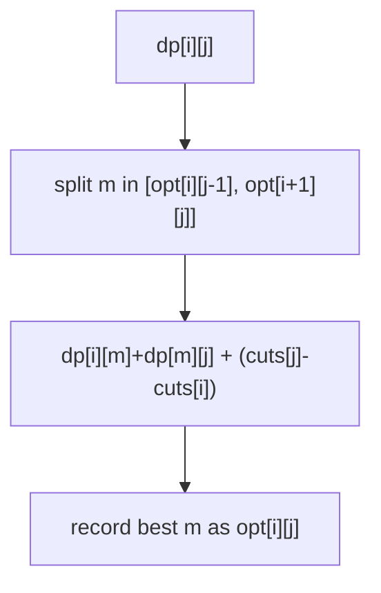

# Cutting Sticks (Knuth Optimization)

> Quadrangle inequality: O(n³) → O(n²). Classic · 🔴 Hard

## Problem
A stick of length `L` has cut positions given in `cuts`. Cutting a piece costs its current length. Find the minimum total cost to make all cuts (order is free).

## 🧮 Math / Recurrence
Add `0` and `L` as boundaries and sort. `dp[i][j]` = min cost to cut the segment between cut `i` and cut `j`:

$$
dp[i][j] = \min_{i < m < j}\big(dp[i][m] + dp[m][j]\big) + (cuts[j] - cuts[i])
$$

**Knuth optimization:** the optimal split `opt[i][j]` is monotonic, so restrict `m ∈ [opt[i][j-1], opt[i+1][j]]`, dropping a factor of `n`.

## 🧠 Logic
This is interval DP (same shape as matrix-chain / burst balloons). The added length cost `cuts[j] − cuts[i]` is independent of the split point, and the cost matrix satisfies the **quadrangle inequality**, which guarantees the best split `m` moves monotonically as the interval grows. Caching `opt[i][j]` and scanning only between neighboring optima reduces the inner loop from `O(n)` to amortized `O(1)`, giving `O(n²)` overall.



## 🔢 Iteration trace (`L=7`, `cuts=[1,3,4,5]`)
- Optimal cutting order cost → **16**.

## 🐍 Python
```python
def min_cost_cuts(length: int, cuts: list[int]) -> int:
    points = sorted([0] + cuts + [length])
    n = len(points)
    INF = float("inf")
    dp = [[0] * n for _ in range(n)]
    opt = [[0] * n for _ in range(n)]
    for i in range(n - 1):
        opt[i][i + 1] = i                      # empty segment, no interior cut

    for gap in range(2, n):
        for i in range(n - gap):
            j = i + gap
            best = INF
            best_m = opt[i][j - 1]
            lo = opt[i][j - 1]
            hi = opt[i + 1][j]
            for m in range(max(i + 1, lo), min(j, hi) + 1):
                cost = dp[i][m] + dp[m][j]
                if cost < best:
                    best = cost
                    best_m = m
            dp[i][j] = best + (points[j] - points[i])
            opt[i][j] = best_m
    return dp[0][n - 1]


if __name__ == "__main__":
    print(min_cost_cuts(7, [1, 3, 4, 5]))   # 16
```

## ⚙️ C++
```cpp
#include <algorithm>
#include <iostream>
#include <vector>
using namespace std;

int minCostCuts(int length, vector<int>& cuts) {
    vector<int> p = cuts;
    p.push_back(0);
    p.push_back(length);
    sort(p.begin(), p.end());
    int n = p.size();
    const int INF = 1e9;
    vector<vector<int>> dp(n, vector<int>(n, 0)), opt(n, vector<int>(n, 0));
    for (int i = 0; i + 1 < n; ++i) opt[i][i + 1] = i;

    for (int gap = 2; gap < n; ++gap)
        for (int i = 0; i + gap < n; ++i) {
            int j = i + gap, best = INF, bestM = opt[i][j - 1];
            int lo = max(i + 1, opt[i][j - 1]), hi = min(j - 1, opt[i + 1][j]);
            for (int m = lo; m <= hi; ++m) {
                int cost = dp[i][m] + dp[m][j];
                if (cost < best) { best = cost; bestM = m; }
            }
            dp[i][j] = best + (p[j] - p[i]);
            opt[i][j] = bestM;
        }
    return dp[0][n - 1];
}

int main() {
    vector<int> cuts = {1, 3, 4, 5};
    cout << minCostCuts(7, cuts) << "\n";   // 16
}
```

## ⏱️ Complexity
- **Time:** `O(n²)` with Knuth (vs `O(n³)` naive).
- **Space:** `O(n²)`.
