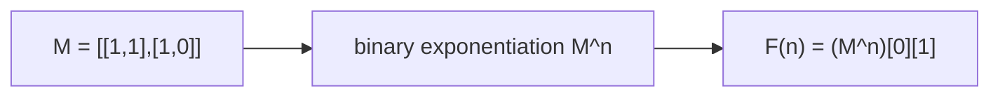

# Fibonacci mod m (Matrix Exponentiation)

> Linear recurrence → matrix power, O(log n). Classic · 🟡 Medium

## Problem
Compute the `n`-th Fibonacci number modulo `m`, for very large `n` (e.g. `n` up to `10^18`).

## 🧮 Math / Recurrence
The recurrence `F(n) = F(n-1) + F(n-2)` is a matrix power:

$$
\begin{bmatrix} F(n+1) \\ F(n) \end{bmatrix}
= \begin{bmatrix} 1 & 1 \\ 1 & 0 \end{bmatrix}^{n}
\begin{bmatrix} F(1) \\ F(0) \end{bmatrix}
$$

So `F(n) = (M^n)[0][1]` where `M = [[1,1],[1,0]]`.

## 🧠 Logic
Any linear recurrence can be written as repeated multiplication by a fixed transition matrix. Raising that matrix to the `n`-th power via **binary exponentiation** (square-and-multiply) costs `O(log n)` matrix multiplications, each `O(d³)` for a `d × d` matrix — here `d = 2`, so effectively `O(log n)`. All arithmetic is done mod `m`. This crushes the `O(n)` iterative approach for astronomically large `n`.



## 🔢 Iteration trace (`n=10`, `m=1000`)
- F(10) = 55 → **55**.

## 🐍 Python
```python
def fib_mod(n: int, m: int) -> int:
    def mat_mul(a: list[list[int]], b: list[list[int]]) -> list[list[int]]:
        return [[(a[i][0] * b[0][j] + a[i][1] * b[1][j]) % m for j in range(2)]
                for i in range(2)]

    result = [[1, 0], [0, 1]]                 # identity
    base = [[1, 1], [1, 0]]
    while n:
        if n & 1:
            result = mat_mul(result, base)
        base = mat_mul(base, base)
        n >>= 1
    return result[0][1]                        # (M^n)[0][1] = F(n)


if __name__ == "__main__":
    print(fib_mod(10, 1000))   # 55
```

## ⚙️ C++
```cpp
#include <array>
#include <iostream>
using namespace std;
using Mat = array<array<long long, 2>, 2>;

Mat mul(const Mat& a, const Mat& b, long long m) {
    Mat c{};
    for (int i = 0; i < 2; ++i)
        for (int j = 0; j < 2; ++j)
            c[i][j] = (a[i][0] * b[0][j] + a[i][1] * b[1][j]) % m;
    return c;
}

long long fibMod(long long n, long long m) {
    Mat result = {{{1, 0}, {0, 1}}}, base = {{{1, 1}, {1, 0}}};
    while (n) {
        if (n & 1) result = mul(result, base, m);
        base = mul(base, base, m);
        n >>= 1;
    }
    return result[0][1];
}

int main() {
    cout << fibMod(10, 1000) << "\n";   // 55
}
```

## ⏱️ Complexity
- **Time:** `O(log n)`.
- **Space:** `O(1)`.
