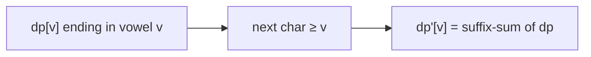

# Count Sorted Vowel Strings

> Tiny linear DP / combinatorics. LC 1641 · 🟢 Easy

## Problem
Count strings of length `n` using only vowels `a, e, i, o, u` that are in **non-decreasing** (sorted) order.

## 🧮 Math / Recurrence
`dp[v]` = number of sorted strings ending with vowel `v`. Each step, a vowel may follow itself or any earlier vowel:

$$
dp'[v] = \sum_{u \le v} dp[u]
$$

Closed form: $\binom{n+4}{4}$.

## 🧠 Logic
A sorted string is determined by how many of each vowel it uses (counts that sum to `n`) — a stars-and-bars count `C(n+4, 4)`. The DP view: maintain counts of strings ending in each vowel; extending by one character, a string ending in `u` can be followed only by a vowel `≥ u`. Taking suffix sums each step accumulates these, and after `n` steps the total over all vowels is the answer.



## 🔢 Iteration trace (`n=2`)
- aa,ae,ai,ao,au,ee,ei,eo,eu,ii,io,iu,oo,ou,uu = **15**.

## 🐍 Python
```python
def count_vowel_strings(n: int) -> int:
    dp = [1] * 5                              # length 1: one per vowel
    for _ in range(n - 1):
        for v in range(3, -1, -1):            # suffix sums
            dp[v] += dp[v + 1]
    return sum(dp)


if __name__ == "__main__":
    print(count_vowel_strings(2))   # 15
```

## ⚙️ C++
```cpp
#include <iostream>
#include <numeric>
#include <vector>
using namespace std;

int countVowelStrings(int n) {
    vector<int> dp(5, 1);
    for (int step = 1; step < n; ++step)
        for (int v = 3; v >= 0; --v) dp[v] += dp[v + 1];
    return accumulate(dp.begin(), dp.end(), 0);
}

int main() {
    cout << countVowelStrings(2) << "\n";   // 15
}
```

## ⏱️ Complexity
- **Time:** `O(n)` (or `O(1)` via the binomial).
- **Space:** `O(1)`.
