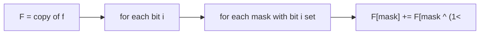

# Sum over Subsets (SOS DP)

> Aggregate over all subsets of each mask in O(n·2ⁿ). CF · 🔴 Hard

## Problem
Given an array `f` indexed by bitmasks (`0 … 2^n − 1`), compute for every mask the sum over **all of its submasks**:

$$
F[mask] = \sum_{sub \subseteq mask} f[sub]
$$

## 🧮 Math / Recurrence
Process one bit dimension at a time. For each bit `i`, add the contribution from masks without bit `i` to those with it:

$$
\text{if } mask \text{ has bit } i:\quad F[mask] \mathrel{+}= F[mask \oplus (1 \ll i)]
$$

## 🧠 Logic
The brute force is `O(3ⁿ)` (enumerate every submask of every mask). SOS DP reduces it to `O(n · 2ⁿ)` by treating the subset lattice as an `n`-dimensional hypercube and doing a **prefix sum along each axis**. After processing bit `i`, `F[mask]` already includes all submasks that differ from `mask` only in bits `0..i`. Iterating all `n` bits accumulates every submask exactly once. (Flipping the condition computes superset sums instead.)



## 🔢 Iteration trace (`n=2`, `f=[1,2,3,4]`)
- F[00]=1, F[01]=3, F[10]=4, F[11]=1+2+3+4 = **10**.

## 🐍 Python
```python
def sum_over_subsets(f: list[int], n: int) -> list[int]:
    F = f[:]
    for i in range(n):
        for mask in range(1 << n):
            if mask & (1 << i):
                F[mask] += F[mask ^ (1 << i)]
    return F


if __name__ == "__main__":
    print(sum_over_subsets([1, 2, 3, 4], 2))   # [1, 3, 4, 10]
```

## ⚙️ C++
```cpp
#include <iostream>
#include <vector>
using namespace std;

vector<int> sumOverSubsets(vector<int> f, int n) {
    vector<int> F = f;
    for (int i = 0; i < n; ++i)
        for (int mask = 0; mask < (1 << n); ++mask)
            if (mask & (1 << i)) F[mask] += F[mask ^ (1 << i)];
    return F;
}

int main() {
    vector<int> f = {1, 2, 3, 4};
    for (int v : sumOverSubsets(f, 2)) cout << v << " ";   // 1 3 4 10
    cout << "\n";
}
```

## ⏱️ Complexity
- **Time:** `O(n · 2ⁿ)`.
- **Space:** `O(2ⁿ)`.
