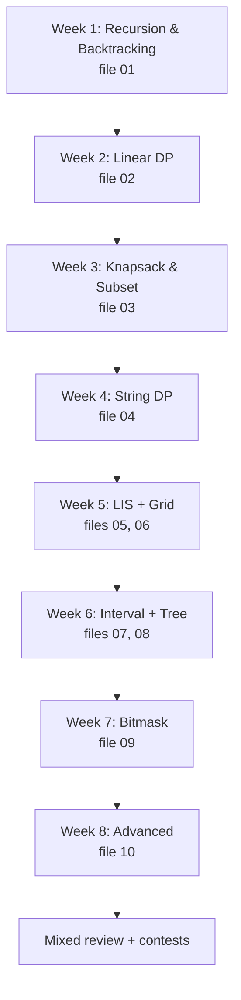
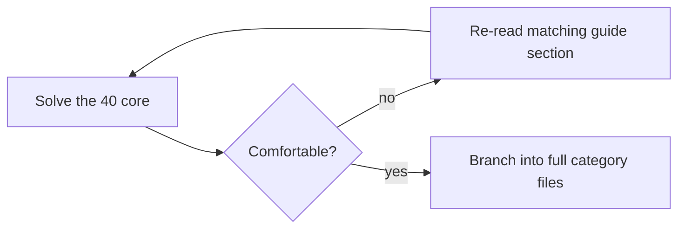

# 🧩 Problems Library — Recursion & Dynamic Programming

A large, categorized practice set. Each problem lists: **source**, **difficulty**, **pattern**, and the **core idea / state & transition** so you can study even without opening the link. Work pattern‑by‑pattern; revisit [the guides](../guide) when stuck.

> Sources: **LC** = LeetCode, **CF** = Codeforces, **GFG** = GeeksforGeeks, **Classic** = textbook/SPOJ/AtCoder.
> Difficulty: 🟢 Easy · 🟡 Medium · 🔴 Hard

---

## 📁 Files in this folder

| File | Theme | # |
|---|---|---|
| [01-recursion-backtracking.md](01-recursion-backtracking.md) | Pure recursion, subsets, permutations, N‑Queens, divide & conquer | 35+ |
| [02-linear-dp.md](02-linear-dp.md) | 1D DP: stairs, robber, Kadane, decode, jump | 25+ |
| [03-knapsack-subset.md](03-knapsack-subset.md) | 0/1 & unbounded knapsack, subset‑sum, coin change | 25+ |
| [04-strings-dp.md](04-strings-dp.md) | LCS, edit distance, palindromes, regex | 25+ |
| [05-sequences-lis.md](05-sequences-lis.md) | LIS family, subsequence DP | 15+ |
| [06-grid-dp.md](06-grid-dp.md) | Path counting & cost on grids | 18+ |
| [07-interval-dp.md](07-interval-dp.md) | Range DP, MCM, burst balloons | 15+ |
| [08-tree-graph-dp.md](08-tree-graph-dp.md) | DP on trees, rerooting, DAG DP | 15+ |
| [09-bitmask-dp.md](09-bitmask-dp.md) | Subset-state DP, TSP, assignment | 12+ |
| [10-advanced-dp.md](10-advanced-dp.md) | Digit DP, game theory, probability, state machine, optimizations | 25+ |

**Total: 200+ problems.**

---

## 🗺️ Suggested study roadmap

---

## 🎯 The "must‑solve 40" (a focused core set)

If you only have time for a subset, master these — they cover every fundamental pattern.

| # | Problem | Source | Pattern |
|---|---|---|---|
| 1 | Climbing Stairs | LC 70 | Linear |
| 2 | House Robber | LC 198 | Linear |
| 3 | Maximum Subarray | LC 53 | Kadane |
| 4 | Decode Ways | LC 91 | Linear/partition |
| 5 | Jump Game II | LC 45 | Linear/greedy‑DP |
| 6 | Subsets | LC 78 | Backtracking |
| 7 | Permutations | LC 46 | Backtracking |
| 8 | Combination Sum | LC 39 | Backtracking |
| 9 | N‑Queens | LC 51 | Backtracking |
| 10 | Word Search | LC 79 | Backtracking/grid |
| 11 | 0/1 Knapsack | Classic/GFG | Knapsack |
| 12 | Partition Equal Subset Sum | LC 416 | Subset‑sum |
| 13 | Target Sum | LC 494 | Subset‑sum |
| 14 | Coin Change | LC 322 | Unbounded |
| 15 | Coin Change II | LC 518 | Unbounded count |
| 16 | Longest Common Subsequence | LC 1143 | String 2D |
| 17 | Edit Distance | LC 72 | String 2D |
| 18 | Longest Palindromic Subsequence | LC 516 | Palindrome |
| 19 | Longest Palindromic Substring | LC 5 | Palindrome |
| 20 | Distinct Subsequences | LC 115 | String 2D |
| 21 | Regular Expression Matching | LC 10 | String 2D |
| 22 | Wildcard Matching | LC 44 | String 2D |
| 23 | Longest Increasing Subsequence | LC 300 | LIS |
| 24 | Russian Doll Envelopes | LC 354 | LIS |
| 25 | Unique Paths | LC 62 | Grid |
| 26 | Minimum Path Sum | LC 64 | Grid |
| 27 | Dungeon Game | LC 174 | Grid reverse |
| 28 | Triangle | LC 120 | Grid |
| 29 | Matrix Chain Multiplication | Classic | Interval |
| 30 | Burst Balloons | LC 312 | Interval |
| 31 | Palindrome Partitioning II | LC 132 | Interval/partition |
| 32 | House Robber III | LC 337 | Tree DP |
| 33 | Binary Tree Maximum Path Sum | LC 124 | Tree DP |
| 34 | Partition to K Equal Sum Subsets | LC 698 | Bitmask |
| 35 | Travelling Salesman | Classic | Bitmask |
| 36 | Best Time to Buy/Sell Stock IV | LC 188 | State machine |
| 37 | Stone Game | LC 877 | Game theory |
| 38 | Count Numbers with Unique Digits | LC 357 | Digit/combinatorics |
| 39 | Word Break | LC 139 | Partition |
| 40 | Knight Probability in Chessboard | LC 688 | Probability |

---

## ✍️ How to practice each problem

1. **Classify** the pattern *before* coding (use the decision flow in [guide 04](../guide/04-dp-patterns.md)).
2. Write the **state, transition, base case, answer** in a comment.
3. Code **brute force → memo → tabulation**.
4. Optimize **space**, then time if needed.
5. **Verify** against brute force on small inputs.
6. Note the trick you missed in your own words.

Good luck — consistency beats intensity. 🧗
