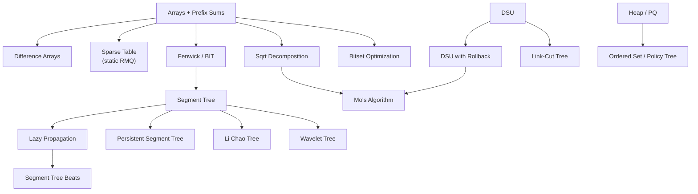

# Data Structures — Advanced

A deep-dive module on **advanced data structures** for competitive programming and senior-level
interviews. Each topic has a **complete guide** (theory, math, complexity, pitfalls) and one or
more **curated problems** (mostly [CSES](https://cses.fi/problemset/) + classics) solved with
**both Python and C++**.

> This folder builds on the foundational [StackQueue](../StackQueue/guide/StackQueue-Complete-Guide.md),
> [Arrays](../Arrays/guide/Arrays-Complete-Guide.md), and [Heaps](../Heaps/guide/Heaps-Complete-Guide.md)
> modules. Here we go deeper: range-query structures (sparse table, BIT, segment trees), lazy
> propagation, DSU with rollback, policy trees, Mo's algorithm, and **persistent** structures.

## Structure

```
ds_advanced/
├── guide/      # one concept guide per topic
└── problems/   # one file per curated problem (Python + C++, traces, diagrams, math)
```

## Topics & Guides

| # | Concept | Guide | Key problems |
|---|---------|-------|--------------|
| 1 | Stack, queue, deque; monotonic stack/queue | [01-stack-queue-deque-monotonic.md](guide/01-stack-queue-deque-monotonic.md) | Sliding Window Maximum, Nearest Smaller Values |
| 2 | Prefix sums & difference arrays (1D & 2D) | [02-prefix-sums-difference-arrays.md](guide/02-prefix-sums-difference-arrays.md) | Forest Queries, Range Update |
| 3 | Sparse table (idempotent RMQ) | [03-sparse-table-rmq.md](guide/03-sparse-table-rmq.md) | Static Range Minimum |
| 4 | Fenwick / BIT (point update, prefix query; 2D) | [04-fenwick-bit.md](guide/04-fenwick-bit.md) | Dynamic Range Sum, Forest Queries II |
| 5 | Segment tree (point update, range query) | [05-segment-tree.md](guide/05-segment-tree.md) | Dynamic Range Min, Hotel Queries |
| 6 | Segment tree with lazy propagation (range update) | [06-segment-tree-lazy.md](guide/06-segment-tree-lazy.md) | Range Update Queries, Polynomial Queries |
| 7 | DSU (path compression + rank; rollback) | [07-dsu-rollback.md](guide/07-dsu-rollback.md) | Road Construction, Dynamic Connectivity |
| 8 | Heap / priority queue | [08-heap-priority-queue.md](guide/08-heap-priority-queue.md) | Room Allocation, Tasks and Deadlines |
| 9 | Ordered set / policy tree (`order_of_key`) | [09-ordered-set-policy-tree.md](guide/09-ordered-set-policy-tree.md) | Counting Inversions, Salary Queries |
| 10 | Sqrt decomposition & Mo's algorithm | [10-sqrt-decomposition-mos.md](guide/10-sqrt-decomposition-mos.md) | Range Distinct Values, DQUERY |
| 11 | Persistent data structures (persistent segment tree) | [11-persistent-segment-tree.md](guide/11-persistent-segment-tree.md) | Range Queries & Copies, K-th smallest in range |
| 12 | Segment tree beats (Ji Driver tree) | [12-segment-tree-beats.md](guide/12-segment-tree-beats.md) | Gorgeous Sequence, range chmin/chmax/add/sum |
| 13 | Li Chao tree (segment tree of lines) | [13-li-chao-tree.md](guide/13-li-chao-tree.md) | Kalila and Dimna, convex DP optimization |
| 14 | Wavelet tree | [14-wavelet-tree.md](guide/14-wavelet-tree.md) | K-th smallest in range, range value count |
| 15 | Link-cut tree (dynamic forest) | [15-link-cut-tree.md](guide/15-link-cut-tree.md) | Dynamic connectivity, QTREE path max |
| 16 | Bitset optimization | [16-bitset-optimization.md](guide/16-bitset-optimization.md) | Subset sum, transitive closure |

## How the pieces fit together



## Recommended study order

1. **Stack/queue/deque + monotonic** (1) — the simplest amortized structures.
2. **Prefix sums & difference arrays** (2) — static range queries / offline range updates.
3. **Sparse table** (3) — immutable idempotent RMQ in $O(1)$ per query.
4. **Fenwick → Segment tree → Lazy** (4–6) — the core mutable range-query stack.
5. **DSU + rollback** (7) — connectivity, offline dynamic connectivity.
6. **Heap, Ordered set** (8–9) — priority + order-statistics queries.
7. **Sqrt decomposition & Mo's** (10) — offline query batching.
8. **Persistent segment tree** (11) — versioned structures.
9. **Segment tree beats, Li Chao, Wavelet** (12–14) — specialized segment-tree variants.
10. **Link-cut tree** (15) — dynamic-forest path queries, the capstone.
11. **Bitset optimization** (16) — the constant-factor $/64$ accelerator, usable anywhere.

## Complexity cheat sheet

| Structure | Build | Query | Update | Notes |
|-----------|-------|-------|--------|-------|
| Monotonic stack/queue | — | $O(1)$ am. | $O(1)$ am. | next-greater, sliding window |
| Prefix sum (1D/2D) | $O(n)$ / $O(nm)$ | $O(1)$ | rebuild | static range sum |
| Difference array | $O(n)$ | after finalize | $O(1)$ range add | offline range updates |
| Sparse table | $O(n \log n)$ | $O(1)$ | immutable | idempotent ops (min/max/gcd) |
| Fenwick / BIT | $O(n)$ | $O(\log n)$ | $O(\log n)$ | prefix-foldable ops |
| 2D Fenwick | $O(nm)$ | $O(\log n \log m)$ | $O(\log n \log m)$ | 2D prefix sums |
| Segment tree | $O(n)$ | $O(\log n)$ | $O(\log n)$ | any associative merge |
| Segment tree + lazy | $O(n)$ | $O(\log n)$ | $O(\log n)$ range | range update + range query |
| DSU (PC + rank) | $O(n)$ | $O(\alpha(n))$ | $O(\alpha(n))$ | near-constant |
| DSU rollback | $O(n)$ | $O(\log n)$ | $O(\log n)$ | union by rank only, undoable |
| Heap | $O(n)$ | $O(1)$ top | $O(\log n)$ | priority queue |
| Ordered set (policy tree) | — | $O(\log n)$ | $O(\log n)$ | `order_of_key`, `find_by_order` |
| Sqrt decomposition | $O(n)$ | $O(\sqrt n)$ | $O(1)$/$O(\sqrt n)$ | blocks |
| Mo's algorithm | — | $O((n+q)\sqrt n)$ | offline | sorted queries |
| Persistent segment tree | $O(n)$ | $O(\log n)$ | $O(\log n)$ new version | versioned, $O(\log n)$ extra nodes |
| Segment tree beats | $O(n)$ | $O(\log n)$ | $O(\log^2 n)$ am. | range chmin/chmax + sum |
| Li Chao tree | $O(n)$ | $O(\log n)$ | $O(\log n)$ insert line | min/max of lines at a point |
| Wavelet tree | $O(n \log \sigma)$ | $O(\log \sigma)$ | static | k-th smallest, range rank |
| Link-cut tree | $O(n)$ | $O(\log n)$ am. | $O(\log n)$ am. | dynamic forest, path queries |
| Bitset | $O(n/64)$ | $O(n/64)$ | $O(n/64)$ | constant-factor $/w$ speedup |

---

> Every code sample appears in **both Python and C++**. Problem files follow the repo format:
> meta table → statement → approaches → Python + C++ → iteration trace → Mermaid → math →
> complexity → takeaway. Guides follow: TOC → concepts → paired code → Mermaid → math →
> complexity → pitfalls → patterns.
