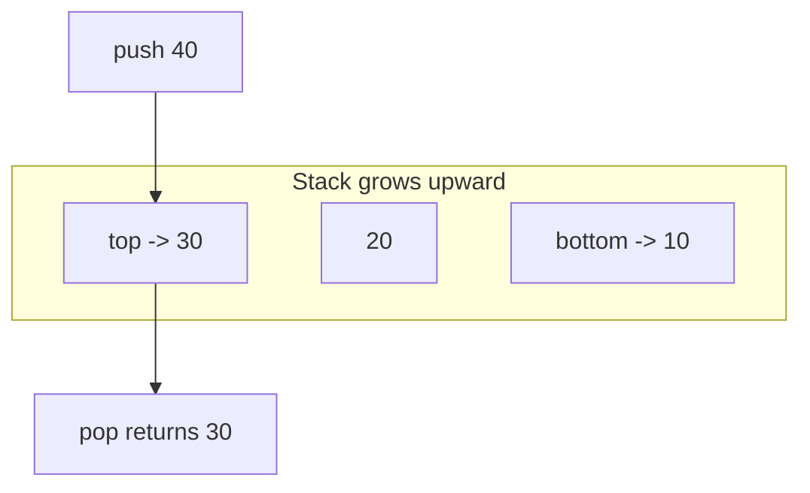
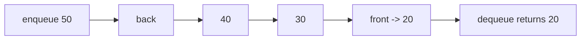
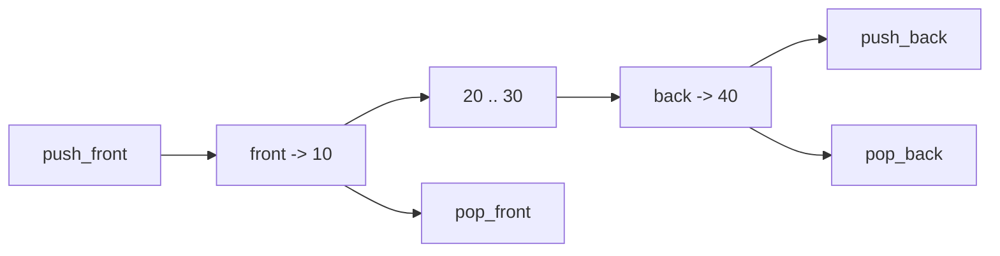
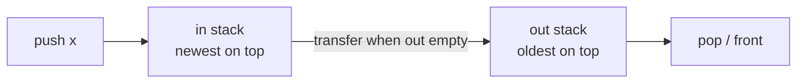
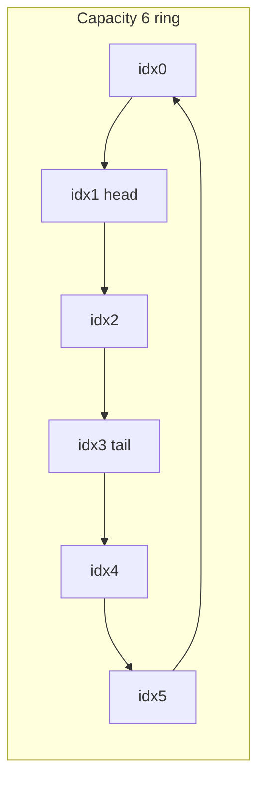
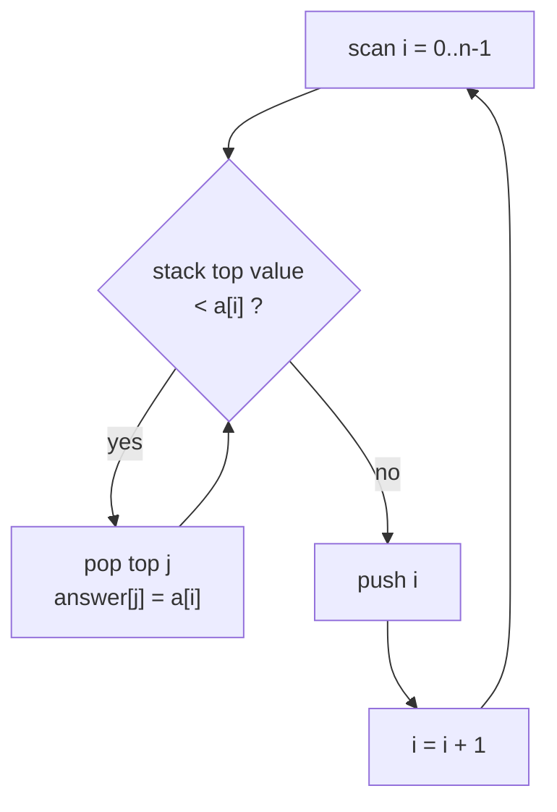
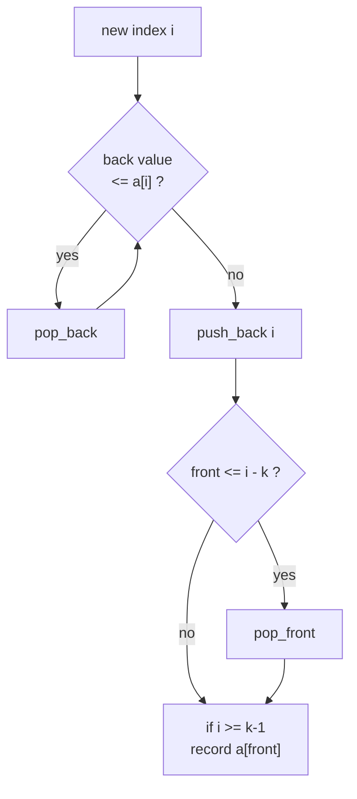

# Stack, Queue, Deque & Monotonic Stack/Queue

Linear sequence containers are the workhorses of competitive programming and systems code. This guide builds from the three fundamental abstract data types — the **stack** (LIFO), the **queue** (FIFO), and the **deque** (double-ended) — up to their most powerful applications: the **monotonic stack** and **monotonic deque**. These two patterns convert many naive $O(n^2)$ scans into clean $O(n)$ algorithms by maintaining an invariant that lets each element be inserted and removed exactly once.

We will pair every code sample in **Python** and **C++**, prove the amortized $O(n)$ bound for the monotonic structures, and finish with a complexity summary, common pitfalls, and reusable patterns.

## Table of Contents

1. [Stack — LIFO](#1-stack--lifo)
2. [Queue — FIFO](#2-queue--fifo)
3. [Deque — Double-Ended Queue](#3-deque--double-ended-queue)
4. [Queue From Two Stacks](#4-queue-from-two-stacks)
5. [Circular Buffer Queue](#5-circular-buffer-queue)
6. [Monotonic Stack](#6-monotonic-stack)
7. [Amortized Analysis](#7-amortized-analysis)
8. [Monotonic Deque — Sliding Window Min/Max](#8-monotonic-deque--sliding-window-minmax)
9. [When To Use Each](#9-when-to-use-each)
10. [Complexity Summary](#complexity-summary)
11. [Common Pitfalls](#common-pitfalls)
12. [Patterns](#patterns)

---

## 1. Stack — LIFO

A **stack** is a Last-In-First-Out container. The last element pushed is the first one popped. Think of a stack of plates: you add to and remove from the top.

Core operations, all $O(1)$:

- `push(x)` — add `x` to the top.
- `pop()` — remove and return the top.
- `top()` / `peek()` — inspect the top without removing.
- `empty()` — is the stack empty?



Common uses: expression/parentheses matching, undo history, DFS iteration, function call frames, and the monotonic stack pattern below.

**Pseudocode — balanced parentheses**

```
function isBalanced(s):
    stk = empty stack
    for ch in s:
        if ch is an opening bracket:
            stk.push(ch)
        else:
            if stk empty or stk.top() does not match ch:
                return false
            stk.pop()
    return stk.empty()
```

```python
def is_balanced(s: str) -> bool:
    pairs = {')': '(', ']': '[', '}': '{'}
    stk = []
    for ch in s:
        if ch in '([{':
            stk.append(ch)
        elif ch in pairs:
            if not stk or stk[-1] != pairs[ch]:
                return False
            stk.pop()
    return not stk


print(is_balanced("([]{})"))  # True
print(is_balanced("([)]"))    # False
```

```cpp
#include <bits/stdc++.h>
using namespace std;

bool isBalanced(const string &s) {
    unordered_map<char, char> pairs = {{')', '('}, {']', '['}, {'}', '{'}};
    stack<char> stk;
    for (char ch : s) {
        if (ch == '(' || ch == '[' || ch == '{') {
            stk.push(ch);
        } else if (pairs.count(ch)) {
            if (stk.empty() || stk.top() != pairs[ch]) return false;
            stk.pop();
        }
    }
    return stk.empty();
}

int main() {
    cout << boolalpha << isBalanced("([]{})") << "\n"; // true
    cout << boolalpha << isBalanced("([)]") << "\n";   // false
}
```

In Python a plain `list` is the idiomatic stack (`append` / `pop`). In C++ use `std::stack<T>` (a `std::deque` adaptor) or simply a `std::vector<T>`.

---

## 2. Queue — FIFO

A **queue** is First-In-First-Out: elements leave in the order they arrived, like people in a line. Operations are $O(1)$:

- `push` / `enqueue(x)` — add to the back.
- `pop` / `dequeue()` — remove from the front.
- `front()` — inspect the front.



Queues power **BFS**, level-order tree traversal, scheduling, and producer/consumer buffers.

```python
from collections import deque

q = deque()
q.append(1)        # enqueue
q.append(2)
q.append(3)
print(q.popleft())  # 1 (dequeue)
print(q[0])         # 2 (front)
print(len(q))       # 2
```

```cpp
#include <bits/stdc++.h>
using namespace std;

int main() {
    queue<int> q;
    q.push(1);          // enqueue
    q.push(2);
    q.push(3);
    cout << q.front() << "\n"; // 1
    q.pop();                   // dequeue
    cout << q.front() << "\n"; // 2
    cout << q.size() << "\n";  // 2
}
```

> Never use a Python `list` as a queue: `list.pop(0)` is $O(n)$ because it shifts every element. Use `collections.deque`, whose `popleft` is $O(1)$.

---

## 3. Deque — Double-Ended Queue

A **deque** (pronounced "deck") supports $O(1)$ insertion and removal at *both* ends. It generalizes both the stack and the queue.

- `push_front(x)` / `push_back(x)`
- `pop_front()` / `pop_back()`
- `front()` / `back()`



```python
from collections import deque

dq = deque([2, 3])
dq.appendleft(1)   # front: 1 2 3
dq.append(4)       # back:  1 2 3 4
print(dq.popleft())  # 1
print(dq.pop())      # 4
print(list(dq))      # [2, 3]
```

```cpp
#include <bits/stdc++.h>
using namespace std;

int main() {
    deque<int> dq = {2, 3};
    dq.push_front(1);  // 1 2 3
    dq.push_back(4);   // 1 2 3 4
    cout << dq.front() << "\n"; dq.pop_front(); // 1
    cout << dq.back() << "\n";  dq.pop_back();  // 4
    for (int x : dq) cout << x << ' ';          // 2 3
    cout << "\n";
}
```

The deque is the foundation for the **sliding window minimum/maximum** algorithm in section 8.

---

## 4. Queue From Two Stacks

A classic exercise: implement an $O(1)$ amortized FIFO queue using only LIFO stacks. Keep an **in-stack** for pushes and an **out-stack** for pops. When `out` is empty and we need the front, pour everything from `in` into `out`, reversing the order so the oldest element ends up on top.



**Pseudocode**

```
push(x):  in.push(x)

move():   if out empty:
              while in not empty:
                  out.push(in.pop())

pop():    move(); return out.pop()
front():  move(); return out.top()
```

```python
class QueueFromStacks:
    def __init__(self):
        self._in = []
        self._out = []

    def push(self, x: int) -> None:
        self._in.append(x)

    def _move(self) -> None:
        if not self._out:
            while self._in:
                self._out.append(self._in.pop())

    def pop(self) -> int:
        self._move()
        return self._out.pop()

    def front(self) -> int:
        self._move()
        return self._out[-1]

    def empty(self) -> bool:
        return not self._in and not self._out


q = QueueFromStacks()
q.push(1); q.push(2); q.push(3)
print(q.pop(), q.front(), q.pop())  # 1 2 2
```

```cpp
#include <bits/stdc++.h>
using namespace std;

class QueueFromStacks {
    stack<int> inStk, outStk;
    void move() {
        if (outStk.empty()) {
            while (!inStk.empty()) {
                outStk.push(inStk.top());
                inStk.pop();
            }
        }
    }
public:
    void push(int x) { inStk.push(x); }
    int pop()  { move(); int v = outStk.top(); outStk.pop(); return v; }
    int front(){ move(); return outStk.top(); }
    bool empty() const { return inStk.empty() && outStk.empty(); }
};

int main() {
    QueueFromStacks q;
    q.push(1); q.push(2); q.push(3);
    cout << q.pop() << ' ' << q.front() << ' ' << q.pop() << "\n"; // 1 2 2
}
```

Each element is moved from `in` to `out` at most once, so $n$ operations cost $O(n)$ total — amortized $O(1)$ per operation.

---

## 5. Circular Buffer Queue

When the maximum size is known, a fixed array used as a **ring buffer** gives a cache-friendly $O(1)$ queue with no dynamic allocation. Indices `head` and `tail` wrap around modulo the capacity.

$$\text{tail}_{\text{next}} = (\text{tail} + 1) \bmod \text{capacity}$$



We keep a `count` to distinguish the empty state from the full state (both would otherwise have `head == tail`).

```python
class CircularQueue:
    def __init__(self, capacity: int):
        self.buf = [0] * capacity
        self.cap = capacity
        self.head = 0
        self.tail = 0
        self.count = 0

    def push(self, x: int) -> bool:
        if self.count == self.cap:
            return False  # full
        self.buf[self.tail] = x
        self.tail = (self.tail + 1) % self.cap
        self.count += 1
        return True

    def pop(self) -> int:
        if self.count == 0:
            raise IndexError("empty")
        x = self.buf[self.head]
        self.head = (self.head + 1) % self.cap
        self.count -= 1
        return x

    def front(self) -> int:
        if self.count == 0:
            raise IndexError("empty")
        return self.buf[self.head]


cq = CircularQueue(3)
cq.push(1); cq.push(2); cq.push(3)
print(cq.push(4))  # False (full)
print(cq.pop())    # 1
cq.push(4)
print(cq.front())  # 2
```

```cpp
#include <bits/stdc++.h>
using namespace std;

class CircularQueue {
    vector<int> buf;
    int cap, head = 0, tail = 0, count = 0;
public:
    explicit CircularQueue(int capacity) : buf(capacity), cap(capacity) {}

    bool push(int x) {
        if (count == cap) return false; // full
        buf[tail] = x;
        tail = (tail + 1) % cap;
        ++count;
        return true;
    }
    int pop() {
        if (count == 0) throw runtime_error("empty");
        int x = buf[head];
        head = (head + 1) % cap;
        --count;
        return x;
    }
    int front() const {
        if (count == 0) throw runtime_error("empty");
        return buf[head];
    }
};

int main() {
    CircularQueue cq(3);
    cq.push(1); cq.push(2); cq.push(3);
    cout << boolalpha << cq.push(4) << "\n"; // false
    cout << cq.pop() << "\n";                // 1
    cq.push(4);
    cout << cq.front() << "\n";              // 2
}
```

---

## 6. Monotonic Stack

A **monotonic stack** maintains its elements in sorted (increasing or decreasing) order from bottom to top. Before pushing a new element we pop everything that violates the order. This single idea answers an entire family of "**next/previous greater/smaller element**" questions in $O(n)$.

The key insight: when element $x$ pops element $y$, then $x$ is the *answer* (the next greater/smaller) for $y$, and $y$ will never be needed again.

### Next Greater Element

For each index $i$, find the nearest index $j > i$ with `a[j] > a[i]` (or report none). We keep a **decreasing** stack of indices whose answers are still pending.



**Pseudocode**

```
function nextGreater(a):
    n = len(a)
    ans = array of -1, size n
    stk = empty stack of indices   # values strictly decreasing
    for i in 0..n-1:
        while stk not empty and a[stk.top()] < a[i]:
            j = stk.pop()
            ans[j] = i              # i is next-greater index of j
        stk.push(i)
    return ans                      # leftover indices have no next greater
```

**Worked example.** Let `a = [2, 1, 5, 6, 2, 3]`. We compute the next-greater *value* for each (or $-1$).

| i | a[i] | Stack before (idx) | Pops (set answer) | Stack after |
|---|------|--------------------|-------------------|-------------|
| 0 | 2    | []                 | —                 | [0]         |
| 1 | 1    | [0]                | — (2 ≥ 1)         | [0,1]       |
| 2 | 5    | [0,1]              | pop 1→5, pop 0→5  | [2]         |
| 3 | 6    | [2]                | pop 2→6           | [3]         |
| 4 | 2    | [3]                | — (6 ≥ 2)         | [3,4]       |
| 5 | 3    | [3,4]              | pop 4→3           | [3,5]       |

Result (value form): `[5, 5, 6, -1, 3, -1]`. Indices 3 and 5 stay on the stack, so they have no next greater element.

```python
def next_greater(a: list[int]) -> list[int]:
    n = len(a)
    ans = [-1] * n          # store the value of the next greater, or -1
    stk = []                # indices, a[stk] strictly decreasing
    for i in range(n):
        while stk and a[stk[-1]] < a[i]:
            ans[stk.pop()] = a[i]
        stk.append(i)
    return ans


print(next_greater([2, 1, 5, 6, 2, 3]))  # [5, 5, 6, -1, 3, -1]
```

```cpp
#include <bits/stdc++.h>
using namespace std;

vector<int> nextGreater(const vector<int> &a) {
    int n = (int)a.size();
    vector<int> ans(n, -1);   // value of next greater, or -1
    stack<int> stk;           // indices, a[stk] strictly decreasing
    for (int i = 0; i < n; ++i) {
        while (!stk.empty() && a[stk.top()] < a[i]) {
            ans[stk.top()] = a[i];
            stk.pop();
        }
        stk.push(i);
    }
    return ans;
}

int main() {
    vector<int> a = {2, 1, 5, 6, 2, 3};
    for (int v : nextGreater(a)) cout << v << ' '; // 5 5 6 -1 3 -1
    cout << "\n";
}
```

### Direction & strictness cheat sheet

- **Next greater** → scan left→right, pop while `top < a[i]`.
- **Next smaller** → scan left→right, pop while `top > a[i]`.
- **Previous greater/smaller** → scan right→left (or read the surviving stack top *before* pushing).
- Use `<` vs `<=` to control whether equal elements are treated as "not strictly greater" (matters for handling duplicates and for histogram-style problems).

---

## 7. Amortized Analysis

Why is the monotonic stack $O(n)$ when there is a `while` loop inside a `for` loop? Use the **accounting / aggregate** method.

Across the entire run:

- Each index is **pushed exactly once** (one `push` per iteration of the outer loop) → at most $n$ pushes.
- Each index is **popped at most once**, because once popped it never returns → at most $n$ pops.

So the total number of stack operations over all $n$ iterations is bounded by $2n$. The inner `while` may run many times in a single iteration, but those iterations are "paid for" by pushes that happened earlier.

$$T(n) = \sum_{i=0}^{n-1}\big(1 + \text{pops}_i\big) = n + \sum_{i=0}^{n-1}\text{pops}_i \le n + n = 2n = O(n).$$

The same argument applies to the two-stack queue and to the monotonic deque: every element enters once and leaves once, giving **amortized $O(1)$** per element.

---

## 8. Monotonic Deque — Sliding Window Min/Max

The **sliding window maximum** problem asks: given an array and a window size $k$, output the maximum of every contiguous window. A monotonic **deque** of indices solves it in $O(n)$.

Maintain the deque so that values are **decreasing** from front to back. The front always holds the index of the current window maximum.

Three steps per index $i$:

1. **Pop back** while the back's value is `<= a[i]` (those can never be the max while `a[i]` is in the window).
2. **Push** `i` to the back.
3. **Pop front** if it has slid out of the window (`front <= i - k`).
4. Once `i >= k - 1`, record `a[front]` as the window max.



**Pseudocode**

```
function slidingMax(a, k):
    dq = empty deque of indices      # a[dq] decreasing front->back
    out = []
    for i in 0..n-1:
        while dq not empty and a[dq.back()] <= a[i]:
            dq.pop_back()
        dq.push_back(i)
        if dq.front() <= i - k:
            dq.pop_front()
        if i >= k - 1:
            out.append(a[dq.front()])
    return out
```

```python
from collections import deque


def sliding_max(a: list[int], k: int) -> list[int]:
    dq = deque()      # indices, a[dq] decreasing front -> back
    out = []
    for i, x in enumerate(a):
        while dq and a[dq[-1]] <= x:
            dq.pop()
        dq.append(i)
        if dq[0] <= i - k:
            dq.popleft()
        if i >= k - 1:
            out.append(a[dq[0]])
    return out


print(sliding_max([1, 3, -1, -3, 5, 3, 6, 7], 3))
# [3, 3, 5, 5, 6, 7]
```

```cpp
#include <bits/stdc++.h>
using namespace std;

vector<int> slidingMax(const vector<int> &a, int k) {
    deque<int> dq;            // indices, a[dq] decreasing front -> back
    vector<int> out;
    for (int i = 0; i < (int)a.size(); ++i) {
        while (!dq.empty() && a[dq.back()] <= a[i]) dq.pop_back();
        dq.push_back(i);
        if (dq.front() <= i - k) dq.pop_front();
        if (i >= k - 1) out.push_back(a[dq.front()]);
    }
    return out;
}

int main() {
    vector<int> a = {1, 3, -1, -3, 5, 3, 6, 7};
    for (int v : slidingMax(a, 3)) cout << v << ' '; // 3 3 5 5 6 7
    cout << "\n";
}
```

For the **sliding window minimum**, flip the comparison in step 1 to `a[dq.back()] >= a[i]` so the deque is increasing and the front holds the minimum.

---

## 9. When To Use Each

| Need | Structure |
|------|-----------|
| Reverse / backtrack / match nesting | Stack |
| Process in arrival order, BFS | Queue |
| Add and remove at both ends | Deque |
| FIFO using only LIFO primitives | Two stacks |
| Fixed-size FIFO, no allocation | Circular buffer |
| Next/previous greater or smaller element | Monotonic stack |
| Min/max over a sliding window | Monotonic deque |

---

## Complexity Summary

| Operation / Algorithm | Time | Space |
|-----------------------|------|-------|
| Stack push / pop / top | $O(1)$ | $O(n)$ |
| Queue push / pop / front | $O(1)$ | $O(n)$ |
| Deque both-end ops | $O(1)$ | $O(n)$ |
| Two-stack queue (per op) | $O(1)$ amortized | $O(n)$ |
| Circular buffer ops | $O(1)$ | $O(\text{cap})$ |
| Monotonic stack (next greater/smaller) | $O(n)$ | $O(n)$ |
| Monotonic deque (sliding window) | $O(n)$ | $O(k)$ |

---

## Common Pitfalls

- **Python `list.pop(0)`** is $O(n)$. Use `collections.deque.popleft()` for queues.
- **Storing values instead of indices** in monotonic structures. Storing indices lets you check window bounds and compute distances; you can always look up the value via `a[idx]`.
- **Wrong strictness** (`<` vs `<=`). With duplicates, the choice decides whether equal neighbors get popped, which changes "span" answers (e.g. stock span requires `<=`).
- **Forgetting to evict the expired front** in the sliding window deque (`front <= i - k`).
- **Recording the answer too early** — only emit a window result once `i >= k - 1`.
- **C++ name clashes**: a local variable named `queue` or `stack` shadows the STL templates. Use `q` / `stk`. A function named `union` will not compile — use `unite`.
- **Overflow** in sum/area variants. Use `long long` and `const long long INF = 1e18` in C++.
- **Empty-stack access** — always guard `top()` / `front()` with an emptiness check.

---

## Patterns

- **Monotonic stack template.** Iterate once; while the stack's top breaks the desired order relative to the current element, pop and resolve that element's answer; then push the current index. Choose increasing vs decreasing stack and scan direction to target next/previous greater/smaller.
- **Span / area collapse.** Histogram largest rectangle, stock span, and "trapping rain water" all reduce to a monotonic stack where popping computes a width or span using index differences.
- **Sliding window extreme.** Keep a monotonic deque of indices; front is the answer; evict from the back to maintain monotonicity and from the front to maintain the window.
- **Amortized once-in once-out.** Whenever each element can be pushed and popped at most once, the whole scan is $O(n)$ regardless of nested loops.
- **FIFO from LIFO.** Two stacks (or a stack pair) simulate a queue with amortized $O(1)$ operations — useful when only stacks are available.
