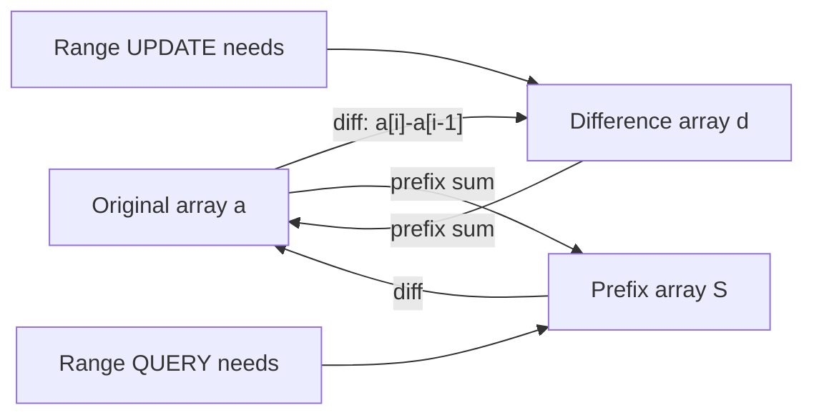
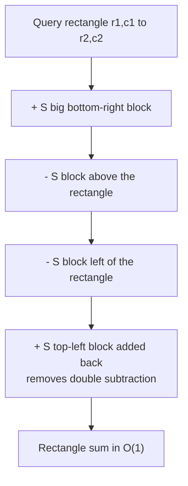
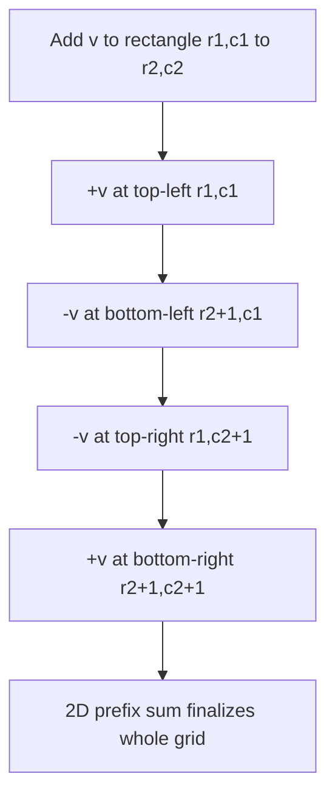

# Prefix Sums & Difference Arrays (1D and 2D)

Prefix sums and difference arrays are two sides of the same coin. A **prefix sum** turns *range
queries* into $O(1)$ lookups after $O(n)$ preprocessing. A **difference array** turns *range updates*
into $O(1)$ edits, with a single $O(n)$ pass to finalize. They are inverse operations: the prefix sum
of a difference array reconstructs the original array, and the difference of a prefix-sum array
reconstructs it back. Master both and you can answer "sum over a range" and "add to a range" problems
in constant time per operation.

---

## Table of Contents

1. [Core Idea & Duality](#core-idea--duality)
2. [1D Prefix Sums](#1d-prefix-sums)
3. [2D Prefix Sums (Inclusion–Exclusion)](#2d-prefix-sums-inclusionexclusion)
4. [1D Difference Array (Range Add)](#1d-difference-array-range-add)
5. [2D Difference Array (4-Corner Range Add)](#2d-difference-array-4-corner-range-add)
6. [Prefix XOR / Prefix Product](#prefix-xor--prefix-product)
7. [Prefix Sums for Counting (Subarray Sum = k)](#prefix-sums-for-counting-subarray-sum--k)
8. [Complexity Summary](#complexity-summary)
9. [Common Pitfalls](#common-pitfalls)
10. [Patterns](#patterns)

---

## Core Idea & Duality

Given an array $a[0 \dots n-1]$:

- **Prefix sum** $S$ answers *range queries* fast: $S[i] = a[0] + a[1] + \dots + a[i-1]$.
- **Difference array** $d$ absorbs *range updates* fast: $d[i] = a[i] - a[i-1]$.

The duality is exact:

$$
\text{prefixSum}(\text{diff}(a)) = a, \qquad \text{diff}(\text{prefixSum}(a)) = a.
$$



> Rule of thumb: many queries, no updates → **prefix sums**. Many range updates, query at the end →
> **difference array**.

---

## 1D Prefix Sums

Build $S$ of length $n+1$ with $S[0] = 0$ and $S[i] = S[i-1] + a[i-1]$. Then the sum of the inclusive
range $a[l \dots r]$ is:

$$
\sum_{k=l}^{r} a[k] = S[r+1] - S[l] = S[r] - S[l-1] \quad (\text{1-indexed } S).
$$

The $S[0]=0$ sentinel removes the special case when $l = 0$.

Pseudocode:

```
S[0] = 0
for i in 1..n:
    S[i] = S[i-1] + a[i-1]
rangeSum(l, r) = S[r+1] - S[l]   # 0-indexed l, r inclusive
```

```python
def build_prefix(a):
    n = len(a)
    S = [0] * (n + 1)
    for i in range(1, n + 1):
        S[i] = S[i - 1] + a[i - 1]
    return S

def range_sum(S, l, r):  # inclusive, 0-indexed
    return S[r + 1] - S[l]

a = [3, 1, 4, 1, 5, 9, 2]
S = build_prefix(a)
print(range_sum(S, 2, 5))  # 4 + 1 + 5 + 9 = 19
```

```cpp
#include <bits/stdc++.h>
using namespace std;

vector<long long> build_prefix(const vector<long long>& a) {
    int n = (int)a.size();
    vector<long long> S(n + 1, 0);
    for (int i = 1; i <= n; ++i)
        S[i] = S[i - 1] + a[i - 1];
    return S;
}

long long range_sum(const vector<long long>& S, int l, int r) { // inclusive, 0-indexed
    return S[r + 1] - S[l];
}

int main() {
    vector<long long> a = {3, 1, 4, 1, 5, 9, 2};
    vector<long long> S = build_prefix(a);
    cout << range_sum(S, 2, 5) << "\n"; // 19
    return 0;
}
```

---

## 2D Prefix Sums (Inclusion–Exclusion)

For a matrix $a$ of size $R \times C$, build $S$ of size $(R+1) \times (C+1)$ with a zero top row and
zero left column. The recurrence adds the cell while folding in the two overlapping prefixes and
**subtracting the double-counted corner**:

$$
S[i][j] = a[i-1][j-1] + S[i-1][j] + S[i][j-1] - S[i-1][j-1].
$$

To query the sum of the rectangle with top-left $(r_1, c_1)$ and bottom-right $(r_2, c_2)$ inclusive
(0-indexed), use **inclusion–exclusion** over four prefix corners:

$$
\text{sum} = S[r_2{+}1][c_2{+}1] - S[r_1][c_2{+}1] - S[r_2{+}1][c_1] + S[r_1][c_1].
$$



```python
def build_prefix_2d(a):
    R, C = len(a), len(a[0])
    S = [[0] * (C + 1) for _ in range(R + 1)]
    for i in range(1, R + 1):
        for j in range(1, C + 1):
            S[i][j] = a[i - 1][j - 1] + S[i - 1][j] + S[i][j - 1] - S[i - 1][j - 1]
    return S

def rect_sum(S, r1, c1, r2, c2):  # inclusive, 0-indexed
    return S[r2 + 1][c2 + 1] - S[r1][c2 + 1] - S[r2 + 1][c1] + S[r1][c1]

mat = [[1, 2, 3],
       [4, 5, 6],
       [7, 8, 9]]
S = build_prefix_2d(mat)
print(rect_sum(S, 1, 1, 2, 2))  # 5 + 6 + 8 + 9 = 28
```

```cpp
#include <bits/stdc++.h>
using namespace std;

vector<vector<long long>> build_prefix_2d(const vector<vector<long long>>& a) {
    int R = (int)a.size(), C = (int)a[0].size();
    vector<vector<long long>> S(R + 1, vector<long long>(C + 1, 0));
    for (int i = 1; i <= R; ++i)
        for (int j = 1; j <= C; ++j)
            S[i][j] = a[i - 1][j - 1] + S[i - 1][j] + S[i][j - 1] - S[i - 1][j - 1];
    return S;
}

long long rect_sum(const vector<vector<long long>>& S,
                   int r1, int c1, int r2, int c2) { // inclusive, 0-indexed
    return S[r2 + 1][c2 + 1] - S[r1][c2 + 1] - S[r2 + 1][c1] + S[r1][c1];
}

int main() {
    vector<vector<long long>> mat = {{1, 2, 3}, {4, 5, 6}, {7, 8, 9}};
    auto S = build_prefix_2d(mat);
    cout << rect_sum(S, 1, 1, 2, 2) << "\n"; // 28
    return 0;
}
```

---

## 1D Difference Array (Range Add)

To add $v$ to every element in $a[l \dots r]$ in $O(1)$, edit a difference array $d$:

$$
d[l] \mathrel{+}= v, \qquad d[r+1] \mathrel{-}= v.
$$

After all updates, a single prefix sum over $d$ produces the final array. The $+v$ "turns the addition
on" at index $l$; the $-v$ at $r+1$ "turns it off" right after the range ends.

Pseudocode:

```
d = array of zeros, length n+1   # extra slot for r+1
for each update (l, r, v):
    d[l]   += v
    d[r+1] -= v
running = 0
for i in 0..n-1:
    running += d[i]
    a[i] = running
```

```python
def range_add(n, updates):
    d = [0] * (n + 1)            # one extra slot guards r+1 == n
    for l, r, v in updates:
        d[l] += v
        d[r + 1] -= v
    a = [0] * n
    running = 0
    for i in range(n):
        running += d[i]
        a[i] = running
    return a

# add 5 to [1..3], add 2 to [0..2]
print(range_add(5, [(1, 3, 5), (0, 2, 2)]))  # [2, 7, 7, 5, 0]
```

```cpp
#include <bits/stdc++.h>
using namespace std;

vector<long long> range_add(int n, const vector<array<long long, 3>>& updates) {
    vector<long long> d(n + 1, 0);          // extra slot guards r+1 == n
    for (const auto& u : updates) {
        long long l = u[0], r = u[1], v = u[2];
        d[l] += v;
        d[r + 1] -= v;
    }
    vector<long long> a(n, 0);
    long long running = 0;
    for (int i = 0; i < n; ++i) {
        running += d[i];
        a[i] = running;
    }
    return a;
}

int main() {
    vector<array<long long, 3>> updates = {{1, 3, 5}, {0, 2, 2}};
    vector<long long> a = range_add(5, updates);
    for (long long x : a) cout << x << " "; // 2 7 7 5 0
    cout << "\n";
    return 0;
}
```

---

## 2D Difference Array (4-Corner Range Add)

To add $v$ to every cell in the sub-rectangle $[r_1, r_2] \times [c_1, c_2]$ in $O(1)$, stamp **four
corners** into a difference matrix $d$ of size $(R+1) \times (C+1)$:

$$
d[r_1][c_1] \mathrel{+}= v, \quad d[r_2{+}1][c_1] \mathrel{-}= v, \quad
d[r_1][c_2{+}1] \mathrel{-}= v, \quad d[r_2{+}1][c_2{+}1] \mathrel{+}= v.
$$

After all updates, take a **2D prefix sum** of $d$ to materialize the final matrix. This is the exact
inverse of the 2D prefix-sum query: there we read four corners, here we write four corners.



```python
def range_add_2d(R, C, updates):
    d = [[0] * (C + 1) for _ in range(R + 1)]
    for r1, c1, r2, c2, v in updates:
        d[r1][c1] += v
        d[r2 + 1][c1] -= v
        d[r1][c2 + 1] -= v
        d[r2 + 1][c2 + 1] += v
    grid = [[0] * C for _ in range(R)]
    for i in range(R):
        for j in range(C):
            up = d[i - 1][j] if i > 0 else 0
            left = d[i][j - 1] if j > 0 else 0
            diag = d[i - 1][j - 1] if i > 0 and j > 0 else 0
            d[i][j] += up + left - diag
            grid[i][j] = d[i][j]
    return grid

# add 3 to rows 0..1, cols 1..2 of a 3x3 grid
print(range_add_2d(3, 3, [(0, 1, 1, 2, 3)]))
# [[0, 3, 3], [0, 3, 3], [0, 0, 0]]
```

```cpp
#include <bits/stdc++.h>
using namespace std;

vector<vector<long long>> range_add_2d(int R, int C,
        const vector<array<long long, 5>>& updates) {
    vector<vector<long long>> d(R + 1, vector<long long>(C + 1, 0));
    for (const auto& u : updates) {
        long long r1 = u[0], c1 = u[1], r2 = u[2], c2 = u[3], v = u[4];
        d[r1][c1] += v;
        d[r2 + 1][c1] -= v;
        d[r1][c2 + 1] -= v;
        d[r2 + 1][c2 + 1] += v;
    }
    vector<vector<long long>> grid(R, vector<long long>(C, 0));
    for (int i = 0; i < R; ++i) {
        for (int j = 0; j < C; ++j) {
            long long up = (i > 0) ? d[i - 1][j] : 0;
            long long left = (j > 0) ? d[i][j - 1] : 0;
            long long diag = (i > 0 && j > 0) ? d[i - 1][j - 1] : 0;
            d[i][j] += up + left - diag;
            grid[i][j] = d[i][j];
        }
    }
    return grid;
}

int main() {
    vector<array<long long, 5>> updates = {{0, 1, 1, 2, 3}};
    auto grid = range_add_2d(3, 3, updates);
    for (auto& row : grid) {
        for (long long x : row) cout << x << " ";
        cout << "\n";
    }
    return 0;
}
```

---

## Prefix XOR / Prefix Product

The prefix-sum idea generalizes to any **invertible associative** operation. XOR is its own inverse,
so prefix XOR answers range-XOR queries:

$$
\bigoplus_{k=l}^{r} a[k] = P[r+1] \oplus P[l], \quad P[i] = a[0] \oplus \dots \oplus a[i-1].
$$

Prefix **product** works too, but only when you can divide (no zeros, or use modular inverse under a
prime modulus). When zeros are possible, a plain division-based prefix product breaks — prefer the
"product of array except self" two-pass trick instead.

```python
def prefix_xor(a):
    P = [0] * (len(a) + 1)
    for i, x in enumerate(a):
        P[i + 1] = P[i] ^ x
    return P

def range_xor(P, l, r):  # inclusive, 0-indexed
    return P[r + 1] ^ P[l]

a = [3, 8, 2, 6, 4]
P = prefix_xor(a)
print(range_xor(P, 1, 3))  # 8 ^ 2 ^ 6 = 12
```

```cpp
#include <bits/stdc++.h>
using namespace std;

vector<long long> prefix_xor(const vector<long long>& a) {
    vector<long long> P(a.size() + 1, 0);
    for (size_t i = 0; i < a.size(); ++i)
        P[i + 1] = P[i] ^ a[i];
    return P;
}

long long range_xor(const vector<long long>& P, int l, int r) { // inclusive, 0-indexed
    return P[r + 1] ^ P[l];
}

int main() {
    vector<long long> a = {3, 8, 2, 6, 4};
    auto P = prefix_xor(a);
    cout << range_xor(P, 1, 3) << "\n"; // 12
    return 0;
}
```

---

## Prefix Sums for Counting (Subarray Sum = k)

A subarray $a[l \dots r]$ sums to $k$ exactly when $S[r+1] - S[l] = k$, i.e. when an earlier prefix
equals $S[r+1] - k$. Stream the prefix sum left to right and keep a **hashmap of prefix-value
frequencies**. For each new prefix $p$, add the count of $p - k$ seen so far. This counts all subarrays
summing to $k$ in $O(n)$, even with negative numbers (where sliding window fails).

$$
\#\{(l, r) : \textstyle\sum_{k=l}^{r} a[k] = k\}
= \sum_{r} \text{freq}\big[\, S[r+1] - k \,\big] \ \text{seen before } r.
$$

Seed the map with `{0: 1}` so a prefix that itself equals $k$ counts the subarray starting at index 0.

```python
from collections import defaultdict

def subarray_sum_equals_k(a, k):
    freq = defaultdict(int)
    freq[0] = 1               # empty prefix
    prefix = 0
    count = 0
    for x in a:
        prefix += x
        count += freq[prefix - k]
        freq[prefix] += 1
    return count

print(subarray_sum_equals_k([1, 2, 3, -3, 3], 3))  # 4
```

```cpp
#include <bits/stdc++.h>
using namespace std;

long long subarray_sum_equals_k(const vector<long long>& a, long long k) {
    unordered_map<long long, long long> freq;
    freq[0] = 1;              // empty prefix
    long long prefix = 0, count = 0;
    for (long long x : a) {
        prefix += x;
        auto it = freq.find(prefix - k);
        if (it != freq.end()) count += it->second;
        freq[prefix] += 1;
    }
    return count;
}

int main() {
    vector<long long> a = {1, 2, 3, -3, 3};
    cout << subarray_sum_equals_k(a, 3) << "\n"; // 4
    return 0;
}
```

---

## Complexity Summary

| Technique | Build / Update | Query | Space | Notes |
|-----------|----------------|-------|-------|-------|
| 1D prefix sum | $O(n)$ build | $O(1)$ range sum | $O(n)$ | Immutable array, many queries |
| 2D prefix sum | $O(RC)$ build | $O(1)$ rect sum | $O(RC)$ | 4-corner inclusion–exclusion |
| 1D difference array | $O(1)$ per update, $O(n)$ finalize | $O(1)$ after finalize | $O(n)$ | Offline range add |
| 2D difference array | $O(1)$ per update, $O(RC)$ finalize | $O(1)$ after finalize | $O(RC)$ | 4-corner range add |
| Prefix XOR | $O(n)$ build | $O(1)$ range XOR | $O(n)$ | XOR is self-inverse |
| Prefix sum + hashmap | $O(n)$ stream | — | $O(n)$ | Counts subarrays summing to $k$ |

---

## Common Pitfalls

- **Off-by-one with the sentinel.** Use $S[0] = 0$ and length $n+1$; query is $S[r+1] - S[l]$ for an
  inclusive 0-indexed range. Mixing 0-indexed and 1-indexed conventions is the #1 bug.
- **Difference array buffer too small.** Allocate length $n+1$ (or $(R+1)\times(C+1)$) so $d[r+1]$ never
  writes out of bounds when $r = n-1$.
- **Integer overflow.** Range sums of $10^5$ values up to $10^9$ exceed 32-bit range. Use `long long`
  in C++ and `const long long INF = 1e18` for sentinels; Python ints are arbitrary precision.
- **Forgetting to finalize.** A difference array is *not* the answer until you take its prefix sum.
- **Prefix product with zeros.** Division-based prefix products break on zeros — use the two-pass
  prefix/suffix product trick instead.
- **Sliding window vs hashmap.** Sliding window for "sum = k" only works with non-negative values; with
  negatives, use the prefix-sum + hashmap counting method.

---

## Patterns

- **"Sum / XOR over many ranges, no updates"** → build a prefix array, answer each query in $O(1)$.
- **"Add to many ranges, read the array once at the end"** → difference array, finalize with a prefix
  sum. Generalize to 2D with 4-corner stamps.
- **"Count subarrays with sum = k"** → streaming prefix sum + hashmap of prefix frequencies.
- **"Submatrix sum queries"** → 2D prefix sums with inclusion–exclusion.
- **Duality check:** prefix sum and difference array are inverses — if a problem mixes range-add and
  range-sum, consider a Fenwick/segment tree, but if updates and queries are *phased* (all updates,
  then all queries), the static prefix/difference combo is simpler and faster.
