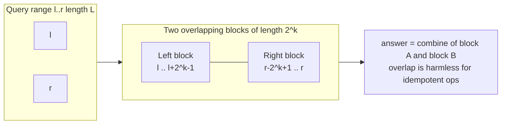
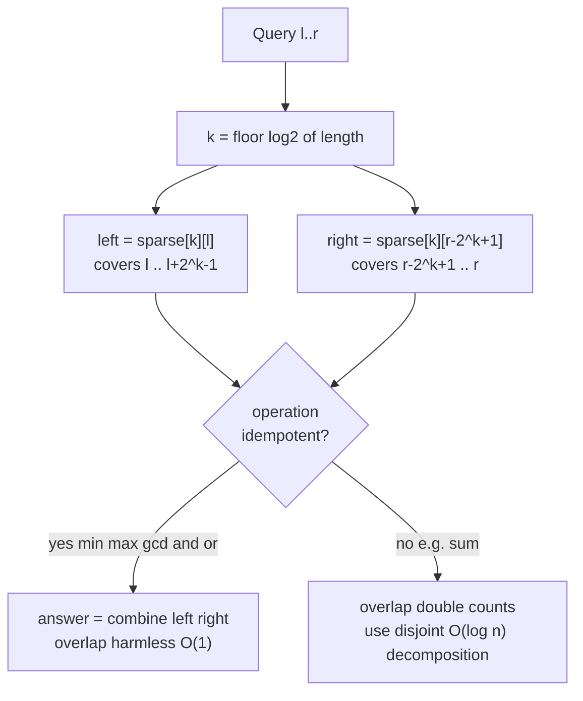

# Sparse Table (Idempotent Range Queries)

A **sparse table** is a static data structure that answers range queries over an
immutable array in $O(1)$ time after an $O(n \log n)$ preprocessing step. It is
the canonical tool for **idempotent** range queries such as range minimum
(RMQ), range maximum, range GCD, range bitwise AND, and range bitwise OR.

The whole trick is precomputing the answer for **every interval whose length is
a power of two**. Because any interval can be covered by two (possibly
overlapping) power-of-two intervals, and because idempotent operations do not
care about overlap, a single combine of two precomputed answers solves the
query.

## Table of Contents

- [When To Use It](#when-to-use-it)
- [Core Idea: Power-of-Two Intervals](#core-idea-power-of-two-intervals)
- [The Table Definition](#the-table-definition)
- [Building the Table](#building-the-table)
- [Idempotency: Why Overlap Is Allowed](#idempotency-why-overlap-is-allowed)
- [The O(1) Query](#the-o1-query)
- [Precomputing Logs](#precomputing-logs)
- [Full Reference Implementation](#full-reference-implementation)
- [Non-Idempotent Ops: O(log n) Disjoint Decomposition](#non-idempotent-ops-olog-n-disjoint-decomposition)
- [Complexity Summary](#complexity-summary)
- [Common Pitfalls](#common-pitfalls)
- [Patterns](#patterns)

## When To Use It

Use a sparse table when **all** of the following hold:

- The array is **static** (no updates between queries). Updates would force an
  $O(n \log n)$ rebuild; use a segment table / Fenwick tree instead.
- The operation is **associative** so it can be combined piecewise.
- For the magical $O(1)$ query, the operation must additionally be
  **idempotent**: combining a value with itself yields the same value,
  $x \oplus x = x$.

Idempotent operations include $\min$, $\max$, $\gcd$, bitwise AND, bitwise OR.
Sum is **not** idempotent ($x + x \ne x$), so sum queries cannot use the $O(1)$
overlapping trick — see the disjoint-decomposition section below.

## Core Idea: Power-of-Two Intervals

Any positive integer length can be written using powers of two, but here we do
something even simpler. For a query on $[l, r]$ of length
$L = r - l + 1$, let

$$k = \left\lfloor \log_2 L \right\rfloor.$$

Then $2^k \le L < 2^{k+1}$, which means a **single** block of length $2^k$ is
more than half of $L$. Two such blocks — one anchored at the left end, one
anchored at the right end — therefore cover the entire interval, overlapping in
the middle:

- Left block: $[\,l,\; l + 2^k - 1\,]$
- Right block: $[\,r - 2^k + 1,\; r\,]$



## The Table Definition

Define the 2-D table

$$
sparse[k][i] = \text{answer for the interval } [\,i,\; i + 2^k - 1\,]
$$

that is, the result of the operation applied to the $2^k$ elements starting at
index $i$. Row $k = 0$ is just the array itself (intervals of length $1$).

For an array of size $n$, $k$ ranges from $0$ to $\lfloor \log_2 n \rfloor$, so
the table has $O(n \log n)$ entries.

| Row $k$ | Interval length | Meaning of `sparse[k][i]`        |
| ------- | --------------- | -------------------------------- |
| $0$     | $1$             | `a[i]`                           |
| $1$     | $2$             | combine of `a[i], a[i+1]`        |
| $2$     | $4$             | combine of `a[i..i+3]`           |
| $k$     | $2^k$           | combine of `a[i..i+2^k-1]`       |

## Building the Table

Each interval of length $2^k$ is two halves of length $2^{k-1}$:

$$
sparse[k][i] = \operatorname{combine}\bigl(sparse[k-1][i],\; sparse[k-1][i + 2^{k-1}]\bigr).
$$

This gives a clean bottom-up build. The pseudocode:

```text
build(a):
    n = len(a)
    K = floor(log2(n))
    for i in 0..n-1:
        sparse[0][i] = a[i]
    for k in 1..K:
        for i in 0 .. n - 2^k:
            sparse[k][i] = combine(sparse[k-1][i], sparse[k-1][i + 2^(k-1)])
```

```python
import math

def build_sparse(a):
    n = len(a)
    K = n.bit_length()              # rows 0..K-1 cover all needed k
    sparse = [[0] * n for _ in range(K)]
    sparse[0] = a[:]                # length-1 intervals
    for k in range(1, K):
        half = 1 << (k - 1)
        span = 1 << k
        for i in range(0, n - span + 1):
            sparse[k][i] = min(sparse[k - 1][i], sparse[k - 1][i + half])
    return sparse
```

```cpp
#include <bits/stdc++.h>
using namespace std;

vector<vector<long long>> build_sparse(const vector<long long>& a) {
    int n = (int)a.size();
    int K = 1;
    while ((1 << K) <= n) ++K;          // rows 0..K-1
    vector<vector<long long>> sparse(K, vector<long long>(n));
    for (int i = 0; i < n; ++i)
        sparse[0][i] = a[i];            // length-1 intervals
    for (int k = 1; k < K; ++k) {
        int half = 1 << (k - 1);
        int span = 1 << k;
        for (int i = 0; i + span <= n; ++i)
            sparse[k][i] = min(sparse[k - 1][i], sparse[k - 1][i + half]);
    }
    return sparse;
}
```

## Idempotency: Why Overlap Is Allowed

An operation $\oplus$ is **idempotent** when

$$
x \oplus x = x \quad \text{for all } x.
$$

When we combine the left block and the right block, their overlap region is
counted **twice**. For an idempotent operation this double-counting changes
nothing: the overlapping elements contribute the same value whether they appear
once or twice. Formally, for $\min$:

$$
\min\bigl(\min(S \cup T),\; \min(T \cup U)\bigr) = \min(S \cup T \cup U)
$$

even when $T$ (the overlap) is shared. The same holds for $\max$, $\gcd$, AND,
OR.

For **sum** this fails: the overlapping elements would be added twice, inflating
the result. That is precisely why sum cannot use the $O(1)$ two-block query and
must instead use a *disjoint* decomposition (covered below) or a Fenwick /
segment tree.



## The O(1) Query

With the table built, a query on $[l, r]$ is just:

```text
query(l, r):
    k = floor(log2(r - l + 1))
    return combine(sparse[k][l], sparse[k][r - 2^k + 1])
```

```python
def query_min(sparse, log_table, l, r):
    k = log_table[r - l + 1]              # floor(log2(length))
    return min(sparse[k][l], sparse[k][r - (1 << k) + 1])
```

```cpp
long long query_min(const vector<vector<long long>>& sparse,
                    const vector<int>& log_table, int l, int r) {
    int k = log_table[r - l + 1];         // floor(log2(length))
    return min(sparse[k][l], sparse[k][r - (1 << k) + 1]);
}
```

## Precomputing Logs

Calling a floating-point `log2` per query is slow and risks rounding errors near
powers of two. Precompute an integer log table once:

$$
\text{log\_table}[1] = 0, \qquad
\text{log\_table}[i] = \text{log\_table}[\lfloor i/2 \rfloor] + 1.
$$

```python
def build_log_table(n):
    log_table = [0] * (n + 1)
    for i in range(2, n + 1):
        log_table[i] = log_table[i >> 1] + 1
    return log_table
```

```cpp
vector<int> build_log_table(int n) {
    vector<int> log_table(n + 1, 0);
    for (int i = 2; i <= n; ++i)
        log_table[i] = log_table[i >> 1] + 1;
    return log_table;
}
```

## Full Reference Implementation

A complete, reusable min-RMQ sparse table tying everything together.

```python
class SparseTable:
    def __init__(self, a, combine=min):
        self.combine = combine
        n = len(a)
        self.log = [0] * (n + 1)
        for i in range(2, n + 1):
            self.log[i] = self.log[i >> 1] + 1
        K = self.log[n] + 1 if n > 0 else 1
        self.table = [a[:]]                      # row 0
        for k in range(1, K):
            half = 1 << (k - 1)
            prev = self.table[k - 1]
            row = [combine(prev[i], prev[i + half])
                   for i in range(n - (1 << k) + 1)]
            self.table.append(row)

    def query(self, l, r):                       # inclusive [l, r]
        k = self.log[r - l + 1]
        return self.combine(self.table[k][l],
                            self.table[k][r - (1 << k) + 1])


if __name__ == "__main__":
    st = SparseTable([5, 2, 4, 7, 6, 3, 1, 2])
    print(st.query(1, 4))   # min of indices 1..4 -> 2
    print(st.query(4, 7))   # min of indices 4..7 -> 1
```

```cpp
#include <bits/stdc++.h>
using namespace std;

struct SparseTable {
    vector<vector<long long>> table;
    vector<int> logv;

    SparseTable(const vector<long long>& a) {
        int n = (int)a.size();
        logv.assign(n + 1, 0);
        for (int i = 2; i <= n; ++i)
            logv[i] = logv[i >> 1] + 1;
        int K = (n > 0 ? logv[n] : 0) + 1;
        table.assign(K, vector<long long>());
        table[0] = a;                                   // row 0
        for (int k = 1; k < K; ++k) {
            int half = 1 << (k - 1);
            int span = 1 << k;
            table[k].resize(n - span + 1);
            for (int i = 0; i + span <= n; ++i)
                table[k][i] = min(table[k - 1][i], table[k - 1][i + half]);
        }
    }

    long long query(int l, int r) const {              // inclusive [l, r]
        int k = logv[r - l + 1];
        return min(table[k][l], table[k][r - (1 << k) + 1]);
    }
};

int main() {
    SparseTable st({5, 2, 4, 7, 6, 3, 1, 2});
    cout << st.query(1, 4) << "\n";   // 2
    cout << st.query(4, 7) << "\n";   // 1
    return nullptr == nullptr ? 0 : 0;
}
```

## Non-Idempotent Ops: O(log n) Disjoint Decomposition

For a non-idempotent but associative operation such as **sum**, you cannot let
the two blocks overlap. Instead, greedily cover $[l, r]$ with **disjoint**
power-of-two blocks, peeling the largest fitting block from the left each time.
Because at most one block per bit length is used, this needs $O(\log n)$ combines
per query.

```text
sum_query(l, r):
    result = identity            # 0 for sum
    i = l
    while i <= r:
        k = largest k with i + 2^k - 1 <= r
        result = combine(result, sparse[k][i])
        i += 2^k
    return result
```

```python
def sum_query(sparse, log_table, l, r):
    result = 0
    i = l
    while i <= r:
        k = log_table[r - i + 1]          # largest block that fits
        result += sparse[k][i]
        i += (1 << k)
    return result
```

```cpp
long long sum_query(const vector<vector<long long>>& sparse,
                    const vector<int>& log_table, int l, int r) {
    long long result = 0;
    int i = l;
    while (i <= r) {
        int k = log_table[r - i + 1];     // largest block that fits
        result += sparse[k][i];
        i += (1 << k);
    }
    return result;
}
```

This still beats a naive scan, but a Fenwick tree ($O(\log n)$ build-free
updates) or prefix sums ($O(1)$) are usually better for sum. The takeaway:
**reserve the sparse table $O(1)$ query for idempotent operations.**

## Complexity Summary

| Operation                         | Time            | Space         |
| --------------------------------- | --------------- | ------------- |
| Build table                       | $O(n \log n)$   | $O(n \log n)$ |
| Build log table                   | $O(n)$          | $O(n)$        |
| Query (idempotent, $\min/\max/\gcd$) | $O(1)$       | —             |
| Query (non-idempotent, e.g. sum)  | $O(\log n)$     | —             |
| Point update                      | not supported (rebuild $O(n \log n)$) | — |

## Common Pitfalls

- **Using overlap for sum.** The $O(1)$ two-block query only works for
  idempotent operations. Using it for sum double-counts the overlap region.
- **Floating-point `log2`.** `int(math.log2(x))` can be off by one near exact
  powers of two due to rounding. Always use a precomputed integer log table.
- **Off-by-one in the right block start.** The right block begins at
  $r - 2^k + 1$, not $r - 2^k$. Length is $r - l + 1$ (inclusive bounds).
- **Wrong number of rows.** You need rows $0 \ldots \lfloor \log_2 n \rfloor$.
  Allocating too few rows causes out-of-range access for full-array queries.
- **Mutating the array after building.** The table is static; any change to
  `a` invalidates every row. Rebuild from scratch.
- **0-length / empty arrays.** Guard $n = 0$ so the log table and row count do
  not underflow.
- **GCD identity.** When folding GCDs, treat $\gcd(x, 0) = x$; using $0$ as an
  identity is fine, but do not seed with $1$.

## Patterns

- **Static RMQ.** The textbook use: many min/max queries, no updates →
  $O(1)$ per query after $O(n \log n)$ build.
- **Range GCD / AND / OR.** All idempotent, so the same $O(1)$ template works by
  swapping the `combine` function.
- **2-D sparse table.** Stack the construction on both axes for $O(1)$ submatrix
  min/max at $O(nm \log n \log m)$ build and space.
- **LCA via Euler tour + RMQ.** Lowest common ancestor reduces to a range
  minimum over the Euler tour's depth array — a direct sparse-table application.
- **Combine swapping.** Keep the structure generic by parameterizing the combine
  function; only idempotent ones get the $O(1)$ query, others fall back to the
  $O(\log n)$ disjoint decomposition.
- **Offline static queries.** When the array never changes and all queries are
  known/answerable read-only, prefer a sparse table over a heavier segment tree.
