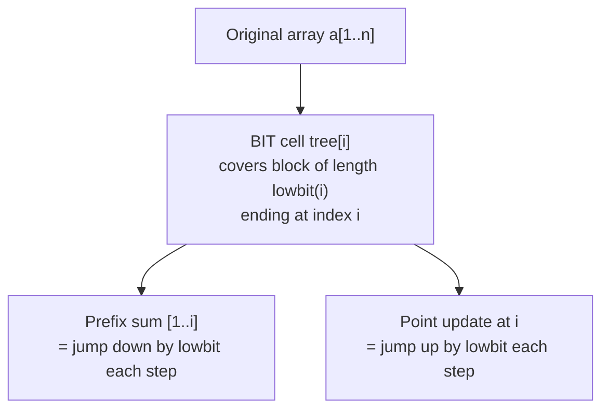
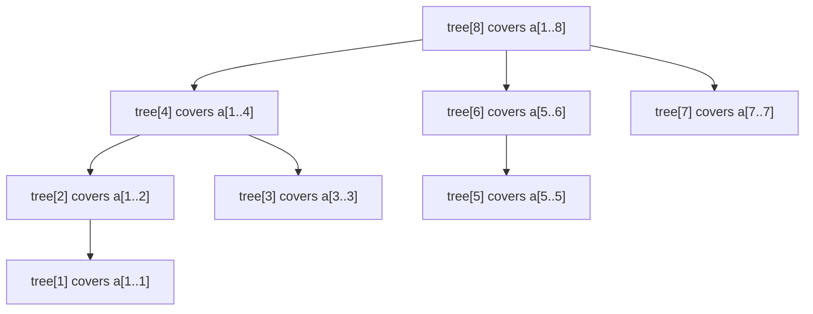
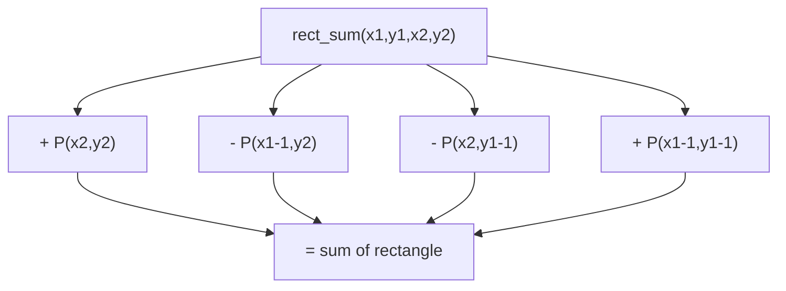

# Fenwick Tree / Binary Indexed Tree (BIT)

A **Fenwick Tree** (a.k.a. **Binary Indexed Tree**, **BIT**) is a compact array-based data
structure that supports **point update** and **prefix-sum query**, each in $O(\log n)$, using
only $O(n)$ memory. It is the go-to structure when you need cumulative sums under updates and
want code that is shorter and faster (smaller constant) than a segment tree.

The magic comes from a single bit trick — the **lowbit** $i \,\&\, (-i)$ — which lets every index
be "responsible" for a power-of-two-sized block of the array. By jumping along these blocks we
cover any prefix in a logarithmic number of steps.

---

## Table of Contents
1. [The Core Idea](#the-core-idea)
2. [The Lowbit Trick](#the-lowbit-trick)
3. [Index Responsibility](#index-responsibility)
4. [Point Update + Prefix Query](#point-update--prefix-query)
5. [1-Indexing](#1-indexing)
6. [Building in O(n)](#building-in-on)
7. [Range-Sum via Two Prefix Queries](#range-sum-via-two-prefix-queries)
8. [Range Update + Point Query](#range-update--point-query)
9. [Range Update + Range Query](#range-update--range-query)
10. [Finding the k-th Element (Binary Lifting)](#finding-the-k-th-element-binary-lifting)
11. [2D BIT](#2d-bit)
12. [Complexity Summary](#complexity-summary)
13. [Common Pitfalls](#common-pitfalls)
14. [Patterns](#patterns)

---

## The Core Idea

Store an array `tree[1..n]` where each cell holds a **partial sum** of the original array. The
cell `tree[i]` covers a contiguous block ending at index `i`, and the **length** of that block
is exactly $\text{lowbit}(i) = i \,\&\, (-i)$ (the value of the lowest set bit of $i$).

Because the block lengths are powers of two, any prefix $[1, i]$ can be written as a sum of a few
disjoint blocks — at most $\lfloor \log_2 n \rfloor + 1$ of them, one per set bit of $i$. That is
why both update and query run in $O(\log n)$.



---

## The Lowbit Trick

For a positive integer $i$, the operation

$$\text{lowbit}(i) = i \,\&\, (-i)$$

isolates the **lowest set bit**. In two's-complement, $-i$ is `~i + 1`, which flips every bit
above the lowest set bit and keeps that bit, so the AND leaves only that single bit.

Examples:

| $i$ | binary | $-i$ (two's complement) | $i \,\&\, (-i)$ |
|-----|--------|--------------------------|------------------|
| 6   | `0110` | `1010`                   | `0010` = 2       |
| 12  | `1100` | `0100`                   | `0100` = 4       |
| 8   | `1000` | `1000`                   | `1000` = 8       |
| 7   | `0111` | `1001`                   | `0001` = 1       |

```python
def lowbit(i: int) -> int:
    return i & (-i)
```

```cpp
int lowbit(int i) {
    return i & (-i);
}
```

---

## Index Responsibility

Each BIT index `i` stores the sum of the block $\big[\,i - \text{lowbit}(i) + 1,\; i\,\big]$.
The diagram below shows the ranges each index is responsible for in a tree of size 8. Notice how
indices that are powers of two cover the largest blocks.



The responsibility lengths for indices $1\ldots 8$:

$$
\text{len}(i) = \big[\,1,\;2,\;1,\;4,\;1,\;2,\;1,\;8\,\big]
$$

which is exactly $\text{lowbit}(i)$ for each $i$.

---

## Point Update + Prefix Query

**Prefix query** `sum(i)` accumulates blocks by repeatedly stripping the lowest set bit
(`i -= lowbit(i)`) until `i` reaches 0.

**Point update** `add(i, delta)` propagates the change to every cell whose block contains `i` by
repeatedly adding the lowest set bit (`i += lowbit(i)`) until `i` exceeds `n`.

Pseudocode:

```
sum(i):
    s = 0
    while i > 0:
        s += tree[i]
        i -= lowbit(i)
    return s

add(i, delta):
    while i <= n:
        tree[i] += delta
        i += lowbit(i)
```

```python
class BIT:
    def __init__(self, n: int) -> None:
        self.n = n
        self.tree = [0] * (n + 1)  # 1-indexed

    def add(self, i: int, delta: int) -> None:
        while i <= self.n:
            self.tree[i] += delta
            i += i & (-i)

    def sum(self, i: int) -> int:
        s = 0
        while i > 0:
            s += self.tree[i]
            i -= i & (-i)
        return s
```

```cpp
struct BIT {
    int n;
    vector<long long> tree;  // 1-indexed

    BIT(int n) : n(n), tree(n + 1, 0) {}

    void add(int i, long long delta) {
        for (; i <= n; i += i & (-i))
            tree[i] += delta;
    }

    long long sum(int i) {
        long long s = 0;
        for (; i > 0; i -= i & (-i))
            s += tree[i];
        return s;
    }
};
```

---

## 1-Indexing

A Fenwick tree **must** be 1-indexed. The query loop `i -= lowbit(i)` terminates when `i == 0`,
and the update loop starts from `i >= 1`. If you used index 0, `lowbit(0) = 0` would cause an
infinite loop (or no progress). Always offset your logical positions by `+1` before calling
`add`/`sum`.

```python
# logical position p in [0, n-1]  ->  BIT index p + 1
bit.add(p + 1, delta)
prefix = bit.sum(p + 1)
```

```cpp
// logical position p in [0, n-1]  ->  BIT index p + 1
bit.add(p + 1, delta);
long long prefix = bit.sum(p + 1);
```

---

## Building in O(n)

Calling `add` for each of $n$ elements costs $O(n \log n)$. We can build in **$O(n)$** by
filling each cell with its block sum directly: put the raw value in `tree[i]`, then "push" each
cell's total into its parent `i + lowbit(i)`.

```python
def build(values: list[int]) -> list[int]:
    n = len(values)
    tree = [0] * (n + 1)
    for i in range(1, n + 1):
        tree[i] += values[i - 1]
        j = i + (i & (-i))
        if j <= n:
            tree[j] += tree[i]
    return tree
```

```cpp
vector<long long> build(const vector<long long>& values) {
    int n = (int)values.size();
    vector<long long> tree(n + 1, 0);
    for (int i = 1; i <= n; i++) {
        tree[i] += values[i - 1];
        int j = i + (i & (-i));
        if (j <= n)
            tree[j] += tree[i];
    }
    return tree;
}
```

---

## Range-Sum via Two Prefix Queries

A BIT only answers prefixes, but any range sum is the difference of two prefixes:

$$
\text{sum}(a, b) = \text{prefix}(b) - \text{prefix}(a - 1)
$$

```python
def range_sum(bit: BIT, a: int, b: int) -> int:
    # a, b are 1-indexed inclusive
    return bit.sum(b) - bit.sum(a - 1)
```

```cpp
long long range_sum(BIT& bit, int a, int b) {
    // a, b are 1-indexed inclusive
    return bit.sum(b) - bit.sum(a - 1);
}
```

---

## Range Update + Point Query

To support **adding a value to a whole range** and **reading a single point**, run the BIT over
the **difference array** $d$ where $d_i = a_i - a_{i-1}$. Adding $v$ to range $[l, r]$ becomes two
point updates:

$$
d_l \mathrel{+}= v, \qquad d_{r+1} \mathrel{-}= v
$$

and a point value is the prefix sum of $d$:

$$
a_i = \sum_{k=1}^{i} d_k = \text{prefix}(i)
$$

```python
class RangeUpdatePointQuery:
    def __init__(self, n: int) -> None:
        self.n = n
        self.bit = BIT(n)

    def range_add(self, l: int, r: int, v: int) -> None:
        self.bit.add(l, v)
        if r + 1 <= self.n:
            self.bit.add(r + 1, -v)

    def point_query(self, i: int) -> int:
        return self.bit.sum(i)
```

```cpp
struct RangeUpdatePointQuery {
    int n;
    BIT bit;

    RangeUpdatePointQuery(int n) : n(n), bit(n) {}

    void range_add(int l, int r, long long v) {
        bit.add(l, v);
        if (r + 1 <= n)
            bit.add(r + 1, -v);
    }

    long long point_query(int i) {
        return bit.sum(i);
    }
};
```

---

## Range Update + Range Query

To support **both** range updates and range queries we keep **two** BITs, $B_1$ and $B_2$.
Adding $v$ to $[l, r]$:

$$
\begin{aligned}
&B_1.\text{add}(l, v), \quad B_1.\text{add}(r+1, -v) \\
&B_2.\text{add}(l, v\,(l-1)), \quad B_2.\text{add}(r+1, -v\, r)
\end{aligned}
$$

Then the prefix sum is

$$
\text{prefix}(i) = B_1.\text{sum}(i) \cdot i - B_2.\text{sum}(i)
$$

and a range sum is $\text{prefix}(r) - \text{prefix}(l-1)$ as usual.

```python
class RangeUpdateRangeQuery:
    def __init__(self, n: int) -> None:
        self.n = n
        self.b1 = BIT(n)
        self.b2 = BIT(n)

    def _add(self, bit: BIT, i: int, v: int) -> None:
        if i <= self.n:
            bit.add(i, v)

    def range_add(self, l: int, r: int, v: int) -> None:
        self._add(self.b1, l, v)
        self._add(self.b1, r + 1, -v)
        self._add(self.b2, l, v * (l - 1))
        self._add(self.b2, r + 1, -v * r)

    def _prefix(self, i: int) -> int:
        return self.b1.sum(i) * i - self.b2.sum(i)

    def range_sum(self, l: int, r: int) -> int:
        return self._prefix(r) - self._prefix(l - 1)
```

```cpp
struct RangeUpdateRangeQuery {
    int n;
    BIT b1, b2;

    RangeUpdateRangeQuery(int n) : n(n), b1(n), b2(n) {}

    void addSafe(BIT& bit, int i, long long v) {
        if (i <= n)
            bit.add(i, v);
    }

    void range_add(int l, int r, long long v) {
        addSafe(b1, l, v);
        addSafe(b1, r + 1, -v);
        addSafe(b2, l, v * (long long)(l - 1));
        addSafe(b2, r + 1, -v * (long long)r);
    }

    long long prefix(int i) {
        return b1.sum(i) * (long long)i - b2.sum(i);
    }

    long long range_sum(int l, int r) {
        return prefix(r) - prefix(l - 1);
    }
};
```

---

## Finding the k-th Element (Binary Lifting)

If a BIT stores **frequencies** (e.g. counts of values), we can find the smallest index whose
prefix sum is $\ge k$ in $O(\log n)$ using **binary lifting on the BIT** — no extra binary search
factor. We try to jump by decreasing powers of two, advancing only when the accumulated sum stays
below $k$.

```
lower_bound(k):
    pos = 0
    for step = highest power of two <= n down to 1:
        if pos + step <= n and tree[pos + step] < k:
            pos += step
            k   -= tree[pos]
    return pos + 1   # first index with prefix >= original k
```

```python
def kth(bit: BIT, k: int) -> int:
    # returns smallest index i with prefix(i) >= k, or n+1 if none
    pos = 0
    log = 1
    while (log << 1) <= bit.n:
        log <<= 1
    step = log
    while step > 0:
        nxt = pos + step
        if nxt <= bit.n and bit.tree[nxt] < k:
            pos = nxt
            k -= bit.tree[nxt]
        step >>= 1
    return pos + 1
```

```cpp
int kth(BIT& bit, long long k) {
    // returns smallest index i with prefix(i) >= k, or n+1 if none
    int pos = 0;
    int log = 1;
    while ((log << 1) <= bit.n)
        log <<= 1;
    for (int step = log; step > 0; step >>= 1) {
        int nxt = pos + step;
        if (nxt <= bit.n && bit.tree[nxt] < k) {
            pos = nxt;
            k -= bit.tree[nxt];
        }
    }
    return pos + 1;
}
```

---

## 2D BIT

A **2D Fenwick tree** supports **point update** of a cell $(x, y)$ and **2D prefix sum** over the
rectangle $[1, x] \times [1, y]$, each in $O(\log n \cdot \log m)$. The inner structure is the
same lowbit walk, nested for both dimensions.

A rectangle sum uses **inclusion–exclusion** over four prefixes:

$$
\text{sum}(x_1, y_1, x_2, y_2) = P(x_2, y_2) - P(x_1 - 1, y_2) - P(x_2, y_1 - 1) + P(x_1 - 1, y_1 - 1)
$$

```python
class BIT2D:
    def __init__(self, n: int, m: int) -> None:
        self.n = n
        self.m = m
        self.tree = [[0] * (m + 1) for _ in range(n + 1)]

    def add(self, x: int, y: int, delta: int) -> None:
        i = x
        while i <= self.n:
            j = y
            while j <= self.m:
                self.tree[i][j] += delta
                j += j & (-j)
            i += i & (-i)

    def sum(self, x: int, y: int) -> int:
        s = 0
        i = x
        while i > 0:
            j = y
            while j > 0:
                s += self.tree[i][j]
                j -= j & (-j)
            i -= i & (-i)
        return s

    def rect_sum(self, x1: int, y1: int, x2: int, y2: int) -> int:
        return (self.sum(x2, y2) - self.sum(x1 - 1, y2)
                - self.sum(x2, y1 - 1) + self.sum(x1 - 1, y1 - 1))
```

```cpp
struct BIT2D {
    int n, m;
    vector<vector<long long>> tree;

    BIT2D(int n, int m) : n(n), m(m), tree(n + 1, vector<long long>(m + 1, 0)) {}

    void add(int x, int y, long long delta) {
        for (int i = x; i <= n; i += i & (-i))
            for (int j = y; j <= m; j += j & (-j))
                tree[i][j] += delta;
    }

    long long sum(int x, int y) {
        long long s = 0;
        for (int i = x; i > 0; i -= i & (-i))
            for (int j = y; j > 0; j -= j & (-j))
                s += tree[i][j];
        return s;
    }

    long long rect_sum(int x1, int y1, int x2, int y2) {
        return sum(x2, y2) - sum(x1 - 1, y2)
             - sum(x2, y1 - 1) + sum(x1 - 1, y1 - 1);
    }
};
```



---

## Complexity Summary

| Operation | Time | Space |
|-----------|------|-------|
| `lowbit(i)` | $O(1)$ | — |
| Point update | $O(\log n)$ | — |
| Prefix query | $O(\log n)$ | — |
| Range sum (two prefixes) | $O(\log n)$ | — |
| Build (naive) | $O(n \log n)$ | $O(n)$ |
| Build (linear) | $O(n)$ | $O(n)$ |
| Range update + point query | $O(\log n)$ | $O(n)$ |
| Range update + range query (two BITs) | $O(\log n)$ | $O(n)$ |
| k-th element (binary lifting) | $O(\log n)$ | $O(n)$ |
| 2D point update / 2D prefix sum | $O(\log n \log m)$ | $O(n m)$ |

---

## Common Pitfalls

- **0-indexing.** A BIT must be 1-indexed; `lowbit(0) == 0` makes the update loop never advance.
  Always map logical position `p` to BIT index `p + 1`.
- **Forgetting `r + 1` bounds.** In range-update tricks, `add(r + 1, ...)` can exceed `n`; guard
  with `if (r + 1 <= n)` so you do not skip a needed cancellation or write out of range.
- **Integer overflow in C++.** Sums of up to $2 \cdot 10^5$ values each up to $10^9$ overflow
  32-bit. Use `long long` for both the tree and accumulators.
- **Using the BIT for non-invertible operations.** Prefix subtraction `prefix(b) - prefix(a-1)`
  only works for invertible operations like sum/XOR. For min/max use a sparse table or segment
  tree instead.
- **Mixing up the two BITs** in range-update-range-query: $B_2$ stores the weighted term
  $v\,(l-1)$ and $v\,r$, not $v$ — a common copy-paste bug.
- **Not coordinate-compressing** when values are large/sparse; size the BIT to the number of
  distinct values, not the value magnitude.

---

## Patterns

- **Prefix sums under point updates** → plain BIT. The default use case.
- **Inversion counting / "smaller to the right"** → BIT over compressed values, query prefix as
  you sweep.
- **Range add, single read** → BIT on the difference array.
- **Range add, range sum** → two BITs with the weighted-prefix formula.
- **Order statistics / k-th smallest in a dynamic multiset** → frequency BIT + binary lifting
  (`lower_bound` on the BIT).
- **2D dominance counting / dynamic grid sums** → 2D BIT with inclusion–exclusion.
- **Offline queries** → sort queries, sweep one dimension, use a BIT for the other.
