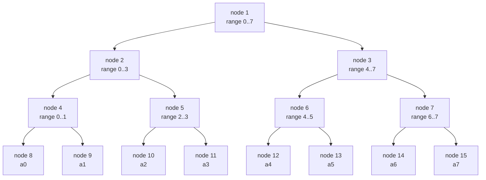

# Segment Tree (Point Update, Range Query)

A **segment tree** is a binary tree that stores aggregate information about contiguous ranges (segments) of an array. It supports two operations in $O(\log n)$ time:

- **Point update:** change the value at a single index.
- **Range query:** combine values over any subrange $[l, r]$ using an **associative** merge operation (sum, min, max, gcd, ...).

It is the workhorse data structure when you need both *fast updates* and *fast range aggregates* — something a prefix-sum array cannot do (prefix sums give $O(1)$ query but $O(n)$ update).

---

## Table of Contents

1. [Why a Segment Tree?](#why-a-segment-tree)
2. [The Core Idea: Divide a Range](#the-core-idea-divide-a-range)
3. [Array-Based Representation](#array-based-representation)
4. [Mermaid: A Tree Over 8 Elements](#mermaid-a-tree-over-8-elements)
5. [Build in O(n)](#build-in-on)
6. [Point Update in O(log n)](#point-update-in-olog-n)
7. [Range Query in O(log n)](#range-query-in-olog-n)
8. [Generalizing the Merge (Associativity)](#generalizing-the-merge-associativity)
9. [Iterative Bottom-Up Segment Tree](#iterative-bottom-up-segment-tree)
10. [Segment Tree for Min With Index](#segment-tree-for-min-with-index)
11. [Descend the Tree: First Position With a Property](#descend-the-tree-first-position-with-a-property)
12. [Complexity Summary](#complexity-summary)
13. [Common Pitfalls](#common-pitfalls)
14. [Patterns](#patterns)

---

## Why a Segment Tree?

Suppose you must answer many queries of the form "sum of $a[l..r]$" while also updating individual elements between queries. Compare the options:

| Structure | Point update | Range query |
|-----------|-------------|-------------|
| Plain array | $O(1)$ | $O(n)$ |
| Prefix sums | $O(n)$ | $O(1)$ |
| **Segment tree** | $O(\log n)$ | $O(\log n)$ |
| Fenwick (BIT) | $O(\log n)$ | $O(\log n)$ |

A segment tree balances both operations and — unlike a Fenwick tree — generalizes to *any associative operation*, plus it supports "descend the tree" queries (finding the first/last index meeting a condition).

---

## The Core Idea: Divide a Range

The tree's root represents the full range $[0, n-1]$. Each internal node representing $[l, r]$ has two children that split the range at the midpoint $m = \lfloor (l+r)/2 \rfloor$:

- left child covers $[l, m]$
- right child covers $[m+1, r]$

Leaves represent single elements $[i, i]$. Each node stores the **merge** of its children (e.g., the sum or min of its segment).

A query range $[ql, qr]$ is answered by decomposing it into $O(\log n)$ **canonical segments** — disjoint tree nodes whose union is exactly $[ql, qr]$.

Pseudocode for the recursion:

```
query(node, l, r, ql, qr):
    if [l, r] is fully outside [ql, qr]:  return IDENTITY
    if [l, r] is fully inside  [ql, qr]:  return tree[node]
    m = (l + r) / 2
    left  = query(2*node,   l,   m, ql, qr)
    right = query(2*node+1, m+1, r, ql, qr)
    return merge(left, right)
```

---

## Array-Based Representation

We avoid pointers by storing the tree in a flat array `tree[]` of size $2 \cdot 2^{\lceil \log_2 n \rceil}$ (a safe upper bound is $4n$). With 1-based node indexing:

- the root is node $1$,
- node $i$ has children $2i$ (left) and $2i+1$ (right),
- node $i$ has parent $\lfloor i/2 \rfloor$.

The height of the tree is $\lceil \log_2 n \rceil$, so a path from root to leaf touches $O(\log n)$ nodes.

```python
class SegmentTree:
    def __init__(self, data):
        self.n = len(data)
        self.tree = [0] * (4 * self.n)   # safe upper bound
        if self.n:
            self._build(data, 1, 0, self.n - 1)

    def _build(self, data, node, l, r):
        if l == r:
            self.tree[node] = data[l]
            return
        m = (l + r) // 2
        self._build(data, 2 * node,     l,     m)
        self._build(data, 2 * node + 1, m + 1, r)
        self.tree[node] = self.tree[2 * node] + self.tree[2 * node + 1]
```

```cpp
struct SegmentTree {
    int n;
    vector<long long> tree;

    SegmentTree(const vector<long long>& data) {
        n = (int)data.size();
        tree.assign(4 * max(n, 1), 0);
        if (n) build(data, 1, 0, n - 1);
    }

    void build(const vector<long long>& data, int node, int l, int r) {
        if (l == r) {
            tree[node] = data[l];
            return;
        }
        int m = (l + r) / 2;
        build(data, 2 * node,     l,     m);
        build(data, 2 * node + 1, m + 1, r);
        tree[node] = tree[2 * node] + tree[2 * node + 1];
    }
};
```

---

## Mermaid: A Tree Over 8 Elements

For an array of size 8, the segment tree is a perfect binary tree. Each node label shows the range it covers.



Notice the array-index relationship: node $4$ has children $8$ and $9$, node $7$ has children $14$ and $15$, exactly $2i$ and $2i+1$.

---

## Build in O(n)

Building recursively visits each tree node exactly once. There are at most $4n$ nodes but only $2n - 1$ are meaningful, so the build is $\Theta(n)$, not $O(n \log n)$.

$$
T_{\text{build}}(n) = 2\,T_{\text{build}}(n/2) + O(1) = \Theta(n).
$$

The build code is shown in [Array-Based Representation](#array-based-representation) above (`_build` / `build`).

---

## Point Update in O(log n)

To set $a[i] = v$, we walk from the root down to the leaf for index $i$, then recompute every node on the way back up (the *pull*). Only one root-to-leaf path is affected, so the cost is $O(\log n)$.

```
update(node, l, r, i, v):
    if l == r:               # reached the leaf
        tree[node] = v
        return
    m = (l + r) / 2
    if i <= m: update(2*node,   l,   m, i, v)
    else:      update(2*node+1, m+1, r, i, v)
    tree[node] = merge(tree[2*node], tree[2*node+1])
```

```python
    def update(self, i, v):
        self._update(1, 0, self.n - 1, i, v)

    def _update(self, node, l, r, i, v):
        if l == r:
            self.tree[node] = v
            return
        m = (l + r) // 2
        if i <= m:
            self._update(2 * node, l, m, i, v)
        else:
            self._update(2 * node + 1, m + 1, r, i, v)
        self.tree[node] = self.tree[2 * node] + self.tree[2 * node + 1]
```

```cpp
    void update(int i, long long v) {
        update(1, 0, n - 1, i, v);
    }

    void update(int node, int l, int r, int i, long long v) {
        if (l == r) {
            tree[node] = v;
            return;
        }
        int m = (l + r) / 2;
        if (i <= m) update(2 * node,     l,     m, i, v);
        else        update(2 * node + 1, m + 1, r, i, v);
        tree[node] = tree[2 * node] + tree[2 * node + 1];
    }
```

---

## Range Query in O(log n)

A query for $[ql, qr]$ recurses with three cases at each node $[l, r]$:

1. **No overlap** ($r < ql$ or $l > qr$): return the merge **identity** (0 for sum, $+\infty$ for min, $-\infty$ for max).
2. **Total overlap** ($ql \le l$ and $r \le qr$): return the node's stored value directly.
3. **Partial overlap:** recurse into both children and merge.

At most $O(\log n)$ nodes are fully matched (two per level), giving $O(\log n)$ total.

```python
    def query(self, ql, qr):
        return self._query(1, 0, self.n - 1, ql, qr)

    def _query(self, node, l, r, ql, qr):
        if qr < l or r < ql:          # no overlap
            return 0                  # identity for sum
        if ql <= l and r <= qr:       # total overlap
            return self.tree[node]
        m = (l + r) // 2              # partial overlap
        left = self._query(2 * node,     l,     m, ql, qr)
        right = self._query(2 * node + 1, m + 1, r, ql, qr)
        return left + right
```

```cpp
    long long query(int ql, int qr) {
        return query(1, 0, n - 1, ql, qr);
    }

    long long query(int node, int l, int r, int ql, int qr) {
        if (qr < l || r < ql) return 0;          // identity for sum
        if (ql <= l && r <= qr) return tree[node];
        int m = (l + r) / 2;
        long long left  = query(2 * node,     l,     m, ql, qr);
        long long right = query(2 * node + 1, m + 1, r, ql, qr);
        return left + right;
    }
```

---

## Generalizing the Merge (Associativity)

A segment tree works for **any associative** binary operation $\oplus$ with an identity element $e$:

$$
(a \oplus b) \oplus c = a \oplus (b \oplus c), \qquad a \oplus e = e \oplus a = a.
$$

Associativity is what lets us pre-combine subranges in any grouping. Commutativity is *not* required (so it also works for matrix products, string concatenation, etc.).

| Operation | Merge | Identity $e$ |
|-----------|-------|--------------|
| Sum | $a + b$ | $0$ |
| Min | $\min(a, b)$ | $+\infty$ |
| Max | $\max(a, b)$ | $-\infty$ |
| GCD | $\gcd(a, b)$ | $0$ |
| AND | $a \,\&\, b$ | all-ones |

Only the `merge` function and the identity in the "no overlap" case change. Here is a min-tree merge swapped in:

```python
import math

def merge_min(a, b):
    return min(a, b)

IDENTITY_MIN = math.inf   # identity for min
```

```cpp
const long long INF = 1e18;   // identity for min

long long merge_min(long long a, long long b) {
    return min(a, b);
}
```

---

## Iterative Bottom-Up Segment Tree

The classic competitive-programming form (Stanford / CP-algorithms style) stores leaves in `tree[n .. 2n-1]` and internal nodes in `tree[1 .. n-1]`. There is **no recursion** and the constant factor is tiny. It assumes $n$ is the array length (it works for any $n$, not only powers of two, for sum/min/max).

Key relations:
- Leaf for index $i$ lives at position $i + n$.
- Parent of node $p$ is $p / 2$.
- For a half-open query $[l, r)$, walk `l += n, r += n` upward, merging boundary nodes.

```python
class IterativeSegTree:
    def __init__(self, data):
        self.n = len(data)
        self.tree = [0] * (2 * self.n)
        # place leaves, then build internal nodes
        for i in range(self.n):
            self.tree[self.n + i] = data[i]
        for i in range(self.n - 1, 0, -1):
            self.tree[i] = self.tree[2 * i] + self.tree[2 * i + 1]

    def update(self, i, v):
        i += self.n
        self.tree[i] = v
        i //= 2
        while i >= 1:
            self.tree[i] = self.tree[2 * i] + self.tree[2 * i + 1]
            i //= 2

    def query(self, l, r):           # half-open [l, r)
        res = 0                      # identity for sum
        l += self.n
        r += self.n
        while l < r:
            if l & 1:
                res += self.tree[l]
                l += 1
            if r & 1:
                r -= 1
                res += self.tree[r]
            l //= 2
            r //= 2
        return res
```

```cpp
struct IterativeSegTree {
    int n;
    vector<long long> tree;

    IterativeSegTree(const vector<long long>& data) {
        n = (int)data.size();
        tree.assign(2 * n, 0);
        for (int i = 0; i < n; ++i) tree[n + i] = data[i];
        for (int i = n - 1; i >= 1; --i)
            tree[i] = tree[2 * i] + tree[2 * i + 1];
    }

    void update(int i, long long v) {
        i += n;
        tree[i] = v;
        for (i /= 2; i >= 1; i /= 2)
            tree[i] = tree[2 * i] + tree[2 * i + 1];
    }

    long long query(int l, int r) {     // half-open [l, r)
        long long res = 0;              // identity for sum
        for (l += n, r += n; l < r; l /= 2, r /= 2) {
            if (l & 1) res += tree[l++];
            if (r & 1) res += tree[--r];
        }
        return res;
    }
};
```

> Note: for **non-commutative** merges the iterative version needs to accumulate left and right results separately and combine in order; for sum/min/max/gcd the simple form above is fine.

---

## Segment Tree for Min With Index

Often we need not just the minimum but *where* it occurs. Store a pair `(value, index)` and define the merge to keep the smaller value (and the leftmost index on ties).

```python
def merge_min_idx(a, b):
    # a, b are (value, index); keep smaller value, leftmost index on tie
    if a[0] < b[0] or (a[0] == b[0] and a[1] <= b[1]):
        return a
    return b

class MinIdxSegTree:
    def __init__(self, data):
        self.n = len(data)
        self.IDENT = (float('inf'), -1)
        self.tree = [self.IDENT] * (4 * self.n)
        self._build(data, 1, 0, self.n - 1)

    def _build(self, data, node, l, r):
        if l == r:
            self.tree[node] = (data[l], l)
            return
        m = (l + r) // 2
        self._build(data, 2 * node, l, m)
        self._build(data, 2 * node + 1, m + 1, r)
        self.tree[node] = merge_min_idx(self.tree[2 * node],
                                        self.tree[2 * node + 1])

    def query(self, ql, qr):
        return self._query(1, 0, self.n - 1, ql, qr)

    def _query(self, node, l, r, ql, qr):
        if qr < l or r < ql:
            return self.IDENT
        if ql <= l and r <= qr:
            return self.tree[node]
        m = (l + r) // 2
        return merge_min_idx(self._query(2 * node, l, m, ql, qr),
                             self._query(2 * node + 1, m + 1, r, ql, qr))
```

```cpp
struct MinIdxSegTree {
    int n;
    const long long INF = 1e18;
    vector<pair<long long,int>> tree;

    pair<long long,int> merge(pair<long long,int> a, pair<long long,int> b) {
        // keep smaller value, leftmost index on tie
        if (a.first < b.first || (a.first == b.first && a.second <= b.second))
            return a;
        return b;
    }

    MinIdxSegTree(const vector<long long>& data) {
        n = (int)data.size();
        tree.assign(4 * n, {INF, -1});
        build(data, 1, 0, n - 1);
    }

    void build(const vector<long long>& data, int node, int l, int r) {
        if (l == r) { tree[node] = {data[l], l}; return; }
        int m = (l + r) / 2;
        build(data, 2 * node,     l,     m);
        build(data, 2 * node + 1, m + 1, r);
        tree[node] = merge(tree[2 * node], tree[2 * node + 1]);
    }

    pair<long long,int> query(int node, int l, int r, int ql, int qr) {
        if (qr < l || r < ql) return {INF, -1};
        if (ql <= l && r <= qr) return tree[node];
        int m = (l + r) / 2;
        return merge(query(2 * node,     l,     m, ql, qr),
                     query(2 * node + 1, m + 1, r, ql, qr));
    }

    pair<long long,int> query(int ql, int qr) {
        return query(1, 0, n - 1, ql, qr);
    }
};
```

---

## Descend the Tree: First Position With a Property

A powerful trick: instead of querying a fixed range, **walk down** the tree guided by node aggregates to find the first index satisfying a condition — for example *the leftmost element that is $\ge x$* in a max-segment-tree. This is $O(\log n)$ because we descend a single root-to-leaf path.

At each internal node, check whether the answer can lie in the left child (does its subtree contain a qualifying element?). If yes, go left; otherwise go right.

```
descend_first_ge(node, l, r, x):
    if tree[node] < x:           # no element >= x in this subtree
        return -1
    if l == r:                   # leaf qualifies
        return l
    m = (l + r) / 2
    if tree[2*node] >= x:        # left subtree has one -> go left
        return descend_first_ge(2*node, l, m, x)
    return descend_first_ge(2*node+1, m+1, r, x)
```

```python
class MaxSegTree:
    def __init__(self, data):
        self.n = len(data)
        self.tree = [float('-inf')] * (4 * self.n)
        self._build(data, 1, 0, self.n - 1)

    def _build(self, data, node, l, r):
        if l == r:
            self.tree[node] = data[l]
            return
        m = (l + r) // 2
        self._build(data, 2 * node, l, m)
        self._build(data, 2 * node + 1, m + 1, r)
        self.tree[node] = max(self.tree[2 * node], self.tree[2 * node + 1])

    def first_ge(self, x):
        # leftmost index with value >= x, or -1 if none
        if self.tree[1] < x:
            return -1
        return self._descend(1, 0, self.n - 1, x)

    def _descend(self, node, l, r, x):
        if l == r:
            return l
        m = (l + r) // 2
        if self.tree[2 * node] >= x:
            return self._descend(2 * node, l, m, x)
        return self._descend(2 * node + 1, m + 1, r, x)
```

```cpp
struct MaxSegTree {
    int n;
    vector<long long> tree;

    MaxSegTree(const vector<long long>& data) {
        n = (int)data.size();
        tree.assign(4 * n, LLONG_MIN);
        build(data, 1, 0, n - 1);
    }

    void build(const vector<long long>& data, int node, int l, int r) {
        if (l == r) { tree[node] = data[l]; return; }
        int m = (l + r) / 2;
        build(data, 2 * node,     l,     m);
        build(data, 2 * node + 1, m + 1, r);
        tree[node] = max(tree[2 * node], tree[2 * node + 1]);
    }

    int first_ge(long long x) {
        if (tree[1] < x) return -1;        // no qualifying element
        return descend(1, 0, n - 1, x);
    }

    int descend(int node, int l, int r, long long x) {
        if (l == r) return l;
        int m = (l + r) / 2;
        if (tree[2 * node] >= x) return descend(2 * node,     l,     m, x);
        return                          descend(2 * node + 1, m + 1, r, x);
    }
};
```

This descend technique is exactly what solves the *Hotel Queries* problem: each room block is a node max, and we find the first hotel with enough free rooms in $O(\log n)$ — then update it.

---

## Complexity Summary

Let $n$ be the array size and $q$ the number of operations.

| Operation | Time | Space |
|-----------|------|-------|
| Build | $O(n)$ | $O(n)$ |
| Point update | $O(\log n)$ | — |
| Range query | $O(\log n)$ | — |
| Descend (first/last with property) | $O(\log n)$ | — |
| $q$ mixed operations | $O(n + q \log n)$ | $O(n)$ |

The tree array uses $\le 4n$ slots in the recursive form and exactly $2n$ in the iterative form.

---

## Common Pitfalls

- **Undersized array:** the recursive tree needs up to $4n$ slots. Sizing it $2n$ (correct only for the iterative form) overflows for the recursive layout.
- **Wrong identity:** returning $0$ for a min query (instead of $+\infty$) silently corrupts results. Match the identity to the operation.
- **Inclusive vs half-open ranges:** the recursive form here uses inclusive $[l, r]$; the iterative form uses half-open $[l, r)$. Mixing the conventions causes off-by-one bugs.
- **Integer overflow:** sums of up to $2 \cdot 10^5$ values each up to $10^9$ exceed 32-bit range. Use `long long` in C++.
- **Off-by-one in midpoint:** children must cover $[l, m]$ and $[m+1, r]$. Forgetting the $+1$ creates overlapping or missing ranges.
- **Empty array:** guard $n = 0$ before building, or sizing $4 \cdot 0 = 0$ leaves no room.
- **Non-associative merge:** the structure only works for associative operations. "Most frequent element in a range" is *not* associative and needs a different approach.

---

## Patterns

- **Point update + range aggregate:** the canonical use (sum/min/max/gcd). Reach for a segment tree when prefix sums fail because of updates.
- **Tree descent for order statistics:** find the first/last index with a property in $O(\log n)$ (first free hotel, $k$-th one in a bitmask tree, first prefix exceeding a threshold).
- **Coordinate compression + segment tree:** when indices are large but sparse, compress values to $[0, m)$ first.
- **Value-indexed (frequency) segment tree:** index by *value* rather than position to count/rank elements; supports "number of elements $\le x$" and $k$-th smallest.
- **Pair / struct nodes:** store tuples like `(min, index)` or `(sum, count)` and define a custom associative merge.
- **Choosing vs Fenwick:** prefer a Fenwick tree for plain prefix sums (less code, smaller constant); prefer a segment tree for min/max/gcd, descend queries, or anything needing more than additive prefix info.
