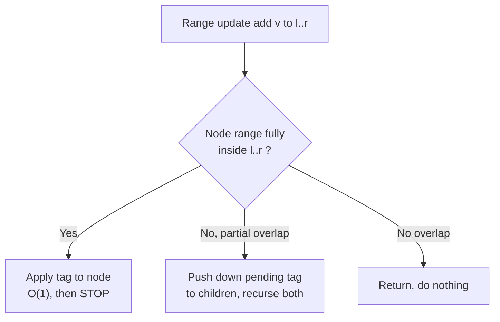
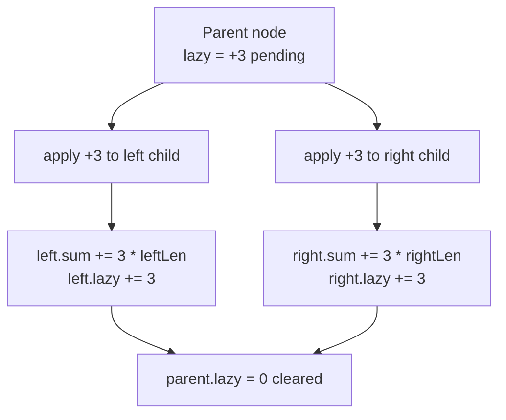

# Segment Tree with Lazy Propagation (Range Update, Range Query)

A plain segment tree handles **point updates** and **range queries** in $O(\log n)$. But what
about updating an entire **range** at once — e.g. "add 5 to every element in $[l, r]$"? Doing
that one element at a time is $O(n)$ per update. **Lazy propagation** is the technique that
makes a *range update* also cost only $O(\log n)$ by **deferring** work: instead of pushing an
update all the way down to the leaves, we stop at the $O(\log n)$ nodes that fully cover the
range, store a "pending" tag there, and only push it down later when (and if) we actually need
to descend into those nodes.

This guide builds the idea from scratch, gives a reusable framework, and shows two fully paired
(Python + C++) implementations: **range-add + range-sum** and **range-assign + range-max**.

---

## Table of Contents
1. [Why Lazy Propagation?](#why-lazy-propagation)
2. [The Lazy / Pending Array](#the-lazy--pending-array)
3. [The Push-Down Operation](#the-push-down-operation)
4. [Variant A — Range-Add + Range-Sum](#variant-a--range-add--range-sum)
5. [Variant B — Range-Assign + Range-Max](#variant-b--range-assign--range-max)
6. [Combining Add AND Assign Tags](#combining-add-and-assign-tags)
7. [The General Framework](#the-general-framework)
8. [Complexity Summary](#complexity-summary)
9. [Common Pitfalls](#common-pitfalls)
10. [Patterns](#patterns)

---

## Why Lazy Propagation?

Consider a segment tree over $n$ elements. A **point update** touches one root-to-leaf path of
length $O(\log n)$. A naive **range update** of $[l, r]$ would touch up to $r - l + 1$ leaves —
that is $O(n)$ in the worst case.

The key observation: when a node's range is **entirely inside** the update range, every leaf
under it receives the *same* change. We do not need to visit them individually. We can update
the node's aggregate value in $O(1)$ and remember "all my descendants still owe this update"
via a **lazy tag**. The descendants are only refreshed later, on demand.

Because the recursive range update visits the same set of nodes a range *query* does, the cost
drops to:

$$T_{\text{range-update}} = O(\log n)$$



---

## The Lazy / Pending Array

Alongside the value array `tree[]` we keep a parallel array `lazy[]` (a.k.a. the *pending* or
*tag* array). `lazy[node]` means: "this update has **already been applied** to `tree[node]`,
but has **not yet been propagated** to `node`'s children."

Invariant we maintain at all times:

> `tree[node]` is correct **assuming** the pending tags of its strict ancestors have been
> pushed down to it, but `node`'s **own** pending tag has *not* yet reached its children.

For range-add + range-sum, the identity (no-op) tag is `0`. For range-assign, we need a sentinel
(e.g. `None` / a flag) to distinguish "assign 0" from "no pending assignment."

```python
NEG = float("-inf")

class LazySeg:
    def __init__(self, n):
        self.n = n
        self.tree = [0] * (4 * n)   # aggregate values
        self.lazy = [0] * (4 * n)   # pending tags, 0 == identity
```

```cpp
const long long NEG = -1e18;

struct LazySeg {
    int n;
    vector<long long> tree;   // aggregate values
    vector<long long> lazy;   // pending tags, 0 == identity
    LazySeg(int n_) : n(n_), tree(4 * n_, 0), lazy(4 * n_, 0) {}
};
```

---

## The Push-Down Operation

`push_down(node)` flushes `node`'s pending tag into its two children, then clears it. It is the
heart of lazy propagation. Two sub-steps:

1. **apply(child, tag)** — incorporate `tag` into the child's aggregate value *and* compose it
   into the child's own pending tag.
2. Reset `lazy[node]` to the identity.

We call `push_down` whenever we are about to **descend** into a node's children (during a
partial-overlap update or query). The size of the child segment matters for sum-style
aggregates: adding $v$ to a segment of length $\ell$ increases its sum by $v \cdot \ell$.



---

## Variant A — Range-Add + Range-Sum

The most common lazy tree: support `add(l, r, v)` (add $v$ to every element in $[l, r]$) and
`query(l, r)` (sum over $[l, r]$).

**Pseudocode**

```
apply(node, len, v):
    tree[node] += v * len      # all `len` leaves gain v
    lazy[node] += v            # compose additive tags

push_down(node, leftLen, rightLen):
    if lazy[node] != 0:
        apply(2*node,   leftLen,  lazy[node])
        apply(2*node+1, rightLen, lazy[node])
        lazy[node] = 0

update(node, nl, nr, l, r, v):
    if r < nl or nr < l:        return            # no overlap
    if l <= nl and nr <= r:     apply(...); return # full cover
    push_down(...)                                 # partial -> descend
    recurse left and right
    tree[node] = tree[left] + tree[right]          # pull up

query(node, nl, nr, l, r):
    if r < nl or nr < l:        return 0
    if l <= nl and nr <= r:     return tree[node]
    push_down(...)
    return query(left) + query(right)
```

### Python

```python
class RangeAddSumSeg:
    def __init__(self, data):
        self.n = len(data)
        self.tree = [0] * (4 * self.n)
        self.lazy = [0] * (4 * self.n)
        self._build(data, 1, 0, self.n - 1)

    def _build(self, data, node, nl, nr):
        if nl == nr:
            self.tree[node] = data[nl]
            return
        mid = (nl + nr) // 2
        self._build(data, 2 * node, nl, mid)
        self._build(data, 2 * node + 1, mid + 1, nr)
        self.tree[node] = self.tree[2 * node] + self.tree[2 * node + 1]

    def _apply(self, node, seg_len, v):
        self.tree[node] += v * seg_len
        self.lazy[node] += v

    def _push_down(self, node, nl, nr):
        if self.lazy[node] != 0:
            mid = (nl + nr) // 2
            self._apply(2 * node, mid - nl + 1, self.lazy[node])
            self._apply(2 * node + 1, nr - mid, self.lazy[node])
            self.lazy[node] = 0

    def update(self, l, r, v, node=1, nl=0, nr=None):
        if nr is None:
            nr = self.n - 1
        if r < nl or nr < l:
            return
        if l <= nl and nr <= r:
            self._apply(node, nr - nl + 1, v)
            return
        self._push_down(node, nl, nr)
        mid = (nl + nr) // 2
        self.update(l, r, v, 2 * node, nl, mid)
        self.update(l, r, v, 2 * node + 1, mid + 1, nr)
        self.tree[node] = self.tree[2 * node] + self.tree[2 * node + 1]

    def query(self, l, r, node=1, nl=0, nr=None):
        if nr is None:
            nr = self.n - 1
        if r < nl or nr < l:
            return 0
        if l <= nl and nr <= r:
            return self.tree[node]
        self._push_down(node, nl, nr)
        mid = (nl + nr) // 2
        return (self.query(l, r, 2 * node, nl, mid)
                + self.query(l, r, 2 * node + 1, mid + 1, nr))
```

```cpp
#include <bits/stdc++.h>
using namespace std;

struct RangeAddSumSeg {
    int n;
    vector<long long> tree, lazy;

    RangeAddSumSeg(const vector<long long>& data) {
        n = (int)data.size();
        tree.assign(4 * n, 0);
        lazy.assign(4 * n, 0);
        build(data, 1, 0, n - 1);
    }

    void build(const vector<long long>& data, int node, int nl, int nr) {
        if (nl == nr) { tree[node] = data[nl]; return; }
        int mid = (nl + nr) / 2;
        build(data, 2 * node, nl, mid);
        build(data, 2 * node + 1, mid + 1, nr);
        tree[node] = tree[2 * node] + tree[2 * node + 1];
    }

    void applyTag(int node, long long segLen, long long v) {
        tree[node] += v * segLen;
        lazy[node] += v;
    }

    void pushDown(int node, int nl, int nr) {
        if (lazy[node] != 0) {
            int mid = (nl + nr) / 2;
            applyTag(2 * node, mid - nl + 1, lazy[node]);
            applyTag(2 * node + 1, nr - mid, lazy[node]);
            lazy[node] = 0;
        }
    }

    void update(int l, int r, long long v, int node = 1, int nl = 0, int nr = -1) {
        if (nr == -1) nr = n - 1;
        if (r < nl || nr < l) return;
        if (l <= nl && nr <= r) { applyTag(node, nr - nl + 1, v); return; }
        pushDown(node, nl, nr);
        int mid = (nl + nr) / 2;
        update(l, r, v, 2 * node, nl, mid);
        update(l, r, v, 2 * node + 1, mid + 1, nr);
        tree[node] = tree[2 * node] + tree[2 * node + 1];
    }

    long long query(int l, int r, int node = 1, int nl = 0, int nr = -1) {
        if (nr == -1) nr = n - 1;
        if (r < nl || nr < l) return 0;
        if (l <= nl && nr <= r) return tree[node];
        pushDown(node, nl, nr);
        int mid = (nl + nr) / 2;
        return query(l, r, 2 * node, nl, mid)
             + query(l, r, 2 * node + 1, mid + 1, nr);
    }
};
```

---

## Variant B — Range-Assign + Range-Max

Now support `assign(l, r, v)` (set every element in $[l, r]$ to $v$) and `query(l, r)` (the
**maximum** over $[l, r]$). The crucial difference from add: assignment **overwrites**, so the
tag identity cannot be a numeric value — we use a sentinel (`None` in Python, a boolean flag in
C++) to mean "no pending assignment."

For a **max** aggregate, assigning $v$ to a whole segment makes its max exactly $v$ (independent
of segment length — that is why no `seg_len` appears here).

### Python

```python
class RangeAssignMaxSeg:
    def __init__(self, data):
        self.n = len(data)
        self.tree = [0] * (4 * self.n)
        self.lazy = [None] * (4 * self.n)   # None == no pending assignment
        self._build(data, 1, 0, self.n - 1)

    def _build(self, data, node, nl, nr):
        if nl == nr:
            self.tree[node] = data[nl]
            return
        mid = (nl + nr) // 2
        self._build(data, 2 * node, nl, mid)
        self._build(data, 2 * node + 1, mid + 1, nr)
        self.tree[node] = max(self.tree[2 * node], self.tree[2 * node + 1])

    def _apply(self, node, v):
        self.tree[node] = v        # whole segment becomes v -> max is v
        self.lazy[node] = v        # overwrite pending tag

    def _push_down(self, node):
        if self.lazy[node] is not None:
            self._apply(2 * node, self.lazy[node])
            self._apply(2 * node + 1, self.lazy[node])
            self.lazy[node] = None

    def assign(self, l, r, v, node=1, nl=0, nr=None):
        if nr is None:
            nr = self.n - 1
        if r < nl or nr < l:
            return
        if l <= nl and nr <= r:
            self._apply(node, v)
            return
        self._push_down(node)
        mid = (nl + nr) // 2
        self.assign(l, r, v, 2 * node, nl, mid)
        self.assign(l, r, v, 2 * node + 1, mid + 1, nr)
        self.tree[node] = max(self.tree[2 * node], self.tree[2 * node + 1])

    def query(self, l, r, node=1, nl=0, nr=None):
        if nr is None:
            nr = self.n - 1
        if r < nl or nr < l:
            return float("-inf")
        if l <= nl and nr <= r:
            return self.tree[node]
        self._push_down(node)
        mid = (nl + nr) // 2
        return max(self.query(l, r, 2 * node, nl, mid),
                   self.query(l, r, 2 * node + 1, mid + 1, nr))
```

```cpp
#include <bits/stdc++.h>
using namespace std;

const long long NEG = -1e18;

struct RangeAssignMaxSeg {
    int n;
    vector<long long> tree;
    vector<long long> lazy;
    vector<char> has;            // has[node] == 1 -> pending assignment present

    RangeAssignMaxSeg(const vector<long long>& data) {
        n = (int)data.size();
        tree.assign(4 * n, 0);
        lazy.assign(4 * n, 0);
        has.assign(4 * n, 0);
        build(data, 1, 0, n - 1);
    }

    void build(const vector<long long>& data, int node, int nl, int nr) {
        if (nl == nr) { tree[node] = data[nl]; return; }
        int mid = (nl + nr) / 2;
        build(data, 2 * node, nl, mid);
        build(data, 2 * node + 1, mid + 1, nr);
        tree[node] = max(tree[2 * node], tree[2 * node + 1]);
    }

    void applyTag(int node, long long v) {
        tree[node] = v;          // whole segment becomes v -> max is v
        lazy[node] = v;
        has[node] = 1;
    }

    void pushDown(int node) {
        if (has[node]) {
            applyTag(2 * node, lazy[node]);
            applyTag(2 * node + 1, lazy[node]);
            has[node] = 0;
        }
    }

    void assign(int l, int r, long long v, int node = 1, int nl = 0, int nr = -1) {
        if (nr == -1) nr = n - 1;
        if (r < nl || nr < l) return;
        if (l <= nl && nr <= r) { applyTag(node, v); return; }
        pushDown(node);
        int mid = (nl + nr) / 2;
        assign(l, r, v, 2 * node, nl, mid);
        assign(l, r, v, 2 * node + 1, mid + 1, nr);
        tree[node] = max(tree[2 * node], tree[2 * node + 1]);
    }

    long long query(int l, int r, int node = 1, int nl = 0, int nr = -1) {
        if (nr == -1) nr = n - 1;
        if (r < nl || nr < l) return NEG;
        if (l <= nl && nr <= r) return tree[node];
        pushDown(node);
        int mid = (nl + nr) / 2;
        return max(query(l, r, 2 * node, nl, mid),
                   query(l, r, 2 * node + 1, mid + 1, nr));
    }
};
```

---

## Combining Add AND Assign Tags

Some problems (e.g. CSES *Range Updates and Sums*) require **both** range-add and range-assign
on the **same** tree, with range-sum queries. Now each node carries **two** tags, and the order
of application matters.

The rule: **assign dominates add.** An assignment wipes out any pending add, because setting
every element to $v$ makes prior pending additions irrelevant. After an assignment, later adds
accumulate on top. So each node stores:

- `assign_val` + `has_assign` flag — a pending "set to this value first."
- `add_val` — a pending "then add this amount."

The semantics, applied to a child of segment length $\ell$:

$$\text{value} \;\leftarrow\; \begin{cases} (\,\text{assign\_val} + \text{add\_val}\,)\cdot \ell & \text{if has\_assign} \\[4pt] \text{value} + \text{add\_val}\cdot \ell & \text{otherwise} \end{cases}$$

**Composition rules** when applying a new tag to a node that already has tags:

| New op on child | Effect on child's tags |
|-----------------|------------------------|
| Apply **assign** $a$ | `has_assign=true`, `assign_val=a`, `add_val=0` (clears prior add) |
| Apply **add** $d$ when child **has** assign | `assign_val += d` (fold into the pending set) |
| Apply **add** $d$ when child has **no** assign | `add_val += d` |

```python
class AddAssignSumSeg:
    def __init__(self, data):
        self.n = len(data)
        self.tree = [0] * (4 * self.n)
        self.add = [0] * (4 * self.n)
        self.assign = [0] * (4 * self.n)
        self.has_assign = [False] * (4 * self.n)
        self._build(data, 1, 0, self.n - 1)

    def _build(self, data, node, nl, nr):
        if nl == nr:
            self.tree[node] = data[nl]
            return
        mid = (nl + nr) // 2
        self._build(data, 2 * node, nl, mid)
        self._build(data, 2 * node + 1, mid + 1, nr)
        self.tree[node] = self.tree[2 * node] + self.tree[2 * node + 1]

    def _apply_assign(self, node, seg_len, v):
        self.tree[node] = v * seg_len
        self.assign[node] = v
        self.has_assign[node] = True
        self.add[node] = 0            # assignment clears pending add

    def _apply_add(self, node, seg_len, v):
        self.tree[node] += v * seg_len
        if self.has_assign[node]:
            self.assign[node] += v    # fold add into pending set
        else:
            self.add[node] += v

    def _push_down(self, node, nl, nr):
        mid = (nl + nr) // 2
        l_len, r_len = mid - nl + 1, nr - mid
        if self.has_assign[node]:
            self._apply_assign(2 * node, l_len, self.assign[node])
            self._apply_assign(2 * node + 1, r_len, self.assign[node])
            self.has_assign[node] = False
        if self.add[node] != 0:
            self._apply_add(2 * node, l_len, self.add[node])
            self._apply_add(2 * node + 1, r_len, self.add[node])
            self.add[node] = 0
```

```cpp
#include <bits/stdc++.h>
using namespace std;

struct AddAssignSumSeg {
    int n;
    vector<long long> tree, add, assignVal;
    vector<char> hasAssign;

    AddAssignSumSeg(const vector<long long>& data) {
        n = (int)data.size();
        tree.assign(4 * n, 0);
        add.assign(4 * n, 0);
        assignVal.assign(4 * n, 0);
        hasAssign.assign(4 * n, 0);
        build(data, 1, 0, n - 1);
    }

    void build(const vector<long long>& data, int node, int nl, int nr) {
        if (nl == nr) { tree[node] = data[nl]; return; }
        int mid = (nl + nr) / 2;
        build(data, 2 * node, nl, mid);
        build(data, 2 * node + 1, mid + 1, nr);
        tree[node] = tree[2 * node] + tree[2 * node + 1];
    }

    void applyAssign(int node, long long segLen, long long v) {
        tree[node] = v * segLen;
        assignVal[node] = v;
        hasAssign[node] = 1;
        add[node] = 0;                 // assignment clears pending add
    }

    void applyAdd(int node, long long segLen, long long v) {
        tree[node] += v * segLen;
        if (hasAssign[node]) assignVal[node] += v;  // fold into pending set
        else add[node] += v;
    }

    void pushDown(int node, int nl, int nr) {
        int mid = (nl + nr) / 2;
        long long lLen = mid - nl + 1, rLen = nr - mid;
        if (hasAssign[node]) {
            applyAssign(2 * node, lLen, assignVal[node]);
            applyAssign(2 * node + 1, rLen, assignVal[node]);
            hasAssign[node] = 0;
        }
        if (add[node] != 0) {
            applyAdd(2 * node, lLen, add[node]);
            applyAdd(2 * node + 1, rLen, add[node]);
            add[node] = 0;
        }
    }
};
```

---

## The General Framework

Every lazy segment tree is an instance of one template. To design one, answer three questions:

1. **What aggregate** does a node store? (sum, min, max, gcd, …)
2. **apply(node, tag, seg_len)** — how does a tag change the aggregate *and* compose into the
   node's existing tag?
3. **compose(old_tag, new_tag)** — how do two tags merge? (For add: addition. For assign:
   overwrite. For mixed: the table above.)

Given those, the recursion is always the same:

```
update(node, range, op):
    no overlap   -> return
    full cover   -> apply(node, op); return
    partial      -> push_down(node); recurse children; pull_up(node)

query(node, range):
    no overlap   -> return identity
    full cover   -> return tree[node]
    partial      -> push_down(node); return combine(query(left), query(right))
```

```python
def pull_up(self, node):
    self.tree[node] = self.combine(self.tree[2 * node], self.tree[2 * node + 1])
```

```cpp
void pullUp(int node) {
    tree[node] = combine(tree[2 * node], tree[2 * node + 1]);
}
```

The two universal rules to never forget:

- **push_down before descending** (partial overlap, in both update and query).
- **pull_up after returning** from children (update only — queries do not modify nodes).

---

## Complexity Summary

| Operation | Time | Space |
|-----------|------|-------|
| Build | $O(n)$ | $O(n)$ |
| Range update (add / assign) | $O(\log n)$ | — |
| Range query (sum / min / max) | $O(\log n)$ | — |
| Push-down (per node) | $O(1)$ | — |
| Total tree storage | — | $O(n)$ (use $4n$ nodes) |

For $q$ mixed operations on $n$ elements: $O((n + q)\log n)$ time, $O(n)$ space.

---

## Common Pitfalls

- **Forgetting to push down before descending.** On a partial overlap you *must* flush pending
  tags into children first, or queries return stale values.
- **Forgetting to pull up after an update.** The parent's aggregate must be recomputed from its
  (now updated) children.
- **Using a numeric identity for assign.** `0` is a valid assigned value, so you cannot use `0`
  to mean "no pending assign." Use `None` / a boolean `has_assign` flag.
- **Ignoring segment length for sum aggregates.** Adding $v$ to a length-$\ell$ segment changes
  its sum by $v\cdot\ell$, not $v$. (Max/min aggregates do *not* multiply by length.)
- **Wrong tag order when mixing add + assign.** An assignment must clear any pending add; a
  later add folds into the pending assign value if one exists.
- **Integer overflow in C++.** Sums of up to $2\cdot10^5$ values each up to $10^9$ exceed 32-bit
  range — use `long long` and `const long long INF = 1e18`.
- **Allocating too few nodes.** Always size arrays to $4n$ to cover the recursion safely.

---

## Patterns

- **Defer & remember.** Whenever a uniform operation hits a node's *entire* range, record it as
  a tag and stop; only materialize it on demand. This "lazy" idea generalizes beyond segment
  trees.
- **Tag = a function on the aggregate.** Add is "+v"; assign is "set to v". Composing tags is
  composing those functions; the identity tag is the do-nothing function.
- **Dominance ordering for conflicting tags.** When two tag types interact (assign vs add),
  define which dominates and how the other folds in — assign wins, pending add gets absorbed.
- **Push-down / pull-up symmetry.** Descend → push_down (flush tags down). Ascend → pull_up
  (recombine children). Every correct lazy tree obeys this rhythm.
- **Coordinate compression first.** When indices are huge but few are used (e.g. Falling
  Squares), compress them to $[0, m)$ before building the tree.
