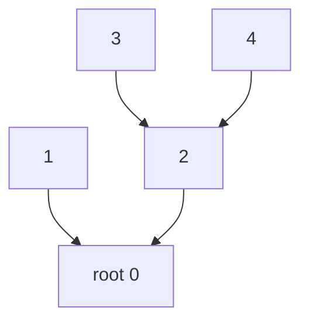
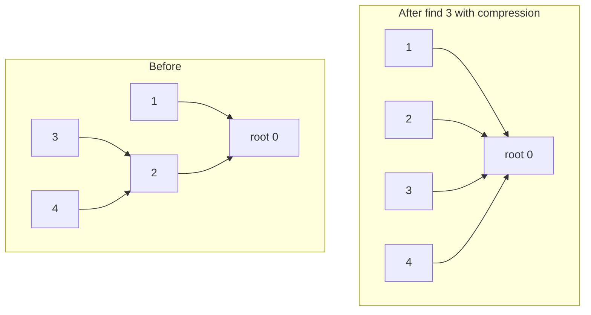
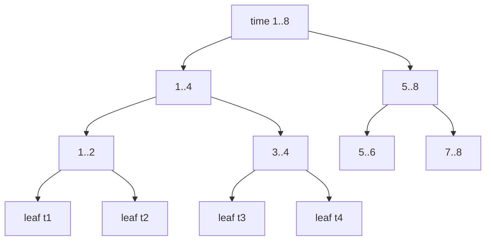

# Disjoint Set Union (DSU): Path Compression, Union by Rank, and Rollback

The **Disjoint Set Union** (DSU), also called **Union-Find**, maintains a partition of $n$ elements into disjoint sets. It answers two questions blisteringly fast:

- **`find(x)`** — which set does `x` belong to? (returns a canonical *representative*)
- **`unite(x, y)`** — merge the sets containing `x` and `y`.

With the two classic optimizations (**path compression** + **union by rank/size**) both operations run in $O(\alpha(n))$ *amortized* time, where $\alpha$ is the inverse-Ackermann function — effectively a constant (less than $5$ for any $n$ you will ever meet).

This guide also covers **DSU with rollback**, a variant that deliberately *drops* path compression so that each union mutates only $O(1)$ state, allowing every union to be **undone**. Rollback DSU is the backbone of **offline dynamic connectivity** (segment tree on time) and **small-to-large** merging.

## Table of Contents

- [Core Idea: A Forest of Pointers](#core-idea-a-forest-of-pointers)
- [Naive find and unite](#naive-find-and-unite)
- [Path Compression](#path-compression)
- [Union by Rank / Size](#union-by-rank--size)
- [The Inverse-Ackermann Bound](#the-inverse-ackermann-bound)
- [Tracking Component Count and Sizes](#tracking-component-count-and-sizes)
- [DSU with Rollback](#dsu-with-rollback)
- [Why Rollback DSU? Offline Dynamic Connectivity](#why-rollback-dsu-offline-dynamic-connectivity)
- [Weighted / Bipartite DSU (Parity)](#weighted--bipartite-dsu-parity)
- [Complexity Summary](#complexity-summary)
- [Common Pitfalls](#common-pitfalls)
- [Patterns](#patterns)

## Core Idea: A Forest of Pointers

Represent each set as a **rooted tree**. Every element stores a `parent` pointer; the **root** is its own parent and serves as the representative of the set. Two elements are in the same set **iff** they share the same root.



Here `find(3)` walks `3 -> 2 -> 0` and returns `0`. `find(4)` also returns `0`, so `3` and `4` are connected.

## Naive find and unite

Without optimizations, `find` walks parent pointers to the root and `unite` hangs one root under the other.

```
function find(x):
    while parent[x] != x:
        x = parent[x]
    return x

function unite(x, y):
    rx = find(x); ry = find(y)
    if rx != ry:
        parent[rx] = ry
```

```python
class DSUNaive:
    def __init__(self, n: int) -> None:
        self.parent = list(range(n))

    def find(self, x: int) -> int:
        while self.parent[x] != x:
            x = self.parent[x]
        return x

    def unite(self, x: int, y: int) -> None:
        rx, ry = self.find(x), self.find(y)
        if rx != ry:
            self.parent[rx] = ry
```

```cpp
#include <bits/stdc++.h>
using namespace std;

struct DSUNaive {
    vector<int> parent;
    explicit DSUNaive(int n) : parent(n) {
        iota(parent.begin(), parent.end(), 0);
    }
    int find(int x) {
        while (parent[x] != x) x = parent[x];
        return x;
    }
    void unite(int x, int y) {
        int rx = find(x), ry = find(y);
        if (rx != ry) parent[rx] = ry;
    }
};
```

The danger: a chain of unions can build a degenerate path of length $n$, making `find` cost $O(n)$. Both optimizations below fix this.

## Path Compression

When `find(x)` walks to the root, **re-point every node on the path directly to the root**. Future queries on those nodes become $O(1)$. This *flattens* the tree.



After `find(3)`, node `3` (and every node on its path) points straight at the root `0`.

```python
def find(self, x: int) -> int:
    root = x
    while self.parent[root] != root:
        root = self.parent[root]
    while self.parent[x] != root:      # second pass: re-point
        self.parent[x], x = root, self.parent[x]
    return root
```

```cpp
int find(int x) {
    int root = x;
    while (parent[root] != root) root = parent[root];
    while (parent[x] != root) {          // second pass: re-point
        int next = parent[x];
        parent[x] = root;
        x = next;
    }
    return root;
}
```

A common one-liner recursive variant (elegant, but watch recursion depth):

```python
def find(self, x: int) -> int:
    if self.parent[x] != x:
        self.parent[x] = self.find(self.parent[x])
    return self.parent[x]
```

```cpp
int find(int x) {
    return parent[x] == x ? x : parent[x] = find(parent[x]);
}
```

## Union by Rank / Size

When merging two trees, always **attach the shorter/smaller tree under the taller/larger root**. This keeps trees shallow.

- **Union by rank**: `rank` is an upper bound on tree height. Attach lower rank under higher; if equal, pick either and increment its rank.
- **Union by size**: track the number of nodes; attach the smaller-count root under the larger. (Often more convenient because you also get component sizes for free.)

```python
class DSU:
    def __init__(self, n: int) -> None:
        self.parent = list(range(n))
        self.size = [1] * n
        self.count = n            # number of disjoint components

    def find(self, x: int) -> int:
        if self.parent[x] != x:
            self.parent[x] = self.find(self.parent[x])
        return self.parent[x]

    def unite(self, x: int, y: int) -> bool:
        rx, ry = self.find(x), self.find(y)
        if rx == ry:
            return False
        if self.size[rx] < self.size[ry]:   # union by size
            rx, ry = ry, rx
        self.parent[ry] = rx
        self.size[rx] += self.size[ry]
        self.count -= 1
        return True
```

```cpp
#include <bits/stdc++.h>
using namespace std;

struct DSU {
    vector<int> parent, size;
    int count;                       // number of disjoint components
    explicit DSU(int n) : parent(n), size(n, 1), count(n) {
        iota(parent.begin(), parent.end(), 0);
    }
    int find(int x) {
        return parent[x] == x ? x : parent[x] = find(parent[x]);
    }
    bool unite(int x, int y) {
        int rx = find(x), ry = find(y);
        if (rx == ry) return false;
        if (size[rx] < size[ry]) swap(rx, ry);   // union by size
        parent[ry] = rx;
        size[rx] += size[ry];
        --count;
        return true;
    }
};
```

## The Inverse-Ackermann Bound

With **both** optimizations, a sequence of $m$ operations on $n$ elements costs

$$
O\bigl(m \cdot \alpha(n)\bigr),
$$

where $\alpha(n)$ is the **inverse Ackermann function**. The Ackermann function $A(k, j)$ grows so explosively that its inverse satisfies $\alpha(n) \le 4$ for every $n \le 2^{2^{2^{2^{16}}}}$ — astronomically larger than the number of atoms in the universe. So $\alpha(n)$ is a *constant* for all practical purposes.

**Intuition.** Path compression rapidly shrinks the distance from a node to its root; union by rank prevents trees from ever getting tall in the first place. The combination means each node's "rank" can only climb through a tiny number of distinct levels before it is permanently flattened. The amortized analysis (Tarjan) partitions cost into "blocks" of the rank hierarchy; the number of blocks a node passes through is bounded by $\alpha(n)$.

Note: using **only** path compression gives $O(\log n)$ amortized; using **only** union by rank gives $O(\log n)$ worst case per op. You need *both* for $\alpha(n)$.

## Tracking Component Count and Sizes

Two cheap pieces of bookkeeping make DSU far more useful:

- **`count`** — start at $n$; decrement on every *successful* `unite`. Answers "how many connected components remain?"
- **`size[root]`** — number of nodes in the component (valid only at a root). Maintain `max_size` for "largest component so far".

```python
class DSUStats:
    def __init__(self, n: int) -> None:
        self.parent = list(range(n))
        self.size = [1] * n
        self.count = n
        self.max_size = 1

    def find(self, x: int) -> int:
        if self.parent[x] != x:
            self.parent[x] = self.find(self.parent[x])
        return self.parent[x]

    def unite(self, x: int, y: int) -> bool:
        rx, ry = self.find(x), self.find(y)
        if rx == ry:
            return False
        if self.size[rx] < self.size[ry]:
            rx, ry = ry, rx
        self.parent[ry] = rx
        self.size[rx] += self.size[ry]
        self.max_size = max(self.max_size, self.size[rx])
        self.count -= 1
        return True
```

```cpp
#include <bits/stdc++.h>
using namespace std;

struct DSUStats {
    vector<int> parent, size;
    int count;
    long long max_size;
    explicit DSUStats(int n) : parent(n), size(n, 1), count(n), max_size(1) {
        iota(parent.begin(), parent.end(), 0);
    }
    int find(int x) {
        return parent[x] == x ? x : parent[x] = find(parent[x]);
    }
    bool unite(int x, int y) {
        int rx = find(x), ry = find(y);
        if (rx == ry) return false;
        if (size[rx] < size[ry]) swap(rx, ry);
        parent[ry] = rx;
        size[rx] += size[ry];
        max_size = max(max_size, (long long)size[rx]);
        --count;
        return true;
    }
};
```

## DSU with Rollback

Sometimes we need to **undo** unions — to backtrack in a search, or to leave a node of a recursion. Path compression makes a single `find` mutate *many* parent pointers in unpredictable ways, so it cannot be cheaply reversed. The fix:

> **Rollback DSU uses union by rank/size ONLY — no path compression.** Each `unite` changes exactly two cells (`parent[smaller]` and `rank/size[larger]`). Record those on a stack; `rollback()` pops and restores them.

Because there is no compression, `find` is $O(\log n)$ (the tree stays balanced via union by rank), and each `unite` / `rollback` is $O(\log n)$ as well. We trade the $\alpha(n)$ bound for the ability to undo.

```
unite(x, y):
    rx = find(x); ry = find(y)
    if rx == ry: push sentinel(-1); return false
    if rank[rx] < rank[ry]: swap(rx, ry)
    push (ry, rank[rx])          # remember child and old rank of new root
    parent[ry] = rx
    if rank[rx] == rank[ry]: rank[rx] += 1
    return true

rollback():
    (child, old_rank) = pop()
    if child == -1: return       # was a no-op union
    root = parent[child]
    parent[child] = child        # detach
    rank[root] = old_rank        # restore rank
    count += 1
```

```python
class DSURollback:
    def __init__(self, n: int) -> None:
        self.parent = list(range(n))
        self.rank = [0] * n
        self.count = n
        self.history: list[tuple[int, int]] = []   # (child_root, old_rank_of_new_root)

    def find(self, x: int) -> int:                 # NO path compression
        while self.parent[x] != x:
            x = self.parent[x]
        return x

    def unite(self, x: int, y: int) -> bool:
        rx, ry = self.find(x), self.find(y)
        if rx == ry:
            self.history.append((-1, -1))          # sentinel: nothing changed
            return False
        if self.rank[rx] < self.rank[ry]:
            rx, ry = ry, rx
        self.history.append((ry, self.rank[rx]))
        self.parent[ry] = rx
        if self.rank[rx] == self.rank[ry]:
            self.rank[rx] += 1
        self.count -= 1
        return True

    def snapshot(self) -> int:
        return len(self.history)

    def rollback(self, until: int) -> None:
        while len(self.history) > until:
            child, old_rank = self.history.pop()
            if child == -1:
                continue
            root = self.parent[child]
            self.parent[child] = child
            self.rank[root] = old_rank
            self.count += 1
```

```cpp
#include <bits/stdc++.h>
using namespace std;

struct DSURollback {
    vector<int> parent, rnk;
    int count;
    vector<pair<int,int>> history;   // (child_root, old_rank_of_new_root)

    explicit DSURollback(int n) : parent(n), rnk(n, 0), count(n) {
        iota(parent.begin(), parent.end(), 0);
    }
    int find(int x) {                // NO path compression
        while (parent[x] != x) x = parent[x];
        return x;
    }
    bool unite(int x, int y) {
        int rx = find(x), ry = find(y);
        if (rx == ry) {
            history.push_back({-1, -1});         // sentinel: nothing changed
            return false;
        }
        if (rnk[rx] < rnk[ry]) swap(rx, ry);
        history.push_back({ry, rnk[rx]});
        parent[ry] = rx;
        if (rnk[rx] == rnk[ry]) ++rnk[rx];
        --count;
        return true;
    }
    int snapshot() const { return (int)history.size(); }
    void rollback(int until) {
        while ((int)history.size() > until) {
            auto [child, old_rank] = history.back();
            history.pop_back();
            if (child == -1) continue;
            int root = parent[child];
            parent[child] = child;
            rnk[root] = old_rank;
            ++count;
        }
    }
};
```

The key invariant: a `unite` always makes `parent[ry] = rx`, so on rollback we know the *child* root `ry`, and `parent[ry]` still points at `rx`, which is exactly the node whose rank we must restore.

## Why Rollback DSU? Offline Dynamic Connectivity

Plain DSU only **adds** edges; it cannot delete them. But many problems insert *and* delete edges over time, then ask connectivity queries. The classic offline technique:

1. Each edge is "alive" during a **time interval** $[l, r)$.
2. Build a **segment tree over time** (one leaf per time/query index).
3. Insert each edge's interval into the $O(\log T)$ canonical segment-tree nodes covering $[l, r)$.
4. **DFS the segment tree.** Entering a node: `unite` all edges stored there (recording snapshots). At a leaf: answer that moment's query. Leaving a node: **`rollback`** to the snapshot taken on entry.

Rollback is essential because the DFS visits sibling subtrees that must *not* see each other's edges.



Each edge alive on $[l, r)$ is pushed onto $O(\log T)$ nodes; total work is $O((E + Q)\log T \cdot \log N)$. This is the standard pattern for the second problem in this folder.

**Small-to-large merging** uses the same rollback idea conceptually: when merging two structures, always iterate the smaller one into the larger, giving an $O(n \log n)$ total bound; combined with DSU-by-size this guarantees each element is moved $O(\log n)$ times.

## Weighted / Bipartite DSU (Parity)

A **weighted DSU** stores, alongside each parent pointer, the *relation* between a node and its parent. For **bipartite / parity DSU** the weight is a single bit: the parity of the path length to the root. This detects **odd cycles** (a graph is bipartite iff it has none).

When `unite(u, v)` is requested with the constraint "`u` and `v` are in different sets (different color)", compute `parity(u)` and `parity(v)`:

- If they are already in the same component and `parity(u) == parity(v)`, you have created an **odd cycle** → not bipartite.
- Otherwise attach roots and set the connecting weight so the parity constraint holds.

```python
class BipartiteDSU:
    def __init__(self, n: int) -> None:
        self.parent = list(range(n))
        self.rank = [0] * n
        self.parity = [0] * n          # parity of edge to parent

    def find(self, x: int) -> tuple[int, int]:
        p = 0
        while self.parent[x] != x:
            p ^= self.parity[x]
            x = self.parent[x]
        return x, p                    # (root, parity from original node to root)

    def unite(self, u: int, v: int) -> bool:
        ru, pu = self.find(u)
        rv, pv = self.find(v)
        if ru == rv:
            return pu != pv            # must differ; equal => odd cycle
        if self.rank[ru] < self.rank[rv]:
            ru, rv, pu, pv = rv, ru, pv, pu
        self.parent[rv] = ru
        self.parity[rv] = pu ^ pv ^ 1  # enforce u, v different colors
        if self.rank[ru] == self.rank[rv]:
            self.rank[ru] += 1
        return True
```

```cpp
#include <bits/stdc++.h>
using namespace std;

struct BipartiteDSU {
    vector<int> parent, rnk, parity;   // parity of edge to parent
    explicit BipartiteDSU(int n) : parent(n), rnk(n, 0), parity(n, 0) {
        iota(parent.begin(), parent.end(), 0);
    }
    pair<int,int> find(int x) {
        int p = 0;
        while (parent[x] != x) {
            p ^= parity[x];
            x = parent[x];
        }
        return {x, p};                 // (root, parity from node to root)
    }
    bool unite(int u, int v) {
        auto [ru, pu] = find(u);
        auto [rv, pv] = find(v);
        if (ru == rv) return pu != pv; // equal parity => odd cycle
        if (rnk[ru] < rnk[rv]) { swap(ru, rv); swap(pu, pv); }
        parent[rv] = ru;
        parity[rv] = pu ^ pv ^ 1;      // enforce different colors
        if (rnk[ru] == rnk[rv]) ++rnk[ru];
        return true;
    }
};
```

## Complexity Summary

| Variant | `find` | `unite` | `rollback` | Notes |
|---|---|---|---|---|
| Naive | $O(n)$ | $O(n)$ | — | degenerate chains |
| Path compression only | $O(\log n)$ amort. | $O(\log n)$ amort. | — | cannot undo |
| Union by rank only | $O(\log n)$ | $O(\log n)$ | — | balanced height |
| Compression + rank | $O(\alpha(n))$ amort. | $O(\alpha(n))$ amort. | — | the standard DSU |
| Rollback (rank only) | $O(\log n)$ | $O(\log n)$ | $O(\log n)$ per undo | undoable, no compression |
| Bipartite/weighted | $O(\log n)$ or $O(\alpha)$ | same | optional | detects odd cycles |

Space is $O(n)$ for all variants; rollback adds $O(\text{number of unions})$ for the history stack.

## Common Pitfalls

- **Mixing path compression with rollback.** Compression mutates ancestors arbitrarily and *cannot* be undone cheaply. Rollback DSU must use union by rank/size **only**.
- **Reading `size` / `rank` of a non-root.** These are valid only at the representative. Always `find` first.
- **Updating `max_size` or `count` on a no-op union.** Only adjust statistics when `unite` actually merged (returned `true`).
- **Recursion depth.** Recursive `find` with compression can hit Python's recursion limit (or C++ stack) for $n \approx 10^5$ deep chains *before* compression flattens. Prefer the iterative two-pass form, or raise the limit.
- **Forgetting the sentinel in rollback.** A `unite` that found the same root still consumes a "step"; push a sentinel so `rollback(snapshot)` pops a matching number of entries.
- **0- vs 1-indexed nodes.** CSES inputs are often 1-indexed; size your arrays as `n + 1` or subtract one consistently.
- **`long long` for counts/sizes.** Sums of component sizes or answers can exceed 32-bit; use `long long` in C++.

## Patterns

- **Online incremental connectivity** → plain DSU with `count` and `size`/`max_size` (CSES Road Construction).
- **Edges deleted over time / connectivity at time t** → segment tree on time + **rollback DSU** (offline dynamic connectivity).
- **Group items by shared key (strings, emails)** → map keys to integer ids, DSU on ids, then bucket by representative (LeetCode Accounts Merge).
- **Detect odd cycle / 2-coloring under constraints** → **bipartite (parity) DSU**.
- **Merge auxiliary data on union** → store data at roots, combine in `unite`; for guaranteed $O(n\log n)$, merge **small into large**.
- **Kruskal's MST** → sort edges, `unite` endpoints, accept edge iff it merged two components.
