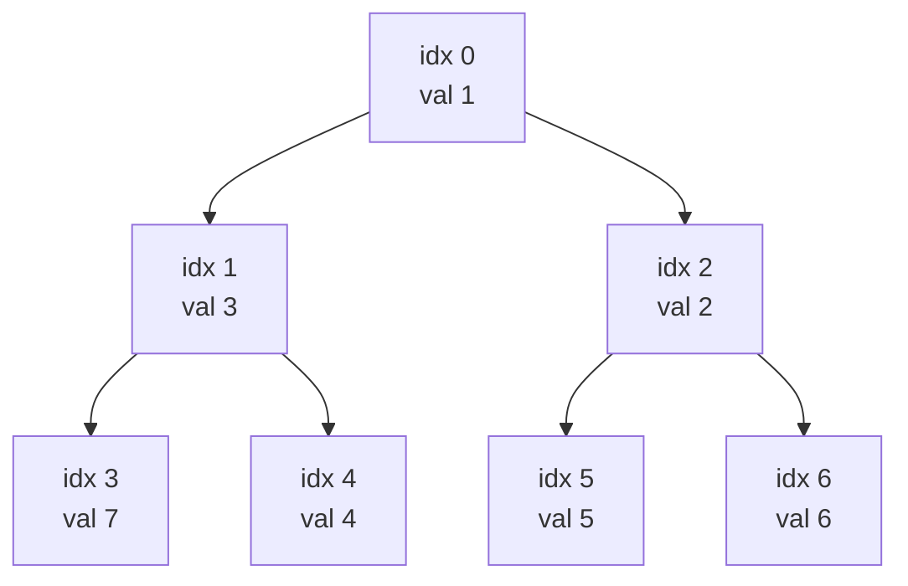
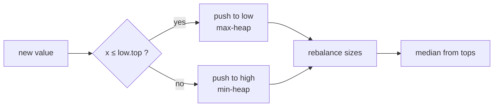
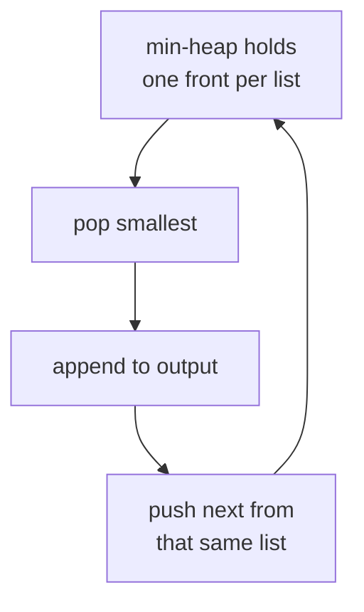

# Heap / Priority Queue

A **heap** is a complete binary tree stored compactly in an array that maintains the **heap property**: every parent is "better than or equal to" its children. In a **min-heap** the smallest element sits at the root; in a **max-heap** the largest does. A **priority queue** is the abstract data type — *insert an element*, *peek at the best*, *remove the best* — and a binary heap is its standard implementation.

Heaps are the go-to structure whenever you repeatedly need the current extreme (smallest/largest) of a changing collection: Dijkstra, event-sweep algorithms, k-way merges, scheduling by priority, and running-median queries all lean on them. Push and pop cost $O(\log n)$, peek is $O(1)$, and you can *build* a heap from $n$ items in $O(n)$.

---

## Table of Contents

1. [Why a Heap?](#why-a-heap)
2. [Complete Tree in an Array](#complete-tree-in-an-array)
3. [Mermaid: A Min-Heap Tree](#mermaid-a-min-heap-tree)
4. [The Heap Property](#the-heap-property)
5. [Sift-Up and Push](#sift-up-and-push)
6. [Sift-Down and Pop](#sift-down-and-pop)
7. [Heapify: Building in O(n)](#heapify-building-in-on)
8. [Min-Heap vs Max-Heap](#min-heap-vs-max-heap)
9. [Python heapq](#python-heapq)
10. [C++ priority_queue](#c-priority_queue)
11. [Lazy Deletion](#lazy-deletion)
12. [Indexed Heap and Decrease-Key](#indexed-heap-and-decrease-key)
13. [Two Heaps for Running Median](#two-heaps-for-running-median)
14. [K-Way Merge](#k-way-merge)
15. [Complexity Summary](#complexity-summary)
16. [Common Pitfalls](#common-pitfalls)
17. [Patterns](#patterns)

---

## Why a Heap?

Suppose you must repeatedly extract the minimum of a multiset while also inserting new values. Compare the options:

| Structure | Insert | Find min | Delete min |
|-----------|--------|----------|------------|
| Unsorted array | $O(1)$ | $O(n)$ | $O(n)$ |
| Sorted array | $O(n)$ | $O(1)$ | $O(n)$ (shift) |
| Balanced BST | $O(\log n)$ | $O(\log n)$ | $O(\log n)$ |
| **Binary heap** | $O(\log n)$ | $O(1)$ | $O(\log n)$ |

A heap gives the cheapest combination for the "insert + extract-extreme" workload, with tiny constants and no pointers — it lives in a flat array. It does **not** support efficient search for an arbitrary key or ordered traversal; if you need those, reach for a balanced BST instead.

---

## Complete Tree in an Array

A binary heap is a **complete** binary tree: every level is full except possibly the last, which is filled left to right. That shape lets us drop the pointers and store the tree level-by-level in an array. For a node at index $i$ (0-indexed):

$$
\text{parent}(i) = \left\lfloor \frac{i-1}{2} \right\rfloor, \qquad
\text{left}(i) = 2i + 1, \qquad
\text{right}(i) = 2i + 2.
$$

So the array `[1, 3, 2, 7, 4, 5, 6]` represents the tree with root `1`, children `3` and `2`, and so on. The height of a heap with $n$ nodes is $\lfloor \log_2 n \rfloor$, which is why push and pop are logarithmic.

```python
def parent(i: int) -> int:
    return (i - 1) // 2

def left(i: int) -> int:
    return 2 * i + 1

def right(i: int) -> int:
    return 2 * i + 2
```

```cpp
int parent(int i) { return (i - 1) / 2; }
int left(int i)   { return 2 * i + 1; }
int right(int i)  { return 2 * i + 2; }
```

---

## Mermaid: A Min-Heap Tree

The array `[1, 3, 2, 7, 4, 5, 6]` viewed as a tree. Each parent is $\le$ both children, so the global minimum `1` is at the root.



---

## The Heap Property

A min-heap satisfies, for every node $i$ that has children,

$$
a[i] \le a[\text{left}(i)] \quad \text{and} \quad a[i] \le a[\text{right}(i)].
$$

This is a **local** invariant, yet it forces a **global** consequence: the root is the minimum of the whole array. Note it does *not* impose any order between siblings or between cousins — that looseness is exactly why a heap is cheaper to maintain than a fully sorted array.

When an operation temporarily breaks the property at one spot, we restore it by moving the offending value along a single root-to-leaf path — either up (sift-up) or down (sift-down).

---

## Sift-Up and Push

To **push** a value, append it at the end (preserving completeness) then **sift it up**: while it is smaller than its parent, swap with the parent. The element bubbles up at most the height of the tree, so $O(\log n)$.

```
push(a, x):
    a.append(x)
    i = len(a) - 1
    while i > 0 and a[parent(i)] > a[i]:
        swap(a[parent(i)], a[i])
        i = parent(i)
```

```python
def sift_up(a: list[int], i: int) -> None:
    while i > 0 and a[(i - 1) // 2] > a[i]:
        a[(i - 1) // 2], a[i] = a[i], a[(i - 1) // 2]
        i = (i - 1) // 2

def push(a: list[int], x: int) -> None:
    a.append(x)
    sift_up(a, len(a) - 1)
```

```cpp
void sift_up(vector<int>& a, int i) {
    while (i > 0 && a[(i - 1) / 2] > a[i]) {
        swap(a[(i - 1) / 2], a[i]);
        i = (i - 1) / 2;
    }
}

void push(vector<int>& a, int x) {
    a.push_back(x);
    sift_up(a, (int)a.size() - 1);
}
```

---

## Sift-Down and Pop

To **pop** the minimum, take the root, move the last element into the root slot (keeping the tree complete), then **sift it down**: repeatedly swap it with its *smaller* child until both children are $\ge$ it.

```
pop_min(a):
    root = a[0]
    a[0] = a[last]
    remove last
    sift_down(a, 0)
    return root
```

```python
def sift_down(a: list[int], i: int) -> None:
    n = len(a)
    while True:
        smallest = i
        l, r = 2 * i + 1, 2 * i + 2
        if l < n and a[l] < a[smallest]:
            smallest = l
        if r < n and a[r] < a[smallest]:
            smallest = r
        if smallest == i:
            break
        a[i], a[smallest] = a[smallest], a[i]
        i = smallest

def pop_min(a: list[int]) -> int:
    root = a[0]
    last = a.pop()
    if a:
        a[0] = last
        sift_down(a, 0)
    return root
```

```cpp
void sift_down(vector<int>& a, int i) {
    int n = (int)a.size();
    while (true) {
        int smallest = i, l = 2 * i + 1, r = 2 * i + 2;
        if (l < n && a[l] < a[smallest]) smallest = l;
        if (r < n && a[r] < a[smallest]) smallest = r;
        if (smallest == i) break;
        swap(a[i], a[smallest]);
        i = smallest;
    }
}

int pop_min(vector<int>& a) {
    int root = a[0];
    int last = a.back();
    a.pop_back();
    if (!a.empty()) {
        a[0] = last;
        sift_down(a, 0);
    }
    return root;
}
```

---

## Heapify: Building in O(n)

Given an arbitrary array, you could push all $n$ elements one by one for $O(n \log n)$. But you can do better: **sift-down every internal node, from the last one up to the root**. Leaves (the second half of the array) are already trivially valid heaps, so start at index $\lfloor n/2 \rfloor - 1$.

```python
def heapify(a: list[int]) -> None:
    for i in range(len(a) // 2 - 1, -1, -1):
        sift_down(a, i)
```

```cpp
void heapify(vector<int>& a) {
    for (int i = (int)a.size() / 2 - 1; i >= 0; --i)
        sift_down(a, i);
}
```

### Why it is linear

A sift-down from a node at height $h$ (distance to the deepest leaf below it) costs $O(h)$. In a heap of $n$ nodes there are at most $\lceil n / 2^{h+1} \rceil$ nodes at height $h$. The total work is

$$
T(n) = \sum_{h=0}^{\lfloor \log n \rfloor} \left\lceil \frac{n}{2^{h+1}} \right\rceil O(h)
      \le O(n) \sum_{h=0}^{\infty} \frac{h}{2^{h+1}}.
$$

The remaining series converges to a constant. Using the identity $\sum_{h=0}^{\infty} \frac{h}{2^{h}} = 2$,

$$
\sum_{h=0}^{\infty} \frac{h}{2^{h+1}} = \frac{1}{2} \sum_{h=0}^{\infty} \frac{h}{2^{h}} = \frac{1}{2} \cdot 2 = 1,
$$

so $T(n) = O(n)$. The intuition: most nodes are near the bottom (cheap, $h$ small), and the expensive nodes near the root are few.

---

## Min-Heap vs Max-Heap

The only difference is the comparison direction. A max-heap keeps the **largest** at the root by enforcing $a[i] \ge a[\text{children}]$. Two common ways to flip a min-heap into a max-heap without rewriting code:

- **Negate the keys** — store $-x$ in a min-heap and negate again on the way out.
- **Reverse the comparator** — pass a "greater" comparison so "better" means "larger".

```python
import heapq

# heapq is a MIN-heap. Negate to simulate a MAX-heap.
max_heap: list[int] = []
for x in [5, 1, 8, 3]:
    heapq.heappush(max_heap, -x)
largest = -heapq.heappop(max_heap)   # 8
```

```cpp
#include <queue>
using namespace std;

// priority_queue is a MAX-heap by default.
priority_queue<int> max_heap;
for (int x : {5, 1, 8, 3}) max_heap.push(x);
int largest = max_heap.top();        // 8
max_heap.pop();
```

---

## Python heapq

Python's standard library exposes a heap through `heapq`, which operates **in place on a plain list** and is always a **min-heap**. Key calls: `heappush`, `heappop`, `heapify`, and `heappushpop` / `heapreplace` for fused operations. To order by a custom key, push **tuples** `(key, payload)`; comparisons go lexicographically, so put the priority first.

```python
import heapq

h: list[tuple[int, str]] = []
heapq.heappush(h, (2, "task-b"))
heapq.heappush(h, (1, "task-a"))
heapq.heappush(h, (3, "task-c"))

heapq.heapify(h)                 # O(n) build from an existing list
priority, name = heapq.heappop(h)   # (1, "task-a")

# Tie-break safely: if keys can collide and payloads are not comparable,
# add a unique counter so tuples never compare the payload object.
import itertools
counter = itertools.count()
heapq.heappush(h, (1, next(counter), "task-a"))
```

```cpp
#include <bits/stdc++.h>
using namespace std;

int main() {
    // Min-heap of (priority, name); pair compares lexicographically.
    priority_queue<pair<int, string>,
                   vector<pair<int, string>>,
                   greater<>> h;
    h.push({2, "task-b"});
    h.push({1, "task-a"});
    h.push({3, "task-c"});

    auto [priority, name] = h.top();   // (1, "task-a")
    h.pop();
    cout << priority << ' ' << name << '\n';
    return 0;
}
```

---

## C++ priority_queue

`std::priority_queue` is a **max-heap by default** — `top()` returns the greatest element. To get a min-heap, supply `greater<>` as the comparator together with the underlying container type:

```python
# Python equivalent: a min-heap by priority, max-heap by negation.
import heapq

min_heap: list[int] = []
heapq.heappush(min_heap, 5)
heapq.heappush(min_heap, 1)
smallest = heapq.heappop(min_heap)   # 1
```

```cpp
#include <bits/stdc++.h>
using namespace std;

int main() {
    priority_queue<int> max_heap;                              // default: max
    priority_queue<int, vector<int>, greater<>> min_heap;      // min-heap

    for (int x : {5, 1, 8, 3}) {
        max_heap.push(x);
        min_heap.push(x);
    }
    cout << max_heap.top() << '\n';   // 8
    cout << min_heap.top() << '\n';   // 1

    // Custom comparator via lambda (note decltype in the template args).
    auto cmp = [](int a, int b) { return a > b; };             // min-heap
    priority_queue<int, vector<int>, decltype(cmp)> pq(cmp);
    pq.push(4); pq.push(2);
    cout << pq.top() << '\n';         // 2
    return 0;
}
```

---

## Lazy Deletion

A binary heap cannot remove an *arbitrary* element cheaply, only the root. When values become stale (e.g., a better distance is found in Dijkstra, or an interval expires), the trick is **lazy deletion**: do not try to remove the stale entry. Instead leave it in the heap and, on every `pop`, **check whether the popped entry is still valid**; if not, discard it and pop again.

```
pop_valid(heap, is_valid):
    while heap not empty:
        x = pop_min(heap)
        if is_valid(x):
            return x
    return NONE
```

```python
import heapq

# Example: heap of (key, version). A separate dict holds the live version.
def pop_valid(heap: list, live: dict) -> tuple | None:
    while heap:
        key, item, ver = heapq.heappop(heap)
        if live.get(item) == ver:        # still current?
            return (key, item)
        # else stale -> skip
    return None
```

```cpp
#include <bits/stdc++.h>
using namespace std;

struct Entry { long long key; int item; int ver; };
struct Cmp { bool operator()(const Entry& a, const Entry& b) const { return a.key > b.key; } };

// live[item] == ver means the entry is current.
optional<Entry> pop_valid(priority_queue<Entry, vector<Entry>, Cmp>& pq,
                          const vector<int>& live) {
    while (!pq.empty()) {
        Entry e = pq.top();
        pq.pop();
        if (live[e.item] == e.ver) return e;   // still current
        // else stale -> skip
    }
    return nullopt;
}
```

Each element is pushed and popped at most once per version, so the amortized cost stays $O(\log n)$ per logical operation even though the heap may temporarily hold stale entries.

---

## Indexed Heap and Decrease-Key

Some algorithms (Dijkstra, Prim) want to **decrease the priority of an element already in the heap**. A plain binary heap has no fast way to *find* that element. An **indexed heap** adds a `position[item]` map that tracks where each item currently lives in the array; then `decrease_key` updates the value in place and sift-ups it.

```
decrease_key(item, new_key):
    i = position[item]
    a[i].key = new_key          # only smaller is allowed in a min-heap
    sift_up(i)                  # may move toward the root
```

Whenever a swap happens during sift-up/sift-down, the `position` map must be updated for *both* swapped items. The result: $O(\log n)$ decrease-key without lazy duplicates.

```python
class IndexedMinHeap:
    def __init__(self) -> None:
        self.a: list[tuple[int, int]] = []   # (key, item)
        self.pos: dict[int, int] = {}        # item -> index in self.a

    def _swap(self, i: int, j: int) -> None:
        self.a[i], self.a[j] = self.a[j], self.a[i]
        self.pos[self.a[i][1]] = i
        self.pos[self.a[j][1]] = j

    def _sift_up(self, i: int) -> None:
        while i > 0 and self.a[(i - 1) // 2][0] > self.a[i][0]:
            self._swap(i, (i - 1) // 2)
            i = (i - 1) // 2

    def push(self, key: int, item: int) -> None:
        self.a.append((key, item))
        self.pos[item] = len(self.a) - 1
        self._sift_up(len(self.a) - 1)

    def decrease_key(self, item: int, new_key: int) -> None:
        i = self.pos[item]
        self.a[i] = (new_key, item)
        self._sift_up(i)
```

```cpp
#include <bits/stdc++.h>
using namespace std;

struct IndexedMinHeap {
    vector<pair<long long, int>> a;   // (key, item)
    unordered_map<int, int> pos;      // item -> index

    void swp(int i, int j) {
        swap(a[i], a[j]);
        pos[a[i].second] = i;
        pos[a[j].second] = j;
    }
    void sift_up(int i) {
        while (i > 0 && a[(i - 1) / 2].first > a[i].first) {
            swp(i, (i - 1) / 2);
            i = (i - 1) / 2;
        }
    }
    void push(long long key, int item) {
        a.push_back({key, item});
        pos[item] = (int)a.size() - 1;
        sift_up((int)a.size() - 1);
    }
    void decrease_key(int item, long long new_key) {
        int i = pos[item];
        a[i].first = new_key;
        sift_up(i);
    }
};
```

In practice, competitive solutions often skip the indexed heap and use **lazy deletion** instead — it is simpler and asymptotically identical.

---

## Two Heaps for Running Median

To maintain the median of a growing stream, split the data across **two heaps**:

- a **max-heap** `low` holding the smaller half,
- a **min-heap** `high` holding the larger half.

Keep them balanced so that $|\,|low| - |high|\,| \le 1$. The median is then `low`'s top (odd total) or the average of both tops (even total). Each insertion is $O(\log n)$.



```python
import heapq

class MedianFinder:
    def __init__(self) -> None:
        self.low: list[int] = []    # max-heap via negation
        self.high: list[int] = []   # min-heap

    def add(self, x: int) -> None:
        heapq.heappush(self.low, -x)
        # ensure every low <= every high
        heapq.heappush(self.high, -heapq.heappop(self.low))
        # rebalance so low has the extra element when odd
        if len(self.high) > len(self.low):
            heapq.heappush(self.low, -heapq.heappop(self.high))

    def median(self) -> float:
        if len(self.low) > len(self.high):
            return -self.low[0]
        return (-self.low[0] + self.high[0]) / 2.0
```

```cpp
#include <bits/stdc++.h>
using namespace std;

struct MedianFinder {
    priority_queue<int> low;                              // max-heap
    priority_queue<int, vector<int>, greater<>> high;     // min-heap

    void add(int x) {
        low.push(x);
        high.push(low.top());
        low.pop();
        if (high.size() > low.size()) {
            low.push(high.top());
            high.pop();
        }
    }
    double median() {
        if (low.size() > high.size()) return low.top();
        return (low.top() + high.top()) / 2.0;
    }
};
```

---

## K-Way Merge

To merge $k$ sorted sequences of total length $N$, keep a heap of the **current front of each sequence**. Pop the smallest, output it, then push the next element from the sequence it came from. The heap never holds more than $k$ items, so the cost is $O(N \log k)$ — far better than $O(N k)$ from naive scanning.



```python
import heapq
from typing import Iterable

def k_way_merge(lists: list[list[int]]) -> list[int]:
    heap: list[tuple[int, int, int]] = []   # (value, list_idx, elem_idx)
    for li, lst in enumerate(lists):
        if lst:
            heapq.heappush(heap, (lst[0], li, 0))

    out: list[int] = []
    while heap:
        val, li, ei = heapq.heappop(heap)
        out.append(val)
        if ei + 1 < len(lists[li]):
            heapq.heappush(heap, (lists[li][ei + 1], li, ei + 1))
    return out
```

```cpp
#include <bits/stdc++.h>
using namespace std;

vector<int> k_way_merge(const vector<vector<int>>& lists) {
    // (value, list_idx, elem_idx), min-heap
    using Node = tuple<int, int, int>;
    priority_queue<Node, vector<Node>, greater<>> heap;
    for (int li = 0; li < (int)lists.size(); ++li)
        if (!lists[li].empty())
            heap.push({lists[li][0], li, 0});

    vector<int> out;
    while (!heap.empty()) {
        auto [val, li, ei] = heap.top();
        heap.pop();
        out.push_back(val);
        if (ei + 1 < (int)lists[li].size())
            heap.push({lists[li][ei + 1], li, ei + 1});
    }
    return out;
}
```

---

## Complexity Summary

| Operation | Time | Notes |
|-----------|------|-------|
| Peek (top) | $O(1)$ | Root of the array |
| Push (insert) | $O(\log n)$ | Append + sift-up |
| Pop (extract) | $O(\log n)$ | Swap root with last + sift-down |
| Heapify (build) | $O(n)$ | Sift-down from $\lfloor n/2\rfloor-1$ to root |
| Decrease-key (indexed) | $O(\log n)$ | Requires position map |
| Search arbitrary key | $O(n)$ | Heaps are not search trees |
| K-way merge | $O(N \log k)$ | Heap of $k$ fronts |
| Running median (per insert) | $O(\log n)$ | Two balanced heaps |

Space is $O(n)$ for the array; the indexed heap adds $O(n)$ for the position map.

---

## Common Pitfalls

- **Wrong heap direction.** `std::priority_queue` is a *max-heap* but Python `heapq` is a *min-heap*. Mixing them up is the most common bug. Negate keys or use `greater<>` deliberately.
- **Comparing non-comparable payloads.** In Python, pushing `(key, obj)` crashes when keys tie and `obj` is not comparable. Insert a unique counter: `(key, next(counter), obj)`.
- **Forgetting completeness.** Hand-rolled heaps must append at the end (push) and fill the root from the last slot (pop) to keep the tree complete; otherwise the index math breaks.
- **Index off-by-one.** With 0-indexed arrays, children are $2i+1$ and $2i+2$, parent is $\lfloor(i-1)/2\rfloor$. With 1-indexed they are $2i$, $2i+1$, $\lfloor i/2\rfloor$. Pick one and be consistent.
- **Trying to delete an arbitrary element.** A plain heap cannot; use lazy deletion or an indexed heap.
- **Updating priorities in place without re-heapifying.** Mutating a key already in the heap without a sift breaks the invariant silently.
- **Integer overflow in C++.** Accumulating keys (costs, sums) may exceed `int`; use `long long` and `const long long INF = 1e18`.

---

## Patterns

- **Top-K / K-th largest.** Keep a min-heap of size $k$; push each element, pop when size exceeds $k$. The root is the k-th largest in $O(n \log k)$.
- **Merge / interleave sorted streams.** K-way merge with a heap of fronts.
- **Greedy scheduling.** Repeatedly take the best available task/interval (shortest job, earliest deadline) via a priority queue.
- **Sweep line with a heap.** Sort events by start, push their end into a heap; pop expired ends as the sweep advances (room allocation, meeting rooms, interval overlap).
- **Dijkstra / Prim.** Priority queue keyed by tentative distance/edge weight, with lazy deletion or decrease-key.
- **Running median / order statistics on a stream.** Two balanced heaps.
- **Build then drain = heapsort.** `heapify` in $O(n)$, then pop $n$ times for an $O(n \log n)$ in-place sort.
