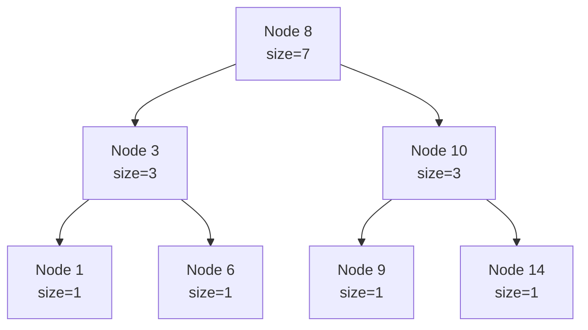

# Ordered Set / Policy Tree (`order_of_key`, Balanced BST)

An **order-statistics tree** is a balanced binary search tree (e.g. a red-black tree) in which
every node stores the **size of its subtree**. That single augmentation upgrades a normal sorted
set into a structure that answers two extra queries in $O(\log n)$:

- **`order_of_key(x)`** — how many stored elements are **strictly less than** `x` (its rank).
- **`find_by_order(k)`** — the **k-th smallest** element (0-indexed).

In C++ the GNU **PBDS** (`__gnu_pbds`) library ships this for free as a `tree<...>` with the
`tree_order_statistics_node_update` policy. Python has no built-in equivalent, but
`sortedcontainers.SortedList` (via `bisect_left` + indexing) or a **Fenwick/BIT over compressed
coordinates** gives the same power.

---

## Table of Contents
1. [What Is an Order-Statistics Tree](#what-is-an-order-statistics-tree)
2. [The Augmentation: Subtree Sizes](#the-augmentation-subtree-sizes)
3. [GNU PBDS Policy Tree (C++)](#gnu-pbds-policy-tree-c)
4. [Python Equivalent: SortedList](#python-equivalent-sortedlist)
5. [Python Equivalent: Fenwick / BIT](#python-equivalent-fenwick--bit)
6. [Making It a Multiset](#making-it-a-multiset)
7. [Complexity Summary](#complexity-summary)
8. [Common Pitfalls](#common-pitfalls)
9. [Patterns](#patterns)

---

## What Is an Order-Statistics Tree

A plain balanced BST keeps elements sorted and supports `insert`, `erase`, and `find` in
$O(\log n)$. An **order-statistics tree** adds two *rank-based* operations:

$$
\text{order\_of\_key}(x) = \bigl|\{\, e \in S : e < x \,\}\bigr|,
\qquad
\text{find\_by\_order}(k) = \text{the } (k{+}1)\text{-th smallest element}.
$$

These are inverse operations: `order_of_key(find_by_order(k)) == k` when all keys are distinct.

The trick is that we never scan the tree linearly. By storing each subtree's element **count**, a
rank is computed by walking a single root-to-leaf path and summing the sizes of the subtrees we
"skip over".

---

## The Augmentation: Subtree Sizes

Each node stores `size = 1 + size(left) + size(right)`. To compute `order_of_key(x)` we descend
from the root: whenever we move right (because `x` is greater than the current node's key), every
element in the **left subtree plus the current node** is known to be `< x`, so we add
`size(left) + 1` to the running rank.



For the tree above (sorted set $\{1,3,6,8,9,10,14\}$), computing `order_of_key(10)`:

- At root `8`: `10 > 8` → go right, add `size(left of 8)+1 = 3+1 = 4`.
- At node `10`: `10 == 10` → stop. Rank so far `= 4`.

So four elements ($1,3,6,8$) are strictly less than `10`. Each step touches one node, giving the
$O(\log n)$ bound:

$$
T_{\text{rank}}(n) = O(\text{tree height}) = O(\log n).
$$

---

## GNU PBDS Policy Tree (C++)

The C++ standard library has no ordered-statistics set, but GCC's policy-based data structures do.
The canonical typedef:

```python
# Python has no direct policy-tree analog; use SortedList for the same operations.
from sortedcontainers import SortedList

s = SortedList()
for x in (8, 3, 10, 1, 6, 9, 14):
    s.add(x)

print(s.bisect_left(10))  # order_of_key(10) -> 4  (count of elements < 10)
print(s[3])               # find_by_order(3)  -> 8  (0-indexed k-th smallest)
```

```cpp
#include <bits/stdc++.h>
#include <ext/pb_ds/assoc_container.hpp>
#include <ext/pb_ds/tree_policy.hpp>
using namespace std;
using namespace __gnu_pbds;

typedef tree<int, null_type, less<int>, rb_tree_tag,
             tree_order_statistics_node_update> ordered_set;

int main() {
    ordered_set s;
    for (int x : {8, 3, 10, 1, 6, 9, 14}) s.insert(x);

    cout << s.order_of_key(10) << "\n";          // 4  (count of elements < 10)
    cout << *s.find_by_order(3) << "\n";         // 8  (0-indexed k-th smallest)
    return 0;
}
```

Template parameters explained:

- `int` — the key type (`null_type` as the mapped type makes it a **set**, not a map).
- `less<int>` — the comparator. Switch to `greater<int>` for descending order.
- `rb_tree_tag` — use a red-black tree as the underlying balanced BST.
- `tree_order_statistics_node_update` — the policy that maintains subtree sizes and exposes
  `order_of_key` / `find_by_order`.

---

## Python Equivalent: SortedList

`sortedcontainers.SortedList` keeps elements in sorted order with $O(\sqrt{n})$ amortized
insert/erase but **$O(\log n)$** rank queries via `bisect_left`/`bisect_right` and **$O(\log n)$**
indexing. For most competitive problems its real-world speed is excellent.

```python
from sortedcontainers import SortedList

class OrderedSet:
    def __init__(self):
        self.sl = SortedList()

    def insert(self, x):
        self.sl.add(x)

    def erase(self, x):
        self.sl.remove(x)            # raises if absent

    def order_of_key(self, x):       # count of elements < x
        return self.sl.bisect_left(x)

    def find_by_order(self, k):      # 0-indexed k-th smallest
        return self.sl[k]

os = OrderedSet()
for x in (8, 3, 10, 1, 6, 9, 14):
    os.insert(x)
print(os.order_of_key(10))   # 4
print(os.find_by_order(3))   # 8
```

```cpp
#include <bits/stdc++.h>
#include <ext/pb_ds/assoc_container.hpp>
#include <ext/pb_ds/tree_policy.hpp>
using namespace std;
using namespace __gnu_pbds;

typedef tree<int, null_type, less<int>, rb_tree_tag,
             tree_order_statistics_node_update> ordered_set;

int main() {
    ordered_set os;
    for (int x : {8, 3, 10, 1, 6, 9, 14}) os.insert(x);

    cout << os.order_of_key(10) << "\n";     // 4
    cout << *os.find_by_order(3) << "\n";    // 8
    return 0;
}
```

---

## Python Equivalent: Fenwick / BIT

When the universe of values is known (or can be **coordinate-compressed**), a Fenwick tree gives a
genuine $O(\log n)$ `order_of_key` and `find_by_order` (k-th element via binary lifting). This is
the fastest pure-Python option and mirrors exactly what the policy tree does internally.

```python
class OrderStatBIT:
    """Order-statistics over compressed values 1..n using a Fenwick tree of counts."""
    def __init__(self, n):
        self.n = n
        self.tree = [0] * (n + 1)
        self.LOG = max(1, (n).bit_length())

    def update(self, i, delta):      # i is 1-indexed compressed value
        while i <= self.n:
            self.tree[i] += delta
            i += i & (-i)

    def prefix(self, i):             # count of inserted values <= i
        s = 0
        while i > 0:
            s += self.tree[i]
            i -= i & (-i)
        return s

    def order_of_key(self, i):       # count of values strictly < i
        return self.prefix(i - 1)

    def kth(self, k):                # 1-indexed k-th smallest value (returns compressed idx)
        pos, rem = 0, k
        for step in range(self.LOG, -1, -1):
            nxt = pos + (1 << step)
            if nxt <= self.n and self.tree[nxt] < rem:
                pos = nxt
                rem -= self.tree[nxt]
        return pos + 1

# Demo with values {8,3,10,1,6,9,14} compressed to 1..7
vals = sorted({8, 3, 10, 1, 6, 9, 14})            # [1,3,6,8,9,10,14]
comp = {v: i + 1 for i, v in enumerate(vals)}     # value -> 1-indexed rank
bit = OrderStatBIT(len(vals))
for x in (8, 3, 10, 1, 6, 9, 14):
    bit.update(comp[x], 1)
print(bit.order_of_key(comp[10]))                 # 4  (elements < 10)
print(vals[bit.kth(4) - 1])                       # 8  (4th smallest, 1-indexed)
```

```cpp
#include <bits/stdc++.h>
using namespace std;

struct OrderStatBIT {
    int n, LOG;
    vector<long long> tree;
    OrderStatBIT(int n) : n(n), tree(n + 1, 0) {
        LOG = max(1, (int)floor(log2(max(1, n))));
    }
    void update(int i, long long delta) {         // 1-indexed
        for (; i <= n; i += i & (-i)) tree[i] += delta;
    }
    long long prefix(int i) {                     // count of values <= i
        long long s = 0;
        for (; i > 0; i -= i & (-i)) s += tree[i];
        return s;
    }
    long long order_of_key(int i) { return prefix(i - 1); }  // values strictly < i
    int kth(long long k) {                        // 1-indexed k-th smallest
        int pos = 0; long long rem = k;
        for (int step = LOG; step >= 0; --step) {
            int nxt = pos + (1 << step);
            if (nxt <= n && tree[nxt] < rem) { pos = nxt; rem -= tree[nxt]; }
        }
        return pos + 1;
    }
};

int main() {
    vector<int> raw = {8, 3, 10, 1, 6, 9, 14};
    vector<int> vals(raw); sort(vals.begin(), vals.end());
    vals.erase(unique(vals.begin(), vals.end()), vals.end());   // [1,3,6,8,9,10,14]
    auto comp = [&](int v) {
        return int(lower_bound(vals.begin(), vals.end(), v) - vals.begin()) + 1;
    };
    OrderStatBIT bit((int)vals.size());
    for (int x : raw) bit.update(comp(x), 1);

    cout << bit.order_of_key(comp(10)) << "\n";    // 4
    cout << vals[bit.kth(4) - 1] << "\n";          // 8
    return 0;
}
```

The Fenwick `kth` uses **binary lifting**: starting from position `0`, we try to jump by
decreasing powers of two, taking a jump whenever the accumulated count stays below `k`. After the
loop, `pos + 1` is the smallest index whose prefix count is at least `k`.

---

## Making It a Multiset

A PBDS `tree<int, ...>` behaves like a **set** — duplicate inserts are ignored. To allow
duplicates you have two common options:

1. **Pair each value with a unique tie-breaker** (e.g. an insertion index), storing
   `pair<value, id>`. This keeps all comparisons strict and `order_of_key({x, 0})` then counts
   elements with value `< x`.
2. **Use `less_equal<int>` as the comparator.** This *appears* to allow duplicates, but it is a
   well-known footgun: `find`, `erase`, and `lower_bound` break because the comparator is no longer
   a strict weak ordering. Prefer option 1 in real code.

```python
from sortedcontainers import SortedList

# SortedList natively supports duplicates -- it is already a multiset.
ml = SortedList()
for x in (5, 5, 5, 2, 8):
    ml.add(x)
print(ml.bisect_left(5))    # 1  -> one element (the 2) is strictly < 5
print(ml.bisect_right(5))   # 4  -> four elements are <= 5
print(len(ml))              # 5  -> duplicates preserved
```

```cpp
#include <bits/stdc++.h>
#include <ext/pb_ds/assoc_container.hpp>
#include <ext/pb_ds/tree_policy.hpp>
using namespace std;
using namespace __gnu_pbds;

// Multiset via pair<value, unique_id>; avoids the less_equal footgun.
typedef tree<pair<long long,int>, null_type, less<pair<long long,int>>,
             rb_tree_tag, tree_order_statistics_node_update> ordered_multiset;

int main() {
    ordered_multiset ms;
    int id = 0;
    for (long long x : {5, 5, 5, 2, 8}) ms.insert({x, id++});

    // count of elements with value strictly < 5: query with the smallest possible id.
    cout << ms.order_of_key({5, INT_MIN}) << "\n";   // 1
    // count of elements with value <= 5: query just past it.
    cout << ms.order_of_key({5, INT_MAX}) << "\n";   // 4
    cout << ms.size() << "\n";                        // 5
    return 0;
}
```

---

## Complexity Summary

| Operation | PBDS `tree` (C++) | `SortedList` (Python) | Fenwick/BIT (Python) |
|---|---|---|---|
| `insert` | $O(\log n)$ | $O(\sqrt{n})$ amortized | $O(\log n)$ |
| `erase` | $O(\log n)$ | $O(\sqrt{n})$ amortized | $O(\log n)$ |
| `order_of_key(x)` | $O(\log n)$ | $O(\log n)$ | $O(\log n)$ |
| `find_by_order(k)` | $O(\log n)$ | $O(\log n)$ | $O(\log n)$ |
| Space | $O(n)$ | $O(n)$ | $O(U)$ over universe $U$ |

For $n$ operations the BIT approach runs in $O(n \log n)$ total after an $O(n \log n)$ compression
step.

---

## Common Pitfalls

- **PBDS is GCC-only.** The `__gnu_pbds` headers do not exist on MSVC or Clang's libc++. Use a
  Fenwick fallback for portability.
- **`order_of_key` counts *strictly less than*.** To count elements `<= x`, use
  `order_of_key(x + 1)` (for integers) or pair with a max tie-breaker.
- **`find_by_order` is 0-indexed**, while a BIT-based `kth` is usually written 1-indexed. Keep the
  convention straight to avoid off-by-one errors.
- **`less_equal` multiset breaks `erase`/`find`.** Prefer `pair<value, id>`.
- **Forgetting coordinate compression** with a BIT when values are large (e.g. up to $10^9$) blows
  up memory. Compress first.
- **`find_by_order(k)` with `k >= size`** returns the `end()` iterator in PBDS — dereferencing it
  is undefined behavior.

---

## Patterns

- **Counting inversions**: insert elements left-to-right; for each new element add the count of
  already-inserted elements greater than it (`i - order_of_key(x) - ...`), i.e. rank queries.
- **Dynamic rank / k-th smallest** under insertions and deletions: maintain a policy tree or a
  Fenwick over compressed coordinates.
- **Count in a value range $[l, r]$**: `order_of_key(r + 1) - order_of_key(l)`.
- **Offline "how many smaller to the right"**: sweep right-to-left, query rank, then insert.
- **Prefix-sum order statistics**: when a problem asks "how many subarrays have sum in a range",
  reduce to rank queries over prefix sums (see LeetCode 327).
