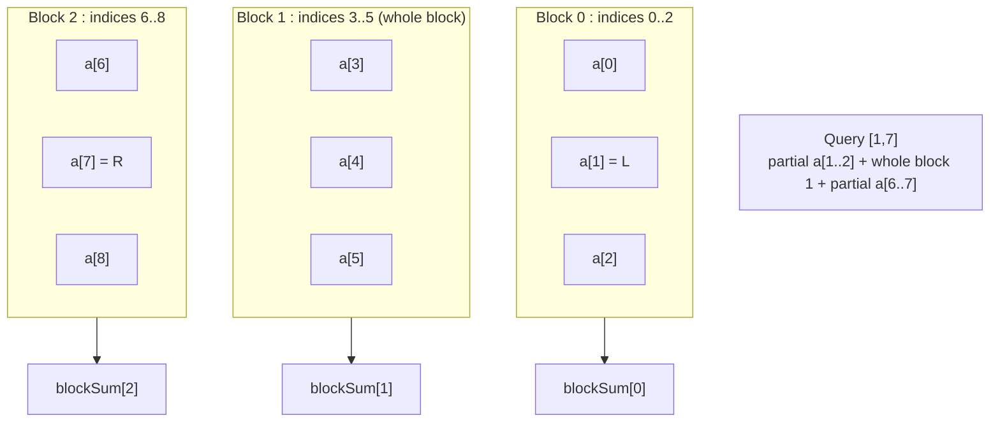

# Sqrt Decomposition & Mo's Algorithm

**Sqrt decomposition** is a family of techniques built on a single, surprisingly
powerful idea: split an array of $n$ elements into $\approx \sqrt n$ blocks of
size $\approx \sqrt n$. Many problems that look like they need a fancy tree can
be solved with this flat, cache-friendly partition — at the cost of an
$O(\sqrt n)$ (instead of $O(\log n)$) factor per operation.

**Mo's algorithm** is the offline cousin of sqrt decomposition. Instead of
splitting the *array*, it splits the *queries*: by reordering range queries
cleverly, two moving pointers sweep across the array and answer all $q$ queries
in $O((n+q)\sqrt n)$ total — even when there is **no** efficient data structure
for the underlying aggregate (e.g. "number of distinct values in a range").

---

## Table of Contents

1. [Why Sqrt Decomposition?](#why-sqrt-decomposition)
2. [The Block Partition](#the-block-partition)
3. [Mermaid: Array Split Into Blocks](#mermaid-array-split-into-blocks)
4. [Range Query in O(sqrt n)](#range-query-in-osqrt-n)
5. [Point Update](#point-update)
6. [Choosing the Block Size](#choosing-the-block-size)
7. [Mo's Algorithm: The Big Idea](#mos-algorithm-the-big-idea)
8. [Query Ordering and the Even/Odd Trick](#query-ordering-and-the-evenodd-trick)
9. [The add / remove / current-answer Pattern](#the-add--remove--current-answer-pattern)
10. [Complexity Derivation](#complexity-derivation)
11. [Complexity Summary](#complexity-summary)
12. [Common Pitfalls](#common-pitfalls)
13. [Patterns](#patterns)

---

## Why Sqrt Decomposition?

Suppose you must answer many "sum of $a[l..r]$" queries while also updating
individual elements. Compare the options:

| Structure | Point update | Range query | Notes |
|-----------|-------------|-------------|-------|
| Plain array | $O(1)$ | $O(n)$ | trivial |
| Prefix sums | $O(n)$ | $O(1)$ | static only |
| **Sqrt decomposition** | $O(1)$ or $O(\sqrt n)$ | $O(\sqrt n)$ | simple, flexible |
| Segment tree / Fenwick | $O(\log n)$ | $O(\log n)$ | faster, more code |

Sqrt decomposition is rarely the *asymptotically* best choice, but it is:

- **Simple** — a few loops, no recursion, no tree indexing.
- **Flexible** — works for aggregates that are awkward in a Fenwick tree.
- **Cache-friendly** — contiguous block scans.
- **The foundation of Mo's algorithm**, which solves problems no $O(\log n)$
  structure can.

---

## The Block Partition

Pick a block size $B \approx \sqrt n$. Element index $i$ (0-indexed) belongs to
block

$$
\text{block}(i) = \left\lfloor \frac{i}{B} \right\rfloor .
$$

There are $\lceil n / B \rceil \approx \sqrt n$ blocks. For each block we store a
precomputed **aggregate** — for range sum, the sum of the block's elements:

```
B = ceil(sqrt(n))
for i in 0..n-1:
    blockSum[i / B] += a[i]
```

Now any range query $[l, r]$ is handled in three parts:

1. A **partial left** piece from $l$ up to the end of $l$'s block.
2. Zero or more **whole blocks** in the middle (use their precomputed aggregate).
3. A **partial right** piece from the start of $r$'s block down to $r$.

The partial ends touch at most $2B = O(\sqrt n)$ elements, and there are at most
$\sqrt n$ whole blocks — so a query is $O(\sqrt n)$.

---

## Mermaid: Array Split Into Blocks

For $n = 9$ and $B = 3$ we get three blocks. A query $[l, r] = [1, 7]$ uses a
partial piece of block 0, the whole of block 1, and a partial piece of block 2.



---

## Range Query in O(sqrt n)

Pseudocode for a range-sum query with block aggregates:

```
query(l, r):
    res = 0
    bl = l / B
    br = r / B
    if bl == br:                 # same block: just scan
        for i in l..r: res += a[i]
    else:
        for i in l..(bl+1)*B - 1: res += a[i]    # partial left
        for b in bl+1 .. br-1:    res += blockSum[b]   # whole blocks
        for i in br*B .. r:       res += a[i]    # partial right
    return res
```

Paired implementations:

```python
import math

class SqrtDecomp:
    def __init__(self, a):
        self.a = a[:]
        self.n = len(a)
        self.B = max(1, int(math.isqrt(self.n)))
        self.nb = (self.n + self.B - 1) // self.B
        self.block = [0] * self.nb
        for i, v in enumerate(a):
            self.block[i // self.B] += v

    def update(self, i, val):           # point update: O(1)
        self.block[i // self.B] += val - self.a[i]
        self.a[i] = val

    def query(self, l, r):              # range sum [l, r]: O(sqrt n)
        res = 0
        bl, br = l // self.B, r // self.B
        if bl == br:
            for i in range(l, r + 1):
                res += self.a[i]
        else:
            for i in range(l, (bl + 1) * self.B):
                res += self.a[i]
            for b in range(bl + 1, br):
                res += self.block[b]
            for i in range(br * self.B, r + 1):
                res += self.a[i]
        return res
```

```cpp
#include <bits/stdc++.h>
using namespace std;

struct SqrtDecomp {
    int n, B, nb;
    vector<long long> a, block;

    SqrtDecomp(const vector<long long>& arr) : a(arr) {
        n = (int)a.size();
        B = max(1, (int)sqrt((double)n));
        nb = (n + B - 1) / B;
        block.assign(nb, 0);
        for (int i = 0; i < n; i++) block[i / B] += a[i];
    }

    void update(int i, long long val) {     // point update: O(1)
        block[i / B] += val - a[i];
        a[i] = val;
    }

    long long query(int l, int r) {         // range sum [l, r]: O(sqrt n)
        long long res = 0;
        int bl = l / B, br = r / B;
        if (bl == br) {
            for (int i = l; i <= r; i++) res += a[i];
        } else {
            for (int i = l; i < (bl + 1) * B; i++) res += a[i];
            for (int b = bl + 1; b < br; b++) res += block[b];
            for (int i = br * B; i <= r; i++) res += a[i];
        }
        return res;
    }
};
```

---

## Point Update

The update cost depends on how the block aggregate relates to its elements:

- **Reversible / incremental aggregate** (sum, xor): adjust the block in $O(1)$
  by applying the *delta*, as shown above.
- **Non-incremental aggregate** (min, max, gcd): you usually cannot patch the
  block in $O(1)$; instead rescan the whole block to recompute its aggregate in
  $O(\sqrt n)$.

```python
def update_min(self, i, val):    # block holds min -> recompute block: O(sqrt n)
    self.a[i] = val
    b = i // self.B
    lo, hi = b * self.B, min(self.n, (b + 1) * self.B)
    self.block[b] = min(self.a[lo:hi])
```

```cpp
void update_min(int i, long long val) {     // block holds min: O(sqrt n)
    a[i] = val;
    int b = i / B, lo = b * B, hi = min(n, (b + 1) * B);
    long long m = LLONG_MAX;
    for (int j = lo; j < hi; j++) m = min(m, a[j]);
    block[b] = m;
}
```

---

## Choosing the Block Size

With block size $B$, a query costs roughly $O(B)$ for the partial ends plus
$O(n / B)$ for the whole blocks:

$$
\text{cost}(B) \;=\; c_1 B + c_2 \frac{n}{B}.
$$

Minimizing over $B$ (set the derivative to zero, $c_1 = c_2 n / B^2$) gives
$B \propto \sqrt n$, and the minimal cost is $O(\sqrt n)$. So $B = \lfloor \sqrt
n \rfloor$ is the canonical choice. In practice you may tune $B$ by a constant
factor to fit cache behavior, but $\sqrt n$ is the right order of magnitude.

For **Mo's algorithm** the optimal block size is slightly different:
$B = n / \sqrt q$ (derived below), though $\sqrt n$ remains a fine default.

---

## Mo's Algorithm: The Big Idea

Some range queries have **no** efficient online data structure. Example: *how
many distinct values are in $a[l..r]$?* A Fenwick/segment tree cannot maintain
"distinct count" under arbitrary range queries.

Mo's algorithm sidesteps this. It requires:

- All queries are known **up front** (offline).
- An $O(1)$ (amortized) **add(x)** and **remove(x)** operation that updates a
  "current answer" when one element enters or leaves the active window.

We keep a current window $[curL, curR]$ and a running answer for it. For each
query $[l, r]$ (processed in a carefully chosen order) we move the pointers
$curL, curR$ to $l, r$, calling `add` / `remove` for each step, then record the
answer.

```
curL, curR = 0, -1
answer = 0
for (l, r) in reordered_queries:
    while curR < r: curR += 1; add(a[curR])
    while curL > l: curL -= 1; add(a[curL])
    while curR > r: remove(a[curR]); curR -= 1
    while curL < l: remove(a[curL]); curL += 1
    ans[query_id] = answer
```

The magic is entirely in *the order* in which queries are processed: a good
order keeps the **total** pointer movement at $O((n+q)\sqrt n)$.

---

## Query Ordering and the Even/Odd Trick

Sort queries by the block of their left endpoint; within a block, sort by the
right endpoint. To shave a constant factor, **alternate** the $R$ sort
direction: ascending $R$ in even-numbered blocks, descending $R$ in odd blocks.
This avoids $R$ jumping from the far right back to the far left each time the
$L$-block changes.

```python
import math

def mos_order_key(B):
    def key(q):
        l, r, _ = q
        b = l // B
        # even/odd trick: flip R within odd blocks
        return (b, r if b % 2 == 0 else -r)
    return key

# queries: list of (l, r, original_index)
def sort_queries(queries, n):
    B = max(1, int(math.isqrt(n)))
    return sorted(queries, key=mos_order_key(B))
```

```cpp
#include <bits/stdc++.h>
using namespace std;

struct Query { int l, r, idx; };

void sort_queries(vector<Query>& qs, int n) {
    int B = max(1, (int)sqrt((double)n));
    sort(qs.begin(), qs.end(), [&](const Query& a, const Query& b) {
        int ba = a.l / B, bb = b.l / B;
        if (ba != bb) return ba < bb;
        // even/odd trick: flip R within odd blocks
        return (ba & 1) ? (a.r > b.r) : (a.r < b.r);
    });
}
```

---

## The add / remove / current-answer Pattern

The aggregate-specific logic lives entirely in `add` and `remove`. For
**count of distinct values**, maintain a frequency table and a running
`distinct` counter:

- `add(x)`: increment `freq[x]`; if it became $1$, a new distinct value
  appeared → `distinct += 1`.
- `remove(x)`: decrement `freq[x]`; if it became $0$, a value disappeared →
  `distinct -= 1`.

```python
freq = {}
distinct = 0

def add(x):
    global distinct
    freq[x] = freq.get(x, 0) + 1
    if freq[x] == 1:
        distinct += 1

def remove(x):
    global distinct
    freq[x] -= 1
    if freq[x] == 0:
        distinct -= 1
```

```cpp
vector<int> freq;     // sized to max value + 1
int distinct = 0;

inline void add(int x) {
    if (++freq[x] == 1) distinct++;
}

inline void remove_(int x) {
    if (--freq[x] == 0) distinct--;
}
```

Both `add` and `remove` are $O(1)$, which is exactly what Mo's algorithm needs.
Other answers (sum of squares of frequencies, mode, number of pairs, ...) just
swap in different $O(1)$ updates.

---

## Complexity Derivation

Let $B$ be the block size and consider total pointer movement across all $q$
queries.

**Right pointer $R$.** Within one $L$-block, queries are sorted by $R$, so $R$
moves monotonically and travels at most $O(n)$. There are $O(n / B)$ blocks, so
total $R$ movement is

$$
O\!\left(\frac{n}{B} \cdot n\right) = O\!\left(\frac{n^2}{B}\right).
$$

**Left pointer $L$.** Both endpoints of consecutive queries lie in the same
$L$-block (until the block changes), so each query moves $L$ by at most $O(B)$,
plus $O(B)$ when crossing into a new block. Across $q$ queries:

$$
O(qB) + O\!\left(\frac{n}{B} \cdot B\right) = O(qB + n).
$$

**Total.**

$$
T(B) = O\!\left(\frac{n^2}{B} + qB\right).
$$

Minimizing over $B$ gives $B = n / \sqrt q$ and

$$
T = O(n \sqrt q).
$$

Using the simpler default $B = \sqrt n$ (and assuming $q = \Theta(n)$) yields the
familiar bound

$$
O\big((n + q)\sqrt n\big).
$$

Each pointer step is an $O(1)$ `add`/`remove`, so this *is* the total running
time (plus $O(q \log q)$ for sorting the queries).

---

## Complexity Summary

| Operation | Sqrt decomposition | Note |
|-----------|--------------------|------|
| Build | $O(n)$ | one pass to fill block aggregates |
| Range query | $O(\sqrt n)$ | $2B$ partial + $n/B$ blocks |
| Point update (incremental) | $O(1)$ | patch block by delta |
| Point update (min/max/gcd) | $O(\sqrt n)$ | rescan one block |
| Space | $O(n)$ | array + $\sqrt n$ block aggregates |

| Mo's algorithm | Complexity |
|----------------|------------|
| Sort queries | $O(q \log q)$ |
| Total pointer movement | $O((n + q)\sqrt n)$, optimal $O(n\sqrt q)$ |
| Per `add` / `remove` | $O(1)$ required |
| Space | $O(n + q + V)$, $V$ = value range |

---

## Common Pitfalls

- **Off-by-one on block boundaries.** The whole-block range is `blocks[bl+1 ..
  br-1]`; the partial pieces are `[l, (bl+1)*B - 1]` and `[br*B, r]`. Mixing
  these up double-counts boundary elements.
- **Same-block special case.** When `bl == br`, handle it with a single scan;
  the three-part formula assumes at least one full block gap.
- **Mo's requires offline queries.** You must read all queries before
  answering any. If updates are interleaved with queries online, plain Mo's does
  not apply (you need *Mo's with updates*, a 3D variant).
- **Mo's needs O(1) add/remove.** If the aggregate cannot be updated in $O(1)$
  when one element enters/leaves, the $O((n+q)\sqrt n)$ bound breaks.
- **Forgetting the even/odd $R$ trick.** Without it, $R$ can oscillate across the
  whole array per block change, roughly doubling the constant factor.
- **Pointer-move ordering.** Always *expand* (`add`) before you *shrink*
  (`remove`) when moving `curL` left / `curR` right, so the window never becomes
  invalid (e.g. `curL > curR + 1`). The four-while order in the pseudocode above
  is a safe canonical sequence.
- **Value compression.** If values are large, coordinate-compress them so `freq`
  can be a flat array (`O(1)` access) rather than a hash map.

---

## Patterns

- **"Range query, point update, weird aggregate"** that's awkward in a Fenwick
  tree (e.g. block-wise sorted lists for "count of values $\le x$ in $[l,r]$") →
  sqrt decomposition over blocks.
- **"Many offline range queries, $O(1)$ add/remove, no online structure"**
  (distinct count, frequency-based answers, number of equal pairs, mode) →
  **Mo's algorithm**.
- **"Sqrt the queries instead of the array"** is the mental hook for Mo's: you
  amortize work by reordering, not by precomputation.
- **Block decomposition as a stepping stone**: when a segment tree feels heavy,
  prototype with sqrt decomposition first — it is easier to get correct and
  often fast enough.
- **Tune $B$**: $\sqrt n$ for array decomposition, $n / \sqrt q$ for Mo's, then
  adjust by a small constant for cache.
