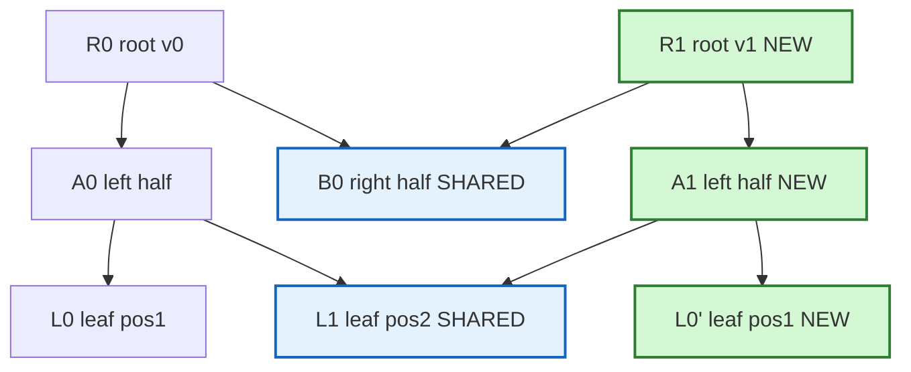

# Persistent Segment Tree (Persistent Data Structures)

A **persistent data structure** preserves every previous version of itself
whenever it is modified. Instead of overwriting nodes in place, each update
produces a **new version** while all older versions remain fully queryable.
The **persistent segment tree** is the workhorse of this idea in competitive
programming: it answers "what did the structure look like after the $i$-th
update?" and powers elegant solutions to problems like **k-th smallest in a
range**.

The magic is that a single update does **not** copy the whole tree. Because a
segment tree update only touches one root-to-leaf path, we copy just the
$O(\log n)$ nodes on that path and **share** every untouched subtree with the
previous version. So $q$ updates cost only $O((n + q)\log n)$ memory total.

## Table of Contents

- [What Is Persistence?](#what-is-persistence)
- [Path Copying: The Core Trick](#path-copying-the-core-trick)
- [Node Storage Model](#node-storage-model)
- [Building the Base Version](#building-the-base-version)
- [Persistent Point Update](#persistent-point-update)
- [Querying a Version](#querying-a-version)
- [Application: K-th Smallest in a Range](#application-k-th-smallest-in-a-range)
- [Application: Count of Values ≤ x in a Range](#application-count-of-values--x-in-a-range)
- [Mermaid: Two Versions Sharing Nodes](#mermaid-two-versions-sharing-nodes)
- [Complexity Summary](#complexity-summary)
- [Common Pitfalls](#common-pitfalls)
- [Patterns](#patterns)

## What Is Persistence?

An ordinary (ephemeral) segment tree has exactly one current state. When you
update it, the old state is gone. A **fully persistent** segment tree keeps an
array of **version roots**:

$$
\text{root}[0], \text{root}[1], \dots, \text{root}[q]
$$

where $\text{root}[i]$ is the root node id of the tree after the $i$-th update.
To query the structure "as of version $i$", you simply start the descent from
$\text{root}[i]$. Every version is immutable once created, which is exactly why
old versions stay correct: nobody ever mutates a shared node.

Two flavors exist:

- **Partial persistence** — you may query any version but only update the latest.
- **Full persistence** — you may update (branch off) from any past version too.

The path-copying persistent segment tree below is naturally **fully
persistent**: `update(prevRoot, ...)` works no matter which version `prevRoot`
points to.

## Path Copying: The Core Trick

A segment tree update from the root to a single leaf visits exactly one node per
level, so it touches $h = \lceil \log_2 n \rceil + 1$ nodes. **Path copying**
means: for each node on that path, allocate a **fresh copy**, and for the child
that is *not* on the path, keep pointing at the **old** child (sharing it).

So a new version is "mostly the old tree" plus a thin new spine:

$$
\text{new nodes per update} = O(\log n), \qquad
\text{total memory} = O\big((n + q)\log n\big)
$$

The $n$ term is the base build; the $q\log n$ term is all the updates.

```text
update(prevNode, lo, hi, pos, delta):
    cur = newNode()                  # fresh copy of this level
    if lo == hi:                     # leaf
        val[cur] = val[prevNode] + delta
        return cur
    mid = (lo + hi) / 2
    if pos <= mid:
        left[cur]  = update(left[prevNode], lo, mid, pos, delta)
        right[cur] = right[prevNode]      # SHARE the old right subtree
    else:
        left[cur]  = left[prevNode]       # SHARE the old left subtree
        right[cur] = update(right[prevNode], mid+1, hi, pos, delta)
    val[cur] = val[left[cur]] + val[right[cur]]
    return cur
```

## Node Storage Model

We avoid pointer-heavy code. Nodes live in **parallel arrays** indexed by an
integer id; children are ids, not pointers. A global counter hands out fresh
ids. Index `0` is a permanent "null/empty" node with value $0$ and children
pointing back at itself, so we never special-case nulls.

```python
class PersistentSegTree:
    def __init__(self, n, max_nodes):
        # index 0 is the null node (val 0, children -> 0)
        self.left = [0] * max_nodes
        self.right = [0] * max_nodes
        self.val = [0] * max_nodes
        self.cnt = 1          # next free node id (0 reserved as null)
        self.n = n
        self.roots = [0]      # roots[0] is the empty base version

    def _new_node(self):
        node = self.cnt
        self.cnt += 1
        return node
```

```cpp
struct PersistentSegTree {
    vector<int> left, right;
    vector<long long> val;
    int cnt;                 // next free node id (0 reserved as null)
    int n;
    vector<int> roots;       // roots[0] is the empty base version

    PersistentSegTree(int n, int maxNodes) : n(n) {
        left.assign(maxNodes, 0);
        right.assign(maxNodes, 0);
        val.assign(maxNodes, 0);
        cnt = 1;             // index 0 is the null node
        roots.push_back(0);  // empty base version
    }

    int newNode() { return cnt++; }
};
```

How big is `max_nodes`? Budget the base build plus every update:

$$
\text{maxNodes} \;\approx\; 2n + q\,(\lceil \log_2 n \rceil + 2)
$$

When in doubt, use `(n + q) * (LOG + 2) + 10`. Running out of node ids is the
single most common bug — over-allocate slightly.

## Building the Base Version

For the "k-th smallest" application the base version is the **empty** value-domain
tree (all counts $0$), and you build versions incrementally by inserting one
array element at a time. For a sum-over-positions tree (like CSES 1737) you build
a real base from the input array.

```python
    def build(self, arr, lo, hi):
        node = self._new_node()
        if lo == hi:
            self.val[node] = arr[lo]
            return node
        mid = (lo + hi) // 2
        self.left[node] = self.build(arr, lo, mid)
        self.right[node] = self.build(arr, mid + 1, hi)
        self.val[node] = self.val[self.left[node]] + self.val[self.right[node]]
        return node
```

```cpp
    int build(const vector<long long>& arr, int lo, int hi) {
        int node = newNode();
        if (lo == hi) {
            val[node] = arr[lo];
            return node;
        }
        int mid = (lo + hi) / 2;
        left[node] = build(arr, lo, mid);
        right[node] = build(arr, mid + 1, hi);
        val[node] = val[left[node]] + val[right[node]];
        return node;
    }
```

## Persistent Point Update

This is path copying in code. It returns the **new root** without altering
`prevNode`.

```python
    def update(self, prev, lo, hi, pos, delta):
        cur = self._new_node()
        if lo == hi:
            self.val[cur] = self.val[prev] + delta
            return cur
        mid = (lo + hi) // 2
        if pos <= mid:
            self.left[cur] = self.update(self.left[prev], lo, mid, pos, delta)
            self.right[cur] = self.right[prev]          # share
        else:
            self.left[cur] = self.left[prev]            # share
            self.right[cur] = self.update(self.right[prev], mid + 1, hi, pos, delta)
        self.val[cur] = self.val[self.left[cur]] + self.val[self.right[cur]]
        return cur
```

```cpp
    int update(int prev, int lo, int hi, int pos, long long delta) {
        int cur = newNode();
        if (lo == hi) {
            val[cur] = val[prev] + delta;
            return cur;
        }
        int mid = (lo + hi) / 2;
        if (pos <= mid) {
            left[cur] = update(left[prev], lo, mid, pos, delta);
            right[cur] = right[prev];                    // share
        } else {
            left[cur] = left[prev];                      // share
            right[cur] = update(right[prev], mid + 1, hi, pos, delta);
        }
        val[cur] = val[left[cur]] + val[right[cur]];
        return cur;
    }
```

## Querying a Version

Querying is identical to an ordinary segment tree — you just start from the
version root you care about.

```python
    def range_sum(self, node, lo, hi, ql, qr):
        if qr < lo or hi < ql:
            return 0
        if ql <= lo and hi <= qr:
            return self.val[node]
        mid = (lo + hi) // 2
        return (self.range_sum(self.left[node], lo, mid, ql, qr) +
                self.range_sum(self.right[node], mid + 1, hi, ql, qr))
```

```cpp
    long long rangeSum(int node, int lo, int hi, int ql, int qr) {
        if (qr < lo || hi < ql) return 0;
        if (ql <= lo && hi <= qr) return val[node];
        int mid = (lo + hi) / 2;
        return rangeSum(left[node], lo, mid, ql, qr) +
               rangeSum(right[node], mid + 1, hi, ql, qr);
    }
```

## Application: K-th Smallest in a Range

This is the canonical use. Given an array $a[1..n]$ and queries $(l, r, k)$,
report the $k$-th smallest value among $a[l..r]$.

**Idea.** Build a persistent segment tree over the **value domain** (compressed
distinct values $0 \dots m-1$). Process the array left to right. Version $i$ is
the tree after inserting $a[1], \dots, a[i]$ — i.e. a **histogram of counts** of
the first $i$ elements. Crucially, each version differs from the previous by a
single $+1$, so it costs $O(\log m)$ nodes.

Now use the **prefix-difference** property. The count of how many elements of
$a[l..r]$ fall in any value range equals

$$
\text{count}_{[l,r]}(\text{value range})
= \text{version}_r(\text{range}) - \text{version}_{l-1}(\text{range}).
$$

To find the $k$-th smallest, **descend both versions in lockstep**. At each node
the number of elements in $[l,r]$ landing in the left (smaller) value half is

$$
c_{\text{left}} = \text{cnt}\big[\text{left}(\text{root}_r)\big]
                - \text{cnt}\big[\text{left}(\text{root}_{l-1})\big].
$$

If $k \le c_{\text{left}}$ go left; otherwise subtract $c_{\text{left}}$ from
$k$ and go right. At the leaf, the value is the answer.

```python
    def kth_smallest(self, root_l_minus_1, root_r, lo, hi, k):
        if lo == hi:
            return lo                                   # compressed value index
        mid = (lo + hi) // 2
        left_count = self.val[self.left[root_r]] - self.val[self.left[root_l_minus_1]]
        if k <= left_count:
            return self.kth_smallest(self.left[root_l_minus_1],
                                     self.left[root_r], lo, mid, k)
        else:
            return self.kth_smallest(self.right[root_l_minus_1],
                                     self.right[root_r], mid + 1, hi,
                                     k - left_count)
```

```cpp
    int kthSmallest(int rootLm1, int rootR, int lo, int hi, long long k) {
        if (lo == hi) return lo;                        // compressed value index
        int mid = (lo + hi) / 2;
        long long leftCount = val[left[rootR]] - val[left[rootLm1]];
        if (k <= leftCount)
            return kthSmallest(left[rootLm1], left[rootR], lo, mid, k);
        else
            return kthSmallest(right[rootLm1], right[rootR], mid + 1, hi,
                               k - leftCount);
    }
```

Each query is one descent of depth $O(\log m)$, so $O(\log n)$ per query.

## Application: Count of Values ≤ x in a Range

Same versions as above (prefix histograms). To count how many elements of
$a[l..r]$ are $\le x$, convert $x$ to its compressed index $p$ (largest
compressed value $\le x$) and ask for the prefix count $[0, p]$ on the
difference of versions:

$$
\#\{i \in [l,r] : a_i \le x\}
= \text{version}_r([0,p]) - \text{version}_{l-1}([0,p]).
$$

```python
    def count_leq(self, root_l_minus_1, root_r, lo, hi, p):
        if p < lo:
            return 0
        if hi <= p:
            return self.val[root_r] - self.val[root_l_minus_1]
        mid = (lo + hi) // 2
        return (self.count_leq(self.left[root_l_minus_1], self.left[root_r], lo, mid, p) +
                self.count_leq(self.right[root_l_minus_1], self.right[root_r], mid + 1, hi, p))
```

```cpp
    long long countLeq(int rootLm1, int rootR, int lo, int hi, int p) {
        if (p < lo) return 0;
        if (hi <= p) return val[rootR] - val[rootLm1];
        int mid = (lo + hi) / 2;
        return countLeq(left[rootLm1], left[rootR], lo, mid, p) +
               countLeq(right[rootLm1], right[rootR], mid + 1, hi, p);
    }
```

## Mermaid: Two Versions Sharing Nodes

After updating position 1 (value `+1`) in a 4-leaf tree, only the path
root → left → leaf-1 is freshly allocated. Version 1 (`R1`) reuses the entire
right subtree and the unchanged left leaf of version 0 (`R0`).



The green nodes are the only three allocated for the new version; the blue nodes
are physically the same objects as in version 0.

## Complexity Summary

Let $n$ be the array length, $q$ the number of updates/queries, and $m$ the
number of distinct values.

| Operation | Time | New Nodes | Notes |
| --- | --- | --- | --- |
| Build base version | $O(n)$ | $O(n)$ | one full tree |
| Persistent point update | $O(\log n)$ | $O(\log n)$ | path copying |
| Query a single version | $O(\log n)$ | $0$ | read-only |
| K-th smallest in range | $O(\log m)$ | $0$ | descend two versions |
| Count $\le x$ in range | $O(\log m)$ | $0$ | version difference |
| Total memory ($q$ updates) | — | $O((n+q)\log n)$ | dominant cost |

## Common Pitfalls

- **Under-allocating node arrays.** Budget $(n+q)(\log n + 2)$ ids. Running out
  silently corrupts the tree. Over-allocate a little.
- **Mutating shared nodes.** Never write into `prev`. Always allocate `cur`
  first, then assign its children. One in-place write poisons every version that
  shares that node.
- **Forgetting the null node.** Keep index `0` as a permanent empty node with
  `val[0] = 0` and `left[0] = right[0] = 0` so descents never dereference nulls.
- **Off-by-one in version indices.** For range $[l,r]$ you subtract
  $\text{root}_{l-1}$ from $\text{root}_r$. Using 1-based positions makes
  $\text{root}_0$ the empty version and avoids negative indices.
- **Coordinate compression mistakes.** Sort + unique the values, map each
  element to its rank, and remember to map the query threshold $x$ to the
  **largest rank with value $\le x$** for count queries.
- **Recursion depth.** In Python, deep trees can exceed the recursion limit;
  raise it (`sys.setrecursionlimit`) or write iterative descents for big $n$.

## Patterns

- **Prefix versions over the value domain** → static range order statistics
  (k-th smallest/largest, count in value range, median). No updates to the array.
- **Version per array prefix** → `version_r − version_{l-1}` gives counts over
  any subarray for free.
- **Branch from any past version** → "copy" operations (e.g. CSES 1737): a copy
  is just storing another reference to an existing root; a later update on the
  copy path-copies from it, leaving the original untouched.
- **Persistent + offline** → combine with sorting queries or Mo's algorithm only
  when online persistence is not strictly required; persistence shines when
  queries must be answered **online** and reference arbitrary versions.
- **Lower-bound descent** → whenever a query asks "smallest value such that a
  monotone count reaches $k$", walk down the tree comparing $k$ to the left
  subtree count; this generalizes beyond k-th smallest to weighted selection.
