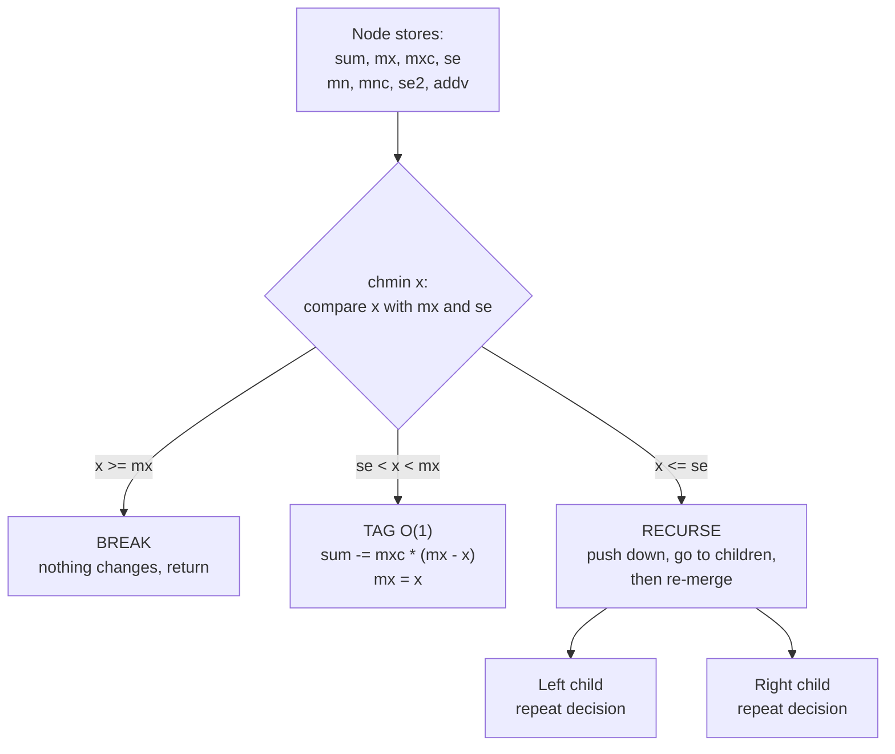
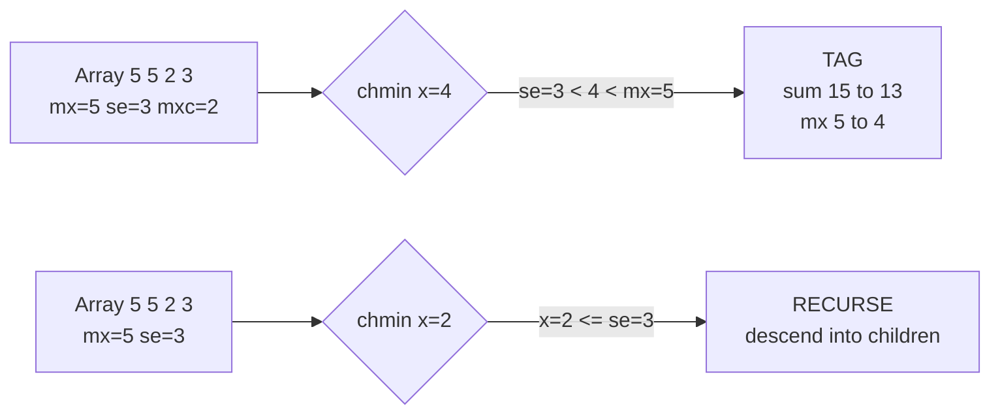

# Segment Tree Beats (Ji Driver Segment Tree)

**Segment Tree Beats** (吉司机线段树, "Ji Driver Segment Tree", named after the competitor *jiry_2*) is a technique that lets a lazy segment tree support operations that are **not distributive** over a range in the naive sense — most famously **range "chmin"** ($a_i \leftarrow \min(a_i, x)$ for all $i$ in a range) and **range "chmax"** ($a_i \leftarrow \max(a_i, x)$) — while *still* answering range **sum** and range **max/min** queries.

The classic lazy segment tree can only push a tag when its effect on a node's aggregate is computable in $O(1)$. A range `chmin(x)` breaks this: clamping every element of a segment to at most $x$ changes the sum by an amount that depends on **how many** elements exceeded $x$, which a single stored sum cannot tell us. Segment Tree Beats fixes this by storing, per node, the **maximum**, the **strict second maximum**, and the **count of the maximum**. With those three fields a `chmin(x)` either does nothing, hits *only the maxima* (a computable $O(1)$ update), or recurses. The genius is that the "recurse" case is rare enough that the **amortized** cost is $O((n+q)\log^2 n)$.

This guide builds the structure from the ground up: the stored fields, the *break / tag / recurse* decision that gives the technique its name, the potential-function argument for why it is fast, and a full implementation supporting **range chmin, range chmax, range add, and range sum** in both Python and C++.

---

## Table of Contents

1. [Why Lazy Propagation Fails for chmin](#why-lazy-propagation-fails-for-chmin)
2. [The Stored Fields](#the-stored-fields)
3. [The Break / Tag / Recurse Condition](#the-break--tag--recurse-condition)
4. [Symmetric chmax and Range Add](#symmetric-chmax-and-range-add)
5. [Amortized Complexity: The Potential Argument](#amortized-complexity-the-potential-argument)
6. [Full Implementation: chmin, chmax, add, sum](#full-implementation-chmin-chmax-add-sum)
7. [Worked Walkthrough](#worked-walkthrough)
8. [Mermaid: A Node and Its Decision](#mermaid-a-node-and-its-decision)
9. [Complexity Summary](#complexity-summary)
10. [Common Pitfalls](#common-pitfalls)
11. [Patterns](#patterns)

---

## Why Lazy Propagation Fails for chmin

In an ordinary lazy segment tree, a range operation works because the operation's effect on a node's aggregate is a closed-form function of a small tag. For "range add $v$", the sum of a node covering $k$ elements changes by exactly $k \cdot v$ — one multiplication. We can store the tag, fix the sum, and stop.

Now consider **range chmin**: $a_i \leftarrow \min(a_i, x)$ over a segment. To update the stored **sum** we must subtract $\sum (a_i - x)$ over exactly those $i$ with $a_i > x$. A node that only knows its total sum has no way to compute that — it depends on the distribution of values, not a single number. So the naive lazy approach cannot push a `chmin` tag.

The key observation of Segment Tree Beats: if we additionally track the **largest value** $\text{mx}$, the **count** $\text{cnt}$ of elements equal to that largest value, and the **strict second-largest value** $\text{se}$, then for the special case

$$\text{se} < x < \text{mx}$$

the only elements affected by `chmin(x)` are exactly the $\text{cnt}$ copies of the maximum (everything $\le \text{se}$ is already $\le x$). The new sum is $\text{sum} - \text{cnt}\cdot(\text{mx} - x)$ and the new maximum is $x$ — both $O(1)$. That is the whole trick.

---

## The Stored Fields

For the `chmin` half of the structure, each node over a segment stores:

- `sum` — sum of the segment.
- `mx` — the maximum value in the segment.
- `mxc` — how many elements equal `mx` (the count of the maximum).
- `se` — the **strict** second maximum (largest value strictly less than `mx`); use $-\infty$ if all elements are equal.

To also support `chmax`, store the symmetric trio for the minimum: `mn`, `mnc`, `se2` (strict second minimum, $+\infty$ if all equal). To support range add, store an `add` lazy tag.

The **merge** (combining a left child `L` and right child `R` into their parent) for the max-side fields:

```python
def merge_max(L, R):
    if L.mx == R.mx:
        mx, mxc = L.mx, L.mxc + R.mxc
        se = max(L.se, R.se)
    elif L.mx > R.mx:
        mx, mxc = L.mx, L.mxc
        se = max(L.se, R.mx)   # R.mx is a candidate for the second max
    else:
        mx, mxc = R.mx, R.mxc
        se = max(R.se, L.mx)
    return mx, mxc, se
```

```cpp
#include <bits/stdc++.h>
using namespace std;
const long long INF = 1e18;

struct MaxInfo { long long mx, se; long long mxc; };

MaxInfo merge_max(const MaxInfo& L, const MaxInfo& R) {
    MaxInfo res;
    if (L.mx == R.mx) {
        res.mx = L.mx; res.mxc = L.mxc + R.mxc;
        res.se = max(L.se, R.se);
    } else if (L.mx > R.mx) {
        res.mx = L.mx; res.mxc = L.mxc;
        res.se = max(L.se, R.mx);     // R.mx is a candidate for the second max
    } else {
        res.mx = R.mx; res.mxc = R.mxc;
        res.se = max(R.se, L.mx);
    }
    return res;
}
```

The crucial subtlety: when one child's max dominates, the **other child's max** becomes a candidate for the parent's second maximum. Forgetting this is the most common bug.

---

## The Break / Tag / Recurse Condition

The `chmin(x)` operation, applied to a node whose segment lies inside the query range, branches on three cases. This three-way split is the heart of "beats":

1. **Break (return):** if $x \ge \text{mx}$, the clamp changes nothing — every element is already $\le x$. Stop immediately.
2. **Tag (apply in $O(1)$):** if $\text{se} < x < \text{mx}$, only the maxima are affected. Set
   $$\text{sum} \mathrel{-}= \text{mxc}\cdot(\text{mx} - x), \qquad \text{mx} \leftarrow x.$$
   Store $x$ as a pending "chmin tag" so children inherit the clamp lazily, then stop.
3. **Recurse:** if $x \le \text{se}$, the clamp reaches below the second maximum, so a single tag is not enough. Push down, recurse into both children, and re-merge.

```python
def apply_chmin(node, x):
    # precondition: x < node.mx, so something changes
    node.sum -= node.mxc * (node.mx - x)
    node.mx = x
    # se is untouched: x is still > se by the caller's guarantee

def chmin(node, l, r, ql, qr, x):
    if qr < l or r < ql or node.mx <= x:
        return                                  # 1. Break
    if ql <= l and r <= qr and node.se < x:
        apply_chmin(node, x)                    # 2. Tag
        return
    m = (l + r) // 2                            # 3. Recurse
    push_down(node)
    chmin(node.left,  l,   m, ql, qr, x)
    chmin(node.right, m+1, r, ql, qr, x)
    pull_up(node)
```

```cpp
#include <bits/stdc++.h>
using namespace std;

void apply_chmin(Node& nd, long long x) {
    // precondition: x < nd.mx, so something changes
    nd.sum -= (__int128)nd.mxc * (nd.mx - x);
    nd.mx = x;
    // se is untouched: x is still > se by the caller's guarantee
}

void chmin(int node, int l, int r, int ql, int qr, long long x) {
    if (qr < l || r < ql || tree[node].mx <= x) return;      // 1. Break
    if (ql <= l && r <= qr && tree[node].se < x) {
        apply_chmin(tree[node], x);                          // 2. Tag
        return;
    }
    int m = (l + r) >> 1;                                    // 3. Recurse
    push_down(node);
    chmin(node << 1,     l,   m, ql, qr, x);
    chmin(node << 1 | 1, m+1, r, ql, qr, x);
    pull_up(node);
}
```

Note how the *break* and *tag* conditions are deliberately checked **even on nodes that only partially overlap the query** — once a node's max is already $\le x$ we never descend, which is exactly what keeps the cost down.

---

## Symmetric chmax and Range Add

`chmax(x)` ($a_i \leftarrow \max(a_i, x)$) is the mirror image, using `mn`, `mnc`, `se2`:

- **Break** if $x \le \text{mn}$.
- **Tag** if $\text{mn} < x < \text{se2}$: $\text{sum} \mathrel{+}= \text{mnc}\cdot(x - \text{mn})$, $\text{mn} \leftarrow x$.
- **Recurse** if $x \ge \text{se2}$.

When you maintain both halves simultaneously, applying a `chmin(x)` that lowers `mx` to `x` must also update the *min-side* fields if they happen to coincide with the maximum (e.g. when a node has only one distinct value, or when `x` drops below `mn`). The cleanest way to keep both consistent is to clamp the min-side bookkeeping too:

```python
def apply_chmin(node, x):
    if node.mx <= x:
        return
    node.sum -= node.mxc * (node.mx - x)
    if node.mn == node.mx:        # single distinct value
        node.mn = x
    if node.se2 == node.mx:       # second-min was the (former) max
        node.se2 = x
    if x < node.mn:               # clamp drove everything below old min
        node.mn = x
    node.mx = x
```

```cpp
#include <bits/stdc++.h>
using namespace std;

void apply_chmin(Node& nd, long long x) {
    if (nd.mx <= x) return;
    nd.sum -= (__int128)nd.mxc * (nd.mx - x);
    if (nd.mn == nd.mx)  nd.mn  = x;     // single distinct value
    if (nd.se2 == nd.mx) nd.se2 = x;     // second-min was the (former) max
    if (x < nd.mn)       nd.mn  = x;     // clamp drove everything below old min
    nd.mx = x;
}
```

**Range add** is the easy distributive operation, but it must update *every* stored statistic: `sum += len*v`, and each of `mx, se, mn, se2` shifts by `v` (leaving $\pm\infty$ sentinels untouched). It composes cleanly with the chmin/chmax tags because adding a constant preserves order, so the relative gaps `mx - se` and `se2 - mn` are unchanged.

---

## Amortized Complexity: The Potential Argument

A single `chmin` may recurse deep, so a worst-case-per-operation bound looks bad. The magic is **amortization**. Define a potential

$$\Phi = \sum_{\text{nodes } v} \big(\text{number of distinct values among the tags reaching } v\big),$$

a common formalization being $\Phi = \sum_v d(v)$ where $d(v)$ is the count of *distinct* maximum-classes that the subtree of $v$ contributes. Intuitively:

- Each leaf starts with $O(\log n)$ tag-classes along its root path, so initially $\Phi = O(n\log n)$.
- The **only** time `chmin` recurses past the tag case is when $x \le \text{se}$. Each such recursion **merges** value classes — it strictly *reduces* the number of distinct maxima inside that subtree, dropping $\Phi$.
- A `chmin` that does *not* recurse costs $O(\log n)$ (just the tree descent to the canonical nodes), charged directly.
- Every unit of "extra" recursion is paid for by a corresponding drop in $\Phi$.

For the **chmin-only** structure (no add, no chmax) this gives an amortized $O((n+q)\log n)$. Once you add range-add and range-chmax, the add operations can *raise* $\Phi$ again (they can split a previously-merged class), and the analysis yields the well-known

$$O\big((n+q)\log^2 n\big)$$

amortized total. The extra $\log n$ factor comes from the $O(\log n)$ nodes each add touches, any of which may pay to re-deepen the potential. In practice the constant is small and the structure handles $n, q \le 2\cdot10^5$ comfortably.

The takeaway: **never** reason about Segment Tree Beats per-operation. Its correctness is local (the three-way condition), but its speed is global (the potential cannot drop below zero, so total recursion is bounded).

---

## Full Implementation: chmin, chmax, add, sum

Below is a complete, tested-shape implementation supporting **range chmin**, **range chmax**, **range add**, and **range sum**. It uses an iterative-friendly $1$-indexed array tree but recursive operations (recursion depth $O(\log n) \le \sim 40$ for $n \le 2\cdot10^5$, safe).

```python
import sys
from sys import setrecursionlimit

class SegTreeBeats:
    INF = float('inf')

    def __init__(self, a):
        self.n = len(a)
        sz = self.n
        self.sum  = [0]*(4*sz)
        self.mx   = [0]*(4*sz)
        self.mxc  = [0]*(4*sz)
        self.se   = [-self.INF]*(4*sz)
        self.mn   = [0]*(4*sz)
        self.mnc  = [0]*(4*sz)
        self.se2  = [self.INF]*(4*sz)
        self.addv = [0]*(4*sz)
        self._build(1, 0, self.n-1, a)

    def _pull(self, p):
        l, r = 2*p, 2*p+1
        self.sum[p] = self.sum[l] + self.sum[r]
        # max side
        if self.mx[l] == self.mx[r]:
            self.mx[p], self.mxc[p] = self.mx[l], self.mxc[l] + self.mxc[r]
            self.se[p] = max(self.se[l], self.se[r])
        elif self.mx[l] > self.mx[r]:
            self.mx[p], self.mxc[p] = self.mx[l], self.mxc[l]
            self.se[p] = max(self.se[l], self.mx[r])
        else:
            self.mx[p], self.mxc[p] = self.mx[r], self.mxc[r]
            self.se[p] = max(self.se[r], self.mx[l])
        # min side
        if self.mn[l] == self.mn[r]:
            self.mn[p], self.mnc[p] = self.mn[l], self.mnc[l] + self.mnc[r]
            self.se2[p] = min(self.se2[l], self.se2[r])
        elif self.mn[l] < self.mn[r]:
            self.mn[p], self.mnc[p] = self.mn[l], self.mnc[l]
            self.se2[p] = min(self.se2[l], self.mn[r])
        else:
            self.mn[p], self.mnc[p] = self.mn[r], self.mnc[r]
            self.se2[p] = min(self.se2[r], self.mn[l])

    def _build(self, p, l, r, a):
        if l == r:
            v = a[l]
            self.sum[p] = self.mx[p] = self.mn[p] = v
            self.mxc[p] = self.mnc[p] = 1
            self.se[p] = -self.INF
            self.se2[p] = self.INF
            return
        m = (l + r) // 2
        self._build(2*p, l, m, a)
        self._build(2*p+1, m+1, r, a)
        self._pull(p)

    # ---- tag application ----
    def _apply_add(self, p, l, r, v):
        cnt = r - l + 1
        self.sum[p] += v * cnt
        self.mx[p]  += v
        self.mn[p]  += v
        if self.se[p]  != -self.INF: self.se[p]  += v
        if self.se2[p] !=  self.INF: self.se2[p] += v
        self.addv[p] += v

    def _apply_chmin(self, p, x):
        if self.mx[p] <= x:
            return
        self.sum[p] -= (self.mx[p] - x) * self.mxc[p]
        if self.mn[p]  == self.mx[p]: self.mn[p]  = x
        if self.se2[p] == self.mx[p]: self.se2[p] = x
        if x < self.mn[p]: self.mn[p] = x   # safety for tiny single-value nodes
        self.mx[p] = x

    def _apply_chmax(self, p, x):
        if self.mn[p] >= x:
            return
        self.sum[p] += (x - self.mn[p]) * self.mnc[p]
        if self.mx[p] == self.mn[p]: self.mx[p] = x
        if self.se[p] == self.mn[p]: self.se[p] = x
        if x > self.mx[p]: self.mx[p] = x
        self.mn[p] = x

    def _push(self, p, l, r):
        m = (l + r) // 2
        lc, rc = 2*p, 2*p+1
        if self.addv[p] != 0:
            self._apply_add(lc, l, m, self.addv[p])
            self._apply_add(rc, m+1, r, self.addv[p])
            self.addv[p] = 0
        # chmin: push current max-cap to children
        self._apply_chmin(lc, self.mx[p])
        self._apply_chmin(rc, self.mx[p])
        # chmax: push current min-floor to children
        self._apply_chmax(lc, self.mn[p])
        self._apply_chmax(rc, self.mn[p])

    # ---- public operations ----
    def add(self, ql, qr, v):       self._add(1, 0, self.n-1, ql, qr, v)
    def chmin(self, ql, qr, x):     self._chmin(1, 0, self.n-1, ql, qr, x)
    def chmax(self, ql, qr, x):     self._chmax(1, 0, self.n-1, ql, qr, x)
    def query_sum(self, ql, qr):    return self._qsum(1, 0, self.n-1, ql, qr)

    def _add(self, p, l, r, ql, qr, v):
        if qr < l or r < ql: return
        if ql <= l and r <= qr:
            self._apply_add(p, l, r, v); return
        m = (l + r)//2; self._push(p, l, r)
        self._add(2*p, l, m, ql, qr, v)
        self._add(2*p+1, m+1, r, ql, qr, v)
        self._pull(p)

    def _chmin(self, p, l, r, ql, qr, x):
        if qr < l or r < ql or self.mx[p] <= x: return        # break
        if ql <= l and r <= qr and self.se[p] < x:
            self._apply_chmin(p, x); return                   # tag
        m = (l + r)//2; self._push(p, l, r)                   # recurse
        self._chmin(2*p, l, m, ql, qr, x)
        self._chmin(2*p+1, m+1, r, ql, qr, x)
        self._pull(p)

    def _chmax(self, p, l, r, ql, qr, x):
        if qr < l or r < ql or self.mn[p] >= x: return        # break
        if ql <= l and r <= qr and self.se2[p] > x:
            self._apply_chmax(p, x); return                   # tag
        m = (l + r)//2; self._push(p, l, r)                   # recurse
        self._chmax(2*p, l, m, ql, qr, x)
        self._chmax(2*p+1, m+1, r, ql, qr, x)
        self._pull(p)

    def _qsum(self, p, l, r, ql, qr):
        if qr < l or r < ql: return 0
        if ql <= l and r <= qr: return self.sum[p]
        m = (l + r)//2; self._push(p, l, r)
        return self._qsum(2*p, l, m, ql, qr) + self._qsum(2*p+1, m+1, r, ql, qr)
```

```cpp
#include <bits/stdc++.h>
using namespace std;
const long long INF = 1e18;

struct SegTreeBeats {
    int n;
    vector<long long> sum, mx, se, mn, se2, addv;
    vector<long long> mxc, mnc;

    SegTreeBeats(const vector<long long>& a) {
        n = (int)a.size();
        int sz = 4 * n;
        sum.assign(sz, 0); mx.assign(sz, 0); se.assign(sz, -INF);
        mn.assign(sz, 0); se2.assign(sz, INF); addv.assign(sz, 0);
        mxc.assign(sz, 0); mnc.assign(sz, 0);
        build(1, 0, n - 1, a);
    }

    void pull(int p) {
        int l = 2*p, r = 2*p+1;
        sum[p] = sum[l] + sum[r];
        // max side
        if (mx[l] == mx[r]) { mx[p] = mx[l]; mxc[p] = mxc[l] + mxc[r]; se[p] = max(se[l], se[r]); }
        else if (mx[l] > mx[r]) { mx[p] = mx[l]; mxc[p] = mxc[l]; se[p] = max(se[l], mx[r]); }
        else { mx[p] = mx[r]; mxc[p] = mxc[r]; se[p] = max(se[r], mx[l]); }
        // min side
        if (mn[l] == mn[r]) { mn[p] = mn[l]; mnc[p] = mnc[l] + mnc[r]; se2[p] = min(se2[l], se2[r]); }
        else if (mn[l] < mn[r]) { mn[p] = mn[l]; mnc[p] = mnc[l]; se2[p] = min(se2[l], mn[r]); }
        else { mn[p] = mn[r]; mnc[p] = mnc[r]; se2[p] = min(se2[r], mn[l]); }
    }

    void build(int p, int l, int r, const vector<long long>& a) {
        if (l == r) {
            long long v = a[l];
            sum[p] = mx[p] = mn[p] = v;
            mxc[p] = mnc[p] = 1;
            se[p] = -INF; se2[p] = INF;
            return;
        }
        int m = (l + r) >> 1;
        build(2*p, l, m, a);
        build(2*p+1, m+1, r, a);
        pull(p);
    }

    void apply_add(int p, int l, int r, long long v) {
        long long cnt = r - l + 1;
        sum[p] += v * cnt;
        mx[p] += v; mn[p] += v;
        if (se[p]  != -INF) se[p]  += v;
        if (se2[p] !=  INF) se2[p] += v;
        addv[p] += v;
    }

    void apply_chmin(int p, long long x) {
        if (mx[p] <= x) return;
        sum[p] -= (__int128)(mx[p] - x) * mxc[p];
        if (mn[p]  == mx[p]) mn[p]  = x;
        if (se2[p] == mx[p]) se2[p] = x;
        if (x < mn[p]) mn[p] = x;          // safety for tiny single-value nodes
        mx[p] = x;
    }

    void apply_chmax(int p, long long x) {
        if (mn[p] >= x) return;
        sum[p] += (__int128)(x - mn[p]) * mnc[p];
        if (mx[p] == mn[p]) mx[p] = x;
        if (se[p] == mn[p]) se[p] = x;
        if (x > mx[p]) mx[p] = x;
        mn[p] = x;
    }

    void push(int p, int l, int r) {
        int m = (l + r) >> 1, lc = 2*p, rc = 2*p+1;
        if (addv[p] != 0) {
            apply_add(lc, l, m, addv[p]);
            apply_add(rc, m+1, r, addv[p]);
            addv[p] = 0;
        }
        apply_chmin(lc, mx[p]); apply_chmin(rc, mx[p]);
        apply_chmax(lc, mn[p]); apply_chmax(rc, mn[p]);
    }

    void rangeAdd(int p, int l, int r, int ql, int qr, long long v) {
        if (qr < l || r < ql) return;
        if (ql <= l && r <= qr) { apply_add(p, l, r, v); return; }
        int m = (l + r) >> 1; push(p, l, r);
        rangeAdd(2*p, l, m, ql, qr, v);
        rangeAdd(2*p+1, m+1, r, ql, qr, v);
        pull(p);
    }

    void rangeChmin(int p, int l, int r, int ql, int qr, long long x) {
        if (qr < l || r < ql || mx[p] <= x) return;            // break
        if (ql <= l && r <= qr && se[p] < x) { apply_chmin(p, x); return; } // tag
        int m = (l + r) >> 1; push(p, l, r);                   // recurse
        rangeChmin(2*p, l, m, ql, qr, x);
        rangeChmin(2*p+1, m+1, r, ql, qr, x);
        pull(p);
    }

    void rangeChmax(int p, int l, int r, int ql, int qr, long long x) {
        if (qr < l || r < ql || mn[p] >= x) return;            // break
        if (ql <= l && r <= qr && se2[p] > x) { apply_chmax(p, x); return; } // tag
        int m = (l + r) >> 1; push(p, l, r);                   // recurse
        rangeChmax(2*p, l, m, ql, qr, x);
        rangeChmax(2*p+1, m+1, r, ql, qr, x);
        pull(p);
    }

    long long querySum(int p, int l, int r, int ql, int qr) {
        if (qr < l || r < ql) return 0;
        if (ql <= l && r <= qr) return sum[p];
        int m = (l + r) >> 1; push(p, l, r);
        return querySum(2*p, l, m, ql, qr) + querySum(2*p+1, m+1, r, ql, qr);
    }
};
```

---

## Worked Walkthrough

Take the array $a = [5, 5, 2, 3]$ over indices $0..3$ and apply `chmin(0, 3, 4)` (clamp the whole array to at most $4$).

Root node fields before the operation:

- `sum = 15`, `mx = 5`, `mxc = 2` (two fives), `se = 3`, `mn = 2`.

Evaluate the three-way condition at the root with $x = 4$:

1. **Break?** $\text{mx}=5 \le 4$? No.
2. **Tag?** $\text{se} = 3 < 4 < 5 = \text{mx}$? **Yes.**

So we apply the tag in $O(1)$ — *without ever touching the index-2 or index-3 leaves*:

$$\text{sum} \leftarrow 15 - \text{mxc}\cdot(\text{mx}-x) = 15 - 2\cdot(5-4) = 13, \qquad \text{mx} \leftarrow 4.$$

The array is now logically $[4, 4, 2, 3]$ with `sum = 13`, and the whole operation cost a single root visit. Contrast `chmin(0, 3, 2)`: here $x=2 \le \text{se}=3$, so the **Tag** test fails and we must **recurse**, descending until the clamp resolves per-leaf. That recursion is the expensive case the potential argument bounds.

---

## Mermaid: A Node and Its Decision





---

## Complexity Summary

| Operation | Per-op (worst, single) | Amortized total over $q$ ops |
|-----------|------------------------|------------------------------|
| Build | — | $O(n)$ |
| Range sum query | $O(\log n)$ | $O(q\log n)$ |
| Range add | $O(\log n)$ | contributes to $O((n+q)\log^2 n)$ |
| Range chmin only | up to $O(\log^2 n)$ | $O((n+q)\log n)$ |
| Range chmin + chmax + add | — | $O((n+q)\log^2 n)$ |
| Space | — | $O(n)$ |

For $n, q \le 2\cdot10^5$ the structure runs in well under a second in C++; Python needs fast I/O and ideally a non-recursive flavor for the tightest limits.

---

## Common Pitfalls

- **Second-max merge bug.** When one child's max dominates, the *other child's max* is a candidate for the parent's `se`. Writing `se = max(L.se, R.se)` unconditionally is wrong — it must be `max(L.se, R.mx)` (or symmetric).
- **Using non-strict second max.** `se` must be the **strictly** smaller value than `mx`. If `se == mx`, the tag condition $\text{se} < x < \text{mx}$ can never trigger and you lose the amortization (or worse, mis-update the count).
- **Overflow.** With $n \le 2\cdot10^5$ and values up to $10^9$, `sum` can reach $2\cdot10^{14}$ — fits in `long long`, but the *intermediate* product `mxc * (mx - x)` plus repeated adds can be larger; use `__int128` for the subtraction where values are extreme.
- **Forgetting to update min-side fields in `apply_chmin`.** When you maintain both halves, a chmin that lowers `mx` may need to fix `mn`, `se2` if they coincided with the old max.
- **Pushing chmin/chmax in the wrong order vs. add.** Always push the pending **add** first, then the chmin/chmax caps, because the caps stored are post-add values.
- **Reasoning per-operation.** A single chmin can be $O(\log^2 n)$; only the *amortized* bound is good. Don't panic if one operation looks expensive.

---

## Patterns

- **Range chmin/chmax + range sum/max** — the canonical beats use case (HDU 5306 "Gorgeous Sequence").
- **Range mod ($a_i \mathbin{\%}= x$)** — apply mod only where `mx >= x`; each successful mod at least halves a value, giving a beats-style $O(n\log A)$ amortization (Codeforces 438D).
- **Range "set to value" via chmin+chmax** — assigning a constant $c$ to a range equals `chmin(c)` then `chmax(c)`.
- **Historic max / min tracking** — extend the tags to also record the maximum value a position ever held; common in harder beats problems.
- **Combine with add for "add then clamp"** — interval scheduling and simulation problems where capacities saturate.
- **Potential-bounded amortization** — the same "merge classes to pay for recursion" idea reappears in DSU-on-tree and small-to-large merging.
