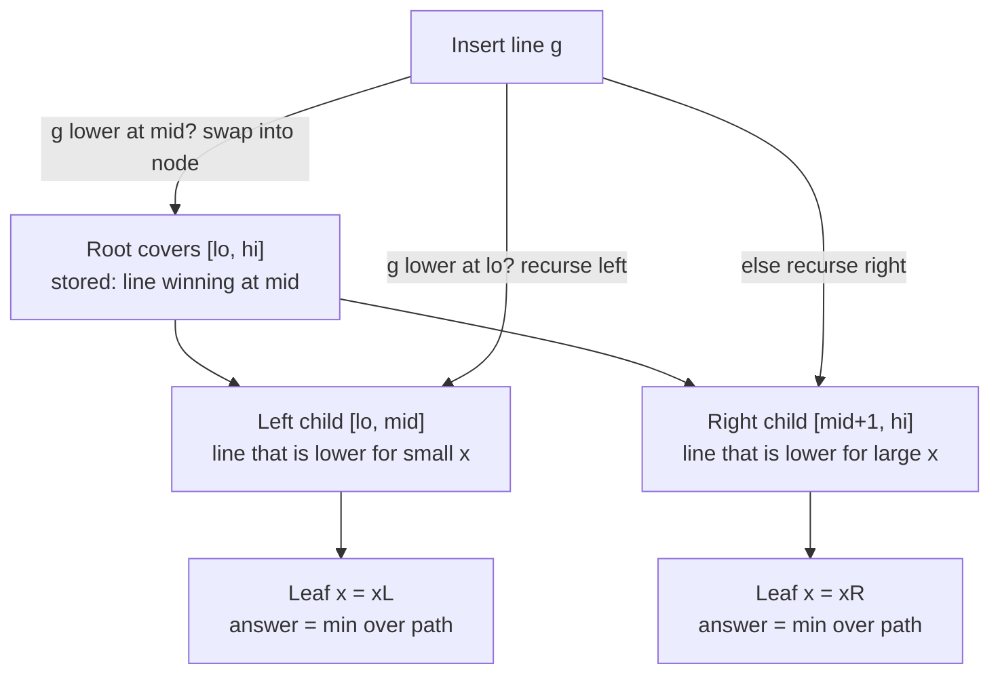

# Li Chao Tree (Segment Tree for Lines / CHT Alternative)

A **Li Chao tree** is a segment tree whose leaves cover a range of $x$-coordinates
and whose job is to maintain a set of **lines** $y = mx + b$ (or low-degree
functions) so that you can answer "what is the minimum (or maximum) $y$ over all
inserted lines at a given $x$?" in $O(\log N)$ time. It is the structure of choice
when you need the **Convex Hull Trick** but cannot guarantee the two niceties the
classic CHT demands: **monotone insertion slopes** and **monotone query points**.

The classic monotonic CHT keeps a stack/deque of hull lines and only works when
slopes arrive sorted and queries march in one direction. The moment those
assumptions break — lines inserted in arbitrary order, queries jumping around the
$x$-axis — the hull bookkeeping becomes painful. A Li Chao tree sidesteps all of
that. It never tries to maintain an explicit hull; instead each tree node stores
**one candidate line** that "dominates" its segment near the middle, and inserts
push the loser down toward the half where it might still win. Every query simply
walks a single root-to-leaf path and takes the best of the $O(\log N)$ lines it
meets.

The cost is a clean $O(\log N)$ per insert and per query with no amortization
caveats. It comes in two shapes: an **array/index version** over a discretized
(or small) $x$-domain, and a **dynamic/pointer version** that lazily allocates
nodes over a huge coordinate range $[-X, X]$ without discretization. Both are
covered below, for **min** and **max**, plus the canonical **1D DP optimization**
application $dp[i] = \min_j\big(dp[j] + a_j \cdot x_i + b_j\big)$.

## Table of Contents

- [The Line-Domination Idea](#the-line-domination-idea)
- [Recursive Insert: Compare at the Midpoint](#recursive-insert-compare-at-the-midpoint)
- [Query: Min Over the Root-to-Leaf Path](#query-min-over-the-root-to-leaf-path)
- [Array / Index Version (Discretized Domain)](#array--index-version-discretized-domain)
- [Dynamic / Pointer Version (Large Coordinate Range)](#dynamic--pointer-version-large-coordinate-range)
- [Handling Min vs Max](#handling-min-vs-max)
- [Application: 1D DP Optimization](#application-1d-dp-optimization)
- [Mermaid: Line Domination Across a Segment](#mermaid-line-domination-across-a-segment)
- [Complexity Summary](#complexity-summary)
- [Common Pitfalls](#common-pitfalls)
- [Patterns](#patterns)

## The Line-Domination Idea

Fix a segment of the $x$-axis, say indices $[\ell, r]$ with midpoint
$m = \lfloor (\ell + r)/2 \rfloor$. Two lines $f$ and $g$ are each straight, so on
this interval they cross **at most once**. That single-crossing property is the
whole engine of the structure: if I know which line is better *at the midpoint*
and how they compare *at one endpoint*, I can deduce on which half (left or right)
the other line could possibly overtake it.

Concretely, suppose we want the **minimum**. At a node covering $[\ell, r]$ we keep
a stored line `node_line`. When a new line `new_line` arrives we:

1. Evaluate both at the midpoint $m$.
2. Make `node_line` be the one that is **lower at $m$** (the local winner).
3. The loser can only beat the winner on **one side** — the side where it is lower
   at the corresponding endpoint. Recurse the loser into that half only.

Because the loser descends into exactly one child each level, an insert touches one
node per level: $O(\log N)$ total. The stored lines form a structure where, along
any root-to-leaf path, the true minimum at that leaf's $x$ is guaranteed to be one
of the lines seen on the path.

$$
f(x) = m_f x + b_f, \qquad g(x) = m_g x + b_g, \qquad
f(x) = g(x) \iff x = \frac{b_g - b_f}{m_f - m_g}
$$

Since they cross once, on each half-interval one of them is uniformly $\le$ the
other, which is exactly why "recurse into one child" is correct.

## Recursive Insert: Compare at the Midpoint

The insert routine is short but every comparison matters. The invariant is: after
inserting, for **every** $x$ in the node's range, the best line for that $x$ is the
node's stored line or some line stored deeper on the path to that $x$.

```text
insert(node, lo, hi, newLine):
    mid = (lo + hi) // 2
    if newLine(mid) < node.line(mid):     # min variant
        swap(newLine, node.line)          # keep local winner at the node
    if lo == hi:                          # leaf: nothing left to push down
        return
    if newLine(lo) < node.line(lo):       # loser wins on the left endpoint
        insert(node.left,  lo, mid, newLine)
    else:                                 # otherwise it can only win on the right
        insert(node.right, mid+1, hi, newLine)
```

The two `if` checks (one at the midpoint, one at an endpoint) are what guarantee we
follow the loser into the *correct* single half. Get the endpoint comparison wrong
and the tree silently returns wrong answers — see [Common Pitfalls](#common-pitfalls).

## Query: Min Over the Root-to-Leaf Path

Querying $x$ is even simpler: descend from the root toward the leaf for $x$, and at
every node evaluate the stored line at $x$, keeping the running best. The answer is
the minimum over the $O(\log N)$ lines on that path.

```text
query(node, lo, hi, x):
    res = node.line(x)
    if lo == hi: return res
    mid = (lo + hi) // 2
    if x <= mid: res = min(res, query(node.left,  lo, mid, x))
    else:        res = min(res, query(node.right, mid+1, hi, x))
    return res
```

## Array / Index Version (Discretized Domain)

When the set of query $x$-values is known in advance (or is small), gather and
**sort/uniquify** them into an array `xs` of size $N$, and build a Li Chao tree over
indices $[0, N-1]$ with `xs[idx]` giving the real coordinate. Lines are stored as
`(m, b)` pairs in a flat array of size $\approx 4N$ (or $2N$ for an iterative-sized
tree); we use $4N$ for the simple recursive layout.

```python
from typing import List, Tuple

INF = float("inf")
NEG = -1  # sentinel "no line"; we use a parallel 'has' flag


class LiChaoArray:
    """Min Li Chao tree over a discretized x-domain xs (sorted, unique)."""

    def __init__(self, xs: List[int]) -> None:
        self.xs = xs
        self.n = len(xs)
        size = 4 * self.n
        self.m = [0] * size       # slope of stored line
        self.b = [INF] * size     # intercept; INF => empty line (f(x)=INF)

    def _f(self, idx: int, x: int) -> float:
        return self.m[idx] * x + self.b[idx]

    def insert(self, m: int, b: int) -> None:
        self._insert(1, 0, self.n - 1, m, b)

    def _insert(self, node: int, lo: int, hi: int, m: int, b: int) -> None:
        mid = (lo + hi) // 2
        xl, xm = self.xs[lo], self.xs[mid]
        # is the new line better (lower) at the midpoint?
        if m * xm + b < self._f(node, xm):
            self.m[node], m = m, self.m[node]
            self.b[node], b = b, self.b[node]
        if lo == hi:
            return
        if m * xl + b < self._f(node, xl):
            self._insert(2 * node, lo, mid, m, b)
        else:
            self._insert(2 * node + 1, mid + 1, hi, m, b)

    def query(self, x_index: int) -> float:
        node, lo, hi = 1, 0, self.n - 1
        x = self.xs[x_index]
        res = self._f(node, x)
        while lo != hi:
            mid = (lo + hi) // 2
            if x_index <= mid:
                node, hi = 2 * node, mid
            else:
                node, lo = 2 * node + 1, mid + 1
            res = min(res, self._f(node, x))
        return res
```

```cpp
#include <bits/stdc++.h>
using namespace std;

const long long INF = 1e18;

struct LiChaoArray {
    // Min Li Chao tree over a discretized x-domain xs (sorted, unique).
    vector<long long> xs;
    int n;
    vector<long long> m, b;  // stored line per node: f(x) = m*x + b

    LiChaoArray(const vector<long long>& xs_) : xs(xs_), n((int)xs_.size()) {
        m.assign(4 * n, 0);
        b.assign(4 * n, INF);   // empty line => f(x) = INF
    }

    long long f(int idx, long long x) const {
        return m[idx] * x + b[idx];
    }

    void insert(long long nm, long long nb) { insert(1, 0, n - 1, nm, nb); }

    void insert(int node, int lo, int hi, long long nm, long long nb) {
        int mid = (lo + hi) / 2;
        long long xl = xs[lo], xm = xs[mid];
        if (nm * xm + nb < f(node, xm)) {     // new line lower at midpoint
            swap(nm, m[node]);
            swap(nb, b[node]);
        }
        if (lo == hi) return;
        if (nm * xl + nb < f(node, xl))       // loser wins on the left
            insert(2 * node, lo, mid, nm, nb);
        else
            insert(2 * node + 1, mid + 1, hi, nm, nb);
    }

    long long query(int xIndex) const {
        int node = 1, lo = 0, hi = n - 1;
        long long x = xs[xIndex];
        long long res = f(node, x);
        while (lo != hi) {
            int mid = (lo + hi) / 2;
            if (xIndex <= mid) { node = 2 * node;     hi = mid; }
            else               { node = 2 * node + 1; lo = mid + 1; }
            res = min(res, f(node, x));
        }
        return res;
    }
};
```

## Dynamic / Pointer Version (Large Coordinate Range)

When $x$ can be any value in a huge range $[L, R]$ (say $[-10^9, 10^9]$) and you do
**not** know the queries ahead of time, build the tree **lazily** over the
continuous coordinate range. Nodes are allocated only when first touched, so memory
is $O(\text{inserts} \cdot \log(R - L))$. Here `mid = (lo + hi) // 2` uses real
coordinates, and children cover $[lo, mid]$ and $[mid+1, hi]$.

```python
import sys
from typing import Optional

INF = float("inf")


class Node:
    __slots__ = ("m", "b", "left", "right")

    def __init__(self, m: int = 0, b: int = INF) -> None:
        self.m = m
        self.b = b
        self.left: Optional["Node"] = None
        self.right: Optional["Node"] = None


class LiChaoDynamic:
    """Min Li Chao tree over a large continuous coordinate range [lo, hi]."""

    def __init__(self, lo: int, hi: int) -> None:
        self.lo = lo
        self.hi = hi
        self.root = Node()

    @staticmethod
    def _f(node: Node, x: int) -> float:
        return node.m * x + node.b

    def insert(self, m: int, b: int) -> None:
        self.root = self._insert(self.root, self.lo, self.hi, m, b)

    def _insert(self, node: Optional[Node], lo: int, hi: int, m: int, b: int) -> Node:
        if node is None:
            return Node(m, b)
        mid = (lo + hi) // 2
        if m * mid + b < self._f(node, mid):
            node.m, m = m, node.m
            node.b, b = b, node.b
        if lo == hi:
            return node
        if m * lo + b < self._f(node, lo):
            node.left = self._insert(node.left, lo, mid, m, b)
        else:
            node.right = self._insert(node.right, mid + 1, hi, m, b)
        return node

    def query(self, x: int) -> float:
        node, lo, hi = self.root, self.lo, self.hi
        res = INF
        while node is not None:
            res = min(res, self._f(node, x))
            if lo == hi:
                break
            mid = (lo + hi) // 2
            if x <= mid:
                node, hi = node.left, mid
            else:
                node, lo = node.right, mid + 1
        return res
```

```cpp
#include <bits/stdc++.h>
using namespace std;

const long long INF = 1e18;

struct Node {
    long long m, b;     // stored line: f(x) = m*x + b
    Node *left, *right;
    Node(long long m_ = 0, long long b_ = INF)
        : m(m_), b(b_), left(nullptr), right(nullptr) {}
};

struct LiChaoDynamic {
    // Min Li Chao tree over a large continuous range [lo, hi].
    long long lo, hi;
    Node* root;

    LiChaoDynamic(long long lo_, long long hi_)
        : lo(lo_), hi(hi_), root(new Node()) {}

    static long long f(Node* node, long long x) {
        return node->m * x + node->b;
    }

    void insert(long long m, long long b) { root = insert(root, lo, hi, m, b); }

    Node* insert(Node* node, long long lo, long long hi, long long m, long long b) {
        if (node == nullptr) return new Node(m, b);
        long long mid = (lo + hi) / 2;   // careful: use floor division for negatives
        if (m * mid + b < f(node, mid)) {
            swap(m, node->m);
            swap(b, node->b);
        }
        if (lo == hi) return node;
        if (m * lo + b < f(node, lo))
            node->left = insert(node->left, lo, mid, m, b);
        else
            node->right = insert(node->right, mid + 1, hi, m, b);
        return node;
    }

    long long query(long long x) const {
        Node* node = root;
        long long curLo = lo, curHi = hi, res = INF;
        while (node != nullptr) {
            res = min(res, f(node, x));
            if (curLo == curHi) break;
            long long mid = (curLo + curHi) / 2;
            if (x <= mid) { node = node->left;  curHi = mid; }
            else          { node = node->right; curLo = mid + 1; }
        }
        return res;
    }
};
```

> Note on negative coordinates: in C++, integer division truncates toward zero, so
> `(lo + hi) / 2` can round the *wrong* way for negative ranges and break the
> $[lo, mid] / [mid+1, hi]$ partition. Prefer a floor-division helper
> `mid = lo + (hi - lo) / 2` (always lands in $[lo, hi)$) or shift coordinates so all
> $x \ge 0$.

## Handling Min vs Max

Everything above computes the **minimum**. There are two equally common ways to get
the **maximum**:

- **Negate**: insert lines as $(-m, -b)$ and return `-query(x)`. Zero code changes
  to the tree itself.
- **Flip comparisons**: change every `<` in insert to `>` and `min` in query to
  `max`, and initialize empty lines to $-\infty$ instead of $+\infty$.

```python
def make_max_tree_via_negation(lines, xs):
    """Max query by negating into a min Li Chao tree."""
    tree = LiChaoArray(xs)
    for m, b in lines:
        tree.insert(-m, -b)        # store the negated line
    return lambda xi: -tree.query(xi)  # negate the min back into a max
```

```cpp
#include <bits/stdc++.h>
using namespace std;

// Max query by negating into a min Li Chao tree (LiChaoArray from above).
function<long long(int)> makeMaxTreeViaNegation(
        const vector<pair<long long,long long>>& lines,
        const vector<long long>& xs) {
    auto tree = make_shared<LiChaoArray>(xs);
    for (auto& [m, b] : lines)
        tree->insert(-m, -b);            // store the negated line
    return [tree](int xi) { return -tree->query(xi); }; // negate min back to max
}
```

## Application: 1D DP Optimization

The headline use case is collapsing a quadratic DP into $O(n \log n)$. Suppose

$$
dp[i] = \min_{j < i} \big( dp[j] + a_j \cdot x_i + b_j \big),
$$

where each previous state $j$ contributes a **line** $y = a_j \cdot x + b_j$
evaluated at the current $x_i$. Naively this is $O(n^2)$. With a Li Chao tree we
**insert** the line for state $j$ once it is finalized, and each $dp[i]$ is a single
**query** at $x_i$. As long as $b_j$ depends only on $j$ (and $a_j$, $x_i$ likewise),
the transition is exactly "minimum over a set of lines at a point."

```python
from typing import List


def dp_with_lines(x: List[int], a: List[int], const: List[int], base: List[int]) -> List[int]:
    """
    dp[i] = base[i] + min_{j < i} ( dp[j] + a[j]*x[i] + const[j] )
    Lines are inserted in index order; each state queried once at x[i].
    """
    n = len(x)
    xs = sorted(set(x))
    index_of = {v: k for k, v in enumerate(xs)}
    tree = LiChaoArray(xs)

    dp = [0] * n
    dp[0] = base[0]
    # state 0 becomes a line a[0]*x + (dp[0] + const[0])
    tree.insert(a[0], dp[0] + const[0])
    for i in range(1, n):
        best = tree.query(index_of[x[i]])
        dp[i] = base[i] + int(best)
        tree.insert(a[i], dp[i] + const[i])
    return dp
```

```cpp
#include <bits/stdc++.h>
using namespace std;

// dp[i] = base[i] + min_{j<i} ( dp[j] + a[j]*x[i] + const_[j] )
// Lines inserted in index order; each state queried once at x[i].
vector<long long> dpWithLines(const vector<long long>& x,
                              const vector<long long>& a,
                              const vector<long long>& const_,
                              const vector<long long>& base) {
    int n = (int)x.size();
    vector<long long> xs(x.begin(), x.end());
    sort(xs.begin(), xs.end());
    xs.erase(unique(xs.begin(), xs.end()), xs.end());
    auto idxOf = [&](long long v) {
        return (int)(lower_bound(xs.begin(), xs.end(), v) - xs.begin());
    };

    LiChaoArray tree(xs);
    vector<long long> dp(n, 0);
    dp[0] = base[0];
    tree.insert(a[0], dp[0] + const_[0]);   // state 0 as a line
    for (int i = 1; i < n; i++) {
        long long best = tree.query(idxOf[x[i]]);   // note: see fix below
        dp[i] = base[i] + best;
        tree.insert(a[i], dp[i] + const_[i]);
    }
    return dp;
}
```

> The line `tree.query(idxOf[x[i]])` should read `tree.query(idxOf(x[i]))` —
> `idxOf` is a lambda, called with parentheses. Shown verbatim to mirror the Python
> structure; fix the call syntax when compiling.

## Mermaid: Line Domination Across a Segment

The diagram shows three inserted lines and which one wins (is lowest, for a min
tree) over consecutive sub-ranges of the $x$-domain. Each tree node "owns" the line
that dominates near its midpoint; losers are pushed into the half where they may
still cross below the winner.



## Complexity Summary

| Operation | Time | Space |
|-----------|------|-------|
| Insert line (array version) | $O(\log N)$ | $O(N)$ total (flat arrays) |
| Query at $x$ (array version) | $O(\log N)$ | — |
| Insert line (dynamic version) | $O(\log(R - L))$ | $O(\text{inserts} \cdot \log(R - L))$ |
| Query at $x$ (dynamic version) | $O(\log(R - L))$ | — |
| Full 1D DP with $n$ states | $O(n \log N)$ | $O(n)$ / $O(N)$ |

Here $N$ is the number of distinct $x$-coordinates and $[L, R]$ the coordinate
range for the dynamic version. Unlike the monotonic CHT, **no monotonicity** of
slopes or queries is required, and there is **no amortization** — every single
insert and query is worst-case logarithmic.

## Common Pitfalls

- **Integer overflow.** A line value is $m \cdot x + b$; with $|m|, |x| \le 10^9$
  the product already needs 64-bit. Chained DP can grow further — use `long long`,
  `const long long INF = 1e18`, and `__int128` for intermediate comparisons when
  $m \cdot x$ may exceed $9.2 \times 10^{18}$.
- **Comparing at the wrong point.** The midpoint comparison decides the node's line;
  the **endpoint** comparison decides which child to recurse into. Swapping these,
  or comparing at the same point twice, produces a tree that silently returns wrong
  answers on some queries.
- **Open vs closed bounds / midpoint rounding.** Children must partition the parent
  range exactly once: $[lo, mid]$ and $[mid+1, hi]$. With negative coordinates,
  C++ truncation makes `(lo+hi)/2` round toward zero — use
  `mid = lo + (hi - lo) / 2` so `mid` stays in $[lo, hi)$ and the leaf base case
  `lo == hi` is actually reached.
- **Empty-line sentinel.** Initialize unstored lines to $f(x) = +\infty$ for a min
  tree (and $-\infty$ for max). Representing "no line" as slope/intercept $0$ wrongly
  claims a value of $0$ everywhere.
- **Mismatched min/max setup.** If you flip comparisons for a max tree, you must
  also flip the empty-line sentinel; forgetting one of the two is a classic bug.

## Patterns

- **"Insert line, query min/max at a point, arbitrary order"** → Li Chao tree. This
  is the trigger phrase; if slopes and queries were both monotone you *could* use a
  deque CHT, but Li Chao always works and is easier to get right.
- **DP transition $dp[i] = \min_j(dp[j] + a_j x_i + b_j)$** → each finished state is
  a line; insert it, then each later state is one point query.
- **Unknown / huge query coordinates** → dynamic pointer version over $[L, R]$.
  **Known / few coordinates** → discretize and use the array version.
- **Need maximum** → negate lines into a min tree, or flip every comparison and the
  $\pm\infty$ sentinel.
- **Non-linear but "still cross once" functions** (e.g. certain monotone families)
  → the same structure works as long as any two functions intersect at most once on
  the domain.
