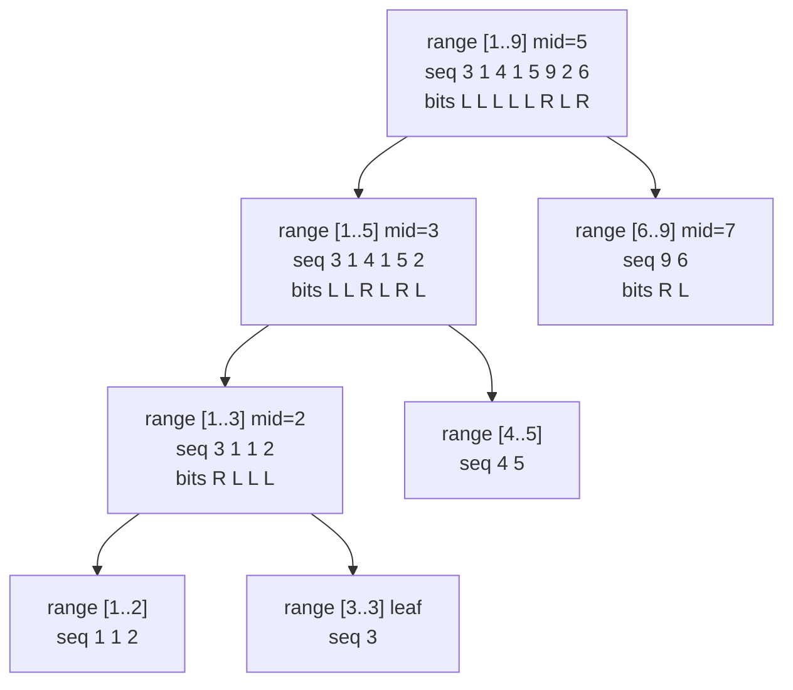

# Wavelet Tree (Advanced Data Structures)

A **wavelet tree** is a static data structure that encodes a sequence over an
alphabet (here, a value range $[\sigma_{lo}, \sigma_{hi}]$) so that it can answer
a rich family of **range + value** questions in $O(\log \sigma)$ time, where
$\sigma$ is the size of the value range. It is the data-structure of choice when
you need things like "the **k-th smallest** value in $a[l..r]$", "how many values
in $a[l..r]$ are **$\le x$**", or "how many values in $a[l..r]$ fall inside the
interval $[lo, hi]$" — all **offline or online**, all without modifying the array.

The core idea is a **recursive partition of the value range**, not of the index
range. At the root we split the alphabet into a low half and a high half. Every
element of the array is classified: does its value fall in the low half or the
high half? We record this as a bit, and — crucially — we keep a **prefix-count
array** telling us, for each prefix of the current node's subsequence, how many
elements went **left** (into the low half). Then we **stably partition** the
elements: everything that went left forms the child sequence on the left, and
everything that went right forms the child sequence on the right. We recurse on
each half until the value range is a single value.

Those prefix counts are everything. They let us **map an index** at one node to
the corresponding index in its left or right child (`mapLeft` / `mapRight`).
Walking down the tree while remapping the query endpoints $[l, r]$ is how all
operations work: each level we decide whether to descend left or right (or both),
shrinking the value range by half, so any query terminates in $O(\log \sigma)$
steps.

## Table of Contents

- [The Recursive Value-Range Partition](#the-recursive-value-range-partition)
- [Construction by Stable Partitioning](#construction-by-stable-partitioning)
- [mapLeft / mapRight Navigation](#mapleft--mapright-navigation)
- [Operation: kth(l, r, k)](#operation-kthl-r-k)
- [Operation: lessOrEqual(l, r, x)](#operation-lessorequall-r-x)
- [Operation: rangeCount(l, r, lo, hi)](#operation-rangecountl-r-lo-hi)
- [Full Implementation](#full-implementation)
- [Mermaid](#mermaid)
- [Complexity Summary](#complexity-summary)
- [Common Pitfalls](#common-pitfalls)
- [Patterns](#patterns)

## The Recursive Value-Range Partition

Fix a value range $[\,v_{lo}, v_{hi}\,]$ at a node (the root uses the full range,
typically the compressed ranks $[0, \sigma-1]$). Let

$$
\text{mid} = \left\lfloor \frac{v_{lo} + v_{hi}}{2} \right\rfloor .
$$

An element with value $v$ goes **left** if $v \le \text{mid}$ (low half) and
**right** otherwise (high half). The node stores, for its subsequence
$s_0, s_1, \dots, s_{t-1}$, a **prefix-count** array

$$
\text{cnt}[i] = \#\{\, j < i : s_j \le \text{mid} \,\},
\qquad i = 0, 1, \dots, t,
$$

so $\text{cnt}[i]$ is "how many of the first $i$ elements went left". This single
array is the engine behind both navigation and counting.

## Construction by Stable Partitioning

To build a node we (1) compute its prefix-count array, then (2) **stably
partition** the subsequence into the left-child subsequence (all low-half
elements, in original order) and the right-child subsequence (all high-half
elements, in original order), and recurse.

```python
class WaveletTree:
    def __init__(self, arr, lo, hi):
        # values in arr are integers within [lo, hi]
        self.lo = lo
        self.hi = hi
        self.left = None
        self.right = None
        self.cnt = [0]                  # prefix counts; cnt[i] = #(go left) in first i
        if lo == hi or not arr:
            # leaf (single value) or empty: still keep prefix length
            for _ in arr:
                self.cnt.append(self.cnt[-1])
            return
        mid = (lo + hi) // 2
        left_seq, right_seq = [], []
        for v in arr:
            goes_left = 1 if v <= mid else 0
            self.cnt.append(self.cnt[-1] + goes_left)
            if goes_left:
                left_seq.append(v)
            else:
                right_seq.append(v)
        self.left = WaveletTree(left_seq, lo, mid)
        self.right = WaveletTree(right_seq, mid + 1, hi)
```

```cpp
#include <bits/stdc++.h>
using namespace std;

struct WaveletTree {
    int lo, hi;
    WaveletTree *left = nullptr, *right = nullptr;
    vector<int> cnt;                    // prefix counts; cnt[i] = #(go left) in first i

    WaveletTree(vector<int> arr, int lo, int hi) : lo(lo), hi(hi) {
        cnt.push_back(0);
        if (lo == hi || arr.empty()) {  // leaf (single value) or empty
            for (size_t i = 0; i < arr.size(); i++) cnt.push_back(cnt.back());
            return;
        }
        int mid = (lo + hi) / 2;
        vector<int> leftSeq, rightSeq;
        for (int v : arr) {
            int goesLeft = (v <= mid) ? 1 : 0;
            cnt.push_back(cnt.back() + goesLeft);
            if (goesLeft) leftSeq.push_back(v);
            else rightSeq.push_back(v);
        }
        left = new WaveletTree(move(leftSeq), lo, mid);
        right = new WaveletTree(move(rightSeq), mid + 1, hi);
    }
};
```

The construction visits each element once per level, so building over $n$
elements and an alphabet of size $\sigma$ costs $O(n \log \sigma)$ time and the
same memory.

## mapLeft / mapRight Navigation

Given an index $i$ into a node's subsequence (a **prefix boundary**, $0 \le i \le
t$), the prefix-count array tells us where that boundary lands in each child:

- **mapLeft**$(i) = \text{cnt}[i]$ — the number of elements among the first $i$
  that went left is exactly the position of the corresponding boundary in the
  left child.
- **mapRight**$(i) = i - \text{cnt}[i]$ — the rest went right, so the boundary in
  the right child is $i$ minus those that went left.

```python
    def map_left(self, i):
        # position in the left child for prefix boundary i
        return self.cnt[i]

    def map_right(self, i):
        # position in the right child for prefix boundary i
        return i - self.cnt[i]
```

```cpp
    int mapLeft(int i) const {
        // position in the left child for prefix boundary i
        return cnt[i];
    }

    int mapRight(int i) const {
        // position in the right child for prefix boundary i
        return i - cnt[i];
    }
```

Because we always remap **boundaries** $l$ and $r{+}1$ (half-open), the count of
elements that stayed in a half over the query window is just the difference of
two mapped boundaries. That is the whole trick.

## Operation: kth(l, r, k)

`kth(l, r, k)` returns the **k-th smallest** value (1-indexed $k$) in the
inclusive index range $[l, r]$. At each node, the number of elements of the
window that go left is

$$
\text{inLeft} = \text{cnt}[r{+}1] - \text{cnt}[l].
$$

If $k \le \text{inLeft}$, the answer lives in the **low half**: descend left with
the remapped window. Otherwise it lives in the **high half**: subtract
$\text{inLeft}$ from $k$ and descend right.

```python
    def kth(self, l, r, k):
        # k-th smallest (1-indexed) in inclusive index range [l, r]
        if self.lo == self.hi:
            return self.lo
        in_left = self.cnt[r + 1] - self.cnt[l]
        if k <= in_left:
            return self.left.kth(self.map_left(l), self.map_left(r + 1) - 1, k)
        else:
            return self.right.kth(self.map_right(l),
                                  self.map_right(r + 1) - 1, k - in_left)
```

```cpp
    int kth(int l, int r, int k) const {
        // k-th smallest (1-indexed) in inclusive index range [l, r]
        if (lo == hi) return lo;
        int inLeft = cnt[r + 1] - cnt[l];
        if (k <= inLeft)
            return left->kth(mapLeft(l), mapLeft(r + 1) - 1, k);
        else
            return right->kth(mapRight(l), mapRight(r + 1) - 1, k - inLeft);
    }
```

## Operation: lessOrEqual(l, r, x)

`lessOrEqual(l, r, x)` counts how many values in $[l, r]$ are **$\le x$**. At a
node, if $x \ge \text{mid}$ then **all** low-half elements of the window qualify,
so we add $\text{inLeft}$ and continue into the right child for the remaining
values $\le x$. If $x \le \text{mid}$, only the left child can contain qualifying
values, so we descend left.

```python
    def less_or_equal(self, l, r, x):
        # count of values <= x in inclusive index range [l, r]
        if l > r:
            return 0
        if x >= self.hi:
            return r - l + 1
        if x < self.lo:
            return 0
        mid = (self.lo + self.hi) // 2
        in_left = self.cnt[r + 1] - self.cnt[l]
        if x <= mid:
            return self.left.less_or_equal(self.map_left(l),
                                           self.map_left(r + 1) - 1, x)
        else:
            return in_left + self.right.less_or_equal(self.map_right(l),
                                                      self.map_right(r + 1) - 1, x)
```

```cpp
    long long lessOrEqual(int l, int r, int x) const {
        // count of values <= x in inclusive index range [l, r]
        if (l > r) return 0;
        if (x >= hi) return (long long)(r - l + 1);
        if (x < lo) return 0;
        int mid = (lo + hi) / 2;
        long long inLeft = cnt[r + 1] - cnt[l];
        if (x <= mid)
            return left->lessOrEqual(mapLeft(l), mapLeft(r + 1) - 1, x);
        else
            return inLeft + right->lessOrEqual(mapRight(l), mapRight(r + 1) - 1, x);
    }
```

## Operation: rangeCount(l, r, lo, hi)

`rangeCount(l, r, qlo, qhi)` counts values in index range $[l, r]$ whose **value**
lies in $[qlo, qhi]$. The cleanest way is to express it via two prefix counts:

$$
\text{rangeCount}(l, r, qlo, qhi)
= \text{lessOrEqual}(l, r, qhi) - \text{lessOrEqual}(l, r, qlo - 1).
$$

```python
    def range_count(self, l, r, qlo, qhi):
        # count of values within [qlo, qhi] in index range [l, r]
        if qlo > qhi or l > r:
            return 0
        return self.less_or_equal(l, r, qhi) - self.less_or_equal(l, r, qlo - 1)
```

```cpp
    long long rangeCount(int l, int r, int qlo, int qhi) const {
        // count of values within [qlo, qhi] in index range [l, r]
        if (qlo > qhi || l > r) return 0;
        return lessOrEqual(l, r, qhi) - lessOrEqual(l, r, qlo - 1);
    }
```

## Full Implementation

A complete, self-contained wavelet tree with all three operations. Values are
assumed to already be compressed to integer ranks in $[0, \sigma - 1]$ (do
coordinate compression before building if your values are large or sparse).

```python
import sys


class WaveletTree:
    def __init__(self, arr, lo, hi):
        self.lo = lo
        self.hi = hi
        self.left = None
        self.right = None
        self.cnt = [0]
        if lo == hi or not arr:
            for _ in arr:
                self.cnt.append(self.cnt[-1])
            return
        mid = (lo + hi) // 2
        left_seq, right_seq = [], []
        for v in arr:
            goes_left = 1 if v <= mid else 0
            self.cnt.append(self.cnt[-1] + goes_left)
            (left_seq if goes_left else right_seq).append(v)
        self.left = WaveletTree(left_seq, lo, mid)
        self.right = WaveletTree(right_seq, mid + 1, hi)

    def map_left(self, i):
        return self.cnt[i]

    def map_right(self, i):
        return i - self.cnt[i]

    def kth(self, l, r, k):
        if self.lo == self.hi:
            return self.lo
        in_left = self.cnt[r + 1] - self.cnt[l]
        if k <= in_left:
            return self.left.kth(self.map_left(l), self.map_left(r + 1) - 1, k)
        return self.right.kth(self.map_right(l),
                              self.map_right(r + 1) - 1, k - in_left)

    def less_or_equal(self, l, r, x):
        if l > r or x < self.lo:
            return 0
        if x >= self.hi:
            return r - l + 1
        mid = (self.lo + self.hi) // 2
        in_left = self.cnt[r + 1] - self.cnt[l]
        if x <= mid:
            return self.left.less_or_equal(self.map_left(l),
                                           self.map_left(r + 1) - 1, x)
        return in_left + self.right.less_or_equal(self.map_right(l),
                                                  self.map_right(r + 1) - 1, x)

    def range_count(self, l, r, qlo, qhi):
        if qlo > qhi or l > r:
            return 0
        return self.less_or_equal(l, r, qhi) - self.less_or_equal(l, r, qlo - 1)


def main():
    sys.setrecursionlimit(1 << 20)
    a = [3, 1, 4, 1, 5, 9, 2, 6]
    wt = WaveletTree(a, min(a), max(a))
    print(wt.kth(0, 4, 2))            # 2nd smallest of [3,1,4,1,5] -> 1
    print(wt.less_or_equal(0, 7, 4))  # values <= 4 in whole array -> 5
    print(wt.range_count(0, 7, 2, 5)) # values in [2,5] -> 4


if __name__ == "__main__":
    main()
```

```cpp
#include <bits/stdc++.h>
using namespace std;

struct WaveletTree {
    int lo, hi;
    WaveletTree *left = nullptr, *right = nullptr;
    vector<int> cnt;

    WaveletTree(vector<int> arr, int lo, int hi) : lo(lo), hi(hi) {
        cnt.push_back(0);
        if (lo == hi || arr.empty()) {
            for (size_t i = 0; i < arr.size(); i++) cnt.push_back(cnt.back());
            return;
        }
        int mid = (lo + hi) / 2;
        vector<int> leftSeq, rightSeq;
        for (int v : arr) {
            int goesLeft = (v <= mid) ? 1 : 0;
            cnt.push_back(cnt.back() + goesLeft);
            if (goesLeft) leftSeq.push_back(v);
            else rightSeq.push_back(v);
        }
        left = new WaveletTree(move(leftSeq), lo, mid);
        right = new WaveletTree(move(rightSeq), mid + 1, hi);
    }

    int mapLeft(int i) const { return cnt[i]; }
    int mapRight(int i) const { return i - cnt[i]; }

    int kth(int l, int r, int k) const {
        if (lo == hi) return lo;
        int inLeft = cnt[r + 1] - cnt[l];
        if (k <= inLeft)
            return left->kth(mapLeft(l), mapLeft(r + 1) - 1, k);
        return right->kth(mapRight(l), mapRight(r + 1) - 1, k - inLeft);
    }

    long long lessOrEqual(int l, int r, int x) const {
        if (l > r || x < lo) return 0;
        if (x >= hi) return (long long)(r - l + 1);
        int mid = (lo + hi) / 2;
        long long inLeft = cnt[r + 1] - cnt[l];
        if (x <= mid)
            return left->lessOrEqual(mapLeft(l), mapLeft(r + 1) - 1, x);
        return inLeft + right->lessOrEqual(mapRight(l), mapRight(r + 1) - 1, x);
    }

    long long rangeCount(int l, int r, int qlo, int qhi) const {
        if (qlo > qhi || l > r) return 0;
        return lessOrEqual(l, r, qhi) - lessOrEqual(l, r, qlo - 1);
    }
};

int main() {
    ios::sync_with_stdio(false);
    cin.tie(nullptr);

    vector<int> a = {3, 1, 4, 1, 5, 9, 2, 6};
    WaveletTree wt(a, *min_element(a.begin(), a.end()),
                      *max_element(a.begin(), a.end()));
    cout << wt.kth(0, 4, 2) << "\n";          // 1
    cout << wt.lessOrEqual(0, 7, 4) << "\n";  // 5
    cout << wt.rangeCount(0, 7, 2, 5) << "\n";// 4
    return 0;
}
```

## Mermaid

The diagram shows the recursive value-range split for
$a = [3, 1, 4, 1, 5, 9, 2, 6]$ over the range $[1, 9]$. Each node lists its
subsequence and the "go-left" bit per element; the prefix-count array is the
running sum of those bits.



A query keeps the **boundaries** $l$ and $r{+}1$ and remaps them with
`mapLeft`/`mapRight` as it walks one root-to-leaf path (for `kth`) or visits both
children additively (for the counting queries).

## Complexity Summary

| Operation | Time | Notes |
| --- | --- | --- |
| Build | $O(n \log \sigma)$ | one stable partition per level |
| Memory | $O(n \log \sigma)$ | prefix-count arrays across levels |
| `kth(l, r, k)` | $O(\log \sigma)$ | single root-to-leaf descent |
| `lessOrEqual(l, r, x)` | $O(\log \sigma)$ | descend, accumulating left counts |
| `rangeCount(l, r, lo, hi)` | $O(\log \sigma)$ | two `lessOrEqual` calls |

Here $\sigma$ is the number of distinct values (after compression); $\log \sigma$
is the height of the value-range recursion.

## Common Pitfalls

- **Boundary off-by-one.** Always remap the **half-open** boundaries $l$ and
  $r{+}1$. The number going left in a window is $\text{cnt}[r{+}1] - \text{cnt}[l]$,
  and the child window becomes $[\,\text{map}(l),\ \text{map}(r{+}1) - 1\,]$.
- **Forgetting coordinate compression.** The recursion depth is $\log(\text{value
  range})$. With raw large/negative values you waste depth; compress to ranks
  first and map results back through the sorted value table.
- **k out of bounds.** For `kth`, ensure $1 \le k \le r - l + 1$; otherwise the
  descent walks past valid data.
- **Static only.** A plain wavelet tree does **not** support point updates. If you
  need updates, switch to a merge-sort tree with BITs, a persistent segment tree,
  or sqrt-decomposition.
- **Leaf detection.** Stop recursing when $lo = hi$; that node represents a single
  value and `kth` simply returns `lo`.

## Patterns

- **k-th order statistic in a subarray** — the canonical `kth(l, r, k)` query
  (SPOJ MKTHNUM, "K-th number").
- **Range rank / count $\le x$** — `lessOrEqual(l, r, x)`; combine two of them for
  count within a value interval `rangeCount`.
- **Quantiles & medians of a range** — `kth(l, r, (r - l + 2) // 2)` gives the
  median without sorting the window.
- **Offline alternative to persistent segment trees** — when the array is static
  and you want one structure for many value-range questions, a wavelet tree is
  compact and cache-friendly.
- **Coordinate-compressed pipeline** — compress values, build once, answer all
  queries online in $O(\log \sigma)$ each.
