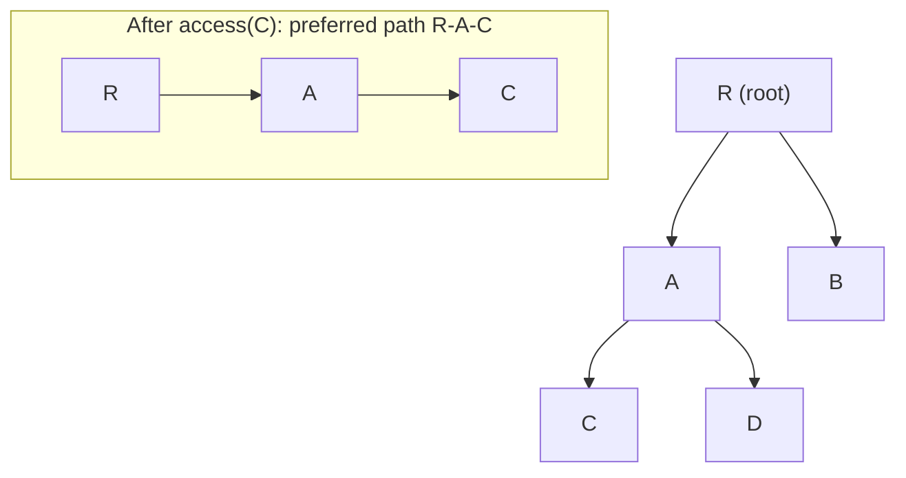
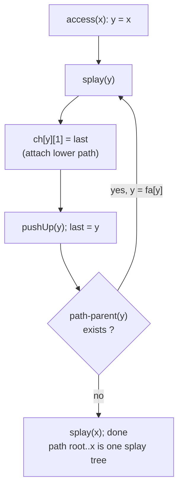

# Link-Cut Tree (Dynamic Forest of Rooted Trees)

A **Link-Cut Tree (LCT)** maintains a *forest* of rooted trees that changes over
time: you may **link** two trees into one, **cut** an edge to split a tree, ask
whether two nodes are **connected**, and run **path queries/updates** between any
two nodes — all in amortized $O(\log n)$ per operation. It is the dynamic
generalization of the Euler-tour / heavy-light decompositions you use on a
*static* tree, except here the tree itself is mutable.

The core idea is **preferred-path decomposition**. At any moment the forest is
partitioned into vertex-disjoint **preferred paths**. Each preferred path is
stored as a balanced BST — specifically a **splay tree** — keyed implicitly by
**depth** (the in-order traversal of the splay tree lists the path from the
shallowest to the deepest vertex). These per-path splay trees are the
*auxiliary trees*; they are glued together by **path-parent pointers** that point
from the root of one auxiliary splay tree to the vertex it hangs under in the
represented tree.

Every high-level operation is built on a single primitive: **`access(x)`**, which
makes the path from the root of `x`'s tree down to `x` the new preferred path and
splays `x` to the top. Because splay trees are self-adjusting, the *amortized*
cost of `access` (and hence everything built on it) is $O(\log n)$. Adding a
**lazy reverse flag** lets us re-root a tree in $O(\log n)$ via **`makeRoot`**,
which is what turns directed root-to-`x` paths into *arbitrary* `u`–`v` paths.

## Table of Contents

- [Preferred Children and Preferred Paths](#preferred-children-and-preferred-paths)
- [The Auxiliary Splay Trees (Keyed by Depth)](#the-auxiliary-splay-trees-keyed-by-depth)
- [Splay Mechanics: rotate, splay, push-down](#splay-mechanics-rotate-splay-push-down)
- [The `access(x)` Operation](#the-accessx-operation)
- [`makeRoot` via Path Reversal](#makeroot-via-path-reversal)
- [`findRoot`, `connected`, `link`, `cut`](#findroot-connected-link-cut)
- [Path Aggregates with Lazy Propagation](#path-aggregates-with-lazy-propagation)
- [Full LCT: link / cut / connected / path-sum + point update](#full-lct-link--cut--connected--path-sum--point-update)
- [Mermaid](#mermaid)
- [Complexity Summary](#complexity-summary)
- [Common Pitfalls](#common-pitfalls)
- [Patterns](#patterns)

## Preferred Children and Preferred Paths

Fix a rooted tree. The most-recently-`access`ed child of a vertex is its
**preferred child**; the chain of preferred edges from a vertex down to a leaf is
a **preferred path**. The whole tree decomposes into vertex-disjoint preferred
paths, exactly like heavy paths in HLD — but the partition is **dynamic**: each
`access(x)` rewires preferred children so that the path root→`x` becomes a single
preferred path.

```text
Represented tree (rooted at R)        Preferred paths (one per chain)
        R                              path1: R - A - C   (preferred edges)
       / \                            path2: B
      A   B                           path3: D
     / \
    C   D       access(C) makes  R-A-C  the preferred path
```

Two vertices are in the same represented tree iff their auxiliary splay trees are
connected through path-parent pointers — which is what `findRoot` exploits.

## The Auxiliary Splay Trees (Keyed by Depth)

Each preferred path is stored in its own **splay tree**. The BST key is the
**depth** of the vertex along that path, but we never store the key explicitly:
the **in-order traversal** of the splay tree *is* the path ordered shallow → deep.
So the leftmost node of an auxiliary tree is the shallowest vertex of its path,
and the rightmost is the deepest.

Three pointers per node tie everything together:

- `ch[x][0]`, `ch[x][1]` — left/right children **inside** the auxiliary splay tree.
- `fa[x]` — parent pointer. If `x` is the **root** of its auxiliary tree, `fa[x]`
  is a **path-parent pointer** into another auxiliary tree; otherwise it is an
  ordinary splay-tree parent.

The distinguishing test is `isRoot(x)`: `x` is a splay-tree root when it is *not*
listed as a child of its parent.

$$
\text{isRoot}(x) \iff \big(\text{ch}[\,\text{fa}[x]\,][0] \neq x \ \wedge\ \text{ch}[\,\text{fa}[x]\,][1] \neq x\big).
$$

## Splay Mechanics: rotate, splay, push-down

LCT correctness rests entirely on a correct splay tree that respects the
`isRoot` boundary and **pushes lazy tags down before touching a subtree**.
`rotate(x)` lifts `x` above its parent; `splay(x)` brings `x` to the root of its
auxiliary tree using the standard zig / zig-zig / zig-zag cases. Crucially, before
the first rotation we **push down all pending lazy flags along the path from the
auxiliary root to `x`**, top-down.

```text
splay(x):
    push down lazy flags from aux-root ... down to x   (top-down!)
    while not isRoot(x):
        y = fa[x]; z = fa[y]
        if not isRoot(y):
            if (x is right-child of y) == (y is right-child of z): rotate(y)
            else:                                                  rotate(x)
        rotate(x)
```

## The `access(x)` Operation

`access(x)` is the heart of the structure. It walks from `x` up to the root of
the represented tree, and at each step it **splices** the current auxiliary tree
onto the one below, making `x`'s root-path the new preferred path. After it
finishes, `x` is splayed to the top of a single auxiliary tree that holds exactly
the path root → `x`.

```text
access(x):
    last = null
    for y = x; y != null; y = path_parent(y):
        splay(y)
        ch[y][1] = last        # detach old preferred child, attach lower path
        pushUp(y)
        last = y
    splay(x)
    return last                # last = the LCA-ish top vertex, useful elsewhere
```

Every iteration does one splay; the *amortized* number of preferred-child changes
over any sequence is $O(m \log n)$ by the access lemma, giving $O(\log n)$ per
operation.

## `makeRoot` via Path Reversal

`access(x)` gives the path **root → x**, but path queries want an **arbitrary**
`u → v` path. The trick: re-root the tree at `u`. After `access(x)`, the path
root → `x` is a single splay tree ordered shallow → deep; **reversing** that
order makes `x` the shallowest vertex, i.e. the new root. We reverse lazily with
a `rev` flag that swaps a node's two children and is pushed to descendants on
demand.

```text
applyRev(x):  swap ch[x][0], ch[x][1];  rev[x] ^= true
pushDown(x):  if rev[x]: applyRev(ch[x][0]); applyRev(ch[x][1]); rev[x] = false
makeRoot(x):  access(x); applyRev(x)
```

After `makeRoot(u); access(v)`, the splay tree of `v` holds exactly the path
`u … v`, so its **subtree aggregate is the path aggregate**.

## `findRoot`, `connected`, `link`, `cut`

With `access` and `makeRoot` in hand the forest API is short:

- **`findRoot(x)`** = `access(x)`, then walk to the leftmost (shallowest) node and
  splay it. Two nodes are **connected** iff they share a root.
- **`link(x, y)`** = `makeRoot(x)`; if `x` and `y` are not already connected, set
  the path-parent of `x` to `y`.
- **`cut(x, y)`** = `makeRoot(x); access(y)`; if `y`'s left child is `x` and they
  are adjacent, detach them.

```text
connected(x, y):  return findRoot(x) == findRoot(y)
split(x, y):      makeRoot(x); access(y)   # y's aux tree == path x..y
```

## Path Aggregates with Lazy Propagation

Because a path is a contiguous splay tree, any associative aggregate you can
maintain in a splay tree works on paths: **sum, max, min, gcd**, etc. Maintain
`sum[x] = sum[ch[x][0]] + val[x] + sum[ch[x][1]]` in `pushUp`. Range updates on a
path (e.g. *add a constant to every vertex on `u..v`*) use a second lazy tag,
applied **after** `split(u, v)` to the single node `v`. The golden rule:

> **Push down lazy tags before reading children; pull up after modifying them.**

A **point update** is the easy special case: `splay(x)`, change `val[x]`, then
`pushUp(x)`.

## Full LCT: link / cut / connected / path-sum + point update

A complete, reusable implementation. C++ uses index-based array nodes (node `0`
is the null sentinel with `sum = 0`); Python mirrors it with parallel arrays and
an explicit stack in `splay` to avoid recursion-depth issues.

```python
import sys


class LinkCutTree:
    """Splay-based dynamic forest: link / cut / connected / path-sum / update."""

    def __init__(self, n):
        size = n + 1                       # node 0 is the null sentinel
        self.ch = [[0, 0] for _ in range(size)]
        self.fa = [0] * size
        self.val = [0] * size
        self.sum = [0] * size
        self.rev = [False] * size

    def is_root(self, x):
        f = self.fa[x]
        return self.ch[f][0] != x and self.ch[f][1] != x

    def push_up(self, x):
        l, r = self.ch[x]
        self.sum[x] = self.sum[l] + self.val[x] + self.sum[r]

    def apply_rev(self, x):
        if x == 0:
            return
        self.ch[x][0], self.ch[x][1] = self.ch[x][1], self.ch[x][0]
        self.rev[x] = not self.rev[x]

    def push_down(self, x):
        if self.rev[x]:
            self.apply_rev(self.ch[x][0])
            self.apply_rev(self.ch[x][1])
            self.rev[x] = False

    def rotate(self, x):
        y = self.fa[x]
        z = self.fa[y]
        k = 1 if self.ch[y][1] == x else 0      # x is right child of y?
        if not self.is_root(y):
            self.ch[z][1 if self.ch[z][1] == y else 0] = x
        self.fa[x] = z
        self.ch[y][k] = self.ch[x][k ^ 1]
        if self.ch[x][k ^ 1]:
            self.fa[self.ch[x][k ^ 1]] = y
        self.ch[x][k ^ 1] = y
        self.fa[y] = x
        self.push_up(y)
        self.push_up(x)

    def splay(self, x):
        # Push down lazy flags top-down along aux-root .. x first.
        stack = [x]
        y = x
        while not self.is_root(y):
            y = self.fa[y]
            stack.append(y)
        while stack:
            self.push_down(stack.pop())
        while not self.is_root(x):
            y = self.fa[x]
            z = self.fa[y]
            if not self.is_root(y):
                if (self.ch[y][1] == x) ^ (self.ch[z][1] == y):
                    self.rotate(x)
                else:
                    self.rotate(y)
            self.rotate(x)

    def access(self, x):
        last = 0
        y = x
        while y:
            self.splay(y)
            self.ch[y][1] = last
            self.push_up(y)
            last = y
            y = self.fa[y]
        self.splay(x)
        return last

    def make_root(self, x):
        self.access(x)
        self.apply_rev(x)

    def find_root(self, x):
        self.access(x)
        while self.ch[x][0]:
            self.push_down(x)
            x = self.ch[x][0]
        self.splay(x)
        return x

    def split(self, x, y):
        self.make_root(x)
        self.access(y)

    def connected(self, x, y):
        if x == y:
            return True
        return self.find_root(x) == self.find_root(y)

    def link(self, x, y):
        self.make_root(x)
        if self.find_root(y) != x:
            self.fa[x] = y

    def cut(self, x, y):
        self.make_root(x)
        if (self.find_root(y) == x and self.fa[y] == x
                and self.ch[y][0] == 0):
            self.fa[y] = 0
            self.ch[x][1] = 0
            self.push_up(x)

    def path_sum(self, x, y):
        self.split(x, y)
        return self.sum[y]

    def update(self, x, v):
        self.splay(x)
        self.val[x] = v
        self.push_up(x)
```

```cpp
#include <bits/stdc++.h>
using namespace std;

struct LinkCutTree {
    // Splay-based dynamic forest: link / cut / connected / path-sum / update.
    vector<array<int, 2>> ch;   // children inside auxiliary splay tree
    vector<int> fa;             // splay parent OR path-parent pointer
    vector<long long> val, sum; // node value and subtree (path) sum
    vector<char> rev;           // lazy reverse flag

    LinkCutTree(int n) {
        int size = n + 1;       // node 0 is the null sentinel (sum = 0)
        ch.assign(size, {0, 0});
        fa.assign(size, 0);
        val.assign(size, 0);
        sum.assign(size, 0);
        rev.assign(size, 0);
    }

    bool isRoot(int x) {
        int f = fa[x];
        return ch[f][0] != x && ch[f][1] != x;
    }

    void pushUp(int x) {
        sum[x] = sum[ch[x][0]] + val[x] + sum[ch[x][1]];
    }

    void applyRev(int x) {
        if (x == 0) return;
        swap(ch[x][0], ch[x][1]);
        rev[x] ^= 1;
    }

    void pushDown(int x) {
        if (rev[x]) {
            applyRev(ch[x][0]);
            applyRev(ch[x][1]);
            rev[x] = 0;
        }
    }

    void rotate(int x) {
        int y = fa[x], z = fa[y];
        int k = (ch[y][1] == x);            // x is right child of y?
        if (!isRoot(y)) ch[z][ch[z][1] == y] = x;
        fa[x] = z;
        ch[y][k] = ch[x][k ^ 1];
        if (ch[x][k ^ 1]) fa[ch[x][k ^ 1]] = y;
        ch[x][k ^ 1] = y;
        fa[y] = x;
        pushUp(y);
        pushUp(x);
    }

    void splay(int x) {
        // Push down lazy flags top-down along aux-root .. x first.
        static vector<int> stk;
        stk.clear();
        int y = x;
        stk.push_back(y);
        while (!isRoot(y)) {
            y = fa[y];
            stk.push_back(y);
        }
        while (!stk.empty()) {
            pushDown(stk.back());
            stk.pop_back();
        }
        while (!isRoot(x)) {
            int yy = fa[x], zz = fa[yy];
            if (!isRoot(yy)) {
                if ((ch[yy][1] == x) ^ (ch[zz][1] == yy)) rotate(x);
                else rotate(yy);
            }
            rotate(x);
        }
    }

    int access(int x) {
        int last = 0;
        for (int y = x; y; y = fa[y]) {
            splay(y);
            ch[y][1] = last;
            pushUp(y);
            last = y;
        }
        splay(x);
        return last;
    }

    void makeRoot(int x) {
        access(x);
        applyRev(x);
    }

    int findRoot(int x) {
        access(x);
        while (ch[x][0]) {
            pushDown(x);
            x = ch[x][0];
        }
        splay(x);
        return x;
    }

    void split(int x, int y) {
        makeRoot(x);
        access(y);
    }

    bool connected(int x, int y) {
        if (x == y) return true;
        return findRoot(x) == findRoot(y);
    }

    void link(int x, int y) {
        makeRoot(x);
        if (findRoot(y) != x) fa[x] = y;
    }

    void cut(int x, int y) {
        makeRoot(x);
        if (findRoot(y) == x && fa[y] == x && ch[y][0] == 0) {
            fa[y] = 0;
            ch[x][1] = 0;
            pushUp(x);
        }
    }

    long long pathSum(int x, int y) {
        split(x, y);
        return sum[y];
    }

    void update(int x, long long v) {
        splay(x);
        val[x] = v;
        pushUp(x);
    }
};
```

A tiny driver showing the API in action — build a path `1-2-3`, query, re-route:

```python
def demo():
    lct = LinkCutTree(5)
    for i in range(1, 6):
        lct.update(i, i)               # val[i] = i
    lct.link(1, 2)
    lct.link(2, 3)
    lct.link(4, 5)
    print(lct.connected(1, 3))         # True  (1-2-3 connected)
    print(lct.connected(1, 5))         # False (different trees)
    print(lct.path_sum(1, 3))          # 1 + 2 + 3 = 6
    lct.cut(2, 3)                      # split off node 3
    print(lct.connected(1, 3))         # False
    lct.update(2, 10)                  # val[2] = 10
    print(lct.path_sum(1, 2))          # 1 + 10 = 11


if __name__ == "__main__":
    demo()
```

```cpp
int main() {
    LinkCutTree lct(5);
    for (int i = 1; i <= 5; i++) lct.update(i, i);   // val[i] = i
    lct.link(1, 2);
    lct.link(2, 3);
    lct.link(4, 5);
    cout << (lct.connected(1, 3) ? "true" : "false") << "\n"; // true
    cout << (lct.connected(1, 5) ? "true" : "false") << "\n"; // false
    cout << lct.pathSum(1, 3) << "\n";                        // 6
    lct.cut(2, 3);                                            // split off node 3
    cout << (lct.connected(1, 3) ? "true" : "false") << "\n"; // false
    lct.update(2, 10);                                       // val[2] = 10
    cout << lct.pathSum(1, 2) << "\n";                        // 11
    return 0;
}
```

## Mermaid

Preferred-path decomposition of a represented tree, then the effect of
`access(C)` which makes `R → A → C` a single preferred path:



How `access(x)` splices auxiliary splay trees bottom-up, splaying each path-parent
and re-attaching the lower path as the new right (deeper) child:



## Complexity Summary

| Operation | Amortized time | Notes |
| --- | --- | --- |
| `access(x)` | $O(\log n)$ | access lemma over preferred-child changes |
| `makeRoot(x)` | $O(\log n)$ | one `access` + lazy reverse |
| `findRoot(x)` | $O(\log n)$ | `access` + leftmost walk |
| `link`, `cut` | $O(\log n)$ | both reduce to `makeRoot` / `access` |
| `connected` | $O(\log n)$ | two `findRoot`s |
| path aggregate / point update | $O(\log n)$ | `split` then read/modify the path root |

All bounds are **amortized** $O(\log n)$; total cost of $m$ operations on $n$
nodes is $O(m \log n)$. Memory is $O(n)$.

## Common Pitfalls

- **Push-down order.** Before any rotation in `splay(x)`, push lazy flags
  **top-down** from the auxiliary root to `x`. Pushing in the wrong order corrupts
  the `rev` flag and silently returns wrong path aggregates.
- **Forgetting `makeRoot` before a path op.** `pathSum(u, v)` *must* call
  `split(u, v)` = `makeRoot(u); access(v)`. Skipping `makeRoot` gives the
  root → `v` path, not the `u → v` path.
- **`isRoot` boundary in `rotate`.** Only re-link the grandparent's child pointer
  when the parent is **not** an auxiliary root; otherwise you overwrite a
  path-parent pointer and disconnect the forest.
- **`pushUp` after every structural change.** `rotate`, `access`, `cut`, and
  `update` must all `pushUp` the touched nodes, or `sum`/`max` go stale.
- **Validating `cut` / `link`.** Check connectivity first: don't `link` two nodes
  already in the same tree (creates a cycle), and only `cut` an edge that exists
  and is adjacent after `makeRoot`.
- **Recursion depth in `splay` (Python).** Use an explicit stack for push-down
  instead of recursion; a degenerate path can be $O(n)$ deep transiently.

## Patterns

- **Dynamic connectivity (online).** Maintain a spanning forest under
  edge insertions/deletions; `connected(u, v)` answers reachability. Extends to
  fully-dynamic connectivity when paired with auxiliary structures.
- **Dynamic MST.** When an edge insertion would create a cycle, query the **max
  edge on the path** between its endpoints (path-max LCT); swap it out if the new
  edge is lighter. This is the dynamic analogue of Kruskal's cycle property.
- **LCA in a dynamic tree.** `access(u)` then `access(v)`; the return value of the
  second `access` is the LCA of `u` and `v` under the current root.
- **Path updates / aggregates.** Sum, max, min, gcd, affine assignment — any
  associative monoid with a compatible lazy tag works exactly as on a static
  segment tree, but over a *mutable* tree.
- **Subtree aggregates.** With extra "virtual subtree" bookkeeping on
  path-parent edges, LCT also supports subtree sums and subtree size queries.
