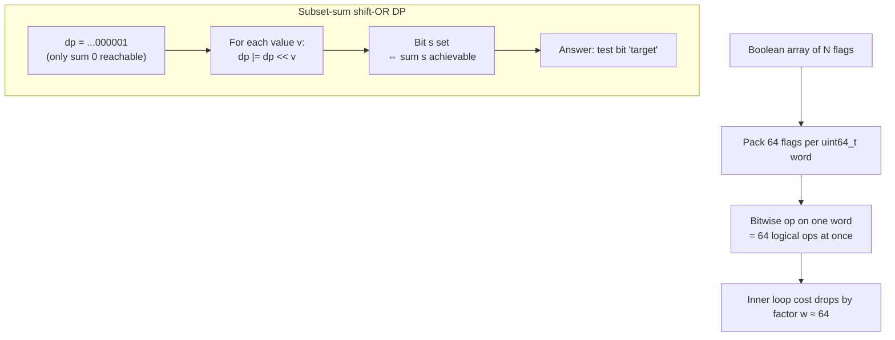
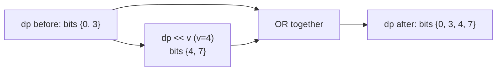

# Bitset Optimization

A **bitset** packs many boolean values into the bits of machine words, processing $w$ booleans
(typically $w = 64$) with a single CPU instruction. Where a naive boolean array touches one flag
per loop iteration, a bitset touches an entire word of $64$ flags per AND/OR/XOR/shift. The
algorithmic shape of your code does not change, but every inner loop that scans booleans shrinks
by a constant factor of $w$.

That constant factor is decisive in practice. An $O(n^2)$ dynamic program or an $O(n^3)$
transitive closure becomes $O(n^2 / 64)$ or $O(n^3 / 64)$ — still the same big-O class, yet often
the difference between TLE and AC. The trick applies whenever your state is a set of booleans that
you combine with bitwise operations or shift around (subset-sum feasibility, reachability,
string matching, LCS).

In C++ the workhorse is `std::bitset<N>`, a fixed compile-time size whose operators (`&`, `|`,
`^`, `<<`, `>>`, `count`, `_Find_first`, `_Find_next`) are vectorized over `uint64_t` words. In
Python there is no native bitset, but a Python **big integer** *is* an arbitrary-width bit vector:
`x | (x << k)`, `x & mask`, and `bin(x).count("1")` give the same word-parallel behavior for free,
backed by CPython's bignum implementation.

---

## Table of Contents
1. [How std::bitset Works](#how-stdbitset-works)
2. [Core Operations](#core-operations)
3. [Subset-Sum / Knapsack Feasibility](#subset-sum--knapsack-feasibility)
4. [Transitive Closure / Reachability](#transitive-closure--reachability)
5. [Bitset over Adjacency for Graph Reachability](#bitset-over-adjacency-for-graph-reachability)
6. [String Matching (Shift-And)](#string-matching-shift-and)
7. [LCS Bit-Parallel (Myers / Hunt)](#lcs-bit-parallel-myers--hunt)
8. [Mermaid](#mermaid)
9. [Complexity Summary](#complexity-summary)
10. [Common Pitfalls](#common-pitfalls)
11. [Patterns](#patterns)

---

## How std::bitset Works

A `std::bitset<N>` stores $\lceil N/64 \rceil$ words of type `uint64_t`. Bit $i$ lives in word
$\lfloor i/64 \rfloor$ at bit position $i \bmod 64$. A bitwise AND over the whole bitset is just a
loop over those words doing `a[j] & b[j]`, so $N$ logical ANDs cost only $\lceil N/64 \rceil$
machine ANDs — the famous **/64 speedup**.

Conceptually a Python `int` behaves identically: it is a sign-magnitude bignum of 30-bit or 64-bit
"limbs", and `a & b`, `a | b`, `a ^ b` all run limb-by-limb in C inside CPython.

```python
# Python: an int IS a bitset. Set bit i, test bit i, clear bit i.
bs = 0
bs |= (1 << 5)              # set bit 5
is_set = (bs >> 5) & 1      # test bit 5  -> 1
bs &= ~(1 << 5)            # clear bit 5
popcount = bin(bs).count("1")
print(is_set, popcount)
```

```cpp
#include <bits/stdc++.h>
using namespace std;

int main() {
    bitset<64> bs;
    bs.set(5);                 // set bit 5
    bool is_set = bs.test(5);  // test bit 5 -> true
    bs.reset(5);               // clear bit 5
    long long popcount = (long long)bs.count();
    cout << is_set << " " << popcount << "\n";
    return 0;
}
```

---

## Core Operations

The vocabulary is small. Intersection is `&`, union is `|`, symmetric difference is `^`, a
left shift `<<` moves every set bit to a higher index (useful for "add a value" in DP), and
`_Find_first` / `_Find_next` scan set bits in $O(N/64)$ amortized.

```python
# Python bit-vector vocabulary
A = 0b1010
B = 0b0110
inter = A & B          # intersection
union = A | B          # union
symdiff = A ^ B        # symmetric difference
shifted = A << 3       # shift bits up by 3
# iterate set bits (like _Find_first/_Find_next)
x = union
while x:
    low = x & (-x)         # lowest set bit
    idx = low.bit_length() - 1
    print("bit", idx)
    x ^= low               # clear it
```

```cpp
#include <bits/stdc++.h>
using namespace std;

int main() {
    bitset<8> A(0b1010), B(0b0110);
    bitset<8> inter   = A & B;   // intersection
    bitset<8> uni     = A | B;   // union
    bitset<8> symdiff = A ^ B;   // symmetric difference
    bitset<8> shifted = A << 3;  // shift bits up by 3
    // iterate set bits with _Find_first / _Find_next
    for (size_t i = uni._Find_first(); i < uni.size(); i = uni._Find_next(i))
        cout << "bit " << i << "\n";
    return 0;
}
```

---

## Subset-Sum / Knapsack Feasibility

The classic subset-sum DP asks: which sums are achievable from a multiset of values? Keep a
boolean vector `dp` where bit $s$ means "sum $s$ is reachable". Start with bit $0$ set (the empty
subset). For each value $v$, every reachable sum $s$ spawns a new reachable sum $s + v$ — exactly
a **left shift by $v$** ORed back in:

$$
dp \mathrel{|}= (dp \ll v).
$$

Each value costs one shift-OR over $\text{sum}/64$ words, so the whole DP is
$O(n \cdot \text{sum} / 64)$ instead of $O(n \cdot \text{sum})$.

```python
def subset_sum_feasible(values, target):
    # bit s set  <=>  sum s is achievable
    dp = 1  # only sum 0 reachable initially
    for v in values:
        dp |= dp << v
    return (dp >> target) & 1 == 1

print(subset_sum_feasible([3, 34, 4, 12, 5, 2], 9))  # True (4+5)
```

```cpp
#include <bits/stdc++.h>
using namespace std;

const int MAXS = 100001;

bool subset_sum_feasible(const vector<int>& values, int target) {
    bitset<MAXS> dp;
    dp[0] = 1;                 // only sum 0 reachable initially
    for (int v : values)
        dp |= dp << v;         // /64 speedup per value
    return dp.test(target);
}

int main() {
    vector<int> values = {3, 34, 4, 12, 5, 2};
    cout << boolalpha << subset_sum_feasible(values, 9) << "\n"; // true
    return 0;
}
```

---

## Transitive Closure / Reachability

Represent a directed graph as `n` bit-rows, where bit $j$ of row $i$ means "edge $i \to j$".
Reachability is computed by the rule: if $i$ can reach $k$ and there is an edge $k \to j$, then $i$
can reach $j$. With rows, "reach all of $k$'s targets" is just **OR row $k$ into row $i$**. The
Floyd–Warshall-style closure becomes:

$$
\forall k,\ \forall i:\quad \text{if } reach[i][k] \text{ then } reach[i] \mathrel{|}= reach[k].
$$

The inner OR over $j$ collapses to one word-parallel OR of two rows, dropping the cost from
$O(n^3)$ to $O(n^3 / 64)$.

```python
def transitive_closure(n, adj_rows):
    # adj_rows[i] is an int bitmask of direct successors of i
    reach = adj_rows[:]
    for i in range(n):
        reach[i] |= (1 << i)       # reflexive: i reaches itself
    for k in range(n):
        bit_k = 1 << k
        for i in range(n):
            if reach[i] & bit_k:    # i can reach k
                reach[i] |= reach[k]
    return reach

rows = [0b0010, 0b0100, 0b1000, 0b0000]  # 0->1->2->3
print([bin(r) for r in transitive_closure(4, rows)])
```

```cpp
#include <bits/stdc++.h>
using namespace std;

const int N = 64;

array<bitset<N>, N> transitive_closure(int n, array<bitset<N>, N> reach) {
    for (int i = 0; i < n; ++i)
        reach[i].set(i);              // reflexive: i reaches itself
    for (int k = 0; k < n; ++k)
        for (int i = 0; i < n; ++i)
            if (reach[i].test(k))      // i can reach k
                reach[i] |= reach[k];  // word-parallel OR of rows
    return reach;
}

int main() {
    array<bitset<N>, N> reach{};
    reach[0].set(1); reach[1].set(2); reach[2].set(3); // 0->1->2->3
    auto r = transitive_closure(4, reach);
    for (int i = 0; i < 4; ++i) cout << r[i].to_ulong() << "\n";
    return 0;
}
```

---

## Bitset over Adjacency for Graph Reachability

The same row representation accelerates a single-source BFS/DFS frontier. Maintain a `frontier`
bitset of newly discovered nodes; expanding it means ORing together the adjacency rows of all
frontier nodes. Because each union of neighbor sets is word-parallel, dense-graph traversals run
in $O((V + E)/64)$-style time per layer instead of scanning every edge individually.

```python
def reachable_from(src, adj_rows, n):
    visited = 1 << src
    frontier = 1 << src
    while frontier:
        nxt = 0
        f = frontier
        while f:
            low = f & (-f)
            u = low.bit_length() - 1
            nxt |= adj_rows[u]      # union of neighbor sets
            f ^= low
        frontier = nxt & ~visited   # only the genuinely new nodes
        visited |= frontier
    return visited
```

```cpp
#include <bits/stdc++.h>
using namespace std;
const int N = 1024;

bitset<N> reachable_from(int src, const array<bitset<N>, N>& adj, int n) {
    bitset<N> visited, frontier;
    visited.set(src); frontier.set(src);
    while (frontier.any()) {
        bitset<N> nxt;
        for (size_t u = frontier._Find_first(); u < frontier.size(); u = frontier._Find_next(u))
            nxt |= adj[u];          // union of neighbor sets
        frontier = nxt & ~visited;  // only the genuinely new nodes
        visited |= frontier;
    }
    return visited;
}
```

---

## String Matching (Shift-And)

The **Shift-And** algorithm matches a pattern of length $m$ against a text using one bitset of
length $m$ as the automaton state. Precompute a mask per alphabet character. For each text symbol,
shift the state left by one, set bit 0, and AND with the character mask; a set bit at position
$m-1$ signals a full match. The whole scan is $O(n \cdot m / w)$.

```python
def shift_and(text, pat):
    m = len(pat)
    mask = {}
    for i, c in enumerate(pat):
        mask[c] = mask.get(c, 0) | (1 << i)
    state = 0
    hits = []
    full = 1 << (m - 1)
    for j, c in enumerate(text):
        state = ((state << 1) | 1) & mask.get(c, 0)
        if state & full:
            hits.append(j - m + 1)
    return hits

print(shift_and("abracadabra", "abra"))  # [0, 7]
```

```cpp
#include <bits/stdc++.h>
using namespace std;
const int M = 64;

vector<int> shift_and(const string& text, const string& pat) {
    int m = (int)pat.size();
    array<bitset<M>, 256> mask{};
    for (int i = 0; i < m; ++i) mask[(unsigned char)pat[i]].set(i);
    bitset<M> state;
    vector<int> hits;
    for (int j = 0; j < (int)text.size(); ++j) {
        state = ((state << 1).set(0)) & mask[(unsigned char)text[j]];
        if (state.test(m - 1)) hits.push_back(j - m + 1);
    }
    return hits;
}

int main() {
    for (int p : shift_and("abracadabra", "abra")) cout << p << " ";
    cout << "\n"; // 0 7
    return 0;
}
```

---

## LCS Bit-Parallel (Myers / Hunt)

The longest common subsequence DP is $O(nm)$, but **Crochemore/Hunt/Myers** bit-parallel tricks
compute one DP row as a few bitwise operations on a length-$m$ bitset, giving $O(nm / w)$. The
core encodes the "match positions" of the current character as a precomputed mask, then advances
a running `row` register with an add-and-XOR identity that propagates carries exactly where the
LCS value increments.

```python
def lcs_length(a, b):
    # bit-parallel LCS (Crochemore/Hunt style) using big-int rows
    pos = {}
    for i, c in enumerate(b):
        pos[c] = pos.get(c, 0) | (1 << i)
    full = (1 << len(b)) - 1
    row = full
    for c in a:
        x = row & pos.get(c, 0)
        row = ((row + (x & row)) | (row - x)) & full  # carry-propagation identity
    return bin((~row) & full).count("1")

print(lcs_length("ABCBDAB", "BDCAB"))
```

```cpp
#include <bits/stdc++.h>
using namespace std;

long long lcs_length(const string& a, const string& b) {
    // bit-parallel LCS using a 64-bit word (assumes |b| <= 64)
    array<unsigned long long, 256> pos{};
    for (int i = 0; i < (int)b.size(); ++i) pos[(unsigned char)b[i]] |= (1ULL << i);
    unsigned long long full = (b.size() == 64) ? ~0ULL : ((1ULL << b.size()) - 1);
    unsigned long long row = full;
    for (char c : a) {
        unsigned long long x = row & pos[(unsigned char)c];
        row = ((row + (x & row)) | (row - x)) & full; // carry-propagation identity
    }
    return (long long)__builtin_popcountll((~row) & full);
}

int main() {
    cout << lcs_length("ABCBDAB", "BDCAB") << "\n";
    return 0;
}
```

---

## Mermaid

Word-packing and the shift-OR subset-sum DP:



How a single shift-OR step propagates reachable sums:



---

## Complexity Summary

| Task | Naive | Bitset |
|------|-------|--------|
| Subset-sum feasibility | $O(n \cdot \text{sum})$ | $O(n \cdot \text{sum} / w)$ |
| Transitive closure | $O(n^3)$ | $O(n^3 / w)$ |
| Dense BFS reachability | $O(V \cdot E)$ | $O(V \cdot E / w)$ |
| Shift-And matching | $O(n \cdot m)$ | $O(n \cdot m / w)$ |
| Bit-parallel LCS | $O(n \cdot m)$ | $O(n \cdot m / w)$ |

Here $w$ is the machine word width, typically $64$. The big-O class is unchanged; the constant
factor $1/w$ is what makes these viable at large $n$.

---

## Common Pitfalls

- **Fixed compile-time size of `std::bitset<N>`.** $N$ must be a compile-time constant. Size it to
  the maximum possible (e.g. `sum + 1`), not the runtime value; oversizing wastes only memory.
- **Word alignment / off-by-one on shifts.** A shift by $v$ can push bits past your intended
  range. Mask with `& full` (or rely on the fixed `bitset` width) so stray high bits do not leak.
- **Python int growth cost.** A Python big-int silently grows; a shift `dp << v` allocates a larger
  integer each time. It is still $O(\text{sum}/64)$ per op but with a real allocation constant —
  cap the mask width with `& ((1 << (S + 1)) - 1)` when sums could otherwise blow up.
- **`_Find_first` / `_Find_next` are GCC extensions.** They are not standard `std::bitset` members
  on every compiler; guard portability if you target MSVC.
- **Reflexivity in closure.** Remember to set the diagonal (`reach[i][i] = 1`) if your definition of
  reachability includes the node itself.

---

## Patterns

- **"Set of reachable sums / states + add an item" → shift-OR bitset DP.** Any DP whose transition
  is "from state $s$ you can move to $s + v$" maps to `dp |= dp << v`.
- **"All-pairs boolean relation" → bitset rows + OR.** Transitive closure, dominator hints, and
  dependency propagation all reduce to ORing rows.
- **"Dense graph BFS/DFS frontier" → union adjacency rows.** When $E$ is near $V^2$, packing
  adjacency into bitset rows beats edge lists.
- **"Match an automaton state against a stream" → Shift-And.** Pattern matching, wildcard matching,
  and approximate matching (Shift-Or, Wu–Manber) are bitset shifts.
- **Rule of thumb:** reach for a bitset whenever an inner loop only reads/writes booleans and you
  are one constant factor away from passing.
