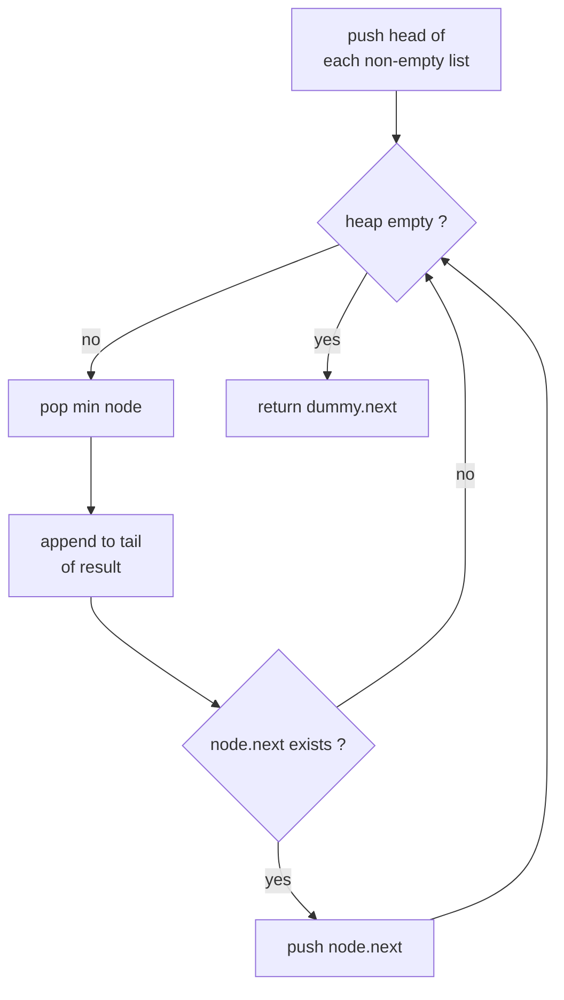

# LeetCode 23 — Merge k Sorted Lists

| Field      | Value                                          |
| ---------- | ---------------------------------------------- |
| Source     | LeetCode                                       |
| Difficulty | Hard                                           |
| Topics     | Heap, Priority queue, K-way merge, Linked list |
| Link       | https://leetcode.com/problems/merge-k-sorted-lists/ |

---

## Problem Statement

You are given an array of $k$ linked lists, each sorted in non-decreasing order. Merge them into **one** sorted linked list and return its head.

$$
0 \le k \le 10^4, \qquad 0 \le \text{list length}, \qquad \sum \text{lengths} = N \le 10^4, \qquad -10^4 \le \text{node value} \le 10^4.
$$

```text
Input:  lists = [[1,4,5],[1,3,4],[2,6]]
Output: [1,1,2,3,4,4,5,6]

Explanation: merging
  1 -> 4 -> 5
  1 -> 3 -> 4
  2 -> 6
yields 1 -> 1 -> 2 -> 3 -> 4 -> 4 -> 5 -> 6
```

## Approach (WHY)

A naive merge that scans all $k$ heads each step costs $O(N k)$. Instead, keep a **min-heap of the current head of every list** (at most $k$ nodes). The heap top is always the globally smallest unmerged value. Pop it, append it to the output, and push the **next node from the same list**. Because the heap holds $\le k$ items, each of the $N$ pops/pushes costs $O(\log k)$, giving $O(N \log k)$ overall.

This is the classic **k-way merge**: a heap over the frontier of $k$ sorted streams.



A subtlety: when two nodes hold **equal values**, comparing the heap entries must not fall back to comparing list-node objects (which are not orderable). We add a **tie-breaker index** so heap entries are `(value, idx, node)` and the node is never compared.

## Solution

### Python

```python
import heapq
from typing import Optional, List

class ListNode:
    def __init__(self, val: int = 0, nxt: "Optional[ListNode]" = None):
        self.val = val
        self.next = nxt

class Solution:
    def mergeKLists(self, lists: List[Optional[ListNode]]) -> Optional[ListNode]:
        # (value, unique_index, node) -- index breaks ties so nodes never compare
        heap: list[tuple[int, int, ListNode]] = []
        counter = 0
        for node in lists:
            if node:
                heap.append((node.val, counter, node))
                counter += 1
        heapq.heapify(heap)            # O(k) build

        dummy = ListNode()
        tail = dummy
        while heap:
            val, _, node = heapq.heappop(heap)
            tail.next = node
            tail = node
            if node.next:
                heapq.heappush(heap, (node.next.val, counter, node.next))
                counter += 1
        tail.next = None
        return dummy.next
```

### C++

```cpp
#include <bits/stdc++.h>
using namespace std;

struct ListNode {
    int val;
    ListNode* next;
    ListNode() : val(0), next(nullptr) {}
    ListNode(int x) : val(x), next(nullptr) {}
    ListNode(int x, ListNode* n) : val(x), next(n) {}
};

class Solution {
public:
    ListNode* mergeKLists(vector<ListNode*>& lists) {
        // Min-heap of (value, node). Renamed to avoid std::queue clash.
        struct Cmp {
            bool operator()(const pair<int, ListNode*>& a,
                            const pair<int, ListNode*>& b) const {
                return a.first > b.first;   // smaller value => higher priority
            }
        };
        priority_queue<pair<int, ListNode*>,
                       vector<pair<int, ListNode*>>, Cmp> nodeQueue;

        for (ListNode* node : lists)
            if (node) nodeQueue.push({node->val, node});

        ListNode dummy;
        ListNode* tail = &dummy;
        while (!nodeQueue.empty()) {
            auto [val, node] = nodeQueue.top();
            nodeQueue.pop();
            tail->next = node;
            tail = node;
            if (node->next) nodeQueue.push({node->next->val, node->next});
        }
        tail->next = nullptr;
        return dummy.next;
    }
};
```

## Iteration Trace

Lists `A: 1->4->5`, `B: 1->3->4`, `C: 2->6`. Heap shown as multiset of values (with source list).

| Step | Heap (value:list) | Pop | Output so far | Push next |
|------|-------------------|-----|---------------|-----------|
| init | {1:A, 1:B, 2:C} | — | — | — |
| 1 | {1:B, 2:C, 4:A} | 1:A | 1 | 4:A |
| 2 | {2:C, 4:A, 3:B} | 1:B | 1 1 | 3:B |
| 3 | {3:B, 4:A, 6:C} | 2:C | 1 1 2 | 6:C |
| 4 | {4:A, 4:B, 6:C} | 3:B | 1 1 2 3 | 4:B |
| 5 | {4:B, 5:A, 6:C} | 4:A | 1 1 2 3 4 | 5:A |
| 6 | {5:A, 6:C} | 4:B | 1 1 2 3 4 4 | (B ended) |
| 7 | {6:C} | 5:A | 1 1 2 3 4 4 5 | (A ended) |
| 8 | {} | 6:C | 1 1 2 3 4 4 5 6 | (C ended) |

Result: `1->1->2->3->4->4->5->6`. ✔

## Complexity

The heap holds at most $k$ nodes; each of the $N$ nodes is pushed and popped once:

$$
O(N \log k) \text{ time}, \qquad O(k) \text{ extra space}.
$$

| Aspect | Cost |
|--------|------|
| Heapify initial heads | $O(k)$ |
| $N$ pop+push, each $O(\log k)$ | $O(N \log k)$ |
| Total time | $O(N \log k)$ |
| Extra space (heap) | $O(k)$ |

We relink existing nodes rather than allocating new ones, so output space beyond the heap is $O(1)$.

## Takeaway

K-way merge = **a min-heap over the frontier of $k$ sorted streams**. Holding only the $k$ current heads keeps each step $O(\log k)$ and the whole merge $O(N \log k)$. Always add a tie-breaker (or a custom comparator) so equal keys never force comparison of non-orderable payloads.
