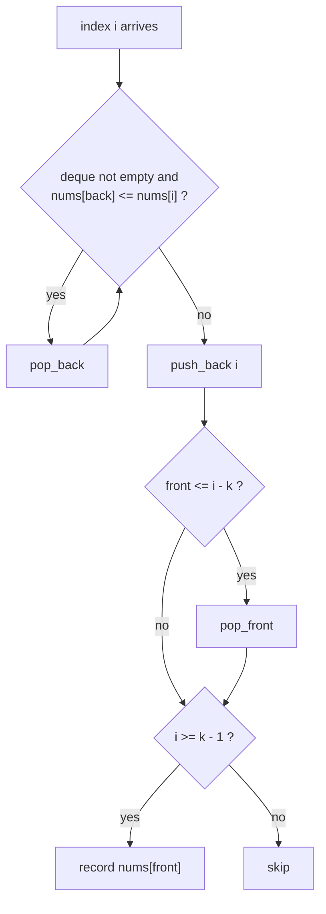

# LeetCode 239 — Sliding Window Maximum

| Meta | Value |
|------|-------|
| Source | LeetCode |
| Difficulty | Hard |
| Topics | Monotonic deque, sliding window |
| Link | https://leetcode.com/problems/sliding-window-maximum/ |

---

## Problem Statement

Given an integer array `nums` and a window size `k`, the window slides from the far left to the far right by one position at a time. Return an array containing the **maximum of each window**.

Constraints:

$$1 \le k \le n \le 10^5, \qquad -10^4 \le \text{nums}[i] \le 10^4$$

A brute-force max over every window is $O(nk)$, up to $10^{10}$ — too slow. A monotonic deque achieves $O(n)$.

```
Input:  nums = [1,3,-1,-3,5,3,6,7], k = 3
Output: [3,3,5,5,6,7]

Window position           Max
[1  3  -1] -3  5  3  6  7   3
 1 [3  -1  -3] 5  3  6  7   3
 1  3 [-1  -3  5] 3  6  7   5
 1  3  -1 [-3  5  3] 6  7   5
 1  3  -1  -3 [5  3  6] 7   6
 1  3  -1  -3  5 [3  6  7]  7
```

## Approach (WHY)

Maintain a **deque of indices** whose values are **decreasing** from front to back. The front index always holds the current window maximum.

When a new index `i` arrives:

1. **Pop from the back** while `nums[back] <= nums[i]`. Any smaller-or-equal value to the left of `i` can never be a maximum while `nums[i]` remains in the window, so discard it.
2. **Push** `i` to the back.
3. **Evict the front** if it has left the window: `front <= i - k`.
4. Once the first full window is formed (`i >= k - 1`), the answer is `nums[front]`.

Each index enters and leaves the deque once → amortized $O(1)$, total $O(n)$.



## Solution

### Python

```python
from collections import deque


class Solution:
    def maxSlidingWindow(self, nums: list[int], k: int) -> list[int]:
        dq = deque()   # indices, nums[dq] decreasing front -> back
        out = []
        for i, x in enumerate(nums):
            while dq and nums[dq[-1]] <= x:
                dq.pop()
            dq.append(i)
            if dq[0] <= i - k:           # front slid out of window
                dq.popleft()
            if i >= k - 1:               # first full window reached
                out.append(nums[dq[0]])
        return out


print(Solution().maxSlidingWindow([1, 3, -1, -3, 5, 3, 6, 7], 3))
# [3, 3, 5, 5, 6, 7]
```

### C++

```cpp
#include <bits/stdc++.h>
using namespace std;

class Solution {
public:
    vector<int> maxSlidingWindow(vector<int> &nums, int k) {
        deque<int> dq;          // indices, nums[dq] decreasing front -> back
        vector<int> out;
        for (int i = 0; i < (int)nums.size(); ++i) {
            while (!dq.empty() && nums[dq.back()] <= nums[i]) dq.pop_back();
            dq.push_back(i);
            if (dq.front() <= i - k) dq.pop_front(); // front out of window
            if (i >= k - 1) out.push_back(nums[dq.front()]);
        }
        return out;
    }
};

int main() {
    vector<int> nums = {1, 3, -1, -3, 5, 3, 6, 7};
    Solution s;
    for (int v : s.maxSlidingWindow(nums, 3)) cout << v << ' ';
    cout << "\n"; // 3 3 5 5 6 7
}
```

## Iteration Trace

`nums = [1, 3, -1, -3, 5, 3, 6, 7]`, `k = 3`. Deque holds indices (values shown in parentheses).

| i | nums[i] | Pop back (≤ nums[i]) | Push | Evict front (front ≤ i-k) | Deque (idx:val) | Emit |
|---|---------|----------------------|------|---------------------------|-----------------|------|
| 0 | 1  | — | 0 | — | [0:1] | — |
| 1 | 3  | pop 0(1) | 1 | — | [1:3] | — |
| 2 | -1 | — | 2 | — | [1:3, 2:-1] | 3 |
| 3 | -3 | — | 3 | — | [1:3, 2:-1, 3:-3] → evict 1 | [2:-1,3:-3]… wait |

Let me show it precisely step by step:

| i | nums[i] | Action sequence | Deque after (idx:val) | Window max |
|---|---------|-----------------|-----------------------|------------|
| 0 | 1  | push 0 | [0:1] | — |
| 1 | 3  | pop 0(1); push 1 | [1:3] | — |
| 2 | -1 | push 2; emit | [1:3, 2:-1] | **3** |
| 3 | -3 | push 3; front 1 ≤ 0? no; emit | [1:3, 2:-1, 3:-3] | **3** |
| 4 | 5  | pop 3(-3),2(-1),1(3); push 4; front 4≤1? no; emit | [4:5] | **5** |
| 5 | 3  | push 5; emit | [4:5, 5:3] | **5** |
| 6 | 6  | pop 5(3),4(5); push 6; emit | [6:6] | **6** |
| 7 | 7  | pop 6(6); push 7; emit | [7:7] | **7** |

Output: `[3, 3, 5, 5, 6, 7]` ✓

## Complexity

Every index is pushed exactly once and popped at most once across the whole run:

$$T(n) = O(n), \qquad \text{Space} = O(k).$$

| Aspect | Bound |
|--------|-------|
| Time | $O(n)$ |
| Space | $O(k)$ (deque holds at most one window) |

## Takeaway

The **monotonic deque** turns a sliding-window extreme into an $O(n)$ scan: keep indices with decreasing values, the front is the maximum, evict stale values from the back and out-of-window indices from the front. Flip the comparison to `>=` for the sliding window minimum.
