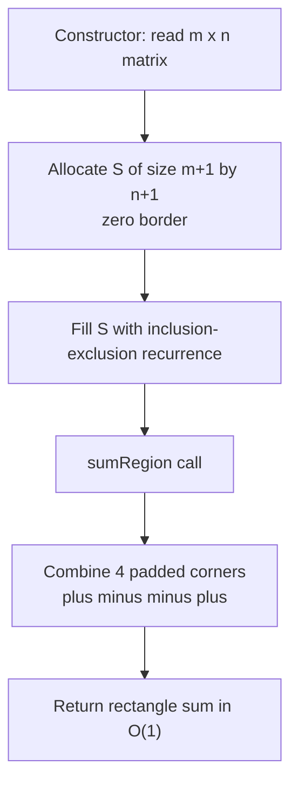

# Range Sum Query 2D - Immutable (LeetCode 304 — 2D Prefix Sums)

| Meta | Value |
|------|-------|
| Source | LeetCode 304 |
| Difficulty | Medium |
| Topics | 2D Prefix Sums, Inclusion–Exclusion, Design |
| Link | https://leetcode.com/problems/range-sum-query-2d-immutable/ |

---

## Problem Statement

Implement a class `NumMatrix` that is initialized with an integer matrix `matrix` of size
$m \times n$. Support the operation:

- `sumRegion(row1, col1, row2, col2)` → the sum of all elements inside the rectangle whose top-left
  corner is $(row1, col1)$ and bottom-right corner is $(row2, col2)$, inclusive and **0-indexed**.

The matrix is **immutable** (never changes after construction), and `sumRegion` may be called many
times, so it must run in $O(1)$.

- $1 \le m, n \le 200$
- $-10^4 \le \text{matrix}[i][j] \le 10^4$
- $0 \le row1 \le row2 < m$, $\quad 0 \le col1 \le col2 < n$
- Up to $10^4$ calls to `sumRegion`

```
matrix = [[3, 0, 1, 4, 2],
          [5, 6, 3, 2, 1],
          [1, 2, 0, 1, 5],
          [4, 1, 0, 1, 7],
          [1, 0, 3, 0, 5]]

sumRegion(2, 1, 4, 3) -> 8
sumRegion(1, 1, 2, 2) -> 11
sumRegion(1, 2, 2, 4) -> 12
```

---

## Approach (WHY)

Because the matrix never changes but `sumRegion` is hot, **precompute once, answer in $O(1)$**. Build a
2D prefix-sum table $S$ of size $(m+1) \times (n+1)$ with a zero top row and left column, so $S[i][j]$
holds the sum of the rectangle from $(0,0)$ to $(i-1, j-1)$.

Build recurrence (inclusion–exclusion, subtract the double-counted corner):

$$
S[i][j] = \text{matrix}[i-1][j-1] + S[i-1][j] + S[i][j-1] - S[i-1][j-1].
$$

Query with four corners (the $+1$ offsets convert the 0-indexed inclusive corners into the padded
table):

$$
\text{sumRegion} = S[row2{+}1][col2{+}1] - S[row1][col2{+}1] - S[row2{+}1][col1] + S[row1][col1].
$$



---

## Solution

### Python

```python
from typing import List

class NumMatrix:
    def __init__(self, matrix: List[List[int]]):
        m, n = len(matrix), len(matrix[0])
        # Padded prefix table: S[i][j] = sum of matrix[0..i-1][0..j-1].
        self.S = [[0] * (n + 1) for _ in range(m + 1)]
        for i in range(1, m + 1):
            for j in range(1, n + 1):
                self.S[i][j] = (matrix[i - 1][j - 1]
                                + self.S[i - 1][j]
                                + self.S[i][j - 1]
                                - self.S[i - 1][j - 1])

    def sumRegion(self, row1: int, col1: int, row2: int, col2: int) -> int:
        S = self.S
        return (S[row2 + 1][col2 + 1]
                - S[row1][col2 + 1]
                - S[row2 + 1][col1]
                + S[row1][col1])
```

### C++

```cpp
#include <bits/stdc++.h>
using namespace std;

class NumMatrix {
    vector<vector<long long>> S;  // padded prefix table

public:
    NumMatrix(vector<vector<int>>& matrix) {
        int m = (int)matrix.size(), n = (int)matrix[0].size();
        // S[i][j] = sum of matrix[0..i-1][0..j-1].
        S.assign(m + 1, vector<long long>(n + 1, 0));
        for (int i = 1; i <= m; ++i)
            for (int j = 1; j <= n; ++j)
                S[i][j] = matrix[i - 1][j - 1]
                        + S[i - 1][j]
                        + S[i][j - 1]
                        - S[i - 1][j - 1];
    }

    int sumRegion(int row1, int col1, int row2, int col2) {
        long long res = S[row2 + 1][col2 + 1]
                      - S[row1][col2 + 1]
                      - S[row2 + 1][col1]
                      + S[row1][col1];
        return (int)res;
    }
};
```

---

## Iteration Trace

Padded prefix table $S$ for the example matrix (row 0 and col 0 are zeros, shown for cols 1..5):

| i\j | 1 | 2 | 3 | 4 | 5 |
|-----|---|---|---|---|---|
| **1** | 3 | 3 | 4 | 8 | 10 |
| **2** | 8 | 14 | 18 | 24 | 27 |
| **3** | 9 | 17 | 21 | 28 | 36 |
| **4** | 13 | 22 | 26 | 34 | 49 |
| **5** | 14 | 23 | 30 | 38 | 58 |

Query `sumRegion(2, 1, 4, 3)`:

$$
S[5][4] - S[2][4] - S[5][1] + S[2][1] = 38 - 24 - 14 + 8 = 8 \ \checkmark
$$

| Call | Formula | Value |
|------|---------|-------|
| `sumRegion(2,1,4,3)` | $38 - 24 - 14 + 8$ | 8 |
| `sumRegion(1,1,2,2)` | $S[3][3]-S[1][3]-S[3][1]+S[1][1] = 21-4-9+3$ | 11 |
| `sumRegion(1,2,2,4)` | $S[3][5]-S[1][5]-S[3][2]+S[1][2] = 36-10-17+3$ | 12 |

---

## Complexity

Constructor builds the table once; each query reads four cells.

$$
T_{\text{build}} = O(mn), \qquad T_{\text{query}} = O(1), \qquad S_{\text{space}} = O(mn)
$$

| Operation | Time | Space |
|-----------|------|-------|
| Constructor | $O(mn)$ | $O(mn)$ |
| `sumRegion` | $O(1)$ | — |

---

## Takeaway

For an immutable matrix with repeated rectangle-sum queries, a padded 2D prefix-sum table is the
canonical answer: $O(mn)$ once, $O(1)$ forever after. The padding row/column eliminates boundary
checks, and the four-corner $+\,-\,-\,+$ formula is the same inclusion–exclusion used to *build* the
table, read in reverse.
