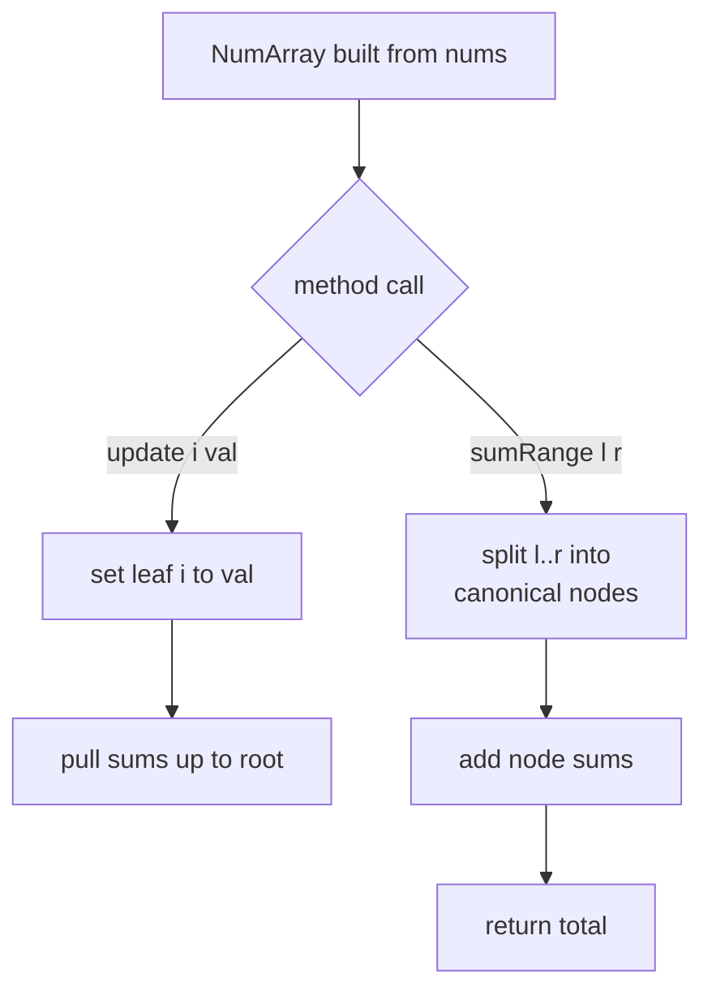

# LeetCode 307 — Range Sum Query (Mutable)

| Field | Value |
|-------|-------|
| Source | LeetCode |
| Difficulty | Medium |
| Topics | Segment tree, point update, range sum query |
| Link | https://leetcode.com/problems/range-sum-query-mutable/ |

---

## Problem Statement

Implement a class `NumArray` initialized from an integer array `nums`, supporting:

- `update(index, val)` — set `nums[index] = val`.
- `sumRange(left, right)` — return $\sum_{i=left}^{right} nums[i]$ (inclusive).

Both operations may be called many times in any order, so we need both to be fast.

Constraints: $1 \le n \le 3 \cdot 10^4$, $-100 \le val \le 100$, up to $3 \cdot 10^4$ calls to each method.

Formally, `sumRange(l, r)` returns:

$$
\sum_{i=l}^{r} nums[i].
$$

```
Input
["NumArray","sumRange","update","sumRange"]
[[[1,3,5]],[0,2],[1,2],[0,2]]

Output
[null, 9, null, 8]
```

Explanation: $1+3+5 = 9$; after `update(1, 2)` the array is `[1,2,5]`, so $1+2+5 = 8$.

---

## Approach (WHY)

A prefix-sum array answers `sumRange` in $O(1)$ but every `update` costs $O(n)$ to rebuild the suffix of prefixes — bad when updates are frequent. A plain array does the opposite. A **segment tree on sum** gives both in $O(\log n)$.

Sum is associative with identity $0$:

$$
(a + b) + c = a + (b + c), \qquad a + 0 = a,
$$

so each node stores the sum of its segment. `update` rewrites one leaf and pulls sums up its path; `sumRange` decomposes $[l, r]$ into $O(\log n)$ canonical nodes.



We use the iterative bottom-up tree: leaves at positions `n..2n-1`, internal sums in `1..n-1`.

---

## Solution

### Python

```python
class NumArray:
    def __init__(self, nums):
        self.n = len(nums)
        self.tree = [0] * (2 * self.n)
        for i in range(self.n):
            self.tree[self.n + i] = nums[i]
        for i in range(self.n - 1, 0, -1):
            self.tree[i] = self.tree[2 * i] + self.tree[2 * i + 1]

    def update(self, index, val):
        i = index + self.n
        self.tree[i] = val
        i //= 2
        while i >= 1:
            self.tree[i] = self.tree[2 * i] + self.tree[2 * i + 1]
            i //= 2

    def sumRange(self, left, right):
        res = 0                          # identity for sum
        l = left + self.n
        r = right + 1 + self.n           # convert inclusive [left, right] to [l, r)
        while l < r:
            if l & 1:
                res += self.tree[l]; l += 1
            if r & 1:
                r -= 1; res += self.tree[r]
            l //= 2
            r //= 2
        return res
```

### C++

```cpp
class NumArray {
    int n;
    vector<long long> tree;

public:
    NumArray(vector<int>& nums) {
        n = (int)nums.size();
        tree.assign(2 * n, 0);
        for (int i = 0; i < n; ++i) tree[n + i] = nums[i];
        for (int i = n - 1; i >= 1; --i)
            tree[i] = tree[2 * i] + tree[2 * i + 1];
    }

    void update(int index, int val) {
        int i = index + n;
        tree[i] = val;
        for (i /= 2; i >= 1; i /= 2)
            tree[i] = tree[2 * i] + tree[2 * i + 1];
    }

    int sumRange(int left, int right) {
        long long res = 0;               // identity for sum
        int l = left + n;
        int r = right + 1 + n;           // inclusive [left, right] -> [l, r)
        for (; l < r; l /= 2, r /= 2) {
            if (l & 1) res += tree[l++];
            if (r & 1) res += tree[--r];
        }
        return (int)res;
    }
};
```

---

## Iteration Trace

`nums = [1, 3, 5]`, so $n = 3$. Tree leaves at positions `3,4,5`; internal nodes `1,2`.

| Step | Call | Tree action | Result |
|------|------|-------------|--------|
| 0 | build | leaves `[1,3,5]`; node 2 = `tree[4]+tree[5]` = 8; node 1 = `tree[2]+tree[3]` = 9 | tree = `[_,9,8,1,3,5]` |
| 1 | `sumRange(0,2)` | range `[3,6)` → add `tree[3]` then `tree[5]`, then `tree[2]` path | $1+5+3 = 9$ |
| 2 | `update(1,2)` | set `tree[4]=2`; node 2 = `2+5=7`; node 1 = `1+7=8` | tree = `[_,8,7,1,2,5]` |
| 3 | `sumRange(0,2)` | range `[3,6)` again | $1+2+5 = 8$ |

---

## Complexity

With $q$ total calls:

$$
T = O(n + q \log n), \qquad \text{Space} = O(n).
$$

| Operation | Time | Space |
|-----------|------|-------|
| Constructor (build) | $O(n)$ | $O(n)$ |
| `update` | $O(\log n)$ | $O(1)$ |
| `sumRange` | $O(\log n)$ | $O(1)$ |

---

## Takeaway

This is the canonical "mutable prefix sum" problem: when updates and range sums are interleaved, a segment tree beats both the prefix-sum array and the raw array. The iterative bottom-up form is compact and fast; the only subtlety is converting LeetCode's **inclusive** $[left, right]$ to the **half-open** $[l, r)$ the loop expects by adding $1$ to `right`.
