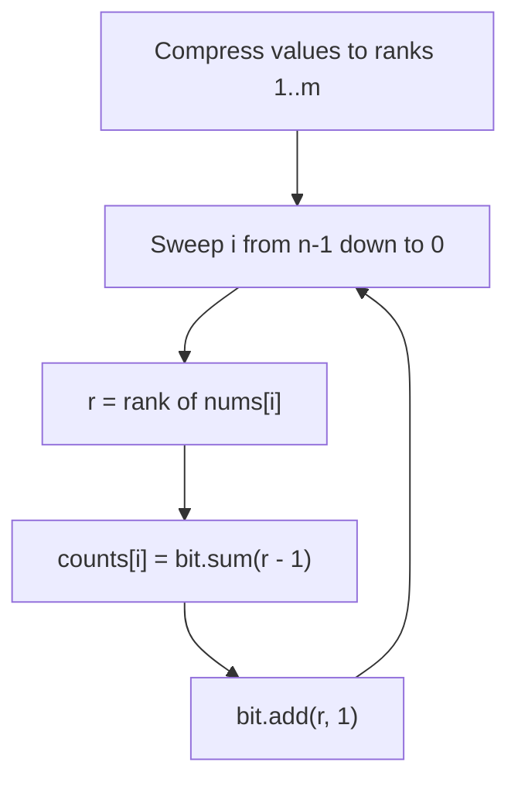
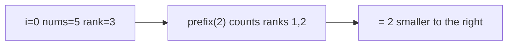

# Count of Smaller Numbers After Self (BIT + Coordinate Compression)

| Meta | Value |
|------|-------|
| Source | LeetCode 315 |
| Difficulty | Hard |
| Topics | Fenwick Tree / BIT, Coordinate Compression, Counting |
| Link | https://leetcode.com/problems/count-of-smaller-numbers-after-self/ |

---

## Problem Statement

Given an integer array `nums`, return an array `counts` where `counts[i]` is the number of
elements to the **right** of `nums[i]` that are **strictly smaller** than `nums[i]`.

Formally, for each $i$:

$$
\text{counts}[i] = \big|\{\, j : j > i \ \text{and}\ \text{nums}[j] < \text{nums}[i] \,\}\big|
$$

Values can be as large as $10^4$ in magnitude (and negative), so we **coordinate-compress** them
to a dense range $[1, m]$ and use a frequency BIT.

```
Input:  nums = [5, 2, 6, 1]
Output: [2, 1, 1, 0]
```

Explanation: to the right of 5 are {2,1} → 2 smaller; right of 2 is {1} → 1; right of 6 is {1}
→ 1; right of 1 is {} → 0.

---

## Approach (WHY)

Sweep the array **from right to left**, maintaining a BIT of how many of the already-seen
(right-side) values fall on each compressed coordinate. For the current value $v$ with compressed
rank $r$, the count of strictly smaller values seen so far is the prefix sum over ranks
$[1, r - 1]$:

$$
\text{counts}[i] = \text{prefix}(r - 1)
$$

Then we insert $v$ with `add(r, 1)` so it is available for elements further left.

Coordinate compression maps the sorted distinct values to ranks $1 \ldots m$, keeping the BIT
size proportional to the number of distinct values rather than the value magnitude.



---

## Solution

### Python

```python
from bisect import bisect_left
from typing import List


class BIT:
    def __init__(self, n: int) -> None:
        self.n = n
        self.tree = [0] * (n + 1)

    def add(self, i: int, delta: int) -> None:
        while i <= self.n:
            self.tree[i] += delta
            i += i & (-i)

    def sum(self, i: int) -> int:
        s = 0
        while i > 0:
            s += self.tree[i]
            i -= i & (-i)
        return s


class Solution:
    def countSmaller(self, nums: List[int]) -> List[int]:
        sorted_vals = sorted(set(nums))
        m = len(sorted_vals)
        bit = BIT(m)

        n = len(nums)
        counts = [0] * n
        for i in range(n - 1, -1, -1):
            # rank in [1, m]
            r = bisect_left(sorted_vals, nums[i]) + 1
            counts[i] = bit.sum(r - 1)
            bit.add(r, 1)
        return counts
```

```cpp
#include <bits/stdc++.h>
using namespace std;

struct BIT {
    int n;
    vector<int> tree;

    BIT(int n) : n(n), tree(n + 1, 0) {}

    void add(int i, int delta) {
        for (; i <= n; i += i & (-i))
            tree[i] += delta;
    }

    int sum(int i) {
        int s = 0;
        for (; i > 0; i -= i & (-i))
            s += tree[i];
        return s;
    }
};

class Solution {
public:
    vector<int> countSmaller(vector<int>& nums) {
        vector<int> sorted_vals(nums.begin(), nums.end());
        sort(sorted_vals.begin(), sorted_vals.end());
        sorted_vals.erase(unique(sorted_vals.begin(), sorted_vals.end()),
                          sorted_vals.end());
        int m = (int)sorted_vals.size();
        BIT bit(m);

        int n = (int)nums.size();
        vector<int> counts(n, 0);
        for (int i = n - 1; i >= 0; i--) {
            // rank in [1, m]
            int r = (int)(lower_bound(sorted_vals.begin(), sorted_vals.end(),
                                      nums[i]) - sorted_vals.begin()) + 1;
            counts[i] = bit.sum(r - 1);
            bit.add(r, 1);
        }
        return counts;
    }
};
```

---

## Iteration Trace

`nums = [5, 2, 6, 1]`. Sorted distinct = `[1, 2, 5, 6]` → ranks: `1→1, 2→2, 5→3, 6→4`.
Sweeping right to left:

| i | nums[i] | rank r | `sum(r-1)` (count) | after `add(r,1)` |
|---|---------|--------|--------------------|-------------------|
| 3 | 1 | 1 | `sum(0) = 0` | rank 1 has 1 |
| 2 | 6 | 4 | `sum(3) = 1` | ranks {1,4} |
| 1 | 2 | 2 | `sum(1) = 1` | ranks {1,2,4} |
| 0 | 5 | 3 | `sum(2) = 2` | ranks {1,2,3,4} |

Result (in original order): `[2, 1, 1, 0]`.



---

## Complexity

Compression sorts in $O(n \log n)$; each of $n$ elements does one $O(\log n)$ query and one
$O(\log n)$ update.

$$
T = O(n \log n), \qquad S = O(n)
$$

| Operation | Time |
|-----------|------|
| Coordinate compression | $O(n \log n)$ |
| Per-element query + update | $O(\log n)$ |
| Total | $O(n \log n)$ |

---

## Takeaway

Counting "smaller elements to the right" is a classic **frequency BIT** sweep. Compress values to
a dense range, walk right to left, query `prefix(rank - 1)` for the answer, then insert the
current value. The same template solves inversion counting.
