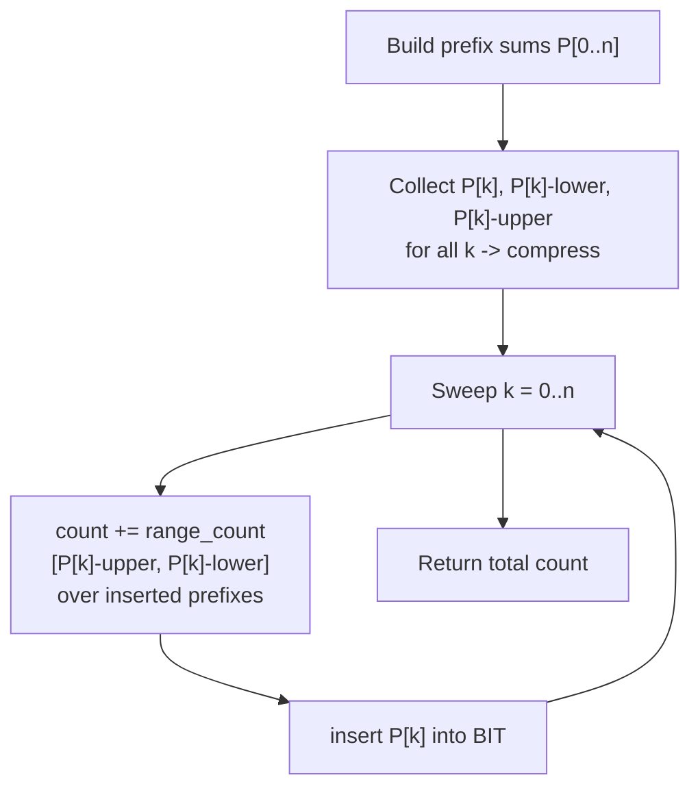

# LeetCode 327 — Count of Range Sums

| | |
|---|---|
| **Source** | LeetCode |
| **Difficulty** | Hard |
| **Topics** | Prefix sums, order statistics, Fenwick/BIT, coordinate compression, merge sort |
| **Link** | https://leetcode.com/problems/count-of-range-sums/ |

---

## Problem Statement

Given an integer array `nums` and two integers `lower` and `upper`, return the number of range sums
that lie in `[lower, upper]` inclusive. A **range sum** $S(i, j)$ is the sum of the elements
`nums[i..j]` with $i \le j$.

Define prefix sums $P_0 = 0$ and $P_k = \sum_{t=0}^{k-1} \text{nums}[t]$. Then

$$
S(i, j) = P_{j+1} - P_i, \qquad 0 \le i \le j < n.
$$

We must count pairs $(i, k)$ with $i < k$ such that

$$
\text{lower} \le P_k - P_i \le \text{upper}.
$$

```
Input:  nums = [-2, 5, -1], lower = -2, upper = 2
Output: 3
Explanation: the range sums in [-2, 2] are S(0,0)=-2, S(2,2)=-1, S(1,2)=4? no...
the valid ones are -2, -1, and 2.
```

---

## Approach (WHY)

Rewrite the condition in terms of prefix sums. Sweep $k$ from left to right while maintaining an
order-statistics structure of the prefix sums $P_0, P_1, \dots, P_{k-1}$ already seen. For the
current $P_k$, the valid earlier prefixes $P_i$ satisfy

$$
P_k - \text{upper} \le P_i \le P_k - \text{lower}.
$$

So the count contributed at step $k$ is the number of inserted prefix sums in the value range
$[P_k - \text{upper},\; P_k - \text{lower}]$ — a classic **count-in-range** order-statistics query.
Because prefix sums can be as large as $10^{14}$, we compress the relevant query values offline.



Each step does two prefix-sum lookups and one insert, all $O(\log n)$, for $O(n \log n)$ overall.

---

## Solution

### Python

We compress all prefix sums, then use a Fenwick tree of counts. `SortedList` is also viable; the
BIT version is shown for the genuine $O(n \log n)$ guarantee.

```python
import sys
from bisect import bisect_left, bisect_right
from typing import List

class Solution:
    def countRangeSum(self, nums: List[int], lower: int, upper: int) -> int:
        n = len(nums)
        prefix = [0] * (n + 1)
        for i in range(n):
            prefix[i + 1] = prefix[i] + nums[i]

        # Compress only the prefix-sum values (the things we insert and look up endpoints for).
        vals = sorted(set(prefix))
        m = len(vals)
        rank = {v: i + 1 for i, v in enumerate(vals)}   # 1-indexed

        tree = [0] * (m + 1)

        def update(i):
            while i <= m:
                tree[i] += 1
                i += i & (-i)

        def query(i):                     # count of inserted prefixes <= vals[i-1]
            s = 0
            while i > 0:
                s += tree[i]
                i -= i & (-i)
            return s

        def range_count(lo_val, hi_val):
            # count inserted prefixes P with lo_val <= P <= hi_val
            lo = bisect_left(vals, lo_val)    # number of vals < lo_val
            hi = bisect_right(vals, hi_val)   # number of vals <= hi_val
            return query(hi) - query(lo)

        count = 0
        for k in range(n + 1):
            # valid earlier prefixes lie in [P[k]-upper, P[k]-lower]
            count += range_count(prefix[k] - upper, prefix[k] - lower)
            update(rank[prefix[k]])
        return count

def main():
    data = sys.stdin.buffer.read().split()
    if not data:
        return
    lower = int(data[0]); upper = int(data[1])
    nums = list(map(int, data[2:]))
    print(Solution().countRangeSum(nums, lower, upper))

if __name__ == "__main__":
    main()
```

```cpp
#include <bits/stdc++.h>
using namespace std;

class Solution {
public:
    int m;
    vector<long long> tree;

    void update(int i) {
        for (; i <= m; i += i & (-i)) tree[i] += 1;
    }
    long long query(int i) {
        long long s = 0;
        for (; i > 0; i -= i & (-i)) s += tree[i];
        return s;
    }

    int countRangeSum(vector<int>& nums, int lower, int upper) {
        int n = (int)nums.size();
        vector<long long> prefix(n + 1, 0);
        for (int i = 0; i < n; ++i)
            prefix[i + 1] = prefix[i] + (long long)nums[i];

        // Compress the prefix-sum values.
        vector<long long> vals(prefix);
        sort(vals.begin(), vals.end());
        vals.erase(unique(vals.begin(), vals.end()), vals.end());
        m = (int)vals.size();
        tree.assign(m + 1, 0);

        auto rank1 = [&](long long v) {       // 1-indexed rank of an existing value
            return int(lower_bound(vals.begin(), vals.end(), v) - vals.begin()) + 1;
        };

        long long count = 0;
        for (int k = 0; k <= n; ++k) {
            long long loVal = prefix[k] - (long long)upper;
            long long hiVal = prefix[k] - (long long)lower;
            int lo = int(lower_bound(vals.begin(), vals.end(), loVal) - vals.begin());
            int hi = int(upper_bound(vals.begin(), vals.end(), hiVal) - vals.begin());
            count += query(hi) - query(lo);
            update(rank1(prefix[k]));
        }
        return (int)count;
    }
};

int main() {
    // Example driver: nums = [-2, 5, -1], lower = -2, upper = 2
    vector<int> nums = {-2, 5, -1};
    Solution sol;
    cout << sol.countRangeSum(nums, -2, 2) << "\n";   // 3
    return 0;
}
```

---

## Iteration Trace

`nums = [-2, 5, -1]`, `lower = -2`, `upper = 2`. Prefix sums `P = [0, -2, 3, 2]`.

At each `k` we count inserted prefixes in `[P[k]-2, P[k]+2]`, then insert `P[k]`.

| k | P[k] | search range [P[k]-upper, P[k]-lower] | inserted prefixes | matches | running count |
|---|------|----------------------------------------|-------------------|---------|---------------|
| 0 | 0    | [-2, 2]                                | {}                | 0       | 0             |
| 1 | -2   | [-4, 0]                                | {0}               | 1 (0)   | 1             |
| 2 | 3    | [1, 5]                                 | {0, -2}           | 0       | 1             |
| 3 | 2    | [0, 4]                                 | {0, -2, 3}        | 2 (0,3) | 3             |

Total = **3**, matching the expected answer.

---

## Complexity

With $n+1$ prefix sums and $O(n)$ compressed coordinates:

$$
T(n) = O(n \log n), \qquad S(n) = O(n).
$$

| Approach | Time | Space |
|---|---|---|
| BIT over compressed prefix sums | $O(n \log n)$ | $O(n)$ |
| Merge sort on prefix sums | $O(n \log n)$ | $O(n)$ |
| PBDS ordered multiset | $O(n \log n)$ | $O(n)$ |
| Brute force (all pairs of prefixes) | $O(n^2)$ | $O(n)$ |

---

## Takeaway

The key reduction is *range sum* → *difference of prefix sums*, turning the question into "how many
earlier prefix sums fall in a moving value window". That is a pure order-statistics
**count-in-range** query, solved by sweeping while maintaining a Fenwick tree (or policy tree) over
coordinate-compressed prefix sums — the same machinery that counts inversions, generalized to a
two-sided bound.
