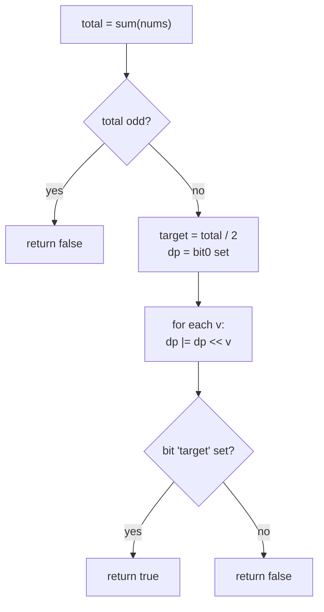

# LeetCode 416 — Partition Equal Subset Sum (Bitset DP)

| Field | Value |
|-------|-------|
| Source | LeetCode |
| Difficulty | Medium |
| Topics | Dynamic programming, subset sum, bitset optimization |
| Link | https://leetcode.com/problems/partition-equal-subset-sum/ |

---

## Problem Statement

Given an integer array `nums`, return `true` if it can be partitioned into two subsets whose sums
are equal, and `false` otherwise.

Let $T = \sum nums$. A valid partition exists iff $T$ is even **and** some subset sums to
$T/2$. So the problem reduces to **subset-sum feasibility** for the target $T/2$.

Constraints: $1 \le n \le 200$, $1 \le nums[i] \le 100$, so $T \le 20000$ and the target fits in a
bitset of about $10001$ bits.

```text
Input:  nums = [1, 5, 11, 5]
Total:  T = 22, half = 11
Subset: {11} sums to 11, complement {1,5,5} also sums to 11
Output: true

Input:  nums = [1, 2, 3, 5]
Total:  T = 11 (odd) -> impossible
Output: false
```

---

## Approach (WHY)

The textbook DP keeps a boolean `dp[s]` = "some subset sums to $s$". Processing item $v$ updates
`dp[s] |= dp[s - v]` for all $s$ from high to low — that inner loop over $s$ is $O(T)$ per item,
$O(n \cdot T)$ overall (here up to $200 \cdot 10000 = 2{\times}10^6$, fine, but a great bitset demo).

The key insight: the **entire boolean row `dp` is a bit-vector**, and "for every reachable sum $s$,
mark $s + v$ reachable" is exactly **shift the whole vector left by $v$ and OR it back**:

$$
dp \mathrel{|}= (dp \ll v).
$$

One shift-OR processes all $T$ sums in $T/64$ word operations, so the DP is
$O(n \cdot T / 64)$ — a clean $64\times$ shrink of the inner loop with no logic change.

We start with bit $0$ set (empty subset sums to $0$), apply one shift-OR per number, then test bit
$T/2$.

---

## Implementation

```python
from typing import List

class Solution:
    def canPartition(self, nums: List[int]) -> bool:
        total = sum(nums)
        if total % 2:                 # odd total can never split evenly
            return False
        target = total // 2
        dp = 1                        # bit s set <=> sum s reachable; sum 0 reachable
        mask = (1 << (target + 1)) - 1  # cap width: we only care about sums <= target
        for v in nums:
            dp |= (dp << v)
            dp &= mask                # keep the int from growing past target
        return (dp >> target) & 1 == 1

print(Solution().canPartition([1, 5, 11, 5]))  # True
print(Solution().canPartition([1, 2, 3, 5]))   # False
```

```cpp
#include <bits/stdc++.h>
using namespace std;

class Solution {
public:
    bool canPartition(vector<int>& nums) {
        long long total = 0;
        for (int v : nums) total += v;
        if (total % 2) return false;          // odd total can never split evenly
        int target = (int)(total / 2);
        static const int MAXS = 10001;        // 200 * 100 / 2 + 1
        bitset<MAXS> dp;
        dp[0] = 1;                            // sum 0 reachable
        for (int v : nums)
            dp |= dp << v;                    // /64 speedup per number
        return dp.test(target);
    }
};

int main() {
    Solution s;
    vector<int> a = {1, 5, 11, 5}, b = {1, 2, 3, 5};
    cout << boolalpha << s.canPartition(a) << " " << s.canPartition(b) << "\n"; // true false
    return 0;
}
```

---

## Trace

For `nums = [1, 5, 11, 5]`, target = 11. `dp` shown as the set of reachable sums:

```text
init        : {0}
after v=1   : {0,1}                         dp |= dp<<1
after v=5   : {0,1,5,6}                      dp |= dp<<5
after v=11  : {0,1,5,6,11,12,16,17}          dp |= dp<<11
after v=5   : {0,1,5,6,10,11,12,16,17,...}    dp |= dp<<5
test bit 11 : set  -> return true
```

Bit $11$ appears once $\{11\}$ is reachable (from the third item), so the answer is `true`.

---

## Mermaid



---

## Math & Complexity

A partition into equal halves exists iff $T = \sum nums$ is even and

$$
\exists\, S \subseteq nums : \sum_{x \in S} x = \frac{T}{2}.
$$

The shift-OR recurrence builds the reachable-sum set incrementally:

$$
dp_0 = \{0\}, \qquad dp_i = dp_{i-1} \cup (dp_{i-1} + nums_i),
$$

where $+v$ is implemented as $\ll v$. With $w = 64$:

- **Time:** $O\!\left(\dfrac{n \cdot T}{w}\right)$, here $\approx \dfrac{200 \cdot 10000}{64}$.
- **Space:** $O(T / w)$ words for the bitset.

---

## Takeaway

Equal-subset partition is subset-sum feasibility for target $T/2$. Modeling the reachable-sum row
as a single bit-vector turns the DP into one `dp |= dp << v` per item, delivering a $64\times$
constant-factor speedup over the scalar boolean loop while keeping the code shorter.
