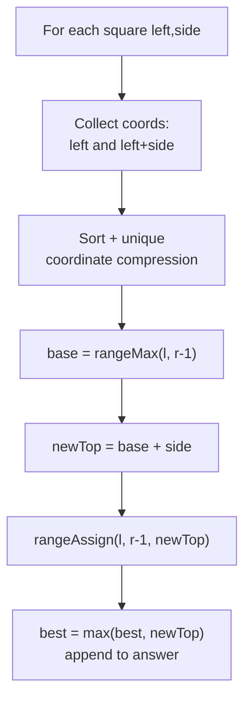

# Falling Squares

| Meta | Value |
|------|-------|
| Source | LeetCode 699 |
| Difficulty | Hard |
| Topics | Segment Tree, Lazy Propagation, Range Assign, Range Max, Coordinate Compression |
| Link | https://leetcode.com/problems/falling-squares/ |

---

## Problem Statement

Squares drop one by one onto a number line. The $i$-th square is given as
`positions[i] = [left, sideLength]`; it occupies the half-open interval
$[\,\text{left},\ \text{left} + \text{sideLength}\,)$ and lands on top of whatever is currently
the highest in that interval (the floor is height $0$). After each drop, record the **maximum
height of any stack so far**. Return the list of these running maxima.

Formally, when a square of side $s$ falls onto interval $[l, r)$, let
$base = \max\big(\text{current heights over } [l, r)\big)$. The new height across $[l, r)$
becomes $base + s$. We then report the global maximum height seen up to and including this drop.

```
positions = [[1, 2], [2, 3], [6, 1]]

drop [1,2): occupies [1,3), base = 0, height -> 2, running max = 2
drop [2,3]: occupies [2,5), base = max over [2,5) = 2, height -> 5, running max = 5
drop [6,1]: occupies [6,7), base = 0, height -> 1, running max = 5

answer = [2, 5, 5]
```

---

## Approach (WHY)

Two range operations are needed:

- **range-max query** over $[l, r)$ to find the base height the square lands on.
- **range-assign** of $base + s$ to every position in $[l, r)$ (the whole interval becomes flat
  at the new top).

That is exactly a **range-assign + range-max lazy segment tree**. The only complication is that
coordinates can be up to $10^8$ while there are at most $1000$ squares, so we **coordinate
compress** the distinct interval endpoints down to a small index space before building the tree.

Because intervals are half-open $[l, r)$, we compress endpoints and operate on the cells
*between* consecutive distinct coordinates. A clean way: collect all `left` and `right = left +
side` values, sort-unique them, and map each square to the compressed cell range $[\,
idx(l),\ idx(r) - 1\,]$ (inclusive) so adjacent squares that merely touch do not overlap.



---

## Solution

### Python

```python
from typing import List


class RangeAssignMaxSeg:
    def __init__(self, n):
        self.n = n
        self.tree = [0] * (4 * n)
        self.lazy = [None] * (4 * n)     # None == no pending assignment

    def _apply(self, node, v):
        self.tree[node] = v              # whole segment flat at v -> max is v
        self.lazy[node] = v

    def _push_down(self, node):
        if self.lazy[node] is not None:
            self._apply(2 * node, self.lazy[node])
            self._apply(2 * node + 1, self.lazy[node])
            self.lazy[node] = None

    def assign(self, l, r, v, node=1, nl=0, nr=None):
        if nr is None:
            nr = self.n - 1
        if r < nl or nr < l:
            return
        if l <= nl and nr <= r:
            self._apply(node, v)
            return
        self._push_down(node)
        mid = (nl + nr) // 2
        self.assign(l, r, v, 2 * node, nl, mid)
        self.assign(l, r, v, 2 * node + 1, mid + 1, nr)
        self.tree[node] = max(self.tree[2 * node], self.tree[2 * node + 1])

    def query(self, l, r, node=1, nl=0, nr=None):
        if nr is None:
            nr = self.n - 1
        if r < nl or nr < l:
            return 0
        if l <= nl and nr <= r:
            return self.tree[node]
        self._push_down(node)
        mid = (nl + nr) // 2
        return max(self.query(l, r, 2 * node, nl, mid),
                   self.query(l, r, 2 * node + 1, mid + 1, nr))


class Solution:
    def fallingSquares(self, positions: List[List[int]]) -> List[int]:
        # Coordinate compression of all endpoints.
        coords = set()
        for left, side in positions:
            coords.add(left)
            coords.add(left + side)
        sorted_coords = sorted(coords)
        index = {c: i for i, c in enumerate(sorted_coords)}

        seg = RangeAssignMaxSeg(len(sorted_coords))
        ans = []
        best = 0
        for left, side in positions:
            l = index[left]
            r = index[left + side]          # half-open -> use [l, r-1]
            base = seg.query(l, r - 1)
            new_top = base + side
            seg.assign(l, r - 1, new_top)
            best = max(best, new_top)
            ans.append(best)
        return ans
```

### C++

```cpp
#include <bits/stdc++.h>
using namespace std;

struct RangeAssignMaxSeg {
    int n;
    vector<long long> tree, lazy;
    vector<char> has;                 // has[node] == 1 -> pending assignment

    RangeAssignMaxSeg(int n_) : n(n_), tree(4 * n_, 0), lazy(4 * n_, 0), has(4 * n_, 0) {}

    void applyTag(int node, long long v) {
        tree[node] = v;               // whole segment flat at v -> max is v
        lazy[node] = v;
        has[node] = 1;
    }

    void pushDown(int node) {
        if (has[node]) {
            applyTag(2 * node, lazy[node]);
            applyTag(2 * node + 1, lazy[node]);
            has[node] = 0;
        }
    }

    void assign(int l, int r, long long v, int node = 1, int nl = 0, int nr = -1) {
        if (nr == -1) nr = n - 1;
        if (r < nl || nr < l) return;
        if (l <= nl && nr <= r) { applyTag(node, v); return; }
        pushDown(node);
        int mid = (nl + nr) / 2;
        assign(l, r, v, 2 * node, nl, mid);
        assign(l, r, v, 2 * node + 1, mid + 1, nr);
        tree[node] = max(tree[2 * node], tree[2 * node + 1]);
    }

    long long query(int l, int r, int node = 1, int nl = 0, int nr = -1) {
        if (nr == -1) nr = n - 1;
        if (r < nl || nr < l) return 0;
        if (l <= nl && nr <= r) return tree[node];
        pushDown(node);
        int mid = (nl + nr) / 2;
        return max(query(l, r, 2 * node, nl, mid),
                   query(l, r, 2 * node + 1, mid + 1, nr));
    }
};

class Solution {
public:
    vector<int> fallingSquares(vector<vector<int>>& positions) {
        // Coordinate compression of all endpoints.
        vector<int> coords;
        for (auto& p : positions) {
            coords.push_back(p[0]);
            coords.push_back(p[0] + p[1]);
        }
        sort(coords.begin(), coords.end());
        coords.erase(unique(coords.begin(), coords.end()), coords.end());

        auto idx = [&](int x) {
            return (int)(lower_bound(coords.begin(), coords.end(), x) - coords.begin());
        };

        RangeAssignMaxSeg seg((int)coords.size());
        vector<int> ans;
        long long best = 0;
        for (auto& p : positions) {
            int l = idx(p[0]);
            int r = idx(p[0] + p[1]);       // half-open -> use [l, r-1]
            long long base = seg.query(l, r - 1);
            long long newTop = base + p[1];
            seg.assign(l, r - 1, newTop);
            best = max(best, newTop);
            ans.push_back((int)best);
        }
        return ans;
    }
};
```

---

## Iteration Trace

`positions = [[1, 2], [2, 3], [6, 1]]`. Distinct endpoints `{1, 2, 3, 5, 6, 7}` compress to
indices `{1:0, 2:1, 3:2, 5:3, 6:4, 7:5}`. Each square uses cells $[l, r-1]$:

| Drop | Interval | Cells $[l, r-1]$ | base = max | new top | running best | answer |
|------|----------|------------------|------------|---------|--------------|--------|
| `[1,2]` | $[1,3)$ | $[0, 1]$ | $0$ | $0+2 = 2$ | $2$ | $2$ |
| `[2,3]` | $[2,5)$ | $[1, 2]$ | $2$ | $2+3 = 5$ | $5$ | $5$ |
| `[6,1]` | $[6,7)$ | $[4, 4]$ | $0$ | $0+1 = 1$ | $5$ | $5$ |

Drop 2's cell range $[1,2]$ overlaps drop 1's cell $1$, so its base correctly reads height $2$,
producing top $5$. Drop 3 is disjoint, lands on the floor.

---

## Complexity

Let $m$ be the number of squares. Coordinate compression yields at most $2m$ cells; each square
does one range-max query and one range-assign:

$$T = O(m \log m), \qquad M = O(m)$$

| Operation | Time | Space |
|-----------|------|-------|
| Coordinate compression | $O(m \log m)$ | $O(m)$ |
| Per square (max query + assign) | $O(\log m)$ | — |
| All $m$ squares | $O(m \log m)$ | $O(m)$ |

---

## Takeaway

Falling Squares is a textbook **range-assign + range-max** lazy segment tree once you notice that
each landing **flattens** an interval to a single height (assign) and you need the current peak
under that interval (max query). Two implementation details matter: use **coordinate
compression** because positions are sparse and large, and handle the **half-open** interval by
operating on cells $[l, r-1]$ so squares that merely touch at an endpoint do not falsely overlap.
