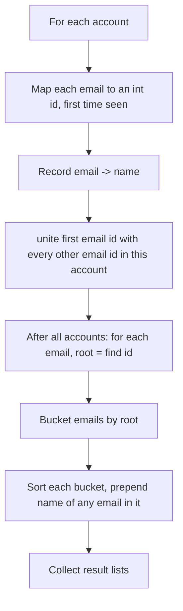
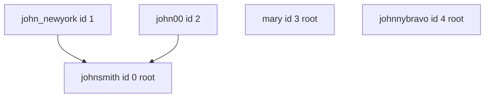

# LeetCode 721 — Accounts Merge

| | |
|---|---|
| **Source** | LeetCode |
| **Difficulty** | Medium |
| **Topics** | DSU / Union-Find, hashing / string-to-id mapping, grouping |
| **Link** | https://leetcode.com/problems/accounts-merge/ |

---

## Problem Statement

You are given a list `accounts`, where `accounts[i] = [name, email1, email2, ...]`. The first element is a person's **name**, and the rest are **emails** belonging to that account.

Two accounts **belong to the same person** if they share **at least one common email** (even if names look the same, different people may share a name — but a shared email always means the same person). Names alone never merge accounts.

Merge the accounts and return them in the format `[name, sorted_email_1, sorted_email_2, ...]`. Emails within an account must be in **sorted order**, and the name is the first element. The accounts themselves may be returned in any order.

Let $A$ be the number of accounts and $E$ the total number of emails across all accounts.

```
Input
accounts = [
  ["John", "johnsmith@mail.com", "john_newyork@mail.com"],
  ["John", "johnsmith@mail.com", "john00@mail.com"],
  ["Mary", "mary@mail.com"],
  ["John", "johnnybravo@mail.com"]
]

Output
[
  ["John", "john00@mail.com", "john_newyork@mail.com", "johnsmith@mail.com"],
  ["Mary", "mary@mail.com"],
  ["John", "johnnybravo@mail.com"]
]
```

The first two `John` accounts share `johnsmith@mail.com`, so they merge into one account with three emails. The third `John` shares nothing, so it stays separate.

## Approach (WHY)

Each **email** is a node. Within a single account, all emails belong to the same person, so we `unite` the first email of the account with every other email in that account. Across accounts, two emails that are textually identical are the *same node*, which is what transitively links accounts that share an email.

DSU works on integers, so we **map each distinct email string to an integer id**. We also remember which name owns each email (any account containing it has the same person's name). After all unions:

- group emails by their DSU representative,
- sort each group,
- prepend the owner's name.



## Solution

### Python

```python
from typing import List


class DSU:
    def __init__(self, n: int) -> None:
        self.parent = list(range(n))
        self.size = [1] * n

    def find(self, x: int) -> int:
        while self.parent[x] != x:
            self.parent[x] = self.parent[self.parent[x]]   # path halving
            x = self.parent[x]
        return x

    def unite(self, a: int, b: int) -> None:
        ra, rb = self.find(a), self.find(b)
        if ra == rb:
            return
        if self.size[ra] < self.size[rb]:
            ra, rb = rb, ra
        self.parent[rb] = ra
        self.size[ra] += self.size[rb]


class Solution:
    def accountsMerge(self, accounts: List[List[str]]) -> List[List[str]]:
        email_id = {}          # email -> int id
        email_name = {}        # email -> owner name

        for account in accounts:
            name = account[0]
            for email in account[1:]:
                if email not in email_id:
                    email_id[email] = len(email_id)
                email_name[email] = name

        dsu = DSU(len(email_id))

        for account in accounts:
            first = email_id[account[1]]
            for email in account[2:]:
                dsu.unite(first, email_id[email])

        # Bucket emails by representative.
        groups = {}
        for email, eid in email_id.items():
            root = dsu.find(eid)
            groups.setdefault(root, []).append(email)

        result = []
        for root, emails in groups.items():
            emails.sort()
            result.append([email_name[emails[0]]] + emails)
        return result
```

### C++

```cpp
#include <bits/stdc++.h>
using namespace std;

struct DSU {
    vector<int> parent, sz;
    explicit DSU(int n) : parent(n), sz(n, 1) {
        iota(parent.begin(), parent.end(), 0);
    }
    int find(int x) {
        while (parent[x] != x) {
            parent[x] = parent[parent[x]];     // path halving
            x = parent[x];
        }
        return x;
    }
    void unite(int a, int b) {
        int ra = find(a), rb = find(b);
        if (ra == rb) return;
        if (sz[ra] < sz[rb]) swap(ra, rb);
        parent[rb] = ra;
        sz[ra] += sz[rb];
    }
};

class Solution {
public:
    vector<vector<string>> accountsMerge(vector<vector<string>>& accounts) {
        unordered_map<string, int> emailId;       // email -> id
        unordered_map<string, string> emailName;  // email -> owner name

        for (auto& account : accounts) {
            const string& name = account[0];
            for (size_t j = 1; j < account.size(); ++j) {
                const string& email = account[j];
                if (emailId.find(email) == emailId.end())
                    emailId[email] = (int)emailId.size();
                emailName[email] = name;
            }
        }

        DSU dsu((int)emailId.size());

        for (auto& account : accounts) {
            int first = emailId[account[1]];
            for (size_t j = 2; j < account.size(); ++j)
                dsu.unite(first, emailId[account[j]]);
        }

        // Bucket emails by representative.
        unordered_map<int, vector<string>> groups;
        for (auto& kv : emailId)
            groups[dsu.find(kv.second)].push_back(kv.first);

        vector<vector<string>> result;
        for (auto& kv : groups) {
            vector<string>& emails = kv.second;
            sort(emails.begin(), emails.end());
            vector<string> entry;
            entry.push_back(emailName[emails[0]]);
            for (auto& e : emails) entry.push_back(e);
            result.push_back(move(entry));
        }
        return result;
    }
};
```

## Iteration Trace

Assigning ids as emails are first seen, then uniting within each account:

| Account | Name | Emails (ids) | Unions performed |
|---|---|---|---|
| 0 | John | `johnsmith`=0, `john_newyork`=1 | unite(0,1) |
| 1 | John | `johnsmith`=0, `john00`=2 | unite(0,2) |
| 2 | Mary | `mary`=3 | none (single email) |
| 3 | John | `johnnybravo`=4 | none (single email) |

DSU state after unions (roots via union by size):

| email | id | root |
|---|---|---|
| johnsmith | 0 | 0 |
| john_newyork | 1 | 0 |
| john00 | 2 | 0 |
| mary | 3 | 3 |
| johnnybravo | 4 | 4 |

Buckets → sorted → prepend name:

| Root | Emails sorted | Output entry |
|---|---|---|
| 0 | john00, john_newyork, johnsmith | `["John", "john00@...", "john_newyork@...", "johnsmith@..."]` |
| 3 | mary | `["Mary", "mary@..."]` |
| 4 | johnnybravo | `["John", "johnnybravo@..."]` |



## Complexity

Let $E$ be the total number of emails and $L$ the maximum email length. Sorting each group dominates the post-processing.

$$
O\bigl(E \log E \cdot L\bigr) \ \text{time}, \qquad O(E \cdot L)\ \text{space.}
$$

The DSU unions themselves cost $O(E\,\alpha(E))$, negligible beside the string sort and hashing.

| Resource | Bound |
|---|---|
| Time | $O(E \log E \cdot L)$ (sorting + hashing emails) |
| Space | $O(E \cdot L)$ |

## Takeaway

When the things you must group are **strings** (or other non-integer keys), map each distinct key to an integer id, run DSU on ids, then bucket by representative. Uniting the first email of every account with the rest stitches together any accounts sharing an email — the transitive closure falls out of the union-find structure for free.
