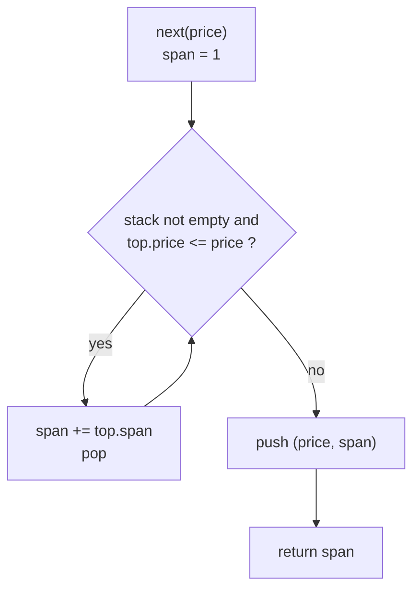
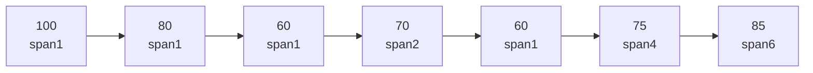

# LeetCode 901 — Online Stock Span

| Meta | Value |
|------|-------|
| Source | LeetCode |
| Difficulty | Medium |
| Topics | Monotonic stack, design |
| Link | https://leetcode.com/problems/online-stock-span/ |

---

## Problem Statement

Design a `StockSpanner` that processes a stream of daily stock prices. For each new price, return its **span**: the number of consecutive days (ending today, going backwards) for which the price was **less than or equal to** today's price.

Formally, for the price on day $i$ the span is

$$\text{span}_i = i - p + 1$$

where $p$ is the index of the nearest previous day with a price **strictly greater** than today's (or $-1$ if none exists).

Constraints:

$$1 \le \text{price} \le 10^5, \qquad \text{at most } 10^4 \text{ calls to } \texttt{next}.$$

```
Input prices:  100  80  60  70  60  75  85
Output spans:    1   1   1   2   1   4   6
```

For the price `75`, the previous days `60, 70, 60` are all ≤ 75, but `80` is greater — so the span is `4` (days 60, 70, 60, 75).

## Approach (WHY)

This is "**previous greater element**" but instead of returning the index we accumulate the span. Maintain a **monotonic decreasing stack** of `(price, span)` pairs.

When a new `price` arrives, start with `span = 1`. While the stack's top price is `<= price`, that day (and the span it already absorbed) is fully covered by today, so **pop it and add its span to ours**. The stack stays strictly decreasing by price, so each element is pushed and popped at most once → amortized $O(1)$ per call.



## Solution

### Python

```python
class StockSpanner:
    def __init__(self) -> None:
        self.stk: list[tuple[int, int]] = []  # (price, span), price strictly decreasing

    def next(self, price: int) -> int:
        span = 1
        while self.stk and self.stk[-1][0] <= price:
            span += self.stk.pop()[1]
        self.stk.append((price, span))
        return span


sp = StockSpanner()
print([sp.next(p) for p in [100, 80, 60, 70, 60, 75, 85]])
# [1, 1, 1, 2, 1, 4, 6]
```

### C++

```cpp
#include <bits/stdc++.h>
using namespace std;

class StockSpanner {
    stack<pair<int, int>> stk;  // (price, span), price strictly decreasing
public:
    int next(int price) {
        int span = 1;
        while (!stk.empty() && stk.top().first <= price) {
            span += stk.top().second;
            stk.pop();
        }
        stk.push({price, span});
        return span;
    }
};

int main() {
    StockSpanner sp;
    for (int p : {100, 80, 60, 70, 60, 75, 85})
        cout << sp.next(p) << ' ';
    cout << "\n"; // 1 1 1 2 1 4 6
}
```

## Iteration Trace

Prices in order: `100, 80, 60, 70, 60, 75, 85`. Stack holds `(price, span)` with prices strictly decreasing bottom→top.

| Call | price | Pops (price ≤ today, add span) | span | Stack after push |
|------|-------|--------------------------------|------|------------------|
| 1 | 100 | — | 1 | (100,1) |
| 2 | 80  | — (100 > 80) | 1 | (100,1)(80,1) |
| 3 | 60  | — (80 > 60) | 1 | (100,1)(80,1)(60,1) |
| 4 | 70  | pop (60,1) → +1 | 2 | (100,1)(80,1)(70,2) |
| 5 | 60  | — (70 > 60) | 1 | (100,1)(80,1)(70,2)(60,1) |
| 6 | 75  | pop (60,1)+1, (70,2)+2, (80?80>75 stop) | 4 | (100,1)(80,1)(75,4) |
| 7 | 85  | pop (75,4)+4, (80,1)+1, (100?100>85 stop) | 6 | (100,1)(85,6) |

Output spans: `1 1 1 2 1 4 6` ✓



## Complexity

Across $m$ calls, each price is pushed once and popped at most once, so the total work is $O(m)$ — amortized $O(1)$ per `next` call:

$$\sum_{i=1}^{m} \text{cost}_i = O(m), \qquad \text{Space} = O(m).$$

| Aspect | Bound |
|--------|-------|
| `next` (amortized) | $O(1)$ |
| Total over $m$ calls | $O(m)$ |
| Space | $O(m)$ |

## Takeaway

When a problem asks "how far back until a strictly greater value," reach for a **monotonic decreasing stack**. Storing `(value, accumulated span)` lets popped elements **donate their spans**, collapsing the previous-greater search into amortized $O(1)$.
