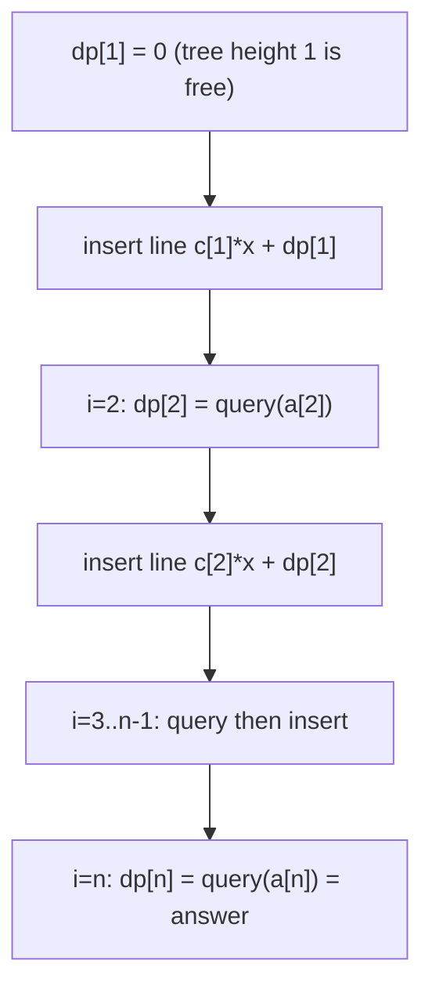

# Codeforces 319C — Kalila and Dimna in the Logging Industry (Li Chao Tree)

| Meta | Value |
|------|-------|
| Source | Codeforces Round 189 (Div. 1) — Problem C |
| Difficulty | Hard (≈2100) |
| Topics | DP optimization, Convex Hull Trick, Li Chao Tree |
| Link | https://codeforces.com/problemset/problem/319/C |

---

## Problem Statement

There are $n$ trees with heights $a_1 < a_2 < \dots < a_n$ where $a_1 = 1$. Each tree
$i$ also has a charge cost $c_1 > c_2 > \dots > c_n$ with $c_n = 0$. You have a
chainsaw. Cutting one unit of height off any tree discharges the chainsaw, and to use
it again you must **recharge** it. You may recharge using any tree that is already
**completely cut down** (height reduced to $0$); recharging via tree $i$ costs $c_i$.

A tree of height $a_i$ needs $a_i$ unit-cuts, hence $a_i$ recharges, each of which may
pick the cheapest already-cut tree. The chainsaw starts charged once for free, and
$a_1 = 1$ means tree $1$ can be felled immediately at cost $0$. Cut **all** trees with
minimum total cost; output the minimum cost to fell tree $n$ (felling tree $n$ implies
all others have been used along the way).

Let $dp[i]$ be the minimum cost to completely cut tree $i$. Then

$$
dp[1] = 0, \qquad
dp[i] = \min_{j < i} \big( dp[j] + a_i \cdot c_j \big),
$$

because each of the $a_i$ recharges needed for tree $i$ uses some already-cut tree $j$
at cost $c_j$, and we pick the best previous state. The answer is $dp[n]$.

Constraints: $1 \le n \le 10^5$, $1 \le a_i, c_i \le 10^9$, with the given strict
orderings and $a_1 = 1$, $c_n = 0$.

```text
Input
5
1 2 3 4 5            (heights a)
5 4 3 2 0            (costs c)

dp[1] = 0
line from j=1: y = c[1]*x + dp[1] = 5x + 0

dp[2] (a=2): j=1 -> 5*2 + 0 = 10            -> dp[2] = 10
line from j=2: y = 4x + 10

dp[3] (a=3): min(5*3+0=15, 4*3+10=22) = 15  -> dp[3] = 15
line from j=3: y = 3x + 15

dp[4] (a=4): min(20, 26, 27) = 20           -> dp[4] = 20
line from j=4: y = 2x + 20

dp[5] (a=5): min(25, 30, 30, 30) = 25       -> dp[5] = 25

Output
25
```

---

## Approach (WHY)

The transition $dp[i] = \min_{j<i}(dp[j] + a_i \cdot c_j)$ is a minimum over lines: each
already-cut tree $j$ gives a line $y = c_j \cdot x + dp[j]$, and $dp[i]$ evaluates that
family at $x = a_i$. So we maintain the lines in a **Li Chao tree** and answer each new
state with one point query.

Here the slopes $c_j$ are **strictly decreasing** and the query points $a_i$ strictly
increasing — a textbook monotonic CHT *would* work — but a **Li Chao tree** needs no
monotonicity assumptions, is shorter to implement correctly, and generalizes if the
orderings were ever relaxed. Since the only query coordinates are the heights $a_i$
(distinct, sorted), we discretize over `xs = a` and use the **array/index version**.

We insert state $j$'s line as soon as $dp[j]$ is known, guaranteeing tree $i$'s query
only sees lines for $j < i$.



---

## Solution

### Python

```python
import sys
from typing import List

INF = float("inf")


class LiChaoMin:
    """Min Li Chao tree over a discretized x-domain xs (sorted, unique)."""

    def __init__(self, xs: List[int]) -> None:
        self.xs = xs
        self.n = len(xs)
        size = 4 * self.n
        self.m = [0] * size
        self.b = [INF] * size  # INF intercept => empty line

    def _f(self, idx: int, x: int) -> float:
        return self.m[idx] * x + self.b[idx]

    def insert(self, m: int, b: int) -> None:
        self._insert(1, 0, self.n - 1, m, b)

    def _insert(self, node: int, lo: int, hi: int, m: int, b: int) -> None:
        mid = (lo + hi) // 2
        xl, xm = self.xs[lo], self.xs[mid]
        if m * xm + b < self._f(node, xm):
            self.m[node], m = m, self.m[node]
            self.b[node], b = b, self.b[node]
        if lo == hi:
            return
        if m * xl + b < self._f(node, xl):
            self._insert(2 * node, lo, mid, m, b)
        else:
            self._insert(2 * node + 1, mid + 1, hi, m, b)

    def query(self, x_index: int) -> int:
        node, lo, hi = 1, 0, self.n - 1
        x = self.xs[x_index]
        res = self._f(node, x)
        while lo != hi:
            mid = (lo + hi) // 2
            if x_index <= mid:
                node, hi = 2 * node, mid
            else:
                node, lo = 2 * node + 1, mid + 1
            res = min(res, self._f(node, x))
        return int(res)


def solve(n: int, a: List[int], c: List[int]) -> int:
    # a, c are 0-indexed here (a[0]..a[n-1]); a is strictly increasing.
    xs = a[:]  # query coordinates are exactly the heights, already sorted & unique
    index_of = {v: i for i, v in enumerate(xs)}
    tree = LiChaoMin(xs)

    dp = [0] * n
    dp[0] = 0  # tree of height a[0] = 1 cut for free
    tree.insert(c[0], dp[0])  # line for j = 0
    for i in range(1, n):
        dp[i] = tree.query(index_of[a[i]])
        tree.insert(c[i], dp[i])  # line for j = i
    return dp[n - 1]


def main() -> None:
    data = sys.stdin.buffer.read().split()
    if not data:
        return
    idx = 0
    n = int(data[idx]); idx += 1
    a = [int(data[idx + k]) for k in range(n)]; idx += n
    c = [int(data[idx + k]) for k in range(n)]; idx += n
    print(solve(n, a, c))


main()
```

### C++

```cpp
#include <bits/stdc++.h>
using namespace std;

const long long INF = 1e18;

struct LiChaoMin {
    // Min Li Chao tree over a discretized x-domain xs (sorted, unique).
    vector<long long> xs;
    int n;
    vector<long long> m, b;  // stored line per node: f(x) = m*x + b

    LiChaoMin(const vector<long long>& xs_) : xs(xs_), n((int)xs_.size()) {
        m.assign(4 * n, 0);
        b.assign(4 * n, INF);  // empty line => f(x) = INF
    }

    // use __int128 to compare line values safely (a*c can reach 1e18)
    static __int128 val(long long m, long long b, long long x) {
        return (__int128)m * x + b;
    }

    void insert(long long nm, long long nb) { insert(1, 0, n - 1, nm, nb); }

    void insert(int node, int lo, int hi, long long nm, long long nb) {
        int mid = (lo + hi) / 2;
        long long xl = xs[lo], xm = xs[mid];
        if (val(nm, nb, xm) < val(m[node], b[node], xm)) {  // lower at midpoint
            swap(nm, m[node]);
            swap(nb, b[node]);
        }
        if (lo == hi) return;
        if (val(nm, nb, xl) < val(m[node], b[node], xl))    // loser wins on left
            insert(2 * node, lo, mid, nm, nb);
        else
            insert(2 * node + 1, mid + 1, hi, nm, nb);
    }

    long long query(int xIndex) const {
        int node = 1, lo = 0, hi = n - 1;
        long long x = xs[xIndex];
        __int128 res = val(m[node], b[node], x);
        while (lo != hi) {
            int mid = (lo + hi) / 2;
            if (xIndex <= mid) { node = 2 * node;     hi = mid; }
            else               { node = 2 * node + 1; lo = mid + 1; }
            res = min(res, val(m[node], b[node], x));
        }
        return (long long)res;
    }
};

long long solve(int n, const vector<long long>& a, const vector<long long>& c) {
    // a, c are 0-indexed; a strictly increasing, so it is already the x-domain.
    vector<long long> xs = a;
    auto idxOf = [&](long long v) {
        return (int)(lower_bound(xs.begin(), xs.end(), v) - xs.begin());
    };

    LiChaoMin tree(xs);
    vector<long long> dp(n, 0);
    dp[0] = 0;                      // tree of height a[0] = 1 cut for free
    tree.insert(c[0], dp[0]);       // line for j = 0
    for (int i = 1; i < n; i++) {
        dp[i] = tree.query(idxOf(a[i]));
        tree.insert(c[i], dp[i]);   // line for j = i
    }
    return dp[n - 1];
}

int main() {
    ios::sync_with_stdio(false);
    cin.tie(nullptr);
    int n;
    if (!(cin >> n)) return 0;
    vector<long long> a(n), c(n);
    for (int i = 0; i < n; i++) cin >> a[i];
    for (int i = 0; i < n; i++) cin >> c[i];
    cout << solve(n, a, c) << "\n";
    return 0;
}
```

---

## Trace (n = 5, a = [1,2,3,4,5], c = [5,4,3,2,0])

| Step | Action | Lines in tree (slope $c_j$, intercept $dp[j]$) | Result |
|------|--------|------------------------------------------------|--------|
| init | `dp[1]=0`, insert j=1 | $(5,\,0)$ | — |
| i=2  | query a=2 → $5\cdot2+0=10$ | — | `dp[2]=10` |
|      | insert j=2 | $(5,0),\,(4,10)$ | — |
| i=3  | query a=3 → min($15$, $22$) | — | `dp[3]=15` |
|      | insert j=3 | $(5,0),(4,10),(3,15)$ | — |
| i=4  | query a=4 → min($20$, $26$, $27$) | — | `dp[4]=20` |
|      | insert j=4 | + $(2,20)$ | — |
| i=5  | query a=5 → min($25$, $30$, $30$, $30$) | — | `dp[5]=25` |

Answer: `dp[5] = 25`, matching the sample. (Second official sample
`a=[1,2,3,10,20,30]`, `c=[6,5,4,3,2,0]` yields `138` by the same recurrence.)

---

## Math & Complexity

Each cut tree $j$ contributes a line $y = c_j \cdot x + dp[j]$, and

$$
dp[i] = \min_{j < i} \big( c_j \cdot a_i + dp[j] \big)
$$

is the minimum of those lines at $x = a_i$. With $n$ inserts and $n$ queries, each
$O(\log n)$ on the array Li Chao tree:

$$
T(n) = O(n \log n), \qquad S(n) = O(n).
$$

Overflow: $a_i \cdot c_j$ reaches $10^9 \cdot 10^9 = 10^{18}$, and chained $dp$ values
can push past the signed 64-bit limit during comparisons. The C++ solution evaluates
every line with `__int128` (`val(...)`) so midpoint and endpoint comparisons never
overflow; `const long long INF = 1e18` is still a valid empty-line sentinel because
true costs are compared in the wider type.

---

## Takeaway

CF 319C is the canonical "DP needs the minimum of $a_i \cdot c_j + dp[j]$" problem.
Recognize each previous state as a **line** $y = c_j x + dp[j]$, drop them into a
**Li Chao tree**, and read off $dp[i]$ with a single point query at $x = a_i$ — turning
an $O(n^2)$ recurrence into $O(n \log n)$, with `__int128` guarding the large
$a \cdot c$ products.
