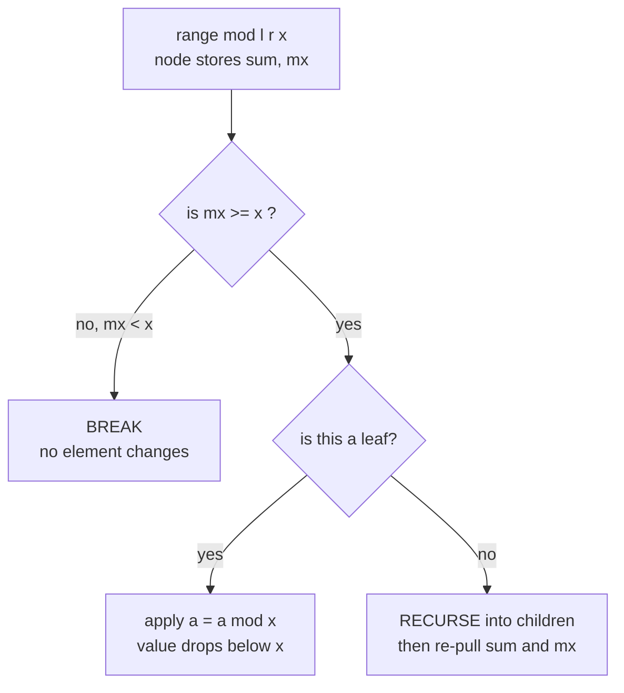

# The Child and Sequence (Codeforces 438D) — Range Mod, Point Set, Range Sum

| Meta | Value |
|------|-------|
| Source | Codeforces Round 250 (Div. 1) — Problem D |
| Difficulty | Hard |
| Topics | Segment Tree, Range Mod, Beats-style Amortization, Range Sum |
| Link | https://codeforces.com/problemset/problem/438/D |

---

## Problem Statement

You are given an array $a_1, \dots, a_n$ and must process $m$ operations:

- `1 l r`   — output $\sum_{i=l}^{r} a_i$ (**range sum**).
- `2 l r x` — for every $i \in [l, r]$, do $a_i \leftarrow a_i \bmod x$ (**range mod**).
- `3 k x`   — set $a_k \leftarrow x$ (**point assignment**).

Constraints: $1 \le n, m \le 10^5$ and $1 \le a_i, x \le 10^9$. A range sum reaches $\sim 10^{14}$, so use 64-bit.

The trap: a range mod is *not* distributive — you cannot lazily "mod a whole segment" with a single tag, because each element's new value depends on the element itself.

```text
n=5, a = [1, 2, 3, 4, 5]

2 3 5 4      a[i] %= 4 for i in [3,5] -> [1, 2, 3, 0, 1]
1 2 5        sum a[2..5] = 2+3+0+1   -> 6
3 3 5        set a[3] = 5            -> [1, 2, 5, 0, 1]
1 2 5        sum a[2..5] = 2+5+0+1   -> 8
```

Output:
```text
6
8
```

---

## Approach (WHY)

The key insight is a **beats-style amortization** for the modulo:

> $a_i \bmod x$ only changes $a_i$ when $a_i \ge x$. And whenever $a_i \ge x$, taking $a_i \bmod x$ makes it **strictly less than $x \le a_i$**, hence the value drops to *less than half* of its old size (since $a \bmod x < x \le a$ implies $a \bmod x \le a/2$ — wait, more precisely $a \bmod x < x$ and $a \ge x$ so the value is reduced below $x$, and across repeated mods each element can be reduced only $O(\log A)$ times).

So we store the **maximum** `mx` in each segment-tree node alongside the **sum**. A range mod operation recurses into a node *only if* $\text{mx} \ge x$ (otherwise nothing in the segment changes — a *break*). When it reaches a single element with $a_i \ge x$, it applies the mod at the leaf. Because each individual element can be modded into a smaller value at most $O(\log A)$ times before reaching 0 (each effective mod at least halves it relative to the modulus class), the **total** number of leaf mods over all operations is $O(n\log A)$, each costing an $O(\log n)$ descent.

Point assignment is an ordinary point update (it may *increase* a value, refreshing its mod budget). Range sum is the standard query. No second-max is needed here — tracking just `mx` plus the "only recurse if `mx >= x`" rule is the beats idea in its simplest guise.

---

## Solution

```python
import sys

class ChildSeq:
    def __init__(self, a):
        self.n = len(a)
        s = 4*self.n
        self.sum = [0]*s
        self.mx  = [0]*s
        self._build(1, 0, self.n-1, a)

    def _pull(self, p):
        self.sum[p] = self.sum[2*p] + self.sum[2*p+1]
        self.mx[p]  = max(self.mx[2*p], self.mx[2*p+1])

    def _build(self, p, l, r, a):
        if l == r:
            self.sum[p] = self.mx[p] = a[l]
            return
        m = (l+r)//2
        self._build(2*p, l, m, a); self._build(2*p+1, m+1, r, a)
        self._pull(p)

    def point_set(self, k, x): self._set(1, 0, self.n-1, k, x)
    def range_mod(self, ql, qr, x): self._mod(1, 0, self.n-1, ql, qr, x)
    def qsum(self, ql, qr): return self._qsum(1, 0, self.n-1, ql, qr)

    def _set(self, p, l, r, k, x):
        if l == r:
            self.sum[p] = self.mx[p] = x
            return
        m = (l+r)//2
        if k <= m: self._set(2*p, l, m, k, x)
        else:      self._set(2*p+1, m+1, r, k, x)
        self._pull(p)

    def _mod(self, p, l, r, ql, qr, x):
        if qr < l or r < ql or self.mx[p] < x:    # break: nothing >= x
            return
        if l == r:                                # leaf: apply the mod
            self.sum[p] %= x
            self.mx[p] = self.sum[p]
            return
        m = (l+r)//2
        self._mod(2*p, l, m, ql, qr, x)
        self._mod(2*p+1, m+1, r, ql, qr, x)
        self._pull(p)

    def _qsum(self, p, l, r, ql, qr):
        if qr < l or r < ql: return 0
        if ql <= l and r <= qr: return self.sum[p]
        m = (l+r)//2
        return self._qsum(2*p, l, m, ql, qr) + self._qsum(2*p+1, m+1, r, ql, qr)
```

```cpp
#include <bits/stdc++.h>
using namespace std;

struct ChildSeq {
    int n;
    vector<long long> sum, mx;

    ChildSeq(const vector<long long>& a) {
        n = (int)a.size();
        int s = 4*n;
        sum.assign(s, 0); mx.assign(s, 0);
        build(1, 0, n-1, a);
    }

    void pull(int p) {
        sum[p] = sum[2*p] + sum[2*p+1];
        mx[p]  = max(mx[2*p], mx[2*p+1]);
    }

    void build(int p, int l, int r, const vector<long long>& a) {
        if (l == r) { sum[p] = mx[p] = a[l]; return; }
        int m = (l+r)>>1;
        build(2*p, l, m, a); build(2*p+1, m+1, r, a);
        pull(p);
    }

    void pointSet(int p, int l, int r, int k, long long x) {
        if (l == r) { sum[p] = mx[p] = x; return; }
        int m = (l+r)>>1;
        if (k <= m) pointSet(2*p, l, m, k, x);
        else        pointSet(2*p+1, m+1, r, k, x);
        pull(p);
    }

    void rangeMod(int p, int l, int r, int ql, int qr, long long x) {
        if (qr < l || r < ql || mx[p] < x) return;   // break: nothing >= x
        if (l == r) {                                 // leaf: apply the mod
            sum[p] %= x;
            mx[p] = sum[p];
            return;
        }
        int m = (l+r)>>1;
        rangeMod(2*p, l, m, ql, qr, x);
        rangeMod(2*p+1, m+1, r, ql, qr, x);
        pull(p);
    }

    long long qsum(int p, int l, int r, int ql, int qr) {
        if (qr < l || r < ql) return 0;
        if (ql <= l && r <= qr) return sum[p];
        int m = (l+r)>>1;
        return qsum(2*p, l, m, ql, qr) + qsum(2*p+1, m+1, r, ql, qr);
    }
};
```

---

## Trace / Walkthrough

Start $a = [1,2,3,4,5]$. Node maxima let us prune.

**`2 3 5 4` (mod indices 3..5 by 4):** at each node we check `mx >= 4`.
- Index 3 holds `3`: leaf `mx = 3 < 4` → **break**, untouched.
- Index 4 holds `4`: leaf `4 >= 4` → apply `4 % 4 = 0`.
- Index 5 holds `5`: leaf `5 >= 4` → apply `5 % 4 = 1`.

Array becomes $[1,2,3,0,1]$.

**`1 2 5` (sum of indices 2..5 → 2,3,0,1):** `6`.

**`3 3 5` (set index 3 to 5):** point update → $[1,2,5,0,1]$. Note this *increases* a value, so it may again exceed future moduli — that is fine, the amortization budget is per "effective mod", and a fresh large value simply earns a new $O(\log A)$ budget.

**`1 2 5` (sum of 2,5,0,1):** `8`.

Crucially, the `mx >= x` break let us skip index 3 (value 3) in the first mod without descending to it — the source of the amortized speed.

---

## Mermaid



---

## Math / Complexity

Let $A$ be the maximum value. A single element, once it satisfies $a \ge x$, becomes $a \bmod x < x \le a$, so its value drops below the modulus. Across a sequence of effective mods an element can be reduced at most $O(\log A)$ times before reaching small values — hence the **total** number of leaf mods is $O((n + m)\log A)$ (point assignments can refresh budgets, adding the $m$ term). Each leaf mod is reached by an $O(\log n)$ descent guided by the `mx >= x` pruning, giving

$$O\big((n + m)\log n \log A\big)$$

overall, with $O(n)$ build and $O(n)$ space. Sums up to $\sim 10^{14}$ fit comfortably in `long long`.

---

## Key Takeaway

Range modulo is non-distributive, but storing the segment **maximum** and only recursing when $\text{mx} \ge x$ turns it into a beats-style amortized structure: each element can be "effectively modded" only $O(\log A)$ times, so the whole sequence of mods costs $O((n+m)\log n\log A)$.
