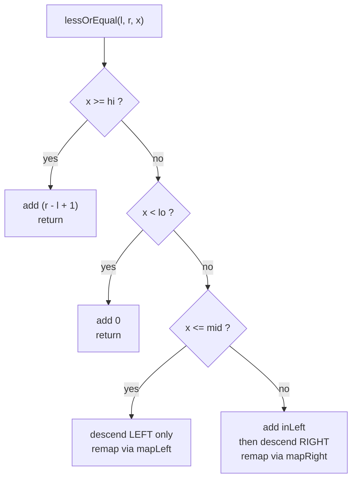

# Count of Elements ≤ x in a Range (Wavelet Tree)

| Field | Value |
| --- | --- |
| Source | Self-contained (classic range-rank query) |
| Difficulty | Medium-Hard |
| Topics | Wavelet tree, coordinate compression, range rank |
| Link | Self-contained (analogous to many online-judge range-counting tasks) |

---

## Problem Statement

You are given an array $a[1..n]$ of integers. Answer $q$ **online** queries. Each
query is a triple $(l, r, x)$ asking: how many elements of the subarray
$a_l, a_{l+1}, \dots, a_r$ have value **at most** $x$?

Formally, output

$$
\#\{\, i : l \le i \le r \ \text{and}\ a_i \le x \,\}.
$$

The threshold $x$ may be any integer (it need not appear in the array), so we
must be careful to count against the **compressed value boundary** $\le x$.

```text
Input:
n = 7, q = 3
a = [4, 1, 3, 4, 2, 5, 4]
queries:
  (2, 6, 3)   # subarray [1,3,4,2,5]; values <= 3 -> {1,3,2} -> 3
  (1, 7, 4)   # whole array; values <= 4 -> {4,1,3,4,2,4} -> 6
  (3, 5, 1)   # subarray [3,4,2]; values <= 1 -> {} -> 0

Output:
3
6
0
```

## Approach (WHY)

The wavelet tree answers "count of values $\le x$ in $[l, r]$" by walking down the
value-range recursion and **accumulating** the low-half contributions whenever the
threshold dominates the current midpoint.

**Why it works.** At a node spanning $[v_{lo}, v_{hi}]$ with $\text{mid}$:

- If $x \ge v_{hi}$, **every** element of the window qualifies → add the whole
  window size $r - l + 1$ and stop.
- If $x < v_{lo}$, **no** element qualifies → contribute $0$.
- Else if $x \le \text{mid}$, only the **left** child can hold values $\le x$;
  descend left with the remapped window.
- Else ($x > \text{mid}$), **all** $\text{inLeft} = \text{cnt}[r{+}1] -
  \text{cnt}[l]$ low-half elements qualify; add them and recurse into the
  **right** child for the rest.

Because the threshold check halves the range each step, the query runs in
$O(\log \sigma)$. To handle an arbitrary $x$, we first translate it to the
**largest rank whose value is $\le x$** via binary search; if none exists, the
answer is $0$.

## Solution

### Python

```python
import sys
from bisect import bisect_right
input = sys.stdin.readline


class WaveletTree:
    def __init__(self, arr, lo, hi):
        self.lo = lo
        self.hi = hi
        self.left = None
        self.right = None
        self.cnt = [0]
        if lo == hi or not arr:
            for _ in arr:
                self.cnt.append(self.cnt[-1])
            return
        mid = (lo + hi) // 2
        left_seq, right_seq = [], []
        for v in arr:
            goes_left = 1 if v <= mid else 0
            self.cnt.append(self.cnt[-1] + goes_left)
            (left_seq if goes_left else right_seq).append(v)
        self.left = WaveletTree(left_seq, lo, mid)
        self.right = WaveletTree(right_seq, mid + 1, hi)

    def map_left(self, i):
        return self.cnt[i]

    def map_right(self, i):
        return i - self.cnt[i]

    def less_or_equal(self, l, r, x):
        # count of ranks <= x in inclusive index range [l, r]
        if l > r or x < self.lo:
            return 0
        if x >= self.hi:
            return r - l + 1
        mid = (self.lo + self.hi) // 2
        in_left = self.cnt[r + 1] - self.cnt[l]
        if x <= mid:
            return self.left.less_or_equal(self.map_left(l),
                                           self.map_left(r + 1) - 1, x)
        return in_left + self.right.less_or_equal(self.map_right(l),
                                                  self.map_right(r + 1) - 1, x)


def main():
    sys.setrecursionlimit(1 << 20)
    n, q = map(int, input().split())
    a = list(map(int, input().split()))

    sorted_vals = sorted(set(a))
    rank = {v: i for i, v in enumerate(sorted_vals)}
    ranks = [rank[v] for v in a]
    wt = WaveletTree(ranks, 0, len(sorted_vals) - 1)

    out = []
    for _ in range(q):
        l, r, x = map(int, input().split())
        p = bisect_right(sorted_vals, x) - 1   # largest rank with value <= x
        if p < 0:
            out.append("0")
        else:
            out.append(str(wt.less_or_equal(l - 1, r - 1, p)))
    sys.stdout.write("\n".join(out) + "\n")


if __name__ == "__main__":
    main()
```

### C++

```cpp
#include <bits/stdc++.h>
using namespace std;

struct WaveletTree {
    int lo, hi;
    WaveletTree *left = nullptr, *right = nullptr;
    vector<int> cnt;

    WaveletTree(vector<int> arr, int lo, int hi) : lo(lo), hi(hi) {
        cnt.push_back(0);
        if (lo == hi || arr.empty()) {
            for (size_t i = 0; i < arr.size(); i++) cnt.push_back(cnt.back());
            return;
        }
        int mid = (lo + hi) / 2;
        vector<int> leftSeq, rightSeq;
        for (int v : arr) {
            int goesLeft = (v <= mid) ? 1 : 0;
            cnt.push_back(cnt.back() + goesLeft);
            if (goesLeft) leftSeq.push_back(v);
            else rightSeq.push_back(v);
        }
        left = new WaveletTree(move(leftSeq), lo, mid);
        right = new WaveletTree(move(rightSeq), mid + 1, hi);
    }

    int mapLeft(int i) const { return cnt[i]; }
    int mapRight(int i) const { return i - cnt[i]; }

    long long lessOrEqual(int l, int r, int x) const {
        // count of ranks <= x in inclusive index range [l, r]
        if (l > r || x < lo) return 0;
        if (x >= hi) return (long long)(r - l + 1);
        int mid = (lo + hi) / 2;
        long long inLeft = cnt[r + 1] - cnt[l];
        if (x <= mid)
            return left->lessOrEqual(mapLeft(l), mapLeft(r + 1) - 1, x);
        return inLeft + right->lessOrEqual(mapRight(l), mapRight(r + 1) - 1, x);
    }
};

int main() {
    ios::sync_with_stdio(false);
    cin.tie(nullptr);

    int n, q;
    cin >> n >> q;
    vector<int> a(n);
    for (int i = 0; i < n; i++) cin >> a[i];

    vector<int> sortedVals(a);
    sort(sortedVals.begin(), sortedVals.end());
    sortedVals.erase(unique(sortedVals.begin(), sortedVals.end()),
                     sortedVals.end());
    auto rankOf = [&](int x) {
        return int(lower_bound(sortedVals.begin(), sortedVals.end(), x)
                   - sortedVals.begin());
    };
    vector<int> ranks(n);
    for (int i = 0; i < n; i++) ranks[i] = rankOf(a[i]);

    WaveletTree wt(ranks, 0, (int)sortedVals.size() - 1);

    string out;
    for (int i = 0; i < q; i++) {
        int l, r, x;
        cin >> l >> r >> x;
        // largest rank whose value <= x
        int p = int(upper_bound(sortedVals.begin(), sortedVals.end(), x)
                    - sortedVals.begin()) - 1;
        if (p < 0) out += "0";
        else out += to_string(wt.lessOrEqual(l - 1, r - 1, p));
        out += '\n';
    }
    cout << out;
    return 0;
}
```

## Trace

Query $(2, 6, 3)$ on $a = [4,1,3,4,2,5,4]$, 0-based window $[1, 5]$ over
$\{1,3,4,2,5\}$. Distinct sorted values $[1,2,3,4,5]$ → ranks identity-shifted;
threshold $x = 3$ maps to rank $p = 2$.

| Node range | window | check | contribution |
| --- | --- | --- | --- |
| $[1,5]$ mid=3 | $[1,5]$ | $x=3 \le$ mid | descend LEFT, add 0 |
| $[1,3]$ mid=2 | remapped | $x=3 \ge$ hi=3 | add window size = 3, stop |

Sum of contributions = **3**, matching the worked example. (Values $\{1,3,2\}$ are
the three elements $\le 3$.)

## Mermaid



## Math / Complexity

With $\sigma$ distinct values, building costs $O(n \log \sigma)$ time and memory.
Each query either stops early or descends one level, so

$$
T_{\text{query}} = O(\log \sigma),
$$

plus an $O(\log \sigma)$ binary search to turn $x$ into a rank. Over $q$ queries:

$$
T_{\text{total}} = O\big((n + q)\log \sigma\big).
$$

## Takeaway

"Count $\le x$ in a range" is a one-sided wavelet-tree descent: whenever the
threshold exceeds the midpoint, the **entire** left half of the window counts
(add $\text{inLeft}$) and you continue right; otherwise you only need the left
child — giving an $O(\log \sigma)$ range-rank query on a static array.
