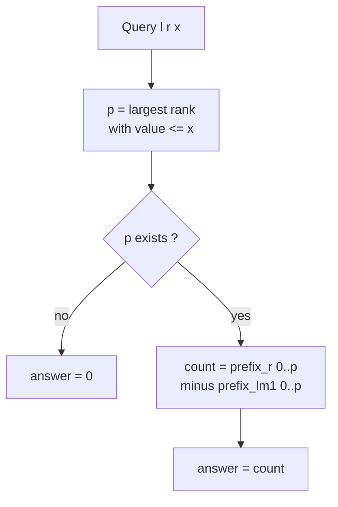
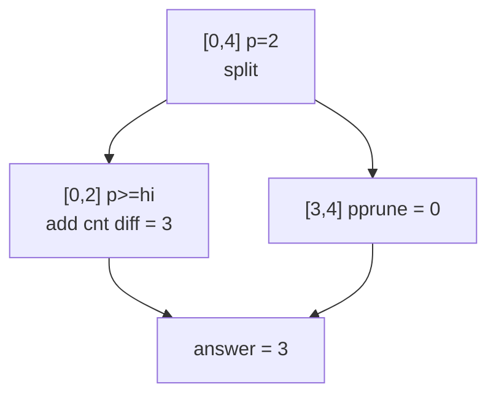

# Count of Values ≤ x in a Range (Persistent Segment Tree)

| Field | Value |
| --- | --- |
| Source | Self-contained (classic range-rank query) |
| Difficulty | Medium-Hard |
| Topics | Persistent segment tree, coordinate compression, prefix versions |
| Link | https://cses.fi/problemset/ (analogous range-counting tasks) |

---

## Problem Statement

You are given an array $a[1..n]$ of integers. Answer $q$ **online** queries. Each
query is a triple $(l, r, x)$ asking: how many elements in the subarray
$a_l, a_{l+1}, \dots, a_r$ have value **at most** $x$?

Formally, output

$$
\#\{\, i : l \le i \le r \ \text{and}\ a_i \le x \,\}.
$$

The values $a_i$ and the threshold $x$ can be arbitrary integers (possibly large
or negative), so coordinate compression is required.

```text
Input:
n = 7, q = 3
a = [4, 1, 3, 4, 2, 5, 4]
queries:
  (2, 6, 3)   # subarray [1,3,4,2,5]; values <= 3 are {1,3,2} -> 3
  (1, 7, 4)   # whole array; values <= 4 -> {4,1,3,4,2,4} -> 6
  (3, 5, 1)   # subarray [3,4,2]; values <= 1 -> {} -> 0

Output:
3
6
0
```

## Approach (WHY)

This is the count-in-value-range cousin of "k-th smallest". We again build
**prefix versions** of a persistent segment tree over the compressed value
domain, then answer each query as a difference of two versions.

1. **Compress** the distinct values to ranks $0 \dots m-1$.
2. **Prefix versions.** `version[i]` is the histogram of the first $i$ elements;
   inserting $a_i$ is a single `+1`, costing $O(\log m)$ new nodes.
3. **Threshold to a rank.** For query value $x$, let $p$ be the **largest rank
   whose value is $\le x$** (found by binary search). If no value is $\le x$,
   the answer is $0$.
4. **Difference query.** The count of $a[l..r]$ with value $\le x$ equals the
   number of elements in rank range $[0, p]$:

$$
\text{answer} = \text{prefixCount}_r([0,p]) - \text{prefixCount}_{l-1}([0,p]).
$$

Because each prefix version differs from the previous by one insertion, the whole
collection of versions fits in $O(n \log m)$, and every query is a single
$O(\log m)$ descent over the two roots.



## Solution

### Python

```python
import sys
from bisect import bisect_right
input = sys.stdin.readline

class CountLeqTree:
    def __init__(self, m, max_nodes):
        self.left = [0] * max_nodes
        self.right = [0] * max_nodes
        self.cnt = [0] * max_nodes      # count in subtree
        self.tot = 1                    # next free id (0 = null)
        self.m = m
        self.roots = [0]                # version 0 = empty

    def _new(self):
        node = self.tot
        self.tot += 1
        return node

    def insert(self, prev, lo, hi, pos):
        cur = self._new()
        self.cnt[cur] = self.cnt[prev] + 1
        if lo == hi:
            return cur
        mid = (lo + hi) // 2
        if pos <= mid:
            self.left[cur] = self.insert(self.left[prev], lo, mid, pos)
            self.right[cur] = self.right[prev]
        else:
            self.left[cur] = self.left[prev]
            self.right[cur] = self.insert(self.right[prev], mid + 1, hi, pos)
        return cur

    def count_leq(self, u, v, lo, hi, p):
        # u = root[l-1], v = root[r]; count ranks in [lo, hi] that are <= p
        if p < lo:
            return 0
        if hi <= p:
            return self.cnt[v] - self.cnt[u]
        mid = (lo + hi) // 2
        return (self.count_leq(self.left[u], self.left[v], lo, mid, p) +
                self.count_leq(self.right[u], self.right[v], mid + 1, hi, p))


def main():
    sys.setrecursionlimit(1 << 20)
    n, q = map(int, input().split())
    a = list(map(int, input().split()))

    sorted_vals = sorted(set(a))
    rank = {v: i for i, v in enumerate(sorted_vals)}
    m = len(sorted_vals)

    LOG = max(1, m.bit_length() + 1)
    tree = CountLeqTree(m, (n + 1) * (LOG + 2) + 10)

    for i, x in enumerate(a):
        new_root = tree.insert(tree.roots[i], 0, m - 1, rank[x])
        tree.roots.append(new_root)

    out = []
    for _ in range(q):
        l, r, x = map(int, input().split())
        # largest rank whose value <= x
        p = bisect_right(sorted_vals, x) - 1
        if p < 0:
            out.append("0")
        else:
            ans = tree.count_leq(tree.roots[l - 1], tree.roots[r], 0, m - 1, p)
            out.append(str(ans))
    sys.stdout.write("\n".join(out) + "\n")


if __name__ == "__main__":
    main()
```

### C++

```cpp
#include <bits/stdc++.h>
using namespace std;

struct CountLeqTree {
    vector<int> lc, rc, cnt;   // children ids and count per node
    int tot;                   // next free id (0 = null)
    int m;
    vector<int> roots;

    CountLeqTree(int m, long long maxNodes) : m(m) {
        lc.assign(maxNodes, 0);
        rc.assign(maxNodes, 0);
        cnt.assign(maxNodes, 0);
        tot = 1;               // index 0 reserved as null
        roots.push_back(0);    // version 0 = empty
    }

    int newNode() { return tot++; }

    int insert(int prev, int lo, int hi, int pos) {
        int cur = newNode();
        cnt[cur] = cnt[prev] + 1;
        if (lo == hi) return cur;
        int mid = (lo + hi) / 2;
        if (pos <= mid) {
            lc[cur] = insert(lc[prev], lo, mid, pos);
            rc[cur] = rc[prev];
        } else {
            lc[cur] = lc[prev];
            rc[cur] = insert(rc[prev], mid + 1, hi, pos);
        }
        return cur;
    }

    long long countLeq(int u, int v, int lo, int hi, int p) {
        // u = root[l-1], v = root[r]; count ranks in [lo,hi] that are <= p
        if (p < lo) return 0;
        if (hi <= p) return (long long)(cnt[v] - cnt[u]);
        int mid = (lo + hi) / 2;
        return countLeq(lc[u], lc[v], lo, mid, p) +
               countLeq(rc[u], rc[v], mid + 1, hi, p);
    }
};

int main() {
    ios::sync_with_stdio(false);
    cin.tie(nullptr);

    int n, q;
    cin >> n >> q;
    vector<int> a(n);
    for (int i = 0; i < n; i++) cin >> a[i];

    vector<int> sortedVals(a);
    sort(sortedVals.begin(), sortedVals.end());
    sortedVals.erase(unique(sortedVals.begin(), sortedVals.end()), sortedVals.end());
    int m = (int)sortedVals.size();
    auto rankOf = [&](int x) {
        return int(lower_bound(sortedVals.begin(), sortedVals.end(), x) - sortedVals.begin());
    };

    int LOG = 1;
    while ((1 << LOG) < max(1, m)) LOG++;
    CountLeqTree tree(m, (long long)(n + 1) * (LOG + 2) + 10);

    for (int i = 0; i < n; i++) {
        int newRoot = tree.insert(tree.roots[i], 0, m - 1, rankOf(a[i]));
        tree.roots.push_back(newRoot);
    }

    for (int i = 0; i < q; i++) {
        int l, r, x;
        cin >> l >> r >> x;
        // largest rank whose value <= x
        int p = int(upper_bound(sortedVals.begin(), sortedVals.end(), x) - sortedVals.begin()) - 1;
        if (p < 0) {
            cout << 0 << "\n";
        } else {
            long long ans = tree.countLeq(tree.roots[l - 1], tree.roots[r], 0, m - 1, p);
            cout << ans << "\n";
        }
    }
    return 0;
}
```

## Iteration Trace

Query $(l, r, x) = (2, 6, 3)$ on `a = [4,1,3,4,2,5,4]`. Distinct sorted values
`[1,2,3,4,5]` → ranks `0..4`. Threshold $x = 3$ → `p = 2` (rank of value 3). We
diff `u = root[1]` (prefix `[4]`) and `v = root[6]` (prefix `[4,1,3,4,2]`).
In-range multiset is `[1,3,4,2,5]`; we count ranks in `[0,2]` (values ≤ 3).

| Step | Node range `[lo,hi]` | Decision | `cnt[v] − cnt[u]` contributed |
| --- | --- | --- | --- |
| 1 | `[0,4]` | `p=2 < hi=4` → split | recurse both |
| 2 | `[0,2]` | `hi=2 ≤ p=2` → take all | counts of ranks 0..2 = `{1,3,2}` → 3 |
| 3 | `[3,4]` | `p=2 < lo=3` → prune | 0 |
| — | total | — | **3** |

Rank 0 (value 1), rank 1 (value 2), rank 2 (value 3) each appear once in the
in-range prefix difference, giving $3$. ✔



Each query descends at most two boundary paths, so:

$$
T_{\text{query}} = O(\log m), \qquad
T_{\text{total}} = O\big((n + q)\log m\big).
$$

## Complexity

| Phase | Time | Memory |
| --- | --- | --- |
| Coordinate compression | $O(n \log n)$ | $O(n)$ |
| Build $n$ prefix versions | $O(n \log m)$ | $O(n \log m)$ |
| Threshold binary search | $O(\log m)$ per query | $O(1)$ |
| Each count query | $O(\log m)$ | $O(1)$ |
| **Total** | $O\big((n+q)\log m\big)$ | $O\big(n \log m\big)$ |

## Takeaway

"Count values $\le x$ in a subarray" reduces to a **prefix-rank** query: convert
$x$ to a rank with binary search, then subtract two prefix histograms. The same
persistent-segment-tree machinery that finds the k-th smallest answers value-range
counts by changing only the descent rule — proof that the
`version[r] − version[l-1]` difference is a reusable primitive for online range
statistics.
