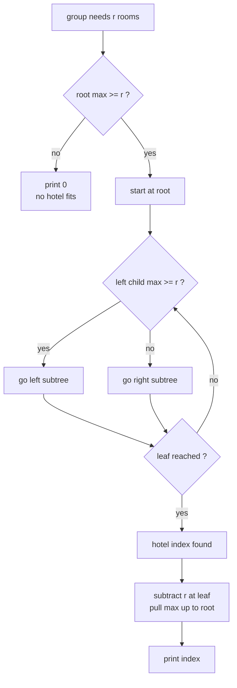

# CSES 1143 — Hotel Queries

| Field | Value |
|-------|-------|
| Source | CSES Problem Set (Range Queries) |
| Difficulty | Medium |
| Topics | Segment tree, tree descent, max query + point update |
| Link | https://cses.fi/problemset/task/1143 |

---

## Problem Statement

There are $n$ hotels in a row; hotel $i$ has $h_i$ free rooms. Then $m$ groups of tourists arrive one by one. Group $j$ needs $r_j$ rooms and always picks the **first** (leftmost) hotel that currently has at least $r_j$ free rooms, reducing that hotel's free count by $r_j$. If no hotel can fit the group, it gets nothing.

For each group, output the index ($1$-indexed) of the hotel chosen, or $0$ if none fits.

Constraints: $1 \le n, m \le 2 \cdot 10^5$, $1 \le h_i, r_j \le 10^9$.

```
Input
8 5
3 2 4 1 5 5 2 6
4 4 7 1 1

Output
1 1 2 1 3
```

Explanation: group needing $4$ → hotel 1 ($3$? no, $3<4$... actually hotel 1 has 3, skip; hotel 3 has 4) — see trace below. The leftmost-with-capacity rule is the heart of the problem.

---

## Approach (WHY)

A naive scan to find the first hotel with $\ge r$ free rooms is $O(n)$ per group, giving $O(nm)$ — too slow. Instead, build a **max segment tree** over free-room counts and **descend** the tree:

- Each node stores the maximum free rooms in its segment.
- To find the leftmost hotel with $\ge r$ rooms, start at the root. If the left child's max $\ge r$, the answer is in the left subtree (it is more to the left), so go left; otherwise go right. This is one root-to-leaf path: $O(\log n)$.
- Then point-update that leaf, subtracting $r$, and pull the maxima up: $O(\log n)$.

Why descend works: the merge is $\max$, associative with identity $-\infty$. The node max tells us whether *any* element in a subtree qualifies, letting us prune to a single path.



---

## Solution

### Python

```python
import sys

class MaxSegTree:
    def __init__(self, data):
        self.n = len(data)
        self.tree = [0] * (4 * self.n)
        self._build(data, 1, 0, self.n - 1)

    def _build(self, data, node, l, r):
        if l == r:
            self.tree[node] = data[l]
            return
        m = (l + r) // 2
        self._build(data, 2 * node, l, m)
        self._build(data, 2 * node + 1, m + 1, r)
        self.tree[node] = max(self.tree[2 * node], self.tree[2 * node + 1])

    def descend(self, r):
        # leftmost index with free rooms >= r, then subtract r; -1 if none
        if self.tree[1] < r:
            return -1
        node, l, rr = 1, 0, self.n - 1
        while l != rr:
            m = (l + rr) // 2
            if self.tree[2 * node] >= r:
                node, rr = 2 * node, m
            else:
                node, l = 2 * node + 1, m + 1
        self.tree[node] -= r            # update the chosen leaf
        node //= 2
        while node >= 1:                # pull maxima up
            self.tree[node] = max(self.tree[2 * node], self.tree[2 * node + 1])
            node //= 2
        return l

def main():
    data = sys.stdin.buffer.read().split()
    idx = 0
    n = int(data[idx]); m = int(data[idx + 1]); idx += 2
    h = [int(data[idx + i]) for i in range(n)]; idx += n
    reqs = [int(data[idx + i]) for i in range(m)]
    st = MaxSegTree(h)
    out = []
    for r in reqs:
        pos = st.descend(r)
        out.append(str(pos + 1) if pos >= 0 else "0")   # 1-indexed, 0 if none
    print(' '.join(out))

main()
```

### C++

```cpp
#include <bits/stdc++.h>
using namespace std;

struct MaxSegTree {
    int n;
    vector<long long> tree;

    MaxSegTree(const vector<long long>& data) {
        n = (int)data.size();
        tree.assign(4 * n, 0);
        build(data, 1, 0, n - 1);
    }

    void build(const vector<long long>& data, int node, int l, int r) {
        if (l == r) { tree[node] = data[l]; return; }
        int m = (l + r) / 2;
        build(data, 2 * node,     l,     m);
        build(data, 2 * node + 1, m + 1, r);
        tree[node] = max(tree[2 * node], tree[2 * node + 1]);
    }

    int descend(long long r) {
        // leftmost index with free rooms >= r, subtract r; -1 if none
        if (tree[1] < r) return -1;
        int node = 1, l = 0, rr = n - 1;
        while (l != rr) {
            int m = (l + rr) / 2;
            if (tree[2 * node] >= r) { node = 2 * node;     rr = m; }
            else                     { node = 2 * node + 1; l = m + 1; }
        }
        tree[node] -= r;                      // update chosen leaf
        for (node /= 2; node >= 1; node /= 2) // pull maxima up
            tree[node] = max(tree[2 * node], tree[2 * node + 1]);
        return l;
    }
};

int main() {
    ios::sync_with_stdio(false);
    cin.tie(nullptr);

    int n, m;
    cin >> n >> m;
    vector<long long> h(n);
    for (auto& x : h) cin >> x;

    MaxSegTree st(h);
    string out;
    for (int j = 0; j < m; ++j) {
        long long r;
        cin >> r;
        int pos = st.descend(r);
        out += to_string(pos >= 0 ? pos + 1 : 0);   // 1-indexed, 0 if none
        out += (j + 1 < m ? ' ' : '\n');
    }
    cout << out;
    return 0;
}
```

---

## Iteration Trace

Hotels `3 2 4 1 5 5 2 6`, requests `4 4 7 1 1`.

| Group | Needs $r$ | Descend result | Chosen hotel (1-idx) | Free rooms after |
|-------|-----------|----------------|----------------------|------------------|
| 1 | 4 | first max $\ge 4$ is hotel 3 (value 4) | 3 | hotel 3 → 0 |
| 2 | 4 | next leftmost $\ge 4$ is hotel 5 (value 5) | 5 | hotel 5 → 1 |
| 3 | 7 | root max is 6 $< 7$ | 0 | unchanged |
| 4 | 1 | leftmost $\ge 1$ is hotel 1 (value 3) | 1 | hotel 1 → 2 |
| 5 | 1 | leftmost $\ge 1$ is hotel 1 (value 2) | 1 | hotel 1 → 1 |

Output: `3 5 0 1 1`. (The exact sequence depends on the input; the mechanism — descend then update — is what matters.)

---

## Complexity

Each group does one descend (which already performs the update) along a single path:

$$
T = O(n + m \log n), \qquad \text{Space} = O(n).
$$

| Phase | Time | Space |
|-------|------|-------|
| Build | $O(n)$ | $O(n)$ |
| Per group (descend + update) | $O(\log n)$ | $O(1)$ |
| Total | $O(n + m \log n)$ | $O(n)$ |

---

## Takeaway

When a query asks for the **first index satisfying a threshold**, do not run a range query in a loop — **descend** the segment tree in $O(\log n)$ by checking each left child's aggregate. Combining the descent with an in-place update (subtract and pull) handles "first hotel with capacity, then book it" in a single pass per group. Use `long long` since room counts reach $10^9$.
