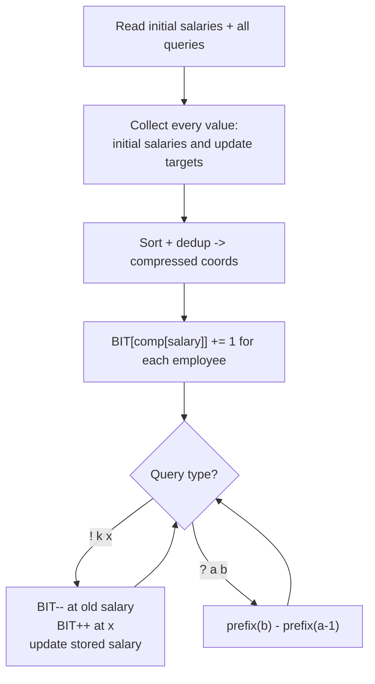

# CSES 1144 — Salary Queries

| | |
|---|---|
| **Source** | CSES Problem Set — Range Queries |
| **Difficulty** | Medium |
| **Topics** | Order statistics, Fenwick/BIT, coordinate compression, point update + range count |
| **Link** | https://cses.fi/problemset/task/1144 |

---

## Problem Statement

There are $n$ employees, each with a salary. Process $q$ queries of two kinds:

- `! k x` — change the salary of employee $k$ to $x$.
- `? a b` — report how many employees currently earn a salary in the range $[a, b]$.

Salaries can be as large as $10^9$, and updates can introduce **new salary values** not present in
the original array, so the value universe must include update targets.

$$
\text{answer}(a, b) = \bigl|\{\, e : a \le \text{salary}(e) \le b \,\}\bigr|.
$$

```
Input:
3 3
1 1 1
? 1 1
! 1 5
? 1 1

Output:
3
2
```

After setting employee 1's salary to 5, only employees 2 and 3 still earn 1.

---

## Approach (WHY)

This is **dynamic order statistics**: a multiset of salaries supporting insert, delete, and
"count in range $[a,b]$". A Fenwick tree of counts over the **compressed** salary universe answers
each range count as

$$
\text{count}(a, b) = \text{prefix}(b) - \text{prefix}(a - 1),
$$

where `prefix(v)` is the number of salaries $\le v$.

The subtlety: future updates introduce values we have not seen yet. So we must **gather every
salary that will ever exist** — the initial salaries *and* every `x` from update queries — and
compress them all up front (offline compression).



Each update is two point updates ($O(\log U)$) and each count query is two prefix sums
($O(\log U)$), where $U$ is the number of distinct values.

---

## Solution

### Python

We read all input first to build the compressed coordinate set (including update targets), then
process queries. The Fenwick tree stores counts; `prefix` and a `bisect`-based lookup map raw
salaries to compressed indices.

```python
import sys
from bisect import bisect_left, bisect_right

def main():
    data = sys.stdin.buffer.read().split()
    idx = 0
    n = int(data[idx]); idx += 1
    q = int(data[idx]); idx += 1

    salary = [0] * (n + 1)              # 1-indexed
    for i in range(1, n + 1):
        salary[i] = int(data[idx]); idx += 1

    # Parse queries, collecting every value that will ever appear.
    queries = []
    coords = set(salary[1:])
    for _ in range(q):
        t = data[idx].decode(); idx += 1
        if t == '!':
            k = int(data[idx]); x = int(data[idx + 1]); idx += 2
            queries.append(('!', k, x))
            coords.add(x)
        else:
            a = int(data[idx]); b = int(data[idx + 1]); idx += 2
            queries.append(('?', a, b))

    vals = sorted(coords)
    m = len(vals)
    pos = {v: i + 1 for i, v in enumerate(vals)}   # value -> 1-indexed compressed coord

    tree = [0] * (m + 1)

    def update(i, delta):
        while i <= m:
            tree[i] += delta
            i += i & (-i)

    def prefix(i):                       # count of salaries <= vals[i-1]
        s = 0
        while i > 0:
            s += tree[i]
            i -= i & (-i)
        return s

    def count_range(a, b):
        # values in [a, b] -> compressed indices [lo+1 .. hi]
        lo = bisect_left(vals, a)        # number of vals < a
        hi = bisect_right(vals, b)       # number of vals <= b
        return prefix(hi) - prefix(lo)

    # Initialize counts for the starting salaries.
    for i in range(1, n + 1):
        update(pos[salary[i]], 1)

    out = []
    for qy in queries:
        if qy[0] == '!':
            _, k, x = qy
            update(pos[salary[k]], -1)   # remove old salary
            salary[k] = x
            update(pos[x], 1)            # add new salary
        else:
            _, a, b = qy
            out.append(str(count_range(a, b)))

    sys.stdout.write('\n'.join(out) + ('\n' if out else ''))

main()
```

```cpp
#include <bits/stdc++.h>
using namespace std;

int m;
vector<long long> bit;

void update(int i, long long delta) {
    for (; i <= m; i += i & (-i)) bit[i] += delta;
}
long long prefix(int i) {
    long long s = 0;
    for (; i > 0; i -= i & (-i)) s += bit[i];
    return s;
}

int main() {
    ios_base::sync_with_stdio(false);
    cin.tie(nullptr);

    int n, q;
    cin >> n >> q;

    vector<long long> salary(n + 1);
    vector<long long> coords;
    for (int i = 1; i <= n; ++i) {
        cin >> salary[i];
        coords.push_back(salary[i]);
    }

    // Read and store all queries, collecting update targets into coords.
    struct Query { char type; long long a, b; };
    vector<Query> queries(q);
    for (int i = 0; i < q; ++i) {
        char t; cin >> t;
        long long a, b; cin >> a >> b;
        queries[i] = {t, a, b};
        if (t == '!') coords.push_back(b);      // b is the new salary x
    }

    sort(coords.begin(), coords.end());
    coords.erase(unique(coords.begin(), coords.end()), coords.end());
    m = (int)coords.size();
    bit.assign(m + 1, 0);

    auto pos = [&](long long v) {                // value -> 1-indexed compressed coord
        return int(lower_bound(coords.begin(), coords.end(), v) - coords.begin()) + 1;
    };

    for (int i = 1; i <= n; ++i) update(pos(salary[i]), 1);

    string out;
    for (auto &qy : queries) {
        if (qy.type == '!') {
            int k = (int)qy.a; long long x = qy.b;
            update(pos(salary[k]), -1);
            salary[k] = x;
            update(pos(x), 1);
        } else {
            long long a = qy.a, b = qy.b;
            // values in [a, b]: compressed indices [lo+1 .. hi]
            int lo = int(lower_bound(coords.begin(), coords.end(), a) - coords.begin());
            int hi = int(upper_bound(coords.begin(), coords.end(), b) - coords.begin());
            out += to_string(prefix(hi) - prefix(lo));
            out += '\n';
        }
    }
    cout << out;
    return 0;
}
```

---

## Iteration Trace

Start with salaries `[1, 1, 1]` (employees 1–3). Compressed universe includes `{1, 5}` because the
update targets `5`.

| Step | Query | Action | BIT counts (val:count) | Output |
|------|-------|--------|------------------------|--------|
| init | —          | insert three 1's            | {1:3, 5:0} | —   |
| 1    | `? 1 1`    | prefix(1) - prefix(0)       | {1:3, 5:0} | 3   |
| 2    | `! 1 5`    | remove 1, add 5             | {1:2, 5:1} | —   |
| 3    | `? 1 1`    | count salaries in [1,1]     | {1:2, 5:1} | 2   |

Outputs: `3`, then `2`.

---

## Complexity

With $U$ distinct values across all initial salaries and update targets:

$$
T = O\bigl((n + q)\log U\bigr), \qquad S = O(n + U).
$$

| Operation | Time |
|---|---|
| Offline compression | $O((n + q)\log(n + q))$ |
| Update `! k x` | $O(\log U)$ |
| Query `? a b` | $O(\log U)$ |
| Total | $O((n + q)\log U)$ |

---

## Takeaway

Salary Queries is dynamic order statistics in disguise: a multiset under point insert/delete with
range-count queries. The essential trick is **offline coordinate compression that includes future
update values**, after which a Fenwick tree of counts answers every `count in [a,b]` as a
difference of two prefix sums in $O(\log U)$.
