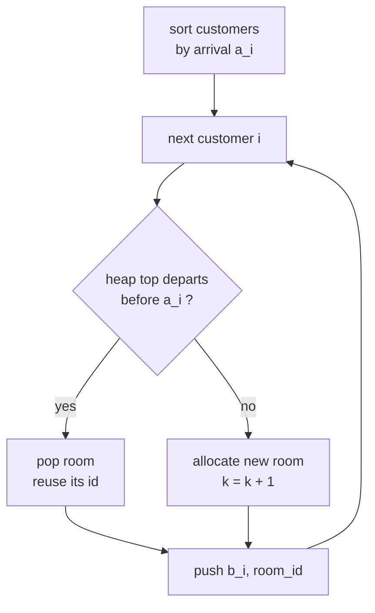

# CSES 1164 — Room Allocation

| Field      | Value                                          |
| ---------- | ---------------------------------------------- |
| Source     | CSES Problem Set                               |
| Difficulty | Easy–Medium                                    |
| Topics     | Sweep line, Min-heap, Greedy, Intervals        |
| Link       | https://cses.fi/problemset/task/1164           |

---

## Problem Statement

There are $n$ customers, each with an arrival day $a_i$ and a departure day $b_i$ (the customer occupies a room on every day from $a_i$ to $b_i$ inclusive). Assign each customer a room so that **no two customers share a room on the same day**, using the **minimum number of rooms**. Print that minimum $k$, and for each customer (in input order) the room number $1 \le r_i \le k$ they were assigned.

$$
1 \le n \le 2 \cdot 10^5, \qquad 1 \le a_i \le b_i \le 10^9.
$$

```text
Input
3
1 2
2 4
4 4

Output
2
1 2 1
```

Customer 1 occupies days $[1,2]$, customer 2 occupies $[2,4]$ — they overlap on day 2, so they need different rooms. Customer 3 occupies $[4,4]$; by the time it arrives, room 1 (used by customer 1) is free again, so it reuses room 1. Two rooms suffice.

## Approach (WHY)

The minimum number of rooms equals the **maximum number of customers present on any single day** (the peak overlap). We discover that peak with a **sweep over time**, and we recycle freed rooms with a **min-heap keyed by departure day**.

Sort customers by arrival day. Maintain a min-heap of `(departure_day, room_id)` for currently occupied rooms. For each customer in arrival order:

- If the **earliest-departing** room (heap top) departs *before* this customer arrives ($\text{top.departure} < a_i$), that room is free — pop it and reuse its id.
- Otherwise every existing room is still busy → allocate a **new** room.
- Push `(b_i, room_id)` for this customer.

The heap top always exposes the room that frees up soonest, which is exactly the candidate to reuse. The high-water mark of the heap size is the answer $k$.



We must report rooms in **input order**, so carry each customer's original index alongside the sort.

## Solution

### Python

```python
import heapq
import sys

def main() -> None:
    data = sys.stdin.buffer.read().split()
    idx = 0
    n = int(data[idx]); idx += 1
    customers = []
    for i in range(n):
        a = int(data[idx]); b = int(data[idx + 1]); idx += 2
        customers.append((a, b, i))

    customers.sort()                 # by arrival, then departure

    ans = [0] * n
    free_room_ids: list[int] = []    # reusable ids (small first not required)
    heap: list[tuple[int, int]] = [] # (departure_day, room_id)
    k = 0

    for a, b, orig in customers:
        if heap and heap[0][0] < a:
            dep, room_id = heapq.heappop(heap)   # earliest-departing room is free
        else:
            k += 1
            room_id = k
        ans[orig] = room_id
        heapq.heappush(heap, (b, room_id))

    out = [str(k), " ".join(map(str, ans))]
    sys.stdout.write("\n".join(out) + "\n")

main()
```

### C++

```cpp
#include <bits/stdc++.h>
using namespace std;

int main() {
    ios::sync_with_stdio(false);
    cin.tie(nullptr);

    int n;
    cin >> n;
    vector<array<int, 3>> customers(n);     // {arrival, departure, orig_index}
    for (int i = 0; i < n; ++i) {
        cin >> customers[i][0] >> customers[i][1];
        customers[i][2] = i;
    }
    sort(customers.begin(), customers.end());

    vector<int> ans(n);
    // min-heap of (departure_day, room_id); renamed to avoid std::queue clash
    priority_queue<pair<int, int>, vector<pair<int, int>>, greater<>> roomQueue;
    int k = 0;

    for (auto& c : customers) {
        int a = c[0], b = c[1], orig = c[2];
        int room_id;
        if (!roomQueue.empty() && roomQueue.top().first < a) {
            room_id = roomQueue.top().second;   // reuse freed room
            roomQueue.pop();
        } else {
            room_id = ++k;                      // allocate a new room
        }
        ans[orig] = room_id;
        roomQueue.push({b, room_id});
    }

    cout << k << '\n';
    for (int i = 0; i < n; ++i)
        cout << ans[i] << " \n"[i == n - 1];
    return 0;
}
```

## Iteration Trace

Input `[(1,2),(2,4),(4,4)]`, already sorted by arrival.

| Step | Customer $[a,b]$ | Heap top (dep, room) | top.dep < a? | Action | room_id | Heap after | $k$ |
|------|------------------|----------------------|--------------|--------|---------|------------|-----|
| 1 | $[1,2]$ | empty | — | new room | 1 | $\{(2,1)\}$ | 1 |
| 2 | $[2,4]$ | $(2,1)$ | $2<2$? no | new room | 2 | $\{(2,1),(4,2)\}$ | 2 |
| 3 | $[4,4]$ | $(2,1)$ | $2<4$? yes | reuse room 1 | 1 | $\{(4,2),(4,1)\}$ | 2 |

Answer: $k=2$, rooms in input order $= [1, 2, 1]$. ✔

## Complexity

Sorting dominates the setup; each customer triggers at most one push and one pop on a heap of size $\le n$:

$$
O(n \log n) \text{ time}, \qquad O(n) \text{ space}.
$$

| Aspect | Cost |
|--------|------|
| Sort by arrival | $O(n \log n)$ |
| Sweep with heap | $O(n \log n)$ |
| Total time | $O(n \log n)$ |
| Space | $O(n)$ |

## Takeaway

The minimum rooms = peak simultaneous overlap. A **min-heap keyed by departure** turns "is any room free yet?" into an $O(1)$ peek and $O(\log n)$ reuse: always recycle the room that empties earliest. This sweep-plus-heap template solves the whole "meeting rooms / interval coloring" family.
