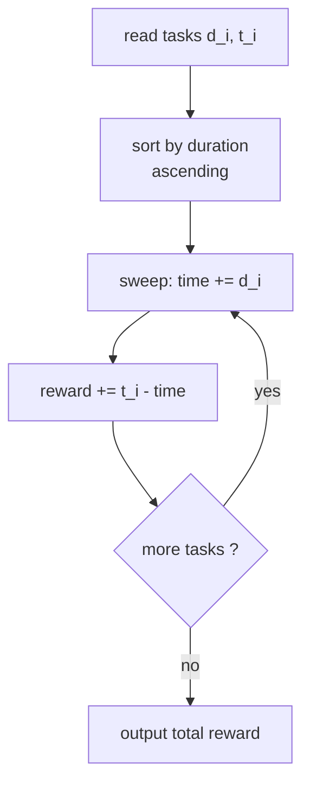

# CSES 1630 — Tasks and Deadlines

| Field      | Value                                          |
| ---------- | ---------------------------------------------- |
| Source     | CSES Problem Set                               |
| Difficulty | Easy                                           |
| Topics     | Greedy, Sorting, Exchange argument, Scheduling |
| Link       | https://cses.fi/problemset/task/1630           |

---

## Problem Statement

You have $n$ tasks. Task $i$ takes $d_i$ units of time (its duration) and has a deadline $t_i$. You process the tasks **one after another in some order you choose**; there is no idle time. If a task *finishes* at time $f$, its **reward** is $t_i - f$ (which may be negative). Choose the order that **maximizes the total reward** $\sum (t_i - f_i)$, and print that maximum.

$$
1 \le n \le 2 \cdot 10^5, \qquad 1 \le d_i, t_i \le 10^6.
$$

```text
Input
3
6 10
8 15
5 12

Output
2
```

Process by increasing duration: durations $5, 6, 8$ with deadlines $12, 10, 15$.
Finish times: $5, 11, 19$. Rewards: $12-5=7$, $10-11=-1$, $15-19=-4$. Total $=2$.

## Approach (WHY)

Split the objective. The finish time of the task in position $k$ is the **prefix sum of durations** up to and including it, independent of deadlines. So

$$
\sum_i (t_i - f_i) = \sum_i t_i - \sum_i f_i .
$$

The first term $\sum t_i$ is a **constant** — the order cannot change it. Therefore maximizing reward is the same as **minimizing $\sum f_i$**, the total of all finish times.

Now $\sum f_i$ depends only on durations. If we run tasks in order $d_{(1)}, d_{(2)}, \dots, d_{(n)}$, then

$$
\sum_k f_{(k)} = \sum_{k=1}^{n} \sum_{j=1}^{k} d_{(j)} = \sum_{j=1}^{n} (n - j + 1)\, d_{(j)} .
$$

Each duration is weighted by how many tasks finish at or after it. The **shortest job first** (SJF) order assigns the largest weights to the smallest durations, minimizing the sum.

**Exchange argument (why SJF is optimal).** Take any schedule with two *adjacent* tasks $x$ then $y$ where $d_x > d_y$. Swapping them leaves every other task's finish time unchanged but lowers the pair's contribution by $d_x - d_y > 0$. So any schedule not in non-decreasing duration order can be improved → sorting by duration is optimal.



A **priority queue keyed by duration** (a min-heap) produces tasks shortest-first; sorting achieves the same thing more cheaply, and we show both.

## Solution

### Python

```python
import heapq
import sys

def main() -> None:
    data = sys.stdin.buffer.read().split()
    idx = 0
    n = int(data[idx]); idx += 1

    # Min-heap keyed by duration => shortest job first.
    heap: list[tuple[int, int]] = []   # (duration, deadline)
    for _ in range(n):
        d = int(data[idx]); t = int(data[idx + 1]); idx += 2
        heapq.heappush(heap, (d, t))

    time = 0
    reward = 0
    while heap:
        d, t = heapq.heappop(heap)
        time += d                      # finish time of this task
        reward += t - time             # t_i - f_i
    print(reward)

main()
```

### C++

```cpp
#include <bits/stdc++.h>
using namespace std;

int main() {
    ios::sync_with_stdio(false);
    cin.tie(nullptr);

    int n;
    cin >> n;

    // Min-heap keyed by duration => shortest job first.
    // Renamed from "queue" to avoid clashing with std::queue.
    priority_queue<pair<int, int>, vector<pair<int, int>>, greater<>> taskQueue;
    for (int i = 0; i < n; ++i) {
        int d, t;
        cin >> d >> t;
        taskQueue.push({d, t});
    }

    long long time = 0;
    long long reward = 0;
    while (!taskQueue.empty()) {
        auto [d, t] = taskQueue.top();
        taskQueue.pop();
        time += d;                     // finish time of this task
        reward += (long long)t - time; // t_i - f_i
    }

    cout << reward << '\n';
    return 0;
}
```

## Iteration Trace

Tasks `(6,10),(8,15),(5,12)` → heap pops shortest-duration first: $5, 6, 8$.

| Pop | Duration $d$ | Deadline $t$ | time after $+=d$ | reward $+= t-\text{time}$ | running reward |
|-----|--------------|--------------|------------------|---------------------------|----------------|
| 1 | 5 | 12 | 5 | $12-5=+7$ | 7 |
| 2 | 6 | 10 | 11 | $10-11=-1$ | 6 |
| 3 | 8 | 15 | 19 | $15-19=-4$ | 2 |

Total reward $= 2$. ✔

## Complexity

Building/sorting by duration dominates; the sweep is linear:

$$
O(n \log n) \text{ time}, \qquad O(n) \text{ space}.
$$

Use 64-bit accumulation: finish times reach $\sum d_i \le 2 \cdot 10^{11}$, overflowing 32-bit, so `long long` is required for `time` and `reward`.

| Aspect | Cost |
|--------|------|
| Heap build / sort | $O(n \log n)$ |
| Linear sweep | $O(n)$ |
| Total time | $O(n \log n)$ |
| Space | $O(n)$ |

## Takeaway

When the objective separates into a constant plus an order-dependent sum of **prefix sums of durations**, deadlines drop out and the problem collapses to **shortest job first**. An adjacent-swap exchange argument proves SJF optimal, and a duration-keyed priority queue (or a plain sort) implements it.
