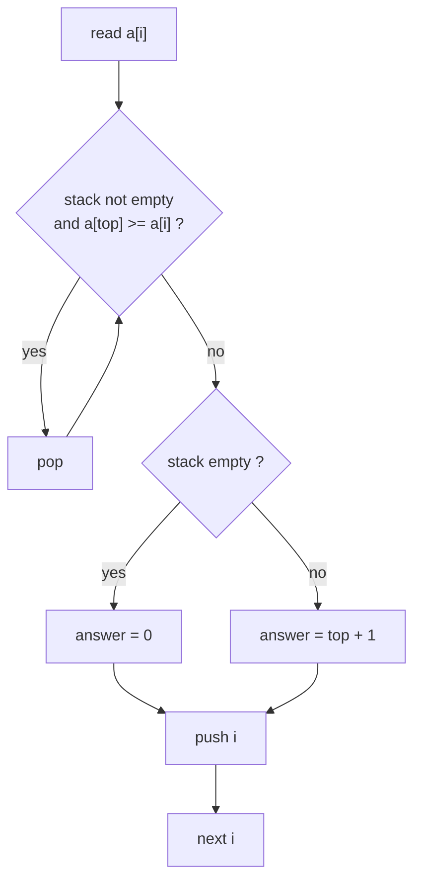
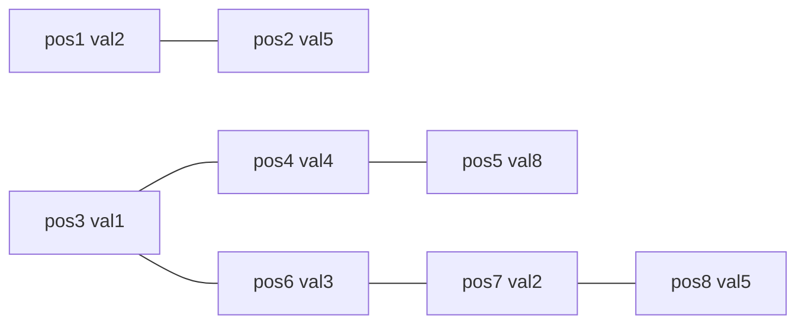

# CSES 1645 — Nearest Smaller Values

| Meta | Value |
|------|-------|
| Source | CSES Problem Set |
| Difficulty | Easy–Medium |
| Topics | Monotonic stack, arrays |
| Link | https://cses.fi/problemset/task/1645 |

---

## Problem Statement

Given an array of $n$ integers, for each element find the **nearest element to its left that is strictly smaller**. Print the **1-based position** of that element, or $0$ if no such element exists.

Constraints:

$$1 \le n \le 2 \cdot 10^5, \qquad 1 \le x_i \le 10^9$$

Because $n$ can be $2\cdot10^5$, an $O(n^2)$ scan ($\approx 4\cdot10^{10}$ operations) is too slow; we need $O(n)$.

```
Input:
8
2 5 1 4 8 3 2 5

Output:
0 1 0 3 4 3 3 7
```

Explanation: for the value `4` at position 4, the nearest strictly smaller value to its left is `1` at position 3, so we print `3`. The value `1` at position 3 has nothing smaller to its left, so we print `0`.

## Approach (WHY)

For each `i` we want the closest `j < i` with `a[j] < a[i]`. Maintain a **monotonic increasing stack of indices**. The crucial observation:

- If `a[top] >= a[i]`, that top can **never** be the "nearest smaller" answer for any index to the right of `i`, because `a[i]` is to its right, is no larger, and is closer. So we can pop it forever.
- After popping all such tops, the new top (if any) is exactly the nearest smaller element of `i`. Then we push `i`.

This keeps stack values strictly increasing bottom→top, and every index is pushed and popped at most once → $O(n)$.



## Solution

### Python

```python
import sys


def main() -> None:
    data = sys.stdin.buffer.read().split()
    n = int(data[0])
    a = list(map(int, data[1:1 + n]))

    ans = [0] * n
    stk = []  # indices, a[stk] strictly increasing bottom -> top
    for i in range(n):
        while stk and a[stk[-1]] >= a[i]:
            stk.pop()
        ans[i] = (stk[-1] + 1) if stk else 0  # 1-based position, 0 if none
        stk.append(i)

    sys.stdout.write(' '.join(map(str, ans)) + '\n')


main()
```

### C++

```cpp
#include <bits/stdc++.h>
using namespace std;

int main() {
    ios::sync_with_stdio(false);
    cin.tie(nullptr);

    int n;
    cin >> n;
    vector<int> a(n);
    for (int &x : a) cin >> x;

    vector<int> ans(n, 0);
    stack<int> stk;  // indices, a[stk] strictly increasing bottom -> top
    for (int i = 0; i < n; ++i) {
        while (!stk.empty() && a[stk.top()] >= a[i]) stk.pop();
        ans[i] = stk.empty() ? 0 : stk.top() + 1;  // 1-based, 0 if none
        stk.push(i);
    }

    for (int i = 0; i < n; ++i)
        cout << ans[i] << " \n"[i == n - 1];
    return 0;
}
```

## Iteration Trace

Array (1-based positions): `a = [2, 5, 1, 4, 8, 3, 2, 5]`. Stack holds 0-based indices.

| i (0-based) | a[i] | Pops while a[top] ≥ a[i] | Stack after pops | Answer (top+1 or 0) | Stack after push |
|-------------|------|--------------------------|------------------|---------------------|------------------|
| 0 | 2 | — | [] | 0 | [0] |
| 1 | 5 | none (2<5) | [0] | 1 | [0,1] |
| 2 | 1 | pop 1(5), pop 0(2) | [] | 0 | [2] |
| 3 | 4 | none (1<4) | [2] | 3 | [2,3] |
| 4 | 8 | none (4<8) | [2,3] | 4 | [2,3,4] |
| 5 | 3 | pop 4(8), pop 3(4) | [2] | 3 | [2,5] |
| 6 | 2 | pop 5(3) | [2] | 3 | [2,6] |
| 7 | 5 | none (2<5) | [2,6] | 7 | [2,6,7] |

Output: `0 1 0 3 4 3 3 7` ✓



## Complexity

Each index is pushed once and popped at most once, so the total work is bounded by $2n$ stack operations:

$$T(n) = O(n), \qquad \text{Space} = O(n).$$

| Aspect | Bound |
|--------|-------|
| Time | $O(n)$ |
| Space | $O(n)$ |

## Takeaway

"Nearest smaller/greater on one side" is the canonical **monotonic stack** problem. Keep an increasing stack of indices, pop everything `>= current`, and the survivor on top is your answer — all in amortized $O(1)$ per element.
